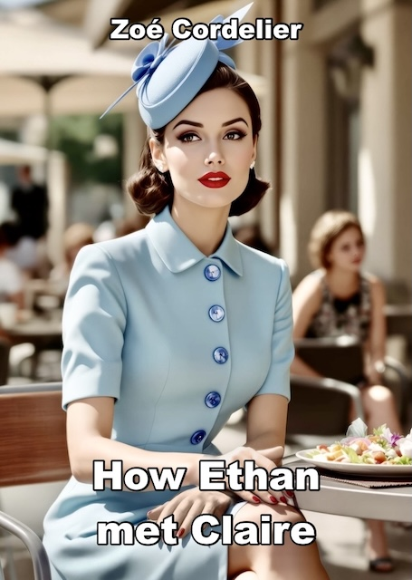
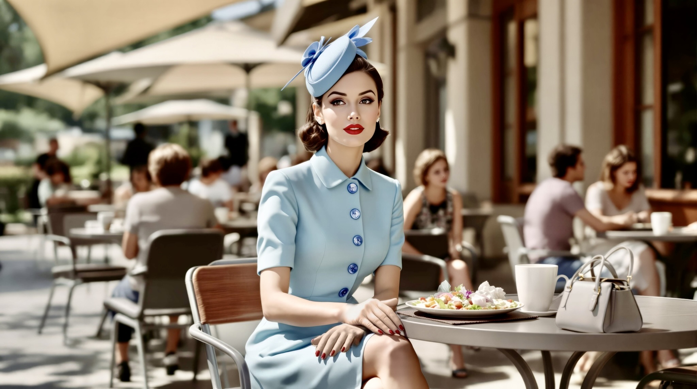
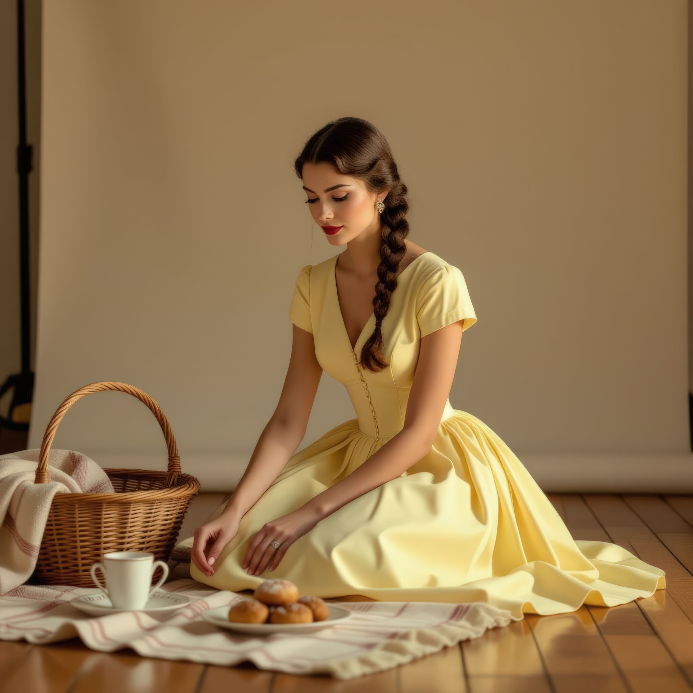

{}
M/f, con, rope bondage, brat, spanking, nipple torture, clit torture, pain
{}

{}
Ethan meets Claire during lunch at the campus canteen.
They banter, and it turns out that Claire is willing to try out bondage with Ethan.
They start with what was supposed to be a beginners rope session, but their relationship quickly progresses.
{}

# EPUB

Read below, or click on the image for the EPUB download:

# Campus Canteen

It was one of those strange, drifting days at the university, after the exams but before the great escape.
The campus was a sprawl of seventies brutalism,
concrete and glass baking under the sun, every surface catching the heat and radiating it back.
Inside, the canteen buzzed with a slow, restless energy, students in flip-flops and tank tops moving in loose patterns,
chasing the last cold drinks or a decent sandwich.

Ethan stood in line, watching a tray inch forward.
His shirt clung to his back where the fabric pressed against his rucksack,
and the usual meat-or-vegetarian choice seemed to take longer than it should.
Eventually, he ended up with something forgettable: a bottle of water, couscous salad, a slice of flan.
He balanced it all like a man who’d done this a hundred times, weaving through the crowds toward the terrace.

Outside was the only place worth sitting.
The canteen’s inner gloom held no air, but out on the terrace the trees gave pockets of green relief.
Overhead, a few triancular canvas sails threw their shade like small islands, the best spots claimed fast.
The rest of the tables sat in full sun, metal chairs too hot to touch.
Laughter carried from a table of Erasmus students, while a Bluetooth speaker played something faint and unrecognizable.
Then he saw her.

Claire.

She sat alone, a still frame of mid-century chic dropped into a careless modern world,
untouched by the noise and slouch of the others.
She wore a pale blue dress, short-sleeved and cut close at the waist, the skirt neat over her knees.
A row of bold buttons marched down the front,
catching the sun as if the material itself had been tailored to shine discreetly under summer light.

Her gloves — wrist-length kid leather — lay carefully across her handbag.
Her hat, a small crescent of felt adorned with decorative feathers,
tilted at an exact angle above one dark, pinned curl.

Even seated, the dress demanded posture and discipline —
shoulders gently squared, spine upright, arms close but not stiff.
It didn’t invite casual wear, and it required shaping underneath:
the kind of boning and compression most women now reserved for weddings or galas.

Claire wore it to lunch.
And somehow, she made it seem normal.
No part of it looked like costume.
She chewed slowly, like she had time to taste every element of the day.

Ethan hesitated.
He didn’t want to bother her.
Most people didn’t.
That was part of it-the effect she had.
People gave her space.
No one was ever seated at her table.
She was a strange sort of royalty, a duchess of the end-of-term campus lunch.
Around her, people quieted, or glanced then looked away.
She didn't belong, not in the canteen,
not in this century-and yet she had claimed her place with such elegance
that it made everyone else feel vaguely underdressed just for existing near her.

But Ethan had done enough cosplay to know that her outfit was no antique-it was a modern variation,
carefully made, reconstructed and altered with knowledge and purpose.
That hat wasn’t millinery from a flea market, it was bespoke.
Her silhouette came from serious shapewear-sculpted, not inherited,
properly done: no lines visible under the fabric, no laziness in the execution.
It was a look that worked because she worked at it.

He shifted his tray in his hands, almost walked past her.
Then didn’t.

“Excuse me,” he said, standing beside the table, trying not to sound like he was interrupting anything sacred.
“Would you mind if I sat here?
Everywhere else is full.”

She looked up, very slowly, without surprise or smile.
Her eyes, cool and calm, scanned his tray, then his face.
There was a pause-just long enough to make him doubt he’d even asked.

Then she moved her hand in a gesture that could have been an invitation,
and gave the faintest nod, as if to say: you may sit, but don’t presume to belong.

“Thanks,” Ethan said, and sat, careful not to scrape the chair legs too loudly.

The book beside her plate was open, its margins crowded with neat notes,
pages bristling with colored stickies that marked some private cartography of thought.
It belonged to her world as naturally as the pearl earrings at her ears
or the polished silver fork she had brought in place of the canteen’s plastic.

He glanced at it. Proust. Of course.

Ethan sat down carefully, adjusting the tray on the metal table between them.
He hesitated for a second, then said with a little nod of introduction,
“Ethan. Sixth semester, mechanical engineering.”

Claire looked up, chin tilted just enough to give the gesture weight.
Her gaze dropped-shirt, checkered and ironed; jeans, faded; shoes, practical leather, scuffed at the toe.
She didn’t smile.

“Obviously,” she said.

There was the faintest breath-not quite a sigh,
but the sound of someone yielding the point in a game they hadn’t wanted to play.
"Claire. Design."

Ethan smiled, glancing at the exacting folds of her skirt. "Obviously."

Still no smile from her.
She turned back to her food, picking up her fork with two fingers and a precision born of long habit.

“You sew quite well,” he said, gently, conversationally.
“A 1954 Dior suit, if I judge the pattern right.
That side seam pocket is yours.
Dior didn’t hide them in darts like that.
No compromise at the waist, though.”

Claire paused mid-bite, her fork hovering over the plate.

He hadn’t said shapewear. He hadn’t even looked there. But he had seen, and more importantly, he knew.

Now she looked at him properly, her eyes narrowing, measuring again.
She was used to questions-Where do you buy your clothes?
Is it cosplay?
Do you wear that every day?-and she had trained herself to glide through them like water over porcelain.
But this wasn’t that.
This was knowledge.

“You prepped well,” she said, unimpressed and dismissive. “Did you look it up on Google Images?”

Ethan grinned, tearing the plastic wrap from his salad. “I sew my own reproductions. Different period, though.”

That made her blink.

He didn’t elaborate.
Didn’t brag or list sources.
He forked up couscous and ate it like he’d just dropped the faintest of gauntlets.
No defensiveness, no apology.

Claire stared at him for a moment longer, then looked down at her plate,
slicing a cherry tomato in half with deliberate care.
Her fingers lingered on the edge of her knife, then she said, “What period?”

Ethan shrugged.
“Late Victorian and Edwardian, mostly.
Menswear.
Everyday stuff, not theatre.”
He didn’t look at her.

Claire swallowed slowly.
The corner of her mouth shifted-was that a smile?
No, not quite.
But something softened, just a little.
She set her fork down, dabbing at her lip with her napkin.

“You don’t wear it outside.”

It wasn’t a question.

“No,” he said. “Not practical. Not brave enough either.”

Claire didn’t respond to that.
But she reached for her water bottle, unscrewed it, drank with the elegance of someone raised in front of a mirror.
Then she looked back at him.

“Your darts wouldn’t survive a day of summer like this.”

Ethan laughed quietly.
“Neither would yours, if you hadn’t constructed the entire underlayer like a suspension bridge.”

That time, Claire smiled. Properly. Just for a second, and only with her mouth. But it was there.

They both ate in silence for a minute, the shade shifting slightly above them, dappled by sun through the fabric sails.
The sounds of student life moved around them, but didn’t touch their table.

Finally, Claire said, “I drafted this from a Lelong base.
Dior’s lines were good, but they exaggerated certain things-Lelong knew how to build tension into curve.”

Ethan looked up. “You adjusted the hem height too. The original suit sits just below the calf.”

“My legs deserve that,” she said, crisp and unapologetic.

Ethan grinned. “Noted.”

She almost laughed, but caught it in time, and returned her attention to her salad.
But the ice had thinned now.
Her shoulders lowered just a touch, and her tone, when she spoke next, held curiosity rather than command.

Ethan finished the last of his flan.
He dragged the plastic spoon slowly through the caramel when he said, almost idly,
“Maintaining that figure in this kind of heat does require a special kind of dedication, though.”

Claire froze for the smallest beat.
Not visibly-but he saw the pause in the way her fingers rested just a moment too long on the rim of her glass.
She was too composed to let anything show on her face.

Then she said, her voice light but precise, “I don’t mind the restriction.”
She looked at him now, fully, meeting his eyes. “But I like the discipline.”

There it was.

Ethan didn’t move, didn’t let the smile rise too quickly.
He met her gaze, then let it slip downward, not quite to her waist, just enough to suggest he understood.
The structure, the ritual, the decision behind it all.
Not just fashion, but frame.

“That makes sense,” he said. “Design students are big on discipline.”

Claire arched a brow, amused. “Some of us still believe in standards.”

Her eyes flicked down, across his jeans and rolled sleeves.
“You could make a little more effort.
You’re clearly capable of precision.
You just don’t apply it to yourself.”

He laughed under his breath. “I do, just… selectively.”

“Meaning?”

“Meaning,” he said, leaning back slightly, arms crossed, “I like to know where effort matters.
A well-cut seam, yes.
A symmetrical welt pocket.
A good waistline.
But jeans and a shirt don’t ask for attention.”

Claire tilted her head. “You think I dress like this because I want attention?”

Ethan smiled, soft, warm, but steady.
“No.
I think you dress like this because you like being in control of what people notice.
That’s different.”

Claire blinked, slowly. Then gave a small shrug, folding her napkin. “That’s unusually perceptive, for an engineer.”

“I do fine,” Ethan said. “When the problem’s interesting.”

She sat still, fingers brushing the embroidered edge of her handbag.
Her eyes narrowed just a touch, not angry-curious.
Testing.

“Mmm,” she said, finally. “You say that like you’re trying to sound harmless.”

He chuckled. “Oh no. I’m just trying not to get expelled from the terrace.”

That got her.
She laughed, quietly, almost elegantly, catching herself with a hand near her mouth.

Claire leaned back in her chair and crossed her ankles neatly.
"Well, Mr. Mechanical Engineer," she said, voice like dry silk,
"maybe next time you’ll wear something that doesn’t look like you lost a bet."

Ethan gathered his tray and stood. "And miss the pleasure of being silently judged for every button and thread?"

Claire smirked, and just as he turned, she added, "Next time, wear a waistcoat."

Ethan turned his head slightly, smiling without showing teeth.
"Only if you promise to come dressed for this century.
I want to see how you handle the handicap."

She didn’t reply-but her eyes followed him as he walked away,
and there was a glimmer there, already planning the outfit she was going to wear.

# I want to ride my bicycle

The next day, the canteen terrace breathed the same soft heat,
the sails stretched tight against a cloudless sky, chatter rising lazily from students in their end-of-term fugue.
Tank tops and sunglasses again ruled the chaos,
but at the edge of it-on the path from the workshop buildings-Ethan emerged.

He did wear a waistcoat, in sturdy blue wool, tight at the sides,
with a simple brass chain curving neatly into the pocket.
The shirt beneath was cotton striped and rolled at the sleeves, collar half-rumpled, one button rebelliously open.
His boots were workman’s, leather worn but clean, and the trousers-high-waisted,
proper-fit as though made for a man who stood upright even when tired.
No gloves.
Just hands, strong-looking.
Slight stubble, barely more than shadow, but intentional.
And a flat cap. Because, of course he had one.

He looked like someone who’d just repaired a train engine and flirted with the stationmaster’s daughter on the way out.
Cleverly disheveled, intentionally rogue.

Heads turned, but not in ridicule.
More curiosity.
A few smiles, a few nudges.
Still within the bounds of eccentric student fashion, especially in a design-conscious university,
but something about it had purpose.

He scanned the terrace and found her-Claire, already seated.

And Claire was not in yesterday’s dress.

No-today she had stepped sideways into the present.

The silhouette was razor-clean,
the fabric a matte, structured crepe in a deep rust-red that seemed to drink the sunlight.
The dress was fitted like a sheath but cut with modern asymmetry-
one sculpted shoulder seam sweeping into a precise notch at the collarbone.
The skirt tight and narrow, with just enough room to allow movement rather than invite it.
The bodice held its line with invisible architecture;
there was boning or corsetry underneath, but it was as smooth as poured glass.

Her hair was coiled low and sleek, her lipstick a deliberate, commanding red.
The gloves-yes, gloves-were a soft, neutral beige,
tossed neatly beside a matching handbag with hardware that gleamed like a designer showroom window.

It was still armour.
Still impossible without discipline.
But it was now, the kind of thing you could see on a runway in Paris or Milan this season,
rather than in a vintage archive.

She belonged on the cover of an international affairs magazine,
a woman who could walk into a summit and unsettle three heads of state before the coffee break.

And yet, when she saw Ethan, her fingers paused mid-motion on her fork.
He approached slowly, not cocky, just composed.
At her table, he gave a small tilt of the head-half bow, half mischief.

“May I sit here, ma’am?”
The edge of his mouth twitched, just enough to suggest he knew exactly how he looked.
And how she looked.

Claire blinked once.
Her eyes trailed over the whole ensemble-cap, shirt, waistcoat, watch chain-her gaze catching, briefly,
at the open collar and the way the fabric held a crease just where it suggested muscle, not sloppiness.
And the stubble.

She raised an eyebrow. A heartbeat passed. Then another.

“You may,” she said, carefully. “If you can behave around a lady.”

Ethan sat with a kind of lazy grace, setting down his tray like it was ritual.
“No promises,” he said, low and amused.

Claire took a breath, eyes still on him. Inside, her thoughts were running riot.

He dressed up. He came to find me. And he looks like sin wrapped in tweed.

But on the surface, she stayed composed.

“You’re very... early 20th century mechanic turned art student,” she said,
taking a sip of her water, hiding a smile.

“You’re very... department head at a couture house about to fire an entire boardroom,” Ethan replied.

Claire laughed-soft, but real.

“That’s accurate.”

“You look... sharp.
Structural.”
His eyes scanned her, not lingering, but knowing.
“Must’ve taken a while to build that silhouette.”

Claire gave him a slow look. “I consider it my obligation to civilize the student body.”

“Well, mission accomplished.” He nodded, then smiled.
“I’ve never seen anyone make me feel underdressed in a waistcoat.”

She allowed herself to smile back, tilting her head.
“You’re not underdressed,” she said. “You’re-intentional.”

Ethan’s fingers idly tapped the edge of his tray.
“That sounds dangerously like a compliment.”

Claire picked up her fork again, but said nothing.

Her cheeks were warm. Not from the sun.

They ate.
Slowly, deliberately, but the air was different today.
The pauses weren’t icy anymore; they were calculated, both of them savoring the dance

Claire cut her food with neat, efficient motions;
Ethan let his elbows rest on the table now and then,
watching her as they talked about nothing important-patterns, student drama, design tutors with vendettas.
But the current ran under it all.
Every exchange hinted at the edge of something else.
And they both knew it.

Ethan wiped his mouth with a napkin, drained the last of his water,
then leaned forward slightly, forearms on the table.

“You look fantastic,” he said. “Absolutely immobile.”

Claire gave a slow, silent blink. Dangerous territory.

“So,” he continued, tone lighter now. “Want to ruin that silhouette with a bike ride?”

She turned to him slowly, head tilted like a predator hearing a strange sound in the forest.

Ethan’s smile widened. “Race you to The Attic. That café down by the river.”

Claire narrowed her eyes. “You're joking.”

He shook his head.
“Nope.
You win, I’ll wear whatever you draft next-even if it’s pink satin.”
A beat.
“I win, you drink a beer with me.
From the bottle.”

Claire inhaled sharply through her nose. “That is-completely impractical.”

Ethan leaned back. “Exactly.”

She crossed her arms.
“You expect me to mount some rusted university bicycle in this dress, without ruining the line, or-”

“Absolutely not,” Ethan said.
“I wouldn’t dream of it.”
He paused, letting her lean into the silence.
“I’ll be on a Penny Farthing.”

Claire blinked, once, then again.
“You have a Penny Farthing.”

“I built it. Lightweight frame. Proper rake. It flies.”

Her mouth parted, then shut again.
She looked down at her lap, then back up at him.
“You are completely mad.”

“I take that as a compliment.”

“You know I can’t pedal in this skirt.”

“Exactly.” His grin was easy, deliberate. “So now it’s a challenge.”

Claire straightened, chin lifted, eyes cool even as her pulse jumped.
He was poking her armor, daring her to play, not to humiliate but to draw her out.
And she hated-hated-how much she wanted to accept.

“I don’t step back from challenges,” she said.

“I know.”

Her fingers tapped the edge of her handbag.
“And if I crash?”

“I’ll catch you.”

That landed too hard.
She stood abruptly, perfectly balanced but with her heart hammering against the bones of her corsetry.
One hand found her hip as she looked down at him.
“You’re impossible.”

Ethan rose more slowly, calm as ever. “I’ll fetch my bike.”

She hesitated, every rational part of her screaming disaster-heels,
tight skirt, sweat beneath polished perfection-and yet…

“Fine,” she said. “But if anyone films this, I’ll murder them.”

He gave a mock salute. “You have my word.”

They started at the north gate, just past the old sculpture courtyard.
Claire gave Ethan a look-half scorn, half challenge-as she mounted her bicycle with impeccable grace.
It was a dignified Dutch-style thing: heavy, stable, skirt guard over the rear wheel,
chain fully enclosed, the saddle worn in just right.
A proper upright posture, with a subtle modern brake system tucked behind the old-fashioned curves.

Before mounting, she reached to her right hip and found a near-invisible zip concealed along a seam.
With one smooth motion, she drew it up eight inches, the slit opening just enough for mobility.
The fabric shifted cleanly, engineered to fall into place without creasing,
the lining holding shape so nothing clung or pulled.
Nothing accidental.
Every allowance planned.

Ethan, meanwhile, wheeled in his absurd machine.

The Penny Farthing gleamed in the sun, its massive front wheel dominating the frame, small trailing wheel behind.
Welded steps curved up the rear spine.
He jogged alongside the machine, then, in one fluid motion, climbed the spine and launched himself up.
A wobble.
A lurch.
His whole body tensed, muscles coiled as the enormous wheel began to spin.

He balanced.

He breathed.

Claire looked over at him and smirked. “You’re going to die.”

He grinned. “Not before coffee.”

Then they were off.

The road sloped down through the campus, then split toward the river.
Trees cast scattered shadows, leaves flickering like old film.
Claire pushed forward easily, the pedals gliding under her,
years of cycling through narrow streets evident in the way she threaded around benches,
potholes, and straggling students.

Before her, Ethan was murderously high off the ground, wobbling slightly with every gust of wind,
but damn if he didn’t hold his course.
He used the slope for speed, leaning into the curve like a stuntman,
pushing down into the wheel with each powerful turn.
His cap nearly flew off.
The wind dragged at his shirt.
The chain on his vest danced like mad.

Claire could have passed him.

She was faster.
Her frame was modern, her balance perfect.
But at the corners, on the slope, at the very moment she might have taken the lead-she didn’t.
Whether from misjudgment, caution, or something else entirely, she let him have it.

Ethan, for his part, wasn’t thinking at all.
He was too busy surviving.
Every jolt was a risk.
One wrong lean and he’d be kissing pavement at twenty kilometers per hour.
But somehow-somehow-he reached the end of the path, skidded wildly into the café’s gravel courtyard,
wrenched the brake and vaulted off the frame,
hopping down with a staggered landing that wasn’t quite a crash.

He straightened.

Looked around.

And there she was.

Claire glided in seconds later, slowed her pace to a graceful halt,
then dismounted as though arriving for afternoon tea.
She clicked her stand into place, adjusted her skirt in a single practiced motion, and stepped forward.
Her breath was steady, her complexion cool, every curl perfectly pinned.

She dusted invisible dirt from her lap, checked her gloves, and gave him a perfect curtsy.

“You win,” she said.

Ethan opened his mouth, then shut it.
He didn’t.
She had him dead to rights in speed, control, elegance, all of it-and they both knew it.
But she was offering him the victory.

He smiled slowly. “You sure?”

She straightened. “A lady does not argue with the result of a wager. Unless you’re volunteering for a rematch.”

Ethan’s eyes didn’t leave hers.
“I wouldn’t dream of it,” he replied, voice low and even.

And then he turned, walked toward The Attic’s worn double doors, and she followed without being asked.
The little café was half-empty-midday lull, old fans buzzing softly overhead.
Dappled light spilled through the large windows onto cracked tile floors and mismatched chairs.

Ethan picked a table in the corner-shaded, discreet-and pulled the chair for her.
Claire sat. Automatically.

He lingered a moment, then went to the counter.
She watched the slight creases in the back of his shirt move as he leaned in.

“Two coffees,” he said. “Black.” He looked back over his shoulder. “As you had it before?”

No options.

Just confirmation.

Claire met his gaze across the room. A pause. Her gloves rested neatly in her lap, fingers still.

She nodded once.

He turned back and added, “And two slices of Paris-Brest.”

Of course. After a bike race.

When he returned, he didn’t speak right away.
He sat opposite her and waited until the waiter brought their order.
Coffee-black, hot-and the pastries, golden, cream-filled, dusted with powdered sugar like snow.

Then, once they were alone again, he said it:

“I don’t like being lied to.”

Claire’s eyes rose to meet his.

“You didn’t lose,” he said. “You let me win. There’s a difference.”

He let it hang there. Not angry, not accusing. Just fact. Truth laid bare between them.

Claire said nothing.

Ethan didn’t look away.
He cut into his pastry with surgical precision.
“Some people might consider that a spankable offense,” he said.

Another pause. No emphasis. No tease.

Then, as he lifted the fork to his mouth:
“I, of course, would never presume.”

Claire’s lips pressed together-but not in disapproval.
Her spine remained upright, chin steady, eyes glittering.
She picked up her coffee cup slowly, elegantly, brought it to her lips.
Took a sip.
Then set it down.
“I see,” she said.

Another sip.

“I suppose,” she continued, tone even, cool-but not cold,
“that would depend on how many offenses one was allowed to accumulate.”

Ethan tilted his head, lips just barely twitching at the corner.

“Are you planning to keep score?” he asked.

Claire folded her napkin across her lap, adjusted a thread that didn’t need adjusting. “That depends.”

“On?”

She looked up now, gaze level. No more fencing.

“Whether or not I’m being trained for obedience,” she said quietly. “Or being punished for initiative.”

The silence between them stretched. Thick, not awkward.

Ethan didn’t blink. Didn’t flinch.

“I don’t punish initiative,” he said. “I encourage it. But I correct things when games are being played with me.”

Claire nodded, slowly.

Then: “And if I enjoy being corrected?”

He reached for his coffee, took a measured sip.

“Then we’re going to get along very well.”

Claire’s expression stayed composed, but her eyes dropped for a second

And that said everything.
Ethan leaned forward now, elbows on the table, voice low.

“Do you want to be trained for obedience?”

Claire froze.

He didn’t press. Just let the words hang there between them. No smirk. No edge. Just… asking. And waiting.

Her eyes narrowed slightly, not offended.

Then he added, just as calmly, “How do you imagine this works?”

Now she had to answer.

Claire set down her coffee cup with deliberate grace.
She adjusted her sleeve, drew in a slow breath to steady herself.
Then, finally, she looked at him and spoke-not with bravado, not with a smirk, but with careful, absolute clarity.

“I’m not anyone’s slave, Ethan. I don’t kneel on command because I’ve been told to.
I’m not weak, or lost, or waiting to be fixed.”
Her voice was low, but steady.
“I’m disciplined, I’m proud of what I’ve built, and I don’t hand that control over lightly.”

Ethan didn’t move, didn’t blink. Just listened.

She went on. “What I do want-when the right person earns it-is to choose to let go.
To surrender, not because I have to, but because I want to.
Because I trust someone enough to know they’ll take it seriously. That they’ll make it mean something.”

Her gaze softened, still sharp but now honest.

“And yes,” she said. “I like being told what to do. In the right moment. In the right setting. I like structure.
I like being made to feel things-things I don’t get from anyone else.
But that doesn’t make me less. It doesn’t make me smaller.”

She tilted her chin up, just a bit.

“It makes me braver than most.”

Ethan exhaled slowly. Nodded once. Not performative-just understanding. Deep and quiet.

“Good,” he said.

Claire blinked. “Good?”

“I’ve done this before,” Ethan said. “Not often. Not lightly.
But enough to know that if the foundation isn’t real, it breaks.”

He leaned back now, relaxed-but still in control.

“I won’t touch anyone who doesn’t know what they’re giving. I won’t micromanage your life.
I won’t play-act a dynamic that doesn’t actually exist between us.
And I don’t believe obedience has any value if it’s not earned.”

Claire studied him. No flinch. No exaggeration.

Then: “What do you believe?”

He looked at her carefully.

“I believe in ownership-not of your body or your choices-but of the responsibility
that comes with someone giving you their trust.
That kind of submission? You protect it. You don’t play with it just because you can.”

Claire stared for a long moment.

Then said, quietly, “That’s not what I expected.”

“I know.”

She picked up her fork again, pushed a bit of cream around her plate.

“And if I said I wasn’t ready for anything serious?” she asked.
“If I said it’s still… a fantasy. Something I’ve never really lived?”

“I’d say we talk about it. Not act it out. Not yet.”

He sipped his coffee again.

“And if I said I’m willing to show you what it could look like… if you want it?”

Claire didn’t respond at once, but the way her fingers wrapped the porcelain-gentle,
deliberate, without tension-said more than words could

Then, almost too quiet to hear:

“I think I do.”

Ethan smiled, slow and private.

“Good.”

They lingered a little longer over coffee, neither of them rushing.
Then Ethan glanced toward the window, then back at her.
His expression shifted-still calm, but more intentional.

“There’s something I’d like to invite you to,” he said. “Just a suggestion. You can say no.”

Claire raised an eyebrow, slowly. “Go on.”

“One of the photo studios in the arts building,” Ethan said.
“Quiet. Locked. I have keys-technician friend owed me. No one disturbs it during summer recess.”

Claire’s posture didn’t shift, but her fingers stilled.
“And what, exactly, are you suggesting we do there?”

He met her eyes fully.

“A basic bondage workshop,” he said. “I show you some rope. How it handles. Safety basics. Body feel.
Might be useful for you-for self-bondage, if you're ever curious.
Or if you want to try things together, with control.
Fully clothed.
No assumptions.
Limits negotiated beforehand.”

Claire stared at him for a long moment. Not shocked. Not flustered. Just evaluating.

Ethan waited.

She leaned back in her chair, crossed one leg over the other, fingers brushing a faint crease from her skirt.
Her tone was flat, cool.

“Do you offer this kind of ‘workshop’ to many girls over coffee?”

Ethan didn’t flinch. “No.”

Her gaze sharpened. “Why me?”

“Because you’re curious,” he said.
“Because you’re not impulsive. You think before you speak.
You want to understand what you're feeling before you let anyone touch it.”

Claire’s eyes didn’t leave his. Stillness passed between them.

Then she said, “Rope, huh?”

“Just rope.”

“No nudity?”

“None.”

“No collar? No kneeling?”

“Not unless you suggest it.”

Claire drummed her fingers on the table once, thoughtfully.

“You’d tie me up. Fully clothed. Just to show me how it feels?”

Ethan smiled faintly.
“Not tie you up. Not at first.
Let you feel the rope and handle it, work with it.
Basic ties, self-done.
What works, and what is dangerous.
Then, if you’re still interested-we try simple ties. Together.”

She looked at him evenly.

“And if I decide I don’t like it?”

“Then I take the rope, say thank you, and walk you out with your dignity fully intact.”

Claire leaned forward slightly, her voice now quieter. “And if I do like it?”

Ethan’s eyes didn’t move.

“Then we take the next step. Carefully. And I take responsibility for your trust.”

Claire stared at him a moment longer.

Then sat back, eyes distant for a heartbeat, and said:

“Give me time. But yes. I’m interested.”

She reached for her gloves, slid them on one finger at a time.

“I want to know, not imagine.”

Ethan stood, waited as she smoothed her dress, took her bag.

“I’ll book the studio,” he said quietly. “We’ll go slow. Everything verbal, everything optional.”

She nodded once.
Still composed, but something had shifted-her gaze was sharper now, like the decision had clarified her.

Then, as they stepped outside into the afternoon light, she turned to him just before they parted.

“Ethan?”

He turned.

“If I let you tie me,” she said, voice low and pointed, “don’t go easy on me. I want to learn. Not be humored.”

Ethan smiled, calm and steady.

“I wouldn’t dream of it.”
# Rope Workshop

With the university almost empty for the summer, the arts building sat quietly in the afternoon light,
its long hallways echoing with the occasional creak of the old floor.
The photo studio sat at the far end, behind a heavy double door with a frosted glass pane.
Ethan was already there, leaning against the doorframe, keys in hand.

Claire arrived right on time.
She wasn’t in her usual battle armor of couture, but she was still unmistakably Claire.
The blouse was soft, dove-grey cotton, the cuffs rolled twice to the forearm.
Underneath, a black ballet leotard traced a clean line to the hollow of her collarbone.
Her skirt was pleated navy wool, falling well past mid-thigh but swaying with each step.
White tights caught the light against low, square-heeled shoes, polished to a gentle shine.

It was an outfit made to move in, without surrendering style.

Ethan’s eyes flicked over her once — just registering the thought she’d put into it.
“Hi, and good afternoon.”

She nodded.
“Good afternoon.
You have the keys?”

“I do.”
He stepped aside, holding the door for her.
The studio smelled faintly of wood polish and old canvas backdrops.
The ceiling was high, a single skylight flooding the space with diffuse daylight.
A worktable stood near the center, covered neatly with coils of rope in different colors and textures.

Claire’s eyes took them in.
“You’ve been busy.”

“Organized,” he corrected.
He stepped to the table, gesturing for her to come closer.

Before she reached for anything, he leaned his hands on the edge of the table, voice even.
“Before we start, you need to know what we’re doing — and how you can stop it at any point.”

Her chin lifted slightly.
“Go on.”

“Today is about handling rope and feeling how it works on the body.
We’ll go through different types, their strengths, and where they fail.
You’ll learn a few ties you can use on yourself — all clothed, all safe — and,
if you want, I’ll demonstrate a couple you can experience with me tying them.”

She nodded once, listening.

“If anything feels wrong — pain, pins and needles, panic — you say stop.
That’s it.
I untie you immediately.
You don’t explain, you don’t justify.
You walk out if you want.
No questions, no argument.”

Her eyes stayed on his.

“You can also end the session instantly,” he continued, “by saying ‘cut it.’
I’ll use safety shears and take the rope off in seconds.
I’ve got a pair right here.”
He tapped a bright — handled cutter on the corner of the table.
“That’s non-negotiable.”

“And you?” she asked.

“I’ll tell you before I do anything that changes the tie or your position. You approve or you don’t. No surprises.”

For a moment, the only sound was the faint hum of the skylight vent.

Then she said, “All right.
Proceed.”

He smiled faintly, straightening.

“Rope first.
Feel it, understand it, then we talk about tying.”
He picked up a pale coil.
“Cotton, no core.
Soft, light, forgiving.
Easy on the skin.
Good for practice or light restraint.
Drawback — stretches under tension, loses shape if you put weight on it.”
He handed it to her.
“Run it through your fingers.”

She did, testing the texture, the way it slid over her palms.

“Cotton with core,” he continued, showing her a thicker, cream — colored rope.
“Still soft, but the core keeps it round and more stable.
Good for maintaining shape.
Less forgiving on skin if you move against it.”

Her eyes narrowed slightly as she compared them.
“The weight is different.”

“Exactly.
Now: hemp.”
He picked up a golden-brown coil, the faint scent of natural fiber drifting between them.
“Traditional.
Strong, holds knots well, won’t stretch.
Takes conditioning to make it skin-safe.
Can leave rope marks-some people like that, some don’t.”

Claire’s fingertips brushed along the rope slowly.
“Not scratchy.”

“I treat mine,” Ethan said simply.
“What we don’t use: nylon, poly blends, or clothesline.”
He tapped a small, white hardware-store bundle on the edge of the table.
“Too slick, doesn’t grip, and knots either slip or cinch tight until they are hard to loosen.
Clothesline is too stiff and too thin, and it cuts into the skin.
Both are dangerous if you’re not in total control of tension."
Then, suddenly assertive,
"You will not use them here or alone.
That prevents injury or worse.”

She nodded once. “Understood.”

Ethan reached for a shorter length of cotton — with-core, the kind of rope that lay soft but solid in the hand.
“Self-bondage basics,” he said, holding it up so she could watch each movement.
“Start simple.
A single-column tie.”

He folded the rope neatly in half, fingers sliding along until he found the bight.
Then he laid his left arm flat on the table, palm upward,
and with his right hand led the doubled rope downward a bit, then turned in a right angle.
He looped the rope smoothly around his wrist,
each pass upward, covering the vertical rope.
The fibers whispered against his skin, each pass settling clean and parallel, no twists, no slack.

“Three wraps,” he explained,
drawing the ends through the bight,
and then over the wraps down to where the rope turned from vertical to looping.
He led the working end through that again,
tightening until the coils hugged his wrist without pinching.
He tugged once, showing how it held firm.
“See how the vertical rope pulls the ropes away from the blood vessels,
and how it stabilizes the wraps.
Now the lock.”

He separated the working ends, crossing them over the wraps again,
then tied them to the bight.
The knot cinched neatly against the column of his wrist, snug and stable, but not biting.
"The knot is outside here, so it does not press into nerves or blood vessels."

He twisted his arm slowly, showing her the rope from every angle.
“See?
Even pressure.
Doesn’t cut circulation, doesn’t slip.
Strong enough that you can’t wriggle free, but easy to release with a pull on the tail.
There are other, cleaner ways to do it, but this is the way that is hardest to get wrong.”

To prove it, he tugged the end once.
The knot dissolved instantly, the rope falling loose in a clean coil back onto the table.

His eyes lifted to hers.
"Your turn.
On yourself."

She took the rope, copying the motion.
The first loop was too loose.
He said nothing, just waited.
She adjusted, her fingers more careful this time.

“Better,” he said, voice low.
“Now lock it. Loop over, tuck under, pull snug — not tight.”

She worked through the steps, her expression focused, lips slightly parted as
she concentrated. The rope sat neatly, holding without pinching.

“Good. Release it.”

She did, the rope falling away in a clean coil.
“Again?” she asked.

He smiled faintly. “As many times as you like.”

She tried a few times to become fluent, and then they moved on.

“For ankles,” he said, picking up a slightly longer length of rope, “we use a two-column tie
same idea as the single, but joining two parallel points so they stay together without twisting.
Usually ankles or wrists, but it works on anything side by side.”

He demonstrated slowly, folding the rope in half so the doubled length hung in a clean U.
“Again, always work doubled,” he said.
“That way you have a bite — the bight —to anchor against.”

He placed the bend neatly between his own forearms.
“For ankles, you lay the bend between them, then wrap both strands around together.
At least three wraps.
That gives enough surface to spread the pressure, so it holds without cutting in.”

His hands moved with deliberate care, showing considerable dexterity and self-tying prowess.
“The working end passes back through the bight, both ropes of it.
After that, you split the strands and wrap in opposite directions.
That pulls the slack out, presses the wraps together, and makes a cuff that stays solid.
Make sure to build nice, even coils.”

He showed the rope where the two strands ran between his arms.
“This is called the cinch or frapping turns.
It is what really stops movement.
It keeps the limbs parallel, blocks twisting, and makes it impossible to slip free.”

Then he undid the the rope, and slid it across the table toward her.

“Your turn. Around your ankles, it's easier with the hands free. Sit first, of course.”

Claire drew her ankles side by side, adjusting her skirt so the pleats fell neatly, then bent to work.
She looped the rope around both ankles, fingers steady, the muscle memory from earlier already showing.
She locked the knot by leading the rope over the center a few times and pulling tight, tucked the end, and sat back.

Ethan watched her work, nodding once.
“Not bad. Stand up.”

She gave him a look — more curiosity than defiance — and rose, trying to take a step.
The rope shifted almost immediately, loosening enough for her to walk with a strange, shuffling gait.

“See the problem?” he asked.

“It slipped,” she admitted.

“Right. You tied it neatly, but did not cinch tight enough to hold against movement.
May I?”

Her gaze lingered on him for a moment, then she nodded once.
“Go ahead.”

“I’m going to adjust the rope on your ankles, touching the ankles,” he said clearly.

“Understood.”

He crouched slightly, hands working quickly but without rush.
“I’m tightening the wraps — that way there is less loose rope in the middle.
Locking the knot is easier then.”
The rope tightened, she could feel it securing her feet without cutting in.

“Stand again,” he said, straightening.

She did — and this time when she tried to walk, the tie held firm and she almost fell.
Her stride stopped after barely an inch, legs held firmly together.

Her eyes lifted to his.
“That’s… different.”

“That’s the point,” he said.
“You can feel the security without pain.
It means the tie is doing the work, not the tension.”

He released her, and she tried again, this time copying his technique.
The rope was holding her in place, and she gave a small, considering nod.
“Effective.”

When they paused, she flexed her fingers, feeling the faint ghosts of pressure from the ties.

“And that,” Ethan said, “is the start.”

Claire looked at him over the rim of her water bottle, her eyes steady.
“I see why people like it.”

He coiled the last rope neatly.
“Then you’re starting to understand.”

Ethan picked up another length of rope, longer this time.
“For the chest harness, I’ll show you on myself first — that way you see the path the rope takes before it touches you.”

He wrapped it around his own torso, crossing it above and below his chest,
explaining each wrap.
“The point isn’t restriction — it’s structure.
This becomes the anchor point for other ties, keeps the rope from sliding, and distributes pressure evenly.”

When he finished the loop and locked it off, he set the rope down and looked at her.
“May I put this on you?”

Claire’s head tilted.
“You keep asking.”

“I said I would.”

“Yes, but…” Her brow furrowed.
“Why be so… formal about it?
I’m here, aren’t I?”

“Because,” he said, meeting her eyes steadily, “we don’t know each other yet.
And we don’t trust each other enough.
Not really.
This way, nothing happens without your permission.
It’s not just for you — it’s for me, too.
I don’t want to cross a line we haven’t agreed to.”

She studied him for a moment, then gave a single, small nod.
“All right. You may.”

“I’m going to wrap the rope above and below your chest, over your blouse.
I’ll keep my hands on the rope, not on you.”

“Understood.”

He stepped closer, looping the rope around her ribcage, his movements smooth and unhurried.
Each pass settled snug against the last, the fibers rasping faintly over the fabric.
He crossed the lines between her shoulder blades, then returned to the front, locking them into place.

“Feels fine?” he asked.

She shifted slightly, feeling the even pressure.
“Yes.”

“Good. Next is a box tie — arms behind, wrists secured to the harness.
It’s restrictive.
You won’t be able to free yourself.
Still want to try?”

“Yes,” she said without hesitation.

“I’ll take your right wrist first,” he said.
She let him guide it behind her, the rope circling, cinching neatly without biting.
“Now your left.”
The second wrist met the first, rope binding them together, then running
upward to anchor to the harness at her back.
A few deft passes, a final knot, and it was done.

“Try to move,” he said.

She did — and quickly realized her arms were locked in place.
The harness held them close, the box tie keeping them parallel.
It wasn’t painful, but it was immovable.

“You’re right — I can’t get out of this,” Claire said, her tone half-evaluating, half-impressed.

She turned toward the full-length mirror propped against the studio wall.
For a moment she just studied herself — the rope crossing in clean,
symmetrical lines over her blouse, the way the harness drew her shoulders back and her chest forward.
It looked deliberate, sculptural, almost like a piece of fashion in its own right.

Ethan watched her.
“You’d have to ask me nicely to let you out, then,” he said, not taunting-just testing.

She turned back to the mirror and began testing the knots in earnest — no panic, just methodical exploration.
She pulled against the rope, shifted her shoulders, twisted her wrists.
Nothing gave.

Her eyes met his. “Still holding me fast. I give up.”

A pause. Then, steady: “Would you untie me, please?”

“Of course.”

He stepped behind her, announcing each movement before his fingers touched the rope.
As he loosened each wrap, the tension released in stages,
leaving her with the faint sensation of the fibers still resting against her skin.
When her arms were free, she rubbed them once, feeling the ghost of their confinement, and glanced at the mirror again -
the faint impressions of rope still marked her blouse and arms in straight, perfect lines.

She breathed once, deeply.
Another pause. “I… might want you to do it again, though.
Different tie.
Tighter.
Challenge me.”

Ethan coiled the rope slowly, his eyes still on her.
“We can build on this tie,” he said, his tone measured.
“But it will be more challenging.
Kind of like yoga.
It will also… put you on display.
Want to try it out?”

Claire considered asking for details, but didn’t.
The uncertainty sat between them like a live wire.
She met his gaze and gave a single, small nod.

“Good,” he said simply.

He guided her to the mirror — not touching her yet — and positioned her so she faced her own reflection.
“Kneeling, please.”

She sank to her knees, the pleats of her skirt settling neatly around her.
Her hands rested loosely at her sides, the faint hum of anticipation in her
chest.

“I’m starting with your arms,” he said, holding the rope up for her to see.
“your hands will end up behind you.
This is a box tie again.
It locks your upper arms and chest together, and holds your arms on your back.”

The first loops circled her torso, two even bands above and below her chest,
framing it without touching skin inappropriately.
The fibers pressed firmly through the blouse, hugging her ribcage with a steady, unyielding presence.

“I’m going to bring your arms back now,” he said.

Her shoulders shifted, elbows drawing in as he brought her wrists toward each other behind her back.
The rope wound around her upper arms, joining them to the chest bands so she could no longer move them forward.
Each pass settled with precision, the slight rasp of hemp marking the rhythm.
She felt her posture change — shoulders rolled back, spine upright, chin naturally lifted.

Then he was joining the wrists, a double-column tie, and bound that to the chest tie,
continuing the rope under her arm, over a shoulder and back,
then again under the other arm, over the other shoulder and back.
"This prevents you from pulling the chest band down," Ethan explained.

Finally, he knelt beside her.
“Legs next — futomomo.
That means a thigh-fold tie.
It binds the calf tightly against the thigh so the leg can’t extend.
I need to lift your skirt for leg access.”
Claire nodded.

Her right leg was first.
He folded it up against her thigh, the angle opening her knee outward.
The rope wrapped snugly around thigh and calf together, layer after layer,
cinched with a final knot that left the joint locked in its folded position.
She tested it lightly — no give.

Her left leg followed, the symmetry doubling the sensation.
Both legs folded, both knees wide,
the skirt bunched neatly over the arrangement but doing nothing to hide its structured nature.
The compact posture made her acutely aware of her balance, her reflection showing a poised,
restrained figure-upright, symmetrical, and completely still.

By the time he tied the last knot,
he took the excess rope from the leg tie and tied it up,
to the wrist tie and the shoulder straps.
There was still more rope, so he wound it around this connecting tie,
turning it into a solid column of rope,
picking up the slack and increasing the strain and the stability of the binding.
The harness and leg bonds together created a closed circuit of rope, each part reinforcing the other.
She couldn’t shift without feeling the whole structure respond.

Claire met her own eyes in the mirror.
The visual was striking: ropes framing her body with architectural clarity,
her arms and legs locked into an elegant, formal pose that left her both
exposed and composed.

Claire flexed her shoulders, testing for slack.
Nothing. The harness held her upper arms like a sculpted frame, each cinch anchored to the chest bands.
She tried shifting her wrists, then her elbows —
all she got was the sensation of the rope tightening evenly, pulling her shoulders back into place.

She moved to her legs next.
The futomomo wraps around each thigh and calf were absolute.
She could wriggle, but there was nowhere for the energy to go — every
movement just confirmed how thoroughly her joints were locked.
Kneeling like this, with her knees spread and her balance rooted in one place,
there was no graceful way to relieve the strain in her thighs.

After a minute she stopped moving and just… felt it.

She glanced at the mirror again — her reflection an elegant, immobile figure,
arms bound away, skirt draped but doing nothing to disguise the openness of her posture.
The thought slipped in without invitation: If I weren’t clothed, he could do anything he wanted right now.
She was fully, utterly accessible.
The ropes hadn’t just restrained her; they’d arranged her,
bust framed, legs spread, and immobilized.

A shiver ran through her.

The realization was complicated, unsettling — and intoxicating.
She’d never thought she’d want this, never thought the combination of helplessness and display would appeal to her.
But now, caught in the posture he’d designed for her, she felt like a perfectly posed object.
Not degraded, but definitely a toy, arranged with care, her movement gone, her presentation fixed.

And she loved it.

Ethan stayed where he was, just behind her shoulder, saying nothing.
His eyes moved from her posture to her breathing to her expression in the glass.
He watched the micro-shifts: the way her jaw had set in the first moments of testing the ropes,
the flicker of surprise in her eyes when she found no slack,
the almost imperceptible softening in her mouth when the realization hit.

She was flexible — the pose wasn’t pushing her into discomfort beyond strain.
She was mentally steady — no sign of panic, no brittle edge in her breathing.
And she wasn’t just tolerating the tie.
She was interested. Deeply.

He might be able to take her further.
Not now — but soon.

Eventually she spoke, her voice quiet but clear.
“You were right. I can’t move.
And… it feels different than I imagined.”

Ethan moved to kneel behind her, both of them facing the mirror.
His reflection met hers briefly before he spoke.
“I’m going to point out some details of the tie.
I’ll have to touch you along the rope.
If anything feels wrong, you tell me immediately, and I’ll stop and untie you.”

“I understand,” she said.

“Good. Starting at your shoulders.”

She felt the heat of him behind her, his knees bracketing hers at a respectful distance,
his body close enough for her to sense the warmth but never pressing.
His hand came into view in the mirror, fingers following the upper chest band from her back around toward her side.
“These wraps anchor the harness — see how they sit above the line of your bust, not cutting in?”

She nodded, eyes flicking between the rope and his face in the glass.

“Next, the lower band,” he said, sliding his touch down an inch,
tracing the rope across her ribs, again stopping short of actual breast contact.
"This one balances the pressure and gives me something to connect to if I need more structure.
Like I did with the upper arm and wrist ties."

His voice stayed low, instructional, but she felt each point of contact acutely —
the gentle press of his fingertips, the faint shift of his weight when he adjusted position.

“I’ll move to your arms now,” he said.
His fingers traveled down the binds pinning her upper arms to the harness,
then traced the cinch knot between her arms.
“This is what keeps your arms from pulling forward.
It’s snug enough to hold, loose enough to let blood flow.
Then the wrist tie, connecting to the bands and crossing under the arms and over the shoulders,
so that you can't pull down and out.”

She breathed slowly, feeling the reality of her helplessness more sharply with each place he indicated.

“Legs next,” he announced, shifting his position so one knee was beside hers.
He touched the rope binding her right thigh to her calf.
“This futomomo wrap keeps your leg folded.
The cinch here” — a gentle tap at the knot — “locks it in place.
Both legs symmetrical keeps you balanced, even though you can’t move.”

Through it all, he never lingered, never let the contact turn into a caress.
But she felt him — his heat, his steadiness, the quiet authority in how he handled the rope and her body’s position.

Claire realized she was following his explanations like a student,
but also acutely aware of every point where his presence brushed her boundaries without crossing them.
The formality made it sharper — the announcement before each touch, the matter-of-fact way he carried it out.
She was restrained, helpless, with him this close… and yet completely safe.

# Ready to fly

Ethan moved the thick studio cushion onto the floor, placing it in front
of her bound knees.

“I’m going to move you from here onto the cushion,” he said, tone even, unreadable.
“I’ll support your weight, and I’ll need to guide your hips and shoulders.
The rope will stay in place.
If you need me to stop, you say so.”

Claire’s pulse ticked up.
“Understood.”

He came to her side.
“I’m going to touch your left shoulder now.”

The warmth of his palm settled there, steadying her.

“My right hand is on your waist.”

His other hand cupped the side of her waist over her blouse, his grip sure but not squeezing.

“On three, I’m going to lift and lean you forward,” he said.
“One… two… three.”

The world tipped. Her folded legs pivoted under her, her bound knees spreading slightly to keep balance.
His arms were easily strong enough to lift and handle her.
She had no control over the speed or the angle — his hands dictated both.

“I’m shifting my hand to the center of your back,” he said.
The heel of his palm pressed between her shoulder blades, easing her downward.

Her hips lifted higher as her torso angled toward the cushion.
The ropes bit in just a little more at her chest,
her skirt sliding over her thighs until it draped neatly over the bound folds of her legs.

“Now I’m supporting you under your ribs.”
His arm came around her front, steady but impersonal, guiding her until her breasts pressed into the thick cushion.

Her cheek met the fabric next, turned so she was looking straight into the mirror.
Her own eyes stared back, wide and a little hazy, hair slightly mussed.

Then she felt it — the realization of the position.
Hips high. Upper body low.
Skirt and hose the only thing between modesty and total exposure.

If the skirt weren’t there… she’d be helpless.
Completely *fuckable*.
The word came to her mind without warning, without euphemism, sharp and obscene.

She couldn’t move. Couldn’t close her legs.
Couldn’t cover herself.
The posture and the rope made sure of it.
And instead of fear, she felt herself slipping — the strain in her shoulders,
the press of the cushion, the absolute absence of control pushing her into something softer, lighter.
A floating, quiet space she didn’t have a name for.

*What would that be like?* she wondered.
To be taken like this — helpless, bound, unable to do a thing about it?

Her breathing slowed.
She let her muscles stop resisting, let the ropes and his hands dictate her posture.

Behind her, Ethan’s voice came, low and calm.
“Comfortable enough to hold for a while?”

“Yes,” she said, and heard her own voice — soft, a little distant.

He noted it.
She could feel him watching her in the mirror, his eyes taking in not just the position,
but the way she’d stopped testing it altogether.

Claire shifted her hips against the ropes, a small, unmistakable wiggle.

“Claire,” Ethan said evenly from behind her. “Don’t do that.”

His voice wasn’t sharp, but there was an edge to it, a thread of distraction he hadn’t shown before.

She smiled faintly into the cushion, then wiggled again. Bratty, deliberate.

“Once more,” he said, calm but lower now, “and I’ll slap your ass. I’m not joking.”

Her breath caught.
The seriousness in his tone cut through the floaty haze for a moment —
only to make it stronger when she realized he meant it.
She let her mind drift back, testing the words in her head: slap me…

The ropes held her, firm and unyielding.
She had no way to escape the position, no way to close herself off.
The idea of being struck, held like this, made her pulse leap.

So she wiggled again.

There was no delay.
Ethan’s hands found her skirt, lifting the wool back over her hips in one practiced motion.
Cool air kissed her tights.
A second later, his palm cracked against her ass, the tights doing little to soften the strike.

The sound rang in the studio — sharp, decisive.
The pain seared, hot and bright, spreading instantly across her cheek before sinking lower,
blooming in her belly and, to her shock, straight between her legs.
It wasn’t unwelcome.
It was alive, like a spark of chili on the tongue — fire that hurt and thrilled at once.

Her breath broke into a gasp, almost a moan.

She shifted again, hips flexing, baiting him.

Another strike came, this time on the opposite cheek.
The heat balanced, a matched burn.
She groaned low, pressing her face harder into the cushion, letting the ropes take the weight.

“You like that, do you?” Ethan asked, voice steady, but she could hear the tightness beneath.

But Claire couldn’t form an answer.
The sharp sting of his hand on her ass had sent her spiraling, deeper than she’d thought possible.
The second blow pushed her past the edge of ordinary sensation, dissolving her into something dreamlike and unmoored.

Space and time unraveled.
She was too far gone, floating on the mixture of pain, restraint, and safety.
The ropes held her body, Ethan’s voice held her mind, and the fire in her skin pulsed deeper, steadier.

She was safe, helpless, held completely by the ropes.
The harness locked her shoulders, the futomomo tied her legs into neat,
immovable folds, and there was nothing she could do.
No choice, no escape.
Just need pooling low inside her, throbbing in the heat where his hand had struck.

She moaned again — not a word, not an answer, just surrender.

The ropes didn’t shift.
They were constant — a firm, unyielding architecture fixed onto her body.
Every breath pressed her chest into the cushion and pulled faintly at the harness across her ribs.
The futomomo wraps on her legs kept her folded tight, no possibility of stretching or changing the angle.

The strain was there — in her shoulders, in her thighs —
but it was contained, held by the rope as much as by her own body.

Behind her, Ethan stayed close.
His warmth was steady, his presence certain, but he didn’t move.
He didn’t touch her.
He was simply there, watching, keeping her in the space he’d put her in, making sure nothing happened to her.

Her only answer was visible, undeniable: a spreading dampness at the crotch of her leotard,
glistening against the pale fabric where her thighs met.
Ethan’s eyes stayed on it for a moment, then lifted back to her reddened ass under the semi-transparent white tights —
both cheeks flushed slightly under the marks of his hand.

He drew in a slow breath through his nose, let it out.
The faint musk of arousal hung in the air, sharp and sweet, and it told him everything her voice hadn’t.

This was moving faster than he’d expected.
He’d pegged her as a submissive, yes, but he hadn’t thought she would throw herself this far, this fast —
testing him with bratty defiance and then diving headlong into subspace as if she’d been waiting her whole life for it.

So he didn’t rush.
He didn’t touch her again.
He just watched her in the mirror — her face slackened against the cushion,
her breath deep and slow, her hips trembling faintly under the ropes.

He gave her time. Let her float. Let her body process what had just happened.

When he finally moved, it was slow and deliberate.
He leaned close to her ear, his voice low, steady, almost a murmur.
Explaining each step before he moved her body, giving her time to hear, time to expect.

“I’m going to start lifting you back up.
You’ll feel my hand at your waist.
Then your shoulder.
I’ll take it slow.”

He slid one hand to her hip, the other to her upper back, guiding her carefully.
The ropes creaked faintly as her body shifted, her weight folding back into her knees.

“Easy. I’ve got you.”

“I’m going to lift your waist now.”

“I’m guiding your shoulders.”

“I’ll hold you steady while the ropes loosen.”

She rose under his support until she was kneeling again, chest no longer pressed to the cushion.
And then she was upright again, kneeling in front of the mirror.
Her reflection showed a rumpled,
mussed woman still wearing rope marks across blouse and tights, Ethan’s broad form behind her.
His warmth pressed steady at her back, his arms braced lightly to either side,
not restraining her anymore but still holding her.

“I’m loosening the knots now,” he said.
His fingers moved with practiced efficiency, undoing the futomomo first, the pressure easing in her thighs.
The ropes slipped loose but stayed coiled lightly around her legs, not discarded, leaving her still faintly encased.
Her skirt fell back into place, covering her.

Then he worked at the harness, not stripping it away all at once,
just releasing tension so she could breathe more fully, the rope still resting over her blouse like decorative bands.
His hands were firm and sure, moving her without strain.
She had no need to think, no need to resist.
Her arms dropped as the knots slackened, and his hands caught them, arranging her gently so she stayed balanced.

By the time he finished, she was upright, half-wrapped, hair mussed, cheeks warm,
the reflection in the mirror showing a woman still bound but no longer straining —
her first lesson written on her body in faint rope marks and the blush of impact.

He stayed behind her, quiet, waiting, holding her. Watching. Giving her space to find her words again.
She breathed in once, deep, let it out, and finally found her voice.

“That…” she said slowly, the words like stepping back into the world. “That was wonderful.”

She let her weight sink back into him, her spine against his chest, no tension in her shoulders now.

And Ethan stayed where he was, solid and steady, giving her all the time she needed.

Ethan’s arms stayed around her from behind, not restraining now but holding — solid, warm, steady.
His breath brushed her ear when he spoke, his voice low and calm.

“You’re safe. You did beautifully.”

His hands shifted slightly, one braced at her ribs, the other just above her hip.
“I’m going to help you up in a moment.
We’ll go slow.
Tell me if you’re not ready yet.”

She leaned heavier into him, and he stayed still, letting her set the pace.
When she didn’t protest, he rose carefully,
guiding her until she was upright on her knees, then easing her onto her feet.
Her legs wobbled from the strain of the futomomo, and he steadied her, murmuring, “I’ve got you.
You’re okay.”

When she seemed steady enough, he guided her back down to sit on the cushion, facing the mirror.
He crouched in front of her now, his gaze level with hers.

“I want to check in,” he said gently.
“What did you like?
What didn’t you like?
And… if you’d like to do something like this again, how you’d want it to feel?”

Claire’s lips parted, but the words didn’t come at once.
Her thoughts were still slow, still tumbling.
She looked at him — really looked — and then down at her hands resting in her lap.

“I…” she started, then stopped.
Swallowed.
Tried again.
“I liked… all of it.
The ropes, the helplessness.
Even…” she hesitated, cheeks warming, “even being slapped.”

Ethan’s expression didn’t shift, didn’t mock. Just patient, waiting.

Her throat tightened.
“I was scared.
Not of you.
Of myself.
That if I said that out loud… if I told anyone I wanted that, needed that… they’d laugh at me.
Tell me I was ridiculous.
Weak.”
Her voice cracked slightly, but she pressed on.
“But you didn’t.
You didn’t laugh.
You didn’t make me feel smaller.”

Ethan shook his head, firm but gentle. “There’s nothing weak about knowing what you want. Or letting yourself feel it.”

She blinked quickly, relief loosening something tight in her chest.
“It was… a fantasy I’ve had for so long.
Not exactly this, but… being tied.
Helpless.
The way damsels looked in old films — scared, but not really scared.
Caught.
Desired.
I thought wanting that made me broken.
And I…” She trailed off, fumbling for the right words.

“And now?” Ethan prompted softly.

Claire met his eyes again, her own glistening faintly.
“Now I don’t feel broken.
I feel… relieved.
Because you take it seriously.
Because you didn’t treat me like I was ridiculous.
And because I know — outside this room — you won’t treat me like I’m lesser for it.
You’ll still…” She faltered, searching.
“You’ll still see me.
Not just… this.”

Ethan leaned in, close enough that his words were for her alone.
“I do see you.
All of you.
What happens here stays here unless you bring it outside.
And nothing you ask for will ever make me laugh at you.”

Her breath hitched — a tiny, shaky sound.
She closed her eyes and leaned forward, resting her forehead against his shoulder.
“Thank you,” she whispered.

Ethan’s hand came up to cradle the back of her head, holding her there with quiet certainty.

When her breathing had steadied again, Ethan leaned back just enough to see her face.
“Claire,” he said softly.
“How do you feel?
Lightheaded?
Tired?”

She took a long breath. “Both,” she admitted.

“Do you want to cycle home on your own, or should I walk you?
I can’t come up, I’ve got other commitments tonight.
But I won’t leave you to stumble off alone.”

She gave a faint smile. “Walking sounds… nice.”

He nodded. “Then walking it is.”

They gathered their things quietly.
The ropes were neatly coiled, the cushion stacked back against the wall,
the studio left as if nothing had happened at all.
Outside, the evening light had softened, shadows stretching across the campus paths.

They walked side by side, almost in silence.
Claire felt her legs still heavy, her body still carrying the memory of knots and impact.
The quiet suited her.

Halfway to her building, she cleared her throat.
“Maybe we should… try another workshop.”
She frowned, corrected herself.
“Another… session.
Soon.
If you’d like to.”

Ethan glanced at her. “I would. What do you want from the next one?”

Her hands tightened on the strap of her handbag. “To move on. From where we were. Bound even tighter.”

He gave a small nod, as though filing it away. “And the spanking?”

Claire’s eyes dropped to the pavement.
Heat rose to her cheeks.
“It… turned me on,” she said quietly.
The words tasted half shame, half relief.

“Do you like pain?” Ethan asked.

She stiffened at the word. “I don’t… I don’t like that word. It scares me.”

He slowed a step, considering, then tried again.
“Spice, then?
It’s sharp, it burns, but in the right dose it makes everything better.”

Claire blinked, then let out a soft breath. “Yes. Spice. That’s exactly it. Like chili. Hot, but… good.”

Ethan laughed, warm and low.
“Then we’ll call it spice.
And no—” he gave her a sidelong look, amused “—you’re definitely not vanilla.”

She laughed too, small and nervous, but genuine. The sound lingered between them as they reached her building.

Ethan stopped at the steps. “Get some rest. Text me when you’ve eaten. We’ll plan the next session when you’re ready.”

Claire nodded, clutching her bag tighter, but her smile was certain now. “I will.”

Claire slipped inside and closed the door with a soft click.
For a moment she just leaned against it, listening to the quiet hum of her own space.
She moved to the window, lifted a hand, and waved down to the street where Ethan still stood.
He tipped his head, steady, then turned away.

Only when he was gone did she breathe out.

She made herself tea — the ritual calming her, the steam rising familiar and grounding.
Mug in hand, she carried it into the main room and lowered herself to the floor, cross-legged on the rug,
facing the tall windows where the last traces of dusk spilled through sheer curtains.

The apartment smelled faintly of linen and bergamot.
Normally, it steadied her.
Tonight it felt like a stage set waiting for the actress to remember her lines.

Her mind turned over and over. What am I? What is he to me? What will I let him do?

She sipped the tea, hands wrapped tightly around the mug.

She knew one thing: she felt safe with him.
Utterly.
Ethan didn’t do anything unannounced.
He never pushed her past where she’d agreed to go.
He gave her a way out every time — clear, obvious, face-saving.
And because of that, she could let him push just far enough to find something new.

Her thighs pressed together at the memory.

The slap.

It still burned in her head.
The sound, the shock, the flood of heat after.
Spice.
She’d floated on it, lost herself, and the thought alone now left her shifting on the rug,
feeling the ache of arousal spark back to live again.

She hated the word pain.
It felt wrong, heavy, dangerous.
She didn’t want to be a woman who “liked pain.”
That sounded broken, ugly.

But spice?
Spice was different.
Spice was heat that heightened everything.
Spice was chili on the tongue — sharp, searing, and delicious.
And she liked it.
She wanted more.

Her hand brushed across her thigh, restless. Does that make me something? A masochist? A submissive? Is that what I am?

She shook her head, frustrated. She knew what she liked. She just didn’t know what it meant.

Only one way to find out.

She drained the last of her tea, set the mug aside, and straightened her spine.
Her reflection in the glass of the window looked back at her: wide-eyed, flushed, hair loose.

I’ll do it again, she thought. Bound tighter. Pushed further. I need to know.

The decision sat firm inside her, steady as the ropes had been.

Claire found her phone, opened a new message and typed without stopping:

Unsent draft:

    I can still feel where you slapped me.
    It hurts in the best way.
    Next time I want more - tighter ropes, harder, longer.
    I want to be helpless again.
    I want you to hit me until I moan,
    then ravish me.

Her thumb hovered over the send button.
The words glared back at her, sharp, unashamed.
She imagined his eyes narrowing as he read it, the faint twitch of his mouth, the way his body might respond.
She pictured him alone, phone in hand, turned on by her words, stroking himself to the image of her tied and begging.

The heat pooled low in her belly again. She bit her lip, her thighs pressing tighter.

Then she caught herself. Not yet.

With a frustrated sigh, she deleted the message.

She sat for a moment, breathing, then typed again-slower this time, measured.

Message sent:

    Thank you for today.
    I’d like to have another session soon, if you want to.
    Maybe something a little tighter this time.
    And some… spice, if you think I can handle it.

She read it once, nodded to herself, and pressed send.

The phone lit her hands with its glow as she waited, heart racing, already imagining his reply.

Ethan leaned back in his chair, phone in hand. Claire’s message glowed on the screen.

    Thank you for today. ...

He smiled.
Controlled.
Fashionable.
Sensible.
That was the Claire he’d already come to know.
Asking, politely, for spice.

*Spice,* he thought, lips twitching. *I can spice her up all right.*

But the smile faded as quickly as it came.
The memory of her kneeling, hips high, skirt slipped back,
wiggling her ass at him after his warning — it had been almost too much.
He prided himself on control.
And he had it.
But he’d also felt just how thin the edge could be when she pushed him deliberately.

He exhaled. He’d have to keep his discipline sharper than ever. For both of them.

Still… they had found something out.
Claire wasn’t afraid of her fantasies anymore.
She’d even admitted the slap had turned her on.
The way her voice had cracked with shame and relief all at once — that had been real.

Second date. He almost laughed. These weren’t bases the way muggles thought of them.
These were different rules entirely.

He opened the message field and typed before he could overthink it:

    You’ll have your spice, Claire.
    More rope, tighter, and enough heat to make you feel it.
    But we’ll talk first - about what you want, what you don’t, and the kind of “damsel” you imagine being.
    Distress can be delicious, but only if it’s the kind you secretly crave.
    I intend to find out.

He hit send. Damn the torpedoes.

The screen dimmed in his hand, and he sat there, already imagining her reaction.

# Negotiations

The arts building was nearly silent again,
its long corridors carrying only the faint hum of old vents and the occasional creak of wood as the afternoon sun shifted.
The photo studio at the end felt like a room suspended outside of time,
its frosted glass door muting the world into a soft blur.

Ethan was already inside, rope coils neatly stacked in their crate, table cleared, cushions leaning against the wall.
He wasn’t expecting play this time — he had been careful in setting expectations.
Talk.
Nothing more.
They needed clarity first, her preferences, her fantasies.
So he leaned against the long worktable, arms folded, mind drifting toward what might be, if she wanted.

The door clicked.

Claire stepped in.

Her hands were full — a wicker basket balanced on her arm, a folded cloth peeking out of the top.
The faint scent of coffee followed her, fresh and rich.

Ethan blinked. “That’s… unexpected.”

She set the basket down with quiet grace, slipping off her gloves before opening the lid. Inside were plates,
cups, a small thermos, and something wrapped in brown parchment.
The faint, buttery scent of pastry drifted into the room.

“I thought we could make this civilized,” she said lightly. “Talk is easier with coffee.”

His mouth curved. “And you bake, apparently?”

She gave him the barest arch of a brow. “Nothing grand.”

“Grand enough,” Ethan said, watching the neat movements of her hands as she unwrapped the food.
“You brought a picnic to a photo studio.
That’s already memorable.”

She ignored the comment,
putting the cloth on the floor as if it was a meadow, and arranging plates with deliberate precision.

Only then did he notice her dress.

Summer light fabric — pale yellow cotton, almost careless, with a scooped neckline and short sleeves.
But the silhouette betrayed her.
The bodice cinched brutally at the waist, flaring into a skirt that swayed just enough to hint at the structure beneath.
Her posture was too straight, shoulders drawn back, her breathing fractionally shallower than natural.
She had laced herself tight.

Ethan smiled, low and genuine. “You’re trying to impress me.”

Her lips quirked, the faintest smile.
“Does it work?”
Her gaze flicked downward — quick, precise — for a fraction of a second toward his lap.
Or maybe he only imagined it.

He let the moment breathe. Then: “Yes. It works.”

They sat opposite one another, the studio transformed into something softer,
a private picknick space, with rope coils stacked discreetly in the background.
She knelt, he sat cross-legged.
She poured coffee into cups, the steam curling between them.

For a while, they ate in companionable silence.
The pastry was dense but tender, and Ethan let the taste settle before he spoke.

“So,” he said, setting down his plate. “You want to talk. About spice.”

Claire’s eyes flickered.
She smoothed her skirt over her knees, spine straight.
“I do.
I… like the idea.
I want to explore it.
But…” she stopped, mouth tightening, “I don’t like the word pain.
I don’t want to be that woman who wants pain.”

Ethan nodded slowly. “But you liked what I did. With my hand.”

Her cheeks warmed faintly, though her voice stayed calm.
“Yes.
I liked it.
I still feel it, if I think about it.
And the word spice feels safer.
Cleaner.
Hot, not ugly.”

He leaned forward, forearms on the table, voice level.
“Then spice it is.
But we need to know which spices you like.
And which ones you don’t touch at all.”

She swallowed, eyes steady. “Go on.”

“Paddles,” Ethan said, counting off on his fingers. “A deeper hit. More thud than sting. Controlled.”

Her lips parted, a quick breath. “Yes.”

“Belts,” he continued. “Leather. The edge can sting, but the broadside spreads the impact.”

Her eyes softened. “Yes.”

“Clamps,” Ethan said, slower now.
“For nipples.
Or thighs.
Adjustable pressure.
It hurts — but it builds.
It doesn’t feel like a blow.
More like… constant insistence.”

She shifted, pressing her thighs together under the skirt. “Yes.”

“Blades,” Ethan said at last, watching her carefully.
“Not to cut.
To press.
Cold.
Sharp.
The mind does most of the work.”

Claire’s expression closed instantly. She shook her head. “No. Not knives. Not razors. Not blood.”

Ethan exhaled, and he felt relief rush through him.

“Good,” he said quietly. “I wouldn’t go there anyway. But I had to ask.”

Her brows knit faintly. “Why are you relieved?”

He looked down at his coffee, thumb brushing the rim, then back at her.
“My last girlfriend… she self-harmed.
Cuts.
Scars.
I tried to help her, but it wasn’t something I could fix.
I ended it when I moved here, but honestly, I’d already realized I couldn’t live in that space.
Every time she put a blade to herself, it wasn’t play.
It was… destruction.
And I can’t blur those lines.”

Claire’s face softened, the tension in her jaw easing. “I hope she's okay now?"

Ethan nodded. "She got a place in therapy, last thing I heard. But that's over a year ago now. I don't know."

He paused, lost in thought.

Claire waited for him to return to the present, then asked. "So blood is a hard no for you."

“Yes,” Ethan said.
“Not just no — never.
I’m not interested in breaking skin, not even a scratch.
Rope marks, yes.
Bruises, if we’re both comfortable, yes.
But blood?
No.
I don’t need that.
I don’t want that.”

She nodded slowly. “Thank you for telling me. And no, I don’t want it either.”

The silence between them stretched, but it wasn’t uncomfortable.

Then she tilted her head slightly, eyes narrowing.
“You listed all those things — not just to see what I’d accept, but to see if I’d stop you.
Didn’t you?”

Ethan smiled faintly. “You’re sharp. Yes. That’s part of it.”

“Why?”

“Because,” he said, voice quiet, steady, “I need to know you’ll assert yourself.
That you’ll stop me if I cross a line.
That you won’t just obey because you think that’s what I want.
The only way this works is if you fight me where it matters.
I want you to challenge me.”

Claire knelt very still, absorbing that. Her fingers tightened slightly on the handle of her cup.

“So obedience isn’t what you want,” she said carefully.

Ethan tilted his head.
“I don't want a doormat.
Anyone can kneel and say yes to everything.
That’s not power exchange, that’s performance.
To give something, you have to own it in the first place.
For you to obey because you choose to — and to defy me when you don’t.
That’s how I know you’re with me, not just playing a role.”

Her eyes lingered on his, sharp and searching. Then she gave the smallest smile, lips curving without showing teeth.

“I see,” she said softly.
“So you want a damsel who ties her own knots, and only lets you catch her when she wants to be caught.”

Ethan chuckled, low in his chest. “I want a damsel that squirms helplessly, because that's what she enjoys.”

Claire shifted back a bit, corset holding her spine tall, her gaze unblinking.
“Then you’d better be ready.
Because I don’t plan on making it easy for you.”

Ethan’s smile widened slowly. “Good. I don’t want easy.”

The coffee between them had cooled, the pastry crumbs scattered neatly on their plates.
Claire leaned back a bit,
her spine still impossibly straight from the corset beneath her summer dress.
Her arms rested lightly in her lap.
Ethan watched her for a long moment before he spoke again.

“I’ve been thinking,” he said slowly.
“About what a scene might look like with you.
Not the detail of every rope or knot.
Just the outline.
The shape.”

Her eyes sharpened at once. “Tell me.”

He shifted forward, elbows on his knees, voice calm but deliberate.
“Picture this: you, bound to a chair or across a table.
Not just casually — secured.
Ankles to the legs, wrists tied so you can’t move them.
Posture arranged to make you feel vulnerable.
Maybe your arms pulled behind, maybe spread, maybe simply resting but locked in place.
The point is, you wouldn’t be able to get up.
You’d be completely caught.
A damsel, displayed.
While you’re like that, I’d test different implements.
Paddle.
Belt.
My hand.
And maybe something else.”

Claire’s breath caught very slightly, a fraction of a pause before she asked, voice softer now, “Something else?”

Ethan let the word hang.
Then: “I wouldn’t tell you beforehand.
You’d discover it when I use it.
And I’d judge from your reaction whether it stays in play or not.”

Her lips parted, eyes bright. “So I wouldn’t know what’s coming.”

“You’d know you’re safe,” Ethan said evenly.
“But not the texture of it.
Not the sting, or the weight.
That would be yours to show me in the moment.”

Claire’s chin lifted, her throat moving as she swallowed. “I want that.”

“Do you?”

“Yes.”
Her answer was low, steady.
“Judge me from my reaction.
That’s the challenge.
Don’t tell me, don’t warn me.
If I flinch, if I moan, if I lean into it — that tells you more than a yes or no ever could.”

He studied her, the long, taut lines of her corseted torso,
the way her shoulders stayed square even as excitement warmed her face.
“You want to be tested.”

“Yes,” she said again, without hesitation.

The silence stretched, thick with the shift in the current.
Ethan leaned back slightly, considering her.

“Repeat it back to me,” he said at last.

Claire’s brows drew together faintly. “What?”

“Through your lens.
I’ve given you the outline.
Now you give it back to me.
What do you hear when I describe it?
What matters to you in it?
What disappears?”

Her lips curved not quite a smile, more the hint of one. “You want to see what I leave out. What I add.”

“Yes,” Ethan said simply.

Claire’s gaze turned inward for a beat, then she straightened further, like she was delivering something solemn.

“I see myself tied to a chair.
Not just tied, but arranged.
My posture fixed so I can’t slouch, can’t twist, can’t hide.
Every line deliberate.
I’d be on display — not for a crowd, not for strangers,
but for you.
Vulnerable.
I’d feel that — the way your eyes would own me in that moment.”

She took a sip of coffee, her voice steady, but lower now. “Then the implements. Paddle. Belt. Clamps, perhaps.”

Ethan’s eyes sharpened. “Clamps?”

Claire’s smile widened just slightly — sly, knowing. She didn’t answer.

“You want me to judge again?” he asked quietly.

She tilted her head. “Yes.”

A pause. Then Ethan nodded, slow, deliberate. “Noted.”

She continued, her voice softer now.
“What matters to me is not knowing.
That you keep your hand hidden until it falls.
That I can’t prepare, can’t guard against it.
That my body speaks before my mind does.
That you read me, not my words.”

Her eyes lifted, catching his. “That’s what I heard in your outline. That’s what excites me.”

Ethan inhaled slowly, holding her gaze.
Sparks passed between them.
Quieter than banter but no less sharp — the friction of two people testing where power began and ended

“And intensity?” he asked, after a beat. “How far do you want me to take it?”

Her mouth curved, her tone almost defiant now. “Farther than I can handle.”

He arched a brow. “That’s not an answer.”

Her cheeks flushed faintly, but her gaze didn’t waver.
“I want to be challenged.
Past comfort.
Past what I think I can take.
I want to reach the point where I’d beg you to stop — but not actually say it.
And know that you’d see it before I did. That you’d know when I’ve had enough.”

Ethan’s chest tightened at the way she said it — the trust in her voice, the fire under it.
He let the weight of silence sit for a moment before he spoke again.

“That’s a dangerous game,” he said quietly.

“Then play it well,” she replied, just as quiet.

The room seemed to still around them, the fading sunlight falling through the skylight in pale bars.

At last, Ethan leaned forward, his voice low and certain.
“Then next time, I’ll bind you to some furniture."
He smiled.
"And I’ll test your appetite for spice.
And you’ll prove to me — and to yourself — how far you can go.”

Claire’s lips parted just enough for the faintest intake of breath.
She didn’t answer with words.
She simply nodded once — deliberate, regal, like a woman accepting terms she herself had chosen.

# Damsel me

Days later, the promise became reality.

The studio had changed.
When Ethan had written in his last message that he was "preparing the room,"
Claire had imagined coils of rope stacked, maybe a cushion or two.
She hadn’t expected this.

The table stood solid in the center of the space, plain wood but crafted with care,
its edges sanded smooth, the lines clean, no wobble at the legs.
A chair leaned nearby, equally sturdy, its frame pierced with neat eyelets along the back and seat rails.
The furniture was purposeful, deliberate — built for more than just sitting.

She stepped in, low heels clicking on the floor, skirt brushing lightly against her stockings.
She had dressed again in what she by now began to consider as her play dress — no corset, no gloves.
Just clean lines: black bodysuit, navy skirt, crisp blouse.
She could breathe, bend, stretch.
Ready.

Her eyes went to the furniture immediately. “You built that?”

Ethan closed the door behind her, sliding the bolt into place. “I did.”

Claire walked closer, fingertips grazing the edge of the table. “Sturdy.”

He smiled faintly. “That was the point.”

Her gaze flicked back to him, daring. “You’ve been busy.”

“I have.” He let a beat pass, then added, “So, you wanted to be surprised and challenged?”

Her eyes narrowed just slightly, lips curving. “Yes, I do. Damsel me.”

The grin that accompanied it was bright, almost mischievous — but steady.

Ethan didn’t hesitate.
He stepped toward her, caught her wrists, and swept them behind her before she could react.
A quick grip, leather biting her skin — cuffs.
Her eyes widened as she flexed her wrists and found them held fast.

“I also made these,” he said with a small smile.

She tugged against the cuffs, testing. “Too bad I can’t see them,” she replied dryly.

“You’ll feel them soon enough.”

He guided her forward toward the table, her heels clicking on the wood floor, a nervous undertone in the sound.
With one hand at her shoulder, the other at her bound wrists, he bent her forward.
“Let’s continue with the challenges first.
How about this?”

A rope was already fixed near the front edge.
Smoothly, he clipped the cuffs to it and drew it taut,
pulling her hands upwards, away from her spine until her shoulders flexed tight, her torso folding down.
He kept pulling until her chest was flat on the table,
arms extended far forward, her face turned sideways against the polished wood.

Claire struggled once, twice, her skirt swishing as she twisted.
The rope held.
There was no bypassing the edge of the table — she was pinned, spread across it, unable to move.

Then Ethan bent, his hand warm at the back of her knee.
He spread her stance, guiding her left leg to the far corner, then the right.
The rope slid smoothly in his hands as he bound her ankle to the leg of the table, snug and secure.

She shifted, testing — restrained, but not yet fully trapped.

But then he worked higher.
At her knees.
Rope circled smooth and fast, pulling them outward to meet the width of the table’s frame.
Her thighs burned at the stretch,
the skirt pulling tight across her hips as her legs opened wider than she would ever choose.
She gasped, her shoulders jerking against the strain of her arms already fixed ahead.

By the time he tied the last knot, she was a line of tautness from shoulders to hips to thighs —
everything stretched, locked, displayed.

Ethan stepped back for a moment, silent. Watching.

Claire’s breath came fast against the tabletop.
She tested once more — but it was no use.
The cuffs held her wrists in their forward position,
the rope pinned her knees so wide her hips ached, her breasts pressed flat against the wood.
Even struggling was barely possible she could twitch, squirm, but not move.

She closed her eyes, exhaling long, riding out the panic-flash. The helplessness was total.

Ethan leaned down then, his voice soft against her ear.
“You’re doing beautifully.
And you look very helpless.”
His breath was warm.
His tone was kind.
“You okay?”

There was a pause — long enough that the question mattered.
Claire’s eyes stayed closed, her cheek pressed to the wood.
Then she nodded once, the smallest motion she could manage.

Her voice, muffled, was quiet but clear. “Yes.”

He let the silence breathe.
His hand brushed her shoulder lightly — steady, grounding.
Then he whispered, still close, “Good girl.”

Her breath shuddered.
She had never thought two such simple words could ripple through her this way —
not belittling, not mocking, but affirming, as if she had passed some unseen threshold.

Ethan’s voice was low, steady.
“Look at me.”

Claire’s lashes fluttered. She opened her eyes, turning her head just enough against the tabletop to find him.

What she saw made her breath stall.

In one smooth motion, Ethan was sliding his belt from its loops, the leather whispering free.
He doubled it over, then coiled it twice around his hand.
The gesture was theatrical, almost deliberate showmanship — but it wasn’t parody.
It was precise.
The set of his shoulders, the measured pace, the calm control in his face, the play of the muscles in his arms —
all of it turned the simple act of undressing an accessory into a performance of authority.

Bound wide, her arms pulled taut, her body stretched across the table, Claire couldn’t move, couldn’t protect herself.
And that was the point.

He held her gaze, belt coiled dark in his palm. She knew exactly what was about to happen.

Deliberately, he walked to the end of the table,
his hand brushing the fabric of her skirt where it bunched against the ropes at her knees.
With a careful flick, he flipped the skirt upward.

The reveal made him inhale.

Stayups hugged her thighs, black nylon topped with lace.
Above them, the bodysuit cut sharp lines — a string-back, baring two pale, perfect buttocks.
The fasteners at the crotch gaped just enough to betray her arousal.
A darkened patch, damp already, glistened faintly where it pressed against the table’s wood.

Ethan let the belt dangle loose for a moment, the tip whispering across the curve of her backside.
The cool touch of leather made Claire sigh, her eyes closing again.
She pressed her cheek harder into the tabletop, shivering with anticipation.

Slowly, Ethan uncoiled the belt until it wrapped just once around his hand, the length hanging free.
He positioned himself carefully, one palm firm at the small of her back — stabilizing, grounding her.
She didn’t need it; she was already tensed across the table, locked open by ropes.
But the hand said: I have you.
You won’t fall.

He lifted the belt, aimed, and let it fall.

The first strike was measured, not brutal.
The leather kissed across both cheeks with a sharp crack, sting blooming hot across her skin.
Claire gasped, hips jolting forward against the table, the cuffs rattling as she reflexively tried to pull her arms.
There was nowhere to go.

Ethan held steady, his hand still pressed to her spine, his body calm. “Breathe,” he said quietly.

She obeyed, dragging air through parted lips, her body adjusting.

The second stroke landed beside the first, slightly higher.
Her hips twitched again, a muffled groan escaping her throat.
The third followed, then the fourth — each one deliberate, the rhythm unhurried.
He wasn’t chasing bruises.
He was painting heat.

By the fifth, her skin glowed pink.
By the eighth, it was mottled with heat, a deepening blush that spread evenly across her buttocks..
Each impact seared at first, then blurred into a flood of warmth, the pain slipping down into something deeper,
something Claire’s body leaned into even as her wrists strained uselessly at the cuffs.

Her thighs trembled, forced wide by the ropes.
Her breathing came heavier, deeper, caught between gasp and moan.

Ethan paused, letting the belt rest lightly across her burning skin, dragging the leather slowly over her cheeks.
He bent close, his breath hot at her ear.

“You’re glowing,” he murmured. “Do you know how beautiful you look like this?”

Claire’s reply was ragged, muffled into the wood.
“Yes…” Her eyes were closed, her lips parted,
her entire body suspended between the sharp ache of the belt and the dizzy relief of surrender.

Ethan smiled faintly. “Good girl.”

He straightened, coiling the belt once more in his hand,
considering how much further to take her — and knowing he had all night to decide.

“Let’s see what you like,” Ethan whispered into her ear, his voice steady, almost calm.

The belt slipped from his fingers, coiling onto the table’s edge,
and he brought out a paddle — heavy, thick, broad-faced, uncompromising.
He let her feel the wood brush across her heated skin before lifting it away.

The first strike landed with a deep thud.
Not the stinging crack of leather, but a wave that pushed through her flesh and sank into her muscles.
Claire gasped, her body jerking against the ropes.
Not in protest, not in rejection, but in shock at the depth of it.

Ethan waited. Watched her breathe. Counted a slow five before lifting the paddle again.

The second blow echoed off the walls, reverberating through her bound body.
She exhaled hard, a noise closer to a moan than a cry.
The third followed, then the fourth — never rushed,
always time between, letting the force spread, settle, bloom into her.

Her hips pressed into the table now, no longer fighting.
She was gone, eyes closed, lips parted, every muscle slackening into the inevitability of it.
Deep in subspace-that drifting surrender where her body didn’t resist, only absorbed.

Ethan slowed, laid the paddle aside. His palm rested at her lower back, steady, anchoring her again.

Then he reached for something new.

The buggy whip.
A meter of thin leather, fiberglass core hidden within.
Flexible, but sharp.
Sting replacing the thud.

He held her steady with one hand, more to mark his aim than restrain her, though she could hardly move at all.
Then he drew the whip back, flicked his wrist, and the lash landed across both cheeks.

Claire inhaled sharply, her whole body jolting against the bonds.
The sting burned fast and deep, her wrists pulling uselessly at the cuffs, her thighs quivering wide in the ropes.

Ethan leaned down, close enough to hear her ragged breathing,
close enough to smell her arousal — hot, sharp, flooding the air.
She was wet, the bodysuit clinging dark between her thighs.

The whip cracked again. Another stripe.
Her moan broke loose, high and raw, her knees straining against the ties.

A pause.
He watched her body shake, chest pressed flat to the table, hips pinned wide.
A third stroke followed — deliberate, controlled.
Precise. Intentional. A mark of possession.

Her head turned against the wood, lips parted, breath spilling fast.

Ethan set the whip aside and placed his hand on her back, keeping her steady as she slipped deeper.
Her body trembled, muscles loose, surrender flooding every line of her.
She didn’t resist the ropes now — she leaned into them, letting them hold her.

Her hips shifted against the edge of the table, grinding helplessly for more.
The movement was small, desperate, but constant.
Her moan thickened, low in her throat, her body aching to be touched.

Ethan’s palm slid over the heat of her marked skin, slow and deliberate.
Across the curve of her ass, down to the soft inside of her thigh.

Claire whimpered, pushing forward as much as the bonds allowed.
“Yes, yes, yes,” she whispered, the words spilling without thought.

His hand traveled upward, so slowly she could barely stand it,
until his fingers found the brass studs at the crotch of her bodysuit.
He paused there, just feeling the tension in her body, the tiny helpless movements as she tried to meet his touch.

Then, with a flick, the first stud opened.

She gasped, a high, sharp sound, her body arching as though she could wiggle herself into his hand.
The cuffed wrists pulled uselessly at the rope, her whole body straining forward, begging without words.

The second stud snapped free.
Claire lifted her hips as far as the ropes allowed, an unconscious offering, opening herself.
Her thighs quivered at the strain, her breath broken, uneven.

Then the last closure came undone, the strip of fabric falling away. The bodysuit was no longer a barrier.

She groaned softly, her hips circling in the smallest, most futile arcs against the table —
searching, pleading, presenting herself as much as her bonds would allow.

Ethan’s hand slipped lower, fingers sliding through the damp heat of her folds.
She was already slick, wet enough that it coated him instantly.

Her moan turned guttural, her head pressing hard into the table.

He traced along her slowly, deliberately — not plunging, not rushing —
just caressing, exploring, spreading her open with his touch.
Each motion coaxed another whimper, another shiver, another frantic attempt at motion that the ropes denied.

Bound wide, ass glowing from whip and paddle, body trembling with need, Claire had no words left —
only broken moans that rose and fell with every careful stroke of his hand.

And Ethan, calm and steady, let her have it—not all at once, but slowly,
intimately, letting her sink deeper into the helpless bliss of surrender.

Ethan’s fingers traced her folds, slow, deliberate, drawing soft whimpers from Claire’s lips.
She tried to push down, tried to press herself against him, but the ropes held her wide and flat.
The futility only wound her tighter.

Her hips twisted in tiny circles, searching for more contact.
“Please…” she whispered, voice muffled into the table.
“Please, Ethan…”

He pressed two fingers gently inside her.

Her whole body shuddered.
Her wrists jerked against the cuffs, her knees pulled against the ropes, but nothing gave.
She was fixed, bound wide and open, and he was inside her.

She moaned low and long, the sound vibrating through the wood beneath her cheek.

Ethan’s other hand stayed firm at the small of her back, keeping her steady, reminding her she was held.
He moved his fingers slowly at first — exploring her,
stroking against the slick heat, learning the way her body clenched around him.

Every movement made her moan. Not words now, just raw, aching sound.

He curved his fingers, pressing up, finding the spot that made her buck helplessly against the ropes.
Her thighs trembled, her hips lifting as much as the bindings allowed, a futile offering of her whole body.

“Yes — oh god — yes,” Claire gasped, forehead pressed hard to the table.

He worked her rhythmically, steady pressure inside, thumb circling her clit with maddening care.
Her body shook, her breath ragged, her whimpers breaking into cries.

The ropes made sure she couldn’t chase the sensation — couldn’t grind harder or move faster.
She had to take it as he gave it, at his pace, with no escape.

Her eyes squeezed shut, her whole body straining into the bonds. “I — Ethan-I’m —”

The words cut off in a strangled cry as the orgasm tore through her.

She bucked once, twice, as far as the ropes allowed,
her body clenching around his fingers, her cries echoing in the studio.
The climax shook her, wave after wave, until she sagged into the table, every muscle trembling.

Ethan stayed steady through it, fingers slowing, easing her down gently.
His hand never left her back, grounding her as her breath finally began to steady.

When he slipped his fingers free, she moaned softly, almost a protest, her body still humming.
He smoothed a hand over her hip, her ass, her thigh — soothing where he’d struck, caressing where he’d claimed.

“You did beautifully,” he murmured, low and certain, close to her ear.

Claire’s lips parted, her cheek still pressed to the table, eyes closed.
“I… I can’t move,” she whispered, dazed, as though she had just realized.

Ethan smiled faintly. “That’s the point.”

And she shivered again, caught between exhaustion and bliss.

Ethan didn’t move her right away.
He stayed close, one hand at her back, the other smoothing slowly over her reddened skin, whispering into her ear.

“You’re beautiful like this. So helpless. So open. Can you feel what you’ve become?”

Claire moaned softly in answer, her body shifting against the table in tiny, futile motions.
She wasn’t finished — he could hear it in her breath,
see it in the way her hips still tried to grind, uselessly, against the wood.

He let her drift, savor, then slowly began to ease her.
First the ropes at her knees, untying carefully, releasing the harshest stretch.
She gasped at the relief, legs trembling as blood rushed back into her muscles.
Her thighs closed slightly, but only slightly — her ankles were still lashed wide to the table legs.

Next, he loosened the rope that dragged her arms so cruelly forward.
Her shoulders lowered, tension easing.
With that little freedom, she pressed herself down against his hand, her body seeking him, desperate for contact.

Ethan studied her for a moment, then decided.

He unhooked her cuffs from the rope, drew her upright,
guiding her until she stood facing the table, legs still spread and bound.
She swayed, weak — kneed, but he held her steady.

Only then did he free her ankles, untying them from the table legs.
Her legs wobbled as blood rushed back, but when he steadied her,
she stayed upright, spread stance narrowing to something she could stand on.

Then, one by one, he stripped away her layers.

The blouse slipped off her shoulders, discarded to the floor.
The bodysuit was unfastened fully now, pulled out of her skirt, tugged down her arms and peeled away,
leaving her torso bare, breasts flushed and rising fast with her breath.

Her hands he drew back behind her, locking the cuffs once again so her arms were useless,
her chest thrust forward by the forced posture.

She stood bound and vulnerable in nothing but her navy skirt, stockings,
and the low black heels she had chosen — every part of her both elegant and undone.

Ethan stepped in behind her, close enough that she felt the heat of his body along her back.
He bent slightly, lips grazing her ear.
“You’re mine like this.
Do you know that?”

Her breath caught, a faint whimper escaping. “Yes…”

His hands slid around to her breasts, cupping them, fingers teasing her already — stiff nipples.
She arched against him, gasping at the sensation, bound hands straining behind her.

And then she felt it — the hardness at his groin pressing into the small of her back.
Instinctively, her cuffed hands wriggled lower, searching,
fumbling blindly until her fingers brushed the outline of him through his trousers.

A soft moan escaped her lips.
She pressed herself harder against him, trying to rub her body into his,
nipples stiff under his teasing fingers, her wrists working desperately to feel more of him through the fabric.

Ethan groaned low, letting her explore, letting her chase him with her restrained touch —
while he kept her firmly in place, bound and bared, every movement hers only by his allowance.

Ethan’s body ached with desire, every nerve alive with the press of her searching hands.
It would have been so easy to give in, to let her fingers have him, to take her there against the table.
But discipline mattered.
More than his need, more than hers.

So he pulled away.

Claire gasped, frustration clear in the sound, but before she could protest his hand slipped into her hair.
Not cruel, not yanking — just a firm grip at the nape, guiding her upright.

“Come,” he murmured.

# DIY

Her knees were weak, her stockings faintly trembling as he steered her across the studio.
The skirt fell around her hips as she moved, until he tugged it down and let it pool at her ankles.
She stepped out, bare now save for her stayups and heels, her torso flushed and naked.

The chair waited.

It was as solid as the table, thick wood, fitted with eyelets at legs and rails.
Ethan lowered her into it, his hand never leaving her hair until she was seated, back straight against the frame.

Then he worked deliberately, binding her in.

First her ankles — lashed to the chair legs, spread wide, heels held firmly to the floor.
Next her knees, tied apart to the frame so her thighs opened helplessly.
Finally, ropes drew her torso snug to the chair’s back,
pinning her upright, no slouch possible, every line of her body presented.

Her wrists he left free. The cuffs dangled loose, her arms unbound.

“Explore,” Ethan said quietly, stepping back.

Claire did. Immediately, instinctively, her hands went to the knots at her knees.
She tugged, twisted, her fingers working at the rope — but the way he had set them made it useless.
Every cinch was out of reach, every tie anchored where she couldn’t angle her hands.

Her breathing quickened. She tried at her ankles, at her waist, stretching awkwardly, but again — nothing.

The realization came slowly, then all at once: she had hands, she had strength, but none of it mattered.

She could cover herself, though.

Her palms moved to her bare sex, shielding what he’d left exposed, closing herself off.
She sat like that for a long moment, as though daring him.

Ethan didn’t move.
He stood a few feet away, fully clothed, watching her.
His expression was calm, almost clinical, though his eyes burned with the hunger he was keeping at bay.

Claire shifted, uncomfortable.
Her fingers twitched, covering, then pressing, then hesitating.
She was trembling now, not from cold but from the unbearable awareness of being watched.

Finally, she dropped her hands into her lap.

And she lifted her eyes to his.

The look she gave him wasn’t defiant, wasn’t submissive — it was something in between.
A raw acknowledgment that she understood exactly what he’d done:
given her freedom where it meant nothing, taken everything that mattered.

Their eyes locked across the space.

Ethan’s voice was low, steady, vibrating with restraint.
“There you are.”

Ethan didn’t move closer at first.
He only reached into his pocket, fingers sure, and drew out a single clamp.
Small, gleaming metal, padded at the jaws but built with pressure that promised no mercy.

He held it out to her, open palm, steady.

“Put it on.”

Claire froze, breath caught in her chest.
She knew instantly where he meant. There was no question in his tone.

Her gaze dropped to the clamp in his hand, then flicked sideways — to the table where the crop rested.
She considered the cost of resistance — a different choice, another kind of punishment.
She pictured it in a flash: the leather tip biting at her inner thighs, or worse, her exposed sex.

Her lips parted, breath quick, considering.

Ethan said nothing, only held his hand there, waiting. The silence stretched, thick and deliberate.

Slowly, her eyes lifted back to his.
She studied his face, the calm control written there, the absolute expectation in the way he waited.

Her fingers reached out, delicate, and took the clamp from his hand.

She held it for a moment, feeling the spring, testing the jaws.
Then, still staring into his eyes, she raised it to her breast.

A sharp inhale as the metal closed around her nipple. Pain flared bright, white — hot, sharper than she had braced for.

Her mouth opened in a gasp, her body jerking against the chair.

The hurt lingered, steady, relentless. She whimpered once, a sound caught halfway between protest and surrender.

Her eyes stayed locked on his, showing him everything: the fear, the shock, the way it seared through her.

Ethan’s jaw tightened, but he didn’t move. He only inclined his head slightly, approving.

Claire’s breath came quick, shallow. She could have pulled it off, could have freed herself. But she didn’t.

Instead, with a shuddering exhale, she leaned into it. Let it hurt. Let herself be marked by it.

Finally, she closed her eyes, surrendering to the feel.

Ethan stayed where he was, letting the silence wrap around her.
The only sound was her own breathing — quick, shallow, then gradually slowing as her body learned the shape of the pain.

When her head tipped back, eyes closed, he spoke at last. His voice was low, velvet-soft.

“Good girl. You took that beautifully.”

A tremor passed through her body at the words.
She shivered, caught between the ache at her breast and the warmth of his approval.

He let her rest in it.
Let the fire at her nipple burn and settle, let her body adapt.
His gaze never left her face, watching for every flicker of expression.

When her lashes fluttered and her eyes opened again, he was there —
close enough for her to see what he held in his hand.

The second clamp.

Her breath hitched. Of course.

What had she expected? That one would be enough? That he would stop halfway and leave her unbalanced?

Her gaze flicked from the clamp to his face.
He wasn’t cruel, wasn’t taunting.
He simply held it out, the same way as before, palm open, patient.
Waiting for her to take it.

Claire swallowed hard.
Her first instinct was to protest — her body already screamed from the first clamp, nerves stretched taut.
But something in the calm steadiness of his gaze stopped the words in her throat.

He wanted this from her. More than that — he wanted her to choose it.

Her hand trembled as she reached forward, fingers brushing his palm, closing around the second clamp.
She held it tightly, as though trying to draw courage from the cold steel.

Her eyes never left his.

The moment stretched. Then, slowly, she raised the clamp to her other breast.

The jaws snapped closed.

Her cry broke free, sharp and helpless.
She jerked against the ropes at her knees, her hands half — rising as though to tear it away — but she stopped.
Froze.
Forced her palms back into her lap.

The pain blazed, twin lines of fire across her chest, each throb echoing low in her belly.
She panted, mouth open, eyes squeezing shut.

Ethan stepped closer now, his hand cupping her cheek, thumb brushing her jaw. His tone was firm, but rich with approval.

“Look at me.”

She forced her eyes open. Met his.

“You did that yourself,” he murmured. “You obeyed. You let it hurt. And you’re still here.”

Claire’s lips trembled; a whimper slipped out, dissolving into a moan.

Ethan’s smile was small, private, pride glinting in his eyes.

“Yes,” he whispered. “That’s it.”

Ethan’s hand slipped into his pocket again. Claire’s eyes followed the movement, still hazy with pain and adrenaline.

When his fingers emerged, there it was — a third clamp, gleaming between his knuckles.

Her breath caught. She didn’t need to ask where it would go. There was only one place left.

Her thighs clenched instinctively, straining against the ropes that bound her wide.
Her hands twitched uselessly in her lap, as though they could shield her, cover her, protect what was still untouched.

Ethan tilted his head, watching her carefully. His voice was quiet, but absolute.

“You know what I want.”

Claire shook her head once, lips parted and trembling.
The first two clamps already burned savagely, constant pulsing fire in her breasts.
The thought of that pain between her legs — at her most sensitive, most vulnerable — made her whole body quake.

And yet…

She didn’t hand it back, didn’t refuse.

Ethan extended the clamp, steady. Waiting. Always waiting, always letting it be her hand that made the choice.

Her fingers lifted slowly, hesitantly, and closed around it.

The metal was cool in her palm, almost mocking against the heat in her skin.
Her gaze darted to his, searching, questioning — and found only calm authority, and the faintest glimmer of pride.

Her lip trembled.
She looked down, between her spread thighs, the ropes holding her wide and open, her sex wet and exposed.

It felt impossible. Unthinkable.

Her hand shook as she brought the clamp lower. She hovered, every nerve in her body alive with anticipation and fear.

Then, with a ragged exhale, she clipped it on.

Her cry tore free, raw and unguarded.
Her whole body jolted against the chair, thighs jerking against the bonds,
hands flying to grip the wooden arms for support.

The pain was searing, electric, a bolt that shot through her core and radiated outward.
Her hips writhed in the ropes, but there was no escape, no slack.

Ethan was beside her instantly, his hand cupping her chin, steadying her.
His face was close, his eyes locked to hers.

“Breathe,” he whispered.

Claire dragged in air, gasping, tears bright at the corners of her eyes.
She held his gaze, wide and desperate, then slowly exhaled, letting her body shake with it.

The pain throbbed, relentless, but beneath it — yes, there, rising in its shadow — was heat.
Raw, aching, unbearable heat.

She moaned, long and low, her body trembling, but she didn’t reach to remove the clamp.
She bore it.
For him.
For herself.

Ethan’s thumb stroked lightly along her jaw. His words were quiet, reverent.

“Beautiful.”

The third clamp burned like nothing she had ever known.
Every pulse of her heartbeat sent another jolt radiating out, sharp and savage,
folding straight into the ache already simmering low in her belly.

Claire whimpered, twisting against the ropes,
her knees pulling uselessly at the bindings, her ankles straining at the leather.
There was no relief.
No slack.
She was wide open, displayed, and every smallest movement only made the clamp bite deeper.

Her hands gripped the arms of the chair so tightly her knuckles whitened.
She could cover herself — she could shield the sight of it from him — but she didn’t.

She sat there, trembling, exposed, offering him the raw truth of her body and her pain.

Ethan stood over her, calm, composed, his gaze steady on her face.
One hand rested lightly at her throat, anchoring.
His thumb stroked slowly along her jaw, grounding her even as her body shook.

“Breathe,” he murmured again.

She did — ragged, shaky, desperate breaths — until her eyes fluttered open, finding his.
The look she gave him was wide, vulnerable, shimmering with tears, but lit with something else beneath: need.

The pain was unbearable. And yet she wanted it.

Ethan didn’t touch the clamps.
He didn’t tug, didn’t flick, didn’t test.
He simply let her sit in it, in the fire she had chosen, her body strung taut between agony and arousal.

Her moans thinned into low, steady whimpers, her thighs trembling with the effort of staying open.
Her hips twitched, seeking something, anything — relief, contact, release — but none came.

He leaned closer, his lips near her ear, his voice low and resonant.

“Look at what you’ve given me. Look at how strong you are.”

Her eyes squeezed shut again, a tear slipping free,
but her head tipped back against the chair, throat bared, as though offering more.

And Ethan smiled faintly, secretly proud,
knowing she was perched on the very edge — strung out between pain and pleasure,
unable to fall, unable to escape, forced to live in that exquisite space he had built for her.

He didn’t give her more. Not yet. He let her hang there, trembling, beautiful, undone.

Balanced on the cliff’s edge.

Ethan stepped forward, filling her vision,
framed by her bound legs spread wide to the chair, until he crouched down between them.
From here he was close and intimate, his eyes level with hers.

“Claire,” he said quietly, steady. “Do you want to be tied down for this?”

Her brows furrowed. She didn’t understand, not really. Her head shook faintly. “No,” she whispered.

He gave a single nod, as if that was all he needed.

His hands rose, broad and sure, cupping her breasts.
He pressed open the first clamp, smooth, swift, removing it in one motion.

Relief hit for a heartbeat, then the pain crashed back.

Claire gasped, sharp, a ragged sound torn from her throat as blood surged back into her nipple.
Her hands flew up on instinct, clutching at her breast, useless against the rush.
The pain stabbed and throbbed, a devilish rush that pierced straight through her chest and radiated outward.

Her head dropped back, a moan escaping her lips, half-anguish, half-bliss.
She twisted against the ropes at her knees, her ankles straining, her torso jerking forward despite the bindings.
Every movement only made it sharper.

Ethan’s gaze never left her face as he moved to the second.
His hand braced her shoulder, steadying her,
while his other fingers pressed the clamp open and removed it just as swiftly.

Another cry, higher this time, her hands darting uselessly to both breasts, trying to rub, to soothe, to do something.
Nothing worked.
The pain was everywhere, sweet and piercing,
burrowing deep until she could only moan and writhe, trapped in the chair, undone.

Her thighs quivered, hips jerking in the bonds as the sensation bled lower,
spreading into a throb between her legs that had nothing to do with the clamp still biting there.

She whimpered, desperate, unable to help herself.

And Ethan — calm, composed, patient — crouched there between her open thighs,
watching her ride it out, his hand hovering near hers, ready to steady, but never interfering.

“Breathe,” he whispered again. “Let it wash through you. Don’t fight it. Take it.”

Claire sobbed once, a broken moan caught in her throat — but she obeyed.
She let her body shudder and shake, let the pain lance through her breasts and down into her core,
until it wasn’t pain anymore but a fire that consumed everything else.

Her breath came heavy, broken.
Her eyes squeezed shut as tears slipped down her cheeks.
And still she moaned, helpless, writhing, trapped in the paradox of agony and pleasure he had crafted for her.

Ethan gave her time.
He didn’t rush, didn’t press.
He only stayed close, crouched between her spread thighs,
watching her with quiet steadiness while the shudders wracked her chest and the throbbing pain of the first two clamps slowly softened into a deep ache.

Claire’s mind drifted.
Somewhere in the haze she remembered the lake from her childhood —
the summer afternoon when she’d swum too far, out to the floating platform.
She’d hauled herself up, shaking and exhausted, the water dripping cold down her shoulders as the wind chilled her skin.
She’d sat there, shivering, realizing with a child’s clarity that she still had to swim all the way back.

That inevitability. That long, unavoidable return.

Her eyes lifted to Ethan’s.
Steady, calm, unyielding.
Then down again, to the final clamp still biting mercilessly between her legs.
And back to him.

No way around it. No shortcut. Only through.

Her voice was quiet but clear. “Tie me up. Completely.”

Ethan’s expression shifted to respect.
He nodded once.
Then he moved with deliberate care, binding her wrists to the chair arms.
Her elbows were drawn in and secured against the backrest.
Rope tightened across her torso, pulling her shoulders into the wood until she was fully fixed,
unable to twist or cover herself.

He held up a small block of polished wood, smooth at the edges. “Bite. You’ll want it.”

She stared at him for a beat, then nodded.
He set it between her lips, and she closed down around it, the taste of clean wood filling her mouth.

When their eyes met again, something passed between them — not words, but understanding.
He was about to hurt her, more than before.
And she was asking for it.

Ethan’s hand moved down, steady, sliding between her thighs until he found the clamp.
His fingers pressed, released the spring, then pulled it away.

The pain hit instantly.

Not sharp, not isolated, but total.
A blinding rush that seemed to pierce through her whole body,
ripping upward through her belly, outward through her chest, radiating into every nerve.
It was unbearable and transcendent all at once, like light too bright to look at.

Claire cried out against the wood, but only a faint, high whimper escaped, muffled and thin.
Her whole body convulsed against the chair, but the ropes held her firm.

She couldn’t move. Couldn’t fight it. She could only take it.

The pain consumed her, then folded into something else — a weightless, dizzy drift, the sense of herself dissolving.
Her vision blurred, her breath shallow, and she felt herself slipping,
falling into a place beyond thought, beyond choice.

Subspace swallowed her whole.

Her eyes rolled half shut, unfocused, her body trembling but her mouth slack against the bit.
Only the faintest sound left her throat, a tiny whimper that was more surrender than protest.

And Ethan was there, watching, steady, his hand still on her thigh,
holding her to the world while she spiraled far away.

Ethan stayed with her.
He didn’t move away, didn’t give her the space she couldn’t yet claim for herself.
Instead he leaned close, his lips brushing the shell of her ear, his voice a steady murmur.

“You’re safe. I’ve got you. Breathe, Claire. Just breathe.”

She floated, untethered, every nerve still burning, the world soft and distant.
His words were the only thing that anchored her, a rhythm she could follow, something solid in the haze.

When her jaw began to slacken, he reached up, gently easing the wooden bit from her mouth.
A line of drool clung to her chin.
He wiped it away with the edge of his sleeve, careful, unhurried, as though it mattered.

“There you are,” he whispered. “Beautiful girl. You did so well.”

Her body sagged against the ropes now, trembling, exhausted.
Ethan’s hands worked steadily at the knots, loosening each one with practiced speed.
Ankles first, then knees, then wrists and elbows.
As each tie fell away, he touched her lightly where the rope had been, soothing the angry imprints into simple warmth.

When the last coil slipped free, he gathered her into his arms.
She was pliant, her weight heavy with surrender, but he lifted her easily.

The cushion waited near the wall, thick and soft.
He lowered her onto it, arranging her carefully so her head rested comfortably.
Then he spread a woolen blanket over her bare skin, tucking it gently at her shoulders, her hips.

He lay down beside her, not crowding, not demanding.
Just close enough that his arm could circle her waist, his body a steady wall of heat against her trembling form.

She turned into him instinctively, cheek against his chest,
the sound of his heartbeat anchoring her.

“I’ve got you,” Ethan whispered again, his lips in her hair. “You’re safe. I won’t let you fall.”

And he simply held her, letting her breathe, letting her drift,
until the trembling eased and her body melted fully against his.

They lay together on the cushion, the blanket soft around them, the air in the studio warm and still.
Ethan’s arms circled her carefully, one beneath her shoulders, the other at her hip,
holding her close but mindful of every rope — marked patch of skin, every point that still burned.
His touch was steady, grounding, never pressing where she was tender.

Claire breathed against his chest, the rhythm uneven at first —
shuddering inhales, broken exhales — but gradually steadier, deeper.
She curled closer, seeking his warmth, the steady beat of his heart, the solidity of his chest beneath her cheek.
Her body was sore, but instead of pulling away she craved the contact even more.
She nuzzled into him like she couldn’t get close enough.

Ethan didn’t move, didn’t speak beyond the occasional soft murmur: I’ve got you… You’re safe… I’m here.

Time slipped. He couldn’t tell if it was minutes or longer before she stirred.

Her lips parted against his shirt.
At first, only a faint whisper: “That… was…” The words trailed off.
She swallowed, tried again.
“…different.”

He kissed the crown of her hair but said nothing.

Claire’s hand fumbled under the blanket until it found his shirt.
Her fingers curled into the fabric like she needed the anchor to keep speaking.

“It hurt.
So much.”
A shaky laugh, almost disbelief.
“I didn’t know it could hurt like that.
And I…” She hesitated, her voice faltering.
“…I wanted it.”

Ethan stroked slow circles over her hipbone with his thumb, silent, waiting.

Her voice gained strength as she went on, words tumbling faster.
“The clamps — when they were on, it was… sharp, but I could hold it.
But when you took them off…” She broke off, shivering in memory.
“…I thought I was going to break.
It was everywhere.
I couldn’t breathe.
I thought I’d—” She bit the word off, then whispered, “—drown.”

She shifted against him, curling tighter.
“But then I didn’t.
I… floated.
It was like falling and flying at the same time, like I wasn’t even in my body anymore.
Just heat.
Just… light.”
Her breath hitched again, but now there was a thread of wonder in it.
“It was terrifying.
And it was beautiful.”

Ethan held her a little closer, his chin lowering to brush her temple.
He kept his breathing even, his silence patient, letting her words fill the space.

Claire’s voice steadied, stronger now.
“I thought I’d hate it.
I thought I’d fight.
But I didn’t.
I couldn’t.
I just — let go.
And you were there.
You kept me safe.
You didn’t leave me.
And that…” She pressed her forehead harder into his chest.
“…that made it okay.
That made it — good.”

Her fingers fisted in his shirt, clinging.
“God, Ethan, I wanted more.
Even when it hurt.
Especially when it hurt.
Does that make me…” She faltered, searching.
“…wrong?”

He breathed out slow, carefully, deliberately. Not an answer. Just presence.

Claire closed her eyes, listening to the steady beat under her ear.
“No one’s ever seen me like that.
I’ve never let anyone see me like that.
But you… you didn’t flinch.
You didn’t make me feel weak.
You made me feel…” She exhaled.
“…brave.”

Her voice went quiet again, but the words were clear. “Thank you.”

Ethan pressed his lips to her hair once more, his hand firm at her hip, holding her in silence.

It was her time to speak. His turn would come later.

For a long while, Ethan just held her, feeling her steady again in his arms, her breathing softer now, less ragged.
He brushed a strand of hair back from her damp cheek, his thumb lingering at her temple.
Then, slowly, carefully, he began to speak.

“You know,” he murmured, his voice low and deliberate, “what you did tonight took more than endurance.
You obeyed.
You trusted me.
Even when it was hard — especially when it was hard — you leaned into it instead of running away.”

Claire stirred slightly against him, but she didn’t pull back.

“And yes…” His mouth quirked faintly, not mocking, but almost tender.
“You like spice.
You don’t have to use the other word if it doesn’t fit.
Call it heat, fire, whatever you want — it doesn’t change what it gives you.
There are people like you, Claire.
People who crave this.
It doesn’t make you wrong.”
His hand rubbed slow circles on her back, grounding her.
“But it does mean you shouldn’t try to chase it alone.
Unsupervised, it can go sideways fast.
You’re better than that.
You deserve better than that.”

She gave a faint sound — a half-sob, half-laugh — and tucked her face harder into his chest.

Ethan smiled softly into her hair, his breath warm against her crown.
“Funny thing is, this was supposed to be a rope workshop.”
He chuckled quietly, shaking his head.
“Show you how to tie, talk safety.
That’s what I came prepared for.
And look what we did instead.”

He tipped his chin to rest lightly on her head.
“Not that I’m complaining.
You were… incredible.
Beautiful.
Brave.
More than I expected, more than I could’ve asked for.
Thank you.”

She lifted her head at that, eyes shining, searching his face.

“Thank you,” he repeated, steady, serious now.
“For sharing this with me.
For letting me see you.
For trusting me enough to go there.
That isn’t small, Claire.
That’s… everything.”

Her throat worked, but no words came.
Instead, she pressed her forehead to his, closing her eyes, their breaths mingling between them.

Ethan cupped the side of her face, brushing his thumb across her cheekbone.
“You’re a joy to be with,” he said softly.
“Never forget that.”

When Claire was steady enough on her feet,
Ethan gathered the blanket from her shoulders and helped her back into her clothes.
Her blouse was wrinkled, her skirt still neat enough,
but the faint rope-marks across her skin would tell the real story for hours yet.
She didn’t complain.
She almost wore them like jewels.

They left the studio together, the door clicking shut behind them.
The campus was hushed at this hour, the summer evening soft and gold around the old buildings.
They walked slowly, side by side, not needing to fill the silence with words.
Her body was sore, her mind still turning over what had happened, and he seemed content to give her space.

When they reached her building, they stopped.
The steps rose before her door like a small hill, and for a moment neither of them moved.

Ethan turned to her, one hand lifting to brush her hair back from her cheek.
He drew her into his arms for a hug, careful but warm.

Claire hissed sharply, flinching as her sore breasts pressed against his chest.

He instantly eased his grip, concern flickering in his eyes.
But she shook her head quickly, managing a soft laugh.
“It’s fine,” she whispered.
“Just… sensitive.”

He smiled faintly, pressing a kiss to the top of her hair before letting her go.

She climbed the steps, pausing at the door.
For a moment she looked back at him, her figure framed in the soft glow from the hallway light.
Her hand lifted in a small wave.

Ethan raised his own in answer — steady, quiet — and didn’t turn to leave until she had disappeared inside.

A moment later, her silhouette appeared at the window above.
She leaned out and waved again, her face soft and unreadable in the dim light.

This time, he smiled. Raised a hand once more.

Only when she finally slipped away from the window did Ethan turn,
his long stride carrying him back through the darkening campus toward home.

They both had a great deal to think about. But there was no question in either of their minds: they would play again.
