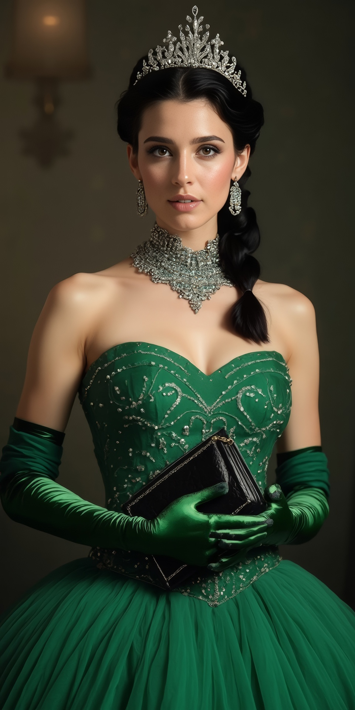

## Dressing Up

Claire stood in her dressing room, a faint smile playing on her lips.
Tonight would be special.
She had spent weeks planning, each detail carefully designed to create an evening neither of them would forget.
She glanced at the emerald-green gown hanging on the wardrobe door.
Its silken fabric glittered with the crystals there were sewn to it.
But it wasn’t just the dress that would make tonight memorable—it was everything else she had planned.

After a hot shower, she toweled off, leaving her skin slightly damp as she began the ritual of transformation.
Her makeup was bold yet refined, emerald-green eyeshadow blending seamlessly with dark eyeliner to make her eyes pop.
A deep ruby lipstick contrasted beautifully, adding a touch of daring to her look.
She took her time, ensuring every stroke and detail was perfect.
Tonight, she wanted to be his masterpiece.

Once her face was flawless,
she turned to the corset—a stunning overbust design in black satin with green embroidery to match her dress.
She slipped it around herself, exhaling as she began to pull the laces tight, centimeter by centimeter.
The sensation was both familiar and thrilling.
With each pull, her posture straightened, her figure sculpted into an elegant hourglass.
When it was as tight as she could manage, she secured the laces, the snug embrace both comforting and challenging.

Next, she rolled on sheer black stockings, smoothing them over her legs before fastening them to the garters.
Her heels were waiting—glossy black stilettos with slender straps that locked discreetly at the ankle.
The keys went into her special handbag.
No turning back now.

Claire moved to her vanity, where her tiara waited—a handcrafted piece of silver adorned with tiny crystals.
It sparkled like frost against her long black hair.
She wove it carefully into place, securing it with hidden pins.
At the base of the tiara, three fine silver chains extended,
disappearing into her hair as she braided it into a loose fishtail.
The chains trailed down to the nape of her neck, where they would later attach to her collar.
Once secured, the chains would hold her head high,
keeping her gaze forward—a regal posture, but one that left no room for disobedience.

With her outer preparations nearly complete, she turned to the more intimate part of her plan.
On the dresser, her toys gleamed under the light.
The anal plug was first—a wide, heavy piece of polished metal with an emerald-colored crystal at its base.
She applied a generous amount of lube, taking a deep breath as she began to insert it.
It slid in easily at first, but as it widened, she had to pause, her body adjusting to the intrusion.
Slowly, millimeter by millimeter, she worked it in until the widest part passed.
Her muscles clenched around it, holding it firmly in place.

The second toy gleamed in the soft light of her dressing room, a sleek,
ergonomic design that would fill her, with a curved arm promised unrelenting attention to her clit,
Just the thought made Claire’s thighs press together involuntarily.
She took a deep breath and applied a generous amount of lubricant, ensuring smoothness despite her anticipation.
Her body was ready, more than ready, but there was no room for mistakes tonight.

Slowly, she slid the dildo in, her body yielding to its presence.
The sensation was immediate, filling her in a way that was both intimate and unavoidable.
It settled perfectly, the curved arm pressing gently but insistently against her most sensitive spot.
She took another breath to steady herself before reaching for the chastity panel.
The cool metal clicked into place over her corset, the sound subtle yet final.
She knew what that meant: no access, no escape.
Her corset was now unremovable,
and the toys were a constant presence, entirely at the mercy of the controller Ethan would soon hold.

Her hands moved to the next step—attaching the thigh bands.
She pulled the smooth leather straps around her upper thighs, just above her knees,
and locked them to the chastity panel.
They hugged her legs tightly, and once she clicked the locks into place, her knees were nearly bound together.
The minimal chain between the bands allowed only the slightest movement.
She tested her range—short, shuffling steps at best.
The restriction sent a thrill through her.
Hobbled, stuffed, and locked, she was becoming the vision she had imagined.

Next, she turned to the gag.
The silencilicone was molded perfectly to fill her mouth while remaining invisible once her lips closed around it.
It slipped between her teeth, the mouthguard-style ridges ensuring it wouldn’t budge once locked.
She pressed it into place, biting down gently as it settled.
The snug fit silenced her completely.
She looked in the mirror, her lips closed and serene, betraying none of the helplessness the gag enforced.

Now came the dress.
The emerald silk felt cool against her skin as she stepped into it, careful not to disturb her restraints.
The fabric glided over her corset, hugging every curve it created.
She reached behind her,
finding the attachment point at the small of her back and threading it through the discreet opening in the dress.
With a practiced motion, she pulled the zipper up.
The gown fit perfectly, tailored precisely to the form the corset forced her body to be in.
The glittering crystals caught the light, enhancing the rich green hue.
She smoothed the fabric over her hips, admiring how it flowed despite the tight constraints beneath.

Claire paused, her reflection staring back at her.
Everything so far had gone according to plan,
but the final touches would be the most challenging—and the most permanent.
She needed a moment to gather herself.
On a small table nearby, she placed the opera tickets alongside a short letter she had written for Ethan.
It contained instructions for the evening,
details that would ensure he understood his role in her carefully constructed vision.
She closed her eyes briefly, steeling herself for the final lock-in.

The shawl was next, a slightly darker green than her dress and equally luxurious.
It draped elegantly behind her, as if just carelessly slid off her shoulders, concealing the attachments beneath.
Embedded within the shawl was a leather strap that she connected to the attachment point at the small of her back.
There was a faint click tethering the shawl in place and ensuring it wouldn’t budge.

She reached for the chains connected to her tiara, threading them carefully to the attachment point of her collar.
Each chain locked into place, pulling her head into a regal position.
She tested the movement.
Her head was immobilized, her gaze fixed forward.
The lack of mobility only enhanced her elegance, forcing her to carry herself with poise.

With her left hand still free, she slipped on her right glove.
Its fingers were sewn together, so that it looked normal, but rendered the hand almost useless.
Now came the harder part: putting on the left glove with her now-mittened right hand.
It was crude and awkward work, her thumb and the mitten clumsily gripping the fabric and pulling it into position.
The tight fit and the fact that her head was locked in its fixed position made the task even more challenging.
The mirror helped guide her, though every shift felt exhausting.
Finally, after several tense moments, the left glove was snugly pulled up to her elbow.

Claire reached carefully for the shawl and draped it over her elbows, arranging it to hang gracefully between them,
checking the fit in the mirror.

With slow, deliberate motions,
she used her left hand to find the leather strap hidden within the shawl on her right hand side..
Guiding it to her right elbow, she secured the strap, fixing her right arm closely to her waist.
She flexed her arm against the restraint but could barely move it.

The left hand side was even more demanding.
She reached carefully for the strap near her left elbow,
as far as the strap in the shawl would allow and careful not to upset the draping on her left.
Her limited dexterity made every movement an effort, her arms trembling slightly from the strain.
Bit by bit, she maneuvered the strap into place,
her mittened right hand pressing awkwardly trying to click the lock shut.
At last, with a soft click, the strap locked, securing her left arm to her waist as well.

Finally, Claire reached for her handbag, the capstone piece of her elaborate plan.
Its design was as thoughtful as every other detail—a slim,
elegant clutch in emerald silk with subtle embroidery to match her gown.
Inside, the small compartment held all the keys to her bindings and the remote for the toys nestled deep within her.
Two straps, in the exact shade of her gloves, adorned the exterior—one on the left and one on the right.
Hidden inside the cover, a solid metal bar ensured that what came next would be effective.

She slid her gloved hands through the straps, aligning them perfectly.
Her breath quickened slightly as she engaged the locking mechanism.
The straps pulled tight, cinching around her wrists and forcing her hands to the purse in front of her,
fingers in front, thumbs behind.
She flexed her fingers instinctively, but the sewn-together mittens of her gloves reduced them to mere decoration.
The bar inside the purse kept her hands immovably secured, ensuring she could do nothing more than hold it in place.
And the leather strap in the shawl held her elbows fixed at her sides.

Hobbled and restricted, she took careful, mincing steps toward the full-length mirror, positioning herself in front.
Her reflection was dazzling.
From the outside, she appeared every bit the vision she had imagined—a woman of sophistication, elegance, and poise.
The gown shimmered as it caught the light,
its sparkling emerald crystals drawing the eye to every contour of her figure.
The corset beneath shaped her into a silhouette of perfection, though its demanding embrace was hidden from view.
The tiara atop her head glittered,
the woven-in silver chains an exquisite detail that only she and Ethan would understand.
Her makeup was flawless, echoing the rich tones of her dress and highlighting her striking eyes and lips.

Her shawl, a matching darker green, dangled casually between her elbows,
giving no hint that her arms were locked to her sides.
Her hands, encased in their elegant gloves, rested on the purse, which she held demurely in front of her.
From the outside, she was the picture of grace and control.

But beneath the surface, the truth was far more tantalizing.
The corset cinched her tightly, making every breath deliberate and her posture unyielding.
Her knees, locked together by the thigh bands, allowed only the smallest, most measured steps.
The toys inside her were a constant, unrelenting presence, held securely in place by the locked chastity panel.
Her arms, restrained at the elbows, left her unable to raise them,
and her mittened hands were useless, tethered to the purse in front of her.
Her gag silenced her completely, the silencilicone filling her mouth and rendering her incapable of speech.
Every restraint was invisible, hidden beneath the glittering perfection of her attire.

With slow, careful steps,
she moved to the small table where she had positioned the opera tickets and her letter to Ethan.
She turned to face the room, standing at attention, her posture regal and composed.
Not that she had much choice.

Ethan would arrive soon,
and when he did, he would find her exactly as she intended: bound,
silent, and helpless, with the remote to her toys resting in her purse,
waiting for him to take control.

All she could do now was wait.

## Coming Home

Ethan’s footsteps echoed in the hallway just as Claire had planned.
She had timed everything perfectly.
She stood poised and still,
the unyielding restraints forcing her calm, regal appearance.
The sound of the key in the lock was followed by the creak of the door opening and the rustle of his coat
as he stepped inside.
Then he stopped, stunned.

Claire smiled behind her gag, her lips curling faintly despite the silencing presence filling her mouth.
She didn’t move; she didn’t need to.
She simply stood, presenting herself as his gift.

Ethan’s eyes widened as they took her in.
“Oh,” he murmured, stepping forward slowly.
“A surprise.”
His voice was warm, tinged with curiosity and delight.
His gaze traveled over her, pausing when he spotted the collar resting snugly around her neck.
A small, knowing smile spread across his lips.
“A very pleasant surprise.”

Claire lowered her gaze as much as she could, a modest curtsy attempted despite her tight restraints.
The thigh bands kept her legs close together, barely allowing the movement,
and the chains connecting her hair to her collar forced her head to remain upright.
She hoped her submissive intent was clear, even if her restricted body made it difficult to express.

Ethan circled her, his steps slow and deliberate.
Claire remained motionless,
every inch of her bound body posed and perfect, like a living mannequin designed for his admiration.
She could feel his eyes on her,
taking in every detail—the shimmering emerald gown, the glittering tiara with its delicate chains woven into her hair,
the flawless makeup that matched the colors of her dress,
and the elegant posture that her corset, heels, and bindings demanded.
Her hands, locked to the handbag in front of her, added to her demure presentation.
She was his to admire, to show off, and to play with.

“So beautiful and regal,” he said softly, his voice tinged with awe.
“And so much glitter.
My love, what do you have planned for the evening?”
He stepped closer, his eyes warm but full of mischief.

Claire couldn’t answer, of course.
The gag filling her mouth rendered her entirely silent.
She held her position, letting her body speak for her.
Ethan studied her closely, his expression shifting from admiration to curiosity as his eyes swept the room.
His gaze landed on the small table, where the envelope and the opera tickets lay neatly.
He strode over and picked them up, glancing back at her before he opened the letter.
As he read, his eyebrows rose slightly, and a smirk tugged at the corner of his lips.

Claire watched him intently, as much as her restricted head movement would allow.
She knew exactly what he was reading—the carefully written description of her helpless state,
laid out in exquisite, erotic detail.
She had explained every restraint, every lock, every limitation she had placed on herself.
She had ended the letter with a simple statement: I am helplessly yours to use as you see fit.

When he finished reading, he folded the letter and set it back on the table.
The tickets—front row center for Turandot—remained in his hand.
He turned back to her, his eyes glowing with a mixture of amusement and arousal.

“You’ve outdone yourself,” he said, stepping closer.
He brushed her neck with his fingers, tracing the smooth line of her collar.
Claire shivered, the sensation heightened by her inability to move or react freely.
His hand wandered upward, brushing along her jawline before settling against her cheek.
His fingers pressed gently, exploring the shape of her gag through her skin.
“Gagged, too,” he murmured, his tone teasing.
“Oh my.”

If Claire could have looked down,
she would have tried to catch a glimpse of the inevitable effect this was having on him.
She couldn’t see, of course, but she didn’t need to.
The intensity in his eyes,
the way his voice softened and deepened—it was enough to know that she had achieved exactly what she wanted.

## At the Opera

The sleek car came to a stop in front of the opera house,
and Ethan stepped out, buttoning his coat against the cool evening air.
He moved to Claire’s side, opening the door and reaching in.
Her immobility made her feel more like an object than a person at that moment, but that was precisely the point.
Ethan gently slid his arms under hers, lifting her carefully out of the car.
Her heels clicked softly against the pavement as he arranged her, ensuring her footing was steady.
He handed the car keys to the stunned valet, who hesitated for a moment before managing a polite nod.

Ethan took the remote for her toys from her purse, and extended his arm to Claire,
taking hers because she could not lift it herself.
Her shawl fell neatly over her elbows, concealing her bindings,
as they began their slow, measured walk toward the grand entrance of the opera house.
Her hobbled, mincing steps made progress painfully slow, but Ethan didn’t rush her.
Instead, he matched her pace, his hand steady on her arm as if they were merely enjoying a leisurely stroll.

The evening air buzzed with the chatter of finely dressed patrons
wandering between the various stands in the foyer.
The two-storied foyer glittered with lights, casting a golden glow on the red carpet leading inside.
Claire felt every eye on them, though she knew the restraints beneath her gown were invisible.
Still, the humiliation of her helpless state burned beneath her perfect posture.
Ethan was calm and collected, his demeanor one of complete control,
which only heightened the thrill and the mortification she felt.

They had almost reached the entrance to the grand hall when a familiar voice stopped Ethan in his tracks.

“Ethan! I haven’t seen you in an eternity.”

Amelie.
Claire recognized her immediately.
She stood a few feet away,
composed and enigmatic, her shiny white latex blouse with a pussybow gleaming under the chandelier light.
Her long black latex skirt swished elegantly as she moved, the fabric catching the light with every shift.
Her gloves, also latex, extended beneath the cuffs of her blouse,
their sheen adding an air of sophistication and kink to her attire.
Beside her, Helen stood quietly, a step behind and slightly to the side, also in latex, her eyes fixed on Amelie.
She was dressed more simply, her posture submissive, her hands clasped behind her back.

Ethan smiled and inclined his head slightly.
“Hello, Amelie.”
He didn’t so much as glance at Helen; it would have been improper to acknowledge her unless Amelie invited it.
“You look… shiny,” he said with a hint of amusement.

Amelie’s lips curled into a knowing smile.
“I have far too little opportunity to show off, but when one offers itself, I’ll take it.”

“I know what you mean,” Ethan replied.
“I wouldn’t have found the time to be here either, but Claire insisted we spend an evening out.”

Amelie’s eyes drifted to Claire, her smile widening.
“How are you, Claire?” she asked politely, though the question carried an edge of curiosity.

“She’s fine,” Ethan answered smoothly. “It’s just that she’s gagged.”

Claire flushed deeply at the words, her cheeks burning.
Neither Amelie nor Ethan made any effort to lower their voices,
their conversation cutting through the soft murmur of the crowd.
She couldn’t move, couldn’t speak, couldn’t even turn her head to avoid Amelie’s piercing gaze.

“Oh, is she now?” Amelie’s tone was playful, but her eyes gleamed with intrigue. “What did she do to earn that?”

“Nothing,” Ethan replied with an almost casual air. “I found her that way when I came home today.”

Amelie tilted her head, appraising Claire more closely.
She snapped her fingers and pointed at the ground.
Helen moved instantly, positioning herself exactly where Amelie indicated,
standing still and silent like a well-trained pet.
Amelie began to circle Claire, her heels clicking against the polished floor as she inspected her.

“Nice corset,” Amelie remarked, pausing briefly behind her.
“And that hair bondage is a nice touch.”
She stepped around to Claire’s side, her eyes narrowing slightly as she took in the details.
“Are the gloves locked?” she asked, her tone almost clinical.

Claire’s heart raced, and the flush of embarrassment deepened.
She felt like a prize cow on display, every inch of her body scrutinized and evaluated.
Ethan, as calm as ever, took that moment to subtly press the remote in his hand.
The front vibrator in her chastity panel hummed to life,
its low but insistent vibration sending a wave of heat through her.
Simultaneously, the plug began to buzz with a less ignorable intensity,
filling her with a deeply rooted stimulation that made her thighs tremble slightly beneath her gown.

Amelie noticed, of course.
Her lips twitched as she glanced at Ethan.
“And here I thought I was the only one who enjoyed bringing toys to the opera,”
she said lightly, her tone laced with amusement.
Claire’s humiliation was now complete, her helpless state a source of entertainment for both of them.
Ethan simply smiled and tucked the remote into his pocket,
his hand steady on Claire’s arm as she struggled to maintain her composure.

“You’ve outdone yourself,” Amelie said, stepping back to stand beside Helen once more.
“Enjoy the performance, Ethan.
I know we will.”

Ethan nodded, his grip on Claire firm as he guided her toward their seats.
The evening had only just begun, and already Claire was overwhelmed—and they hadn’t even made it to the grand hall yet.

The walk to their seats was an agonizing trial for Claire,
each step sending ripples of sensation through her body as the toys buzzed relentlessly inside her.
Ethan held her arm, his firm grip steady as he led her down the aisle.
The grand opera house seemed brighter than ever, the chandeliers casting their warm glow over the audience,
making her feel as though every eye in the room was focused on her.
She forced herself to maintain her composure, her shoulders back,
her head held high despite the chains restricting her movement.
Each step was a delicate battle, the vibrations from the anal plug growing more insistent,
the pressure inside her building with every moment.

They reached their seats in the very front row, the position making her feel even more exposed.
She could sense the people behind her, their murmured conversations and quiet laughter filling the air.
Her restraints were invisible, but the humiliation of her helpless state felt written across her skin.
The seat to her right was occupied by an elderly lady, her silver hair styled neatly, her expression kind.
She noticed Claire's hesitation and leaned forward, pressing the seat down for her with a polite smile.

“Here, dear,” the woman said. “Let me help you.”

Claire nodded faintly, her movements restricted, and Ethan stepped in, guiding her gently as she lowered herself.
Sitting down was a fresh torment.
The weight of her body pressed the anal plug deeper,
the relentless vibrations against her most sensitive spots amplifying.
The front dildo shifted, the arm against her clit adding an almost unbearable pressure.
Claire's breath caught in her throat, and she closed her eyes tightly, feeling herself teetering on the edge.
The sensation was overwhelming, the pleasure too much, too sudden, and utterly unstoppable.

And then, everything stopped.

The sudden absence of the vibrations left her stunned.
She opened her eyes, startled, and saw Ethan smiling at her, the remote casually hidden in his hand.
He leaned in slightly, his voice soft.
“You’re doing beautifully,” he murmured, his tone laced with amusement.

“Are you okay, dear?” the elderly woman asked, her kind eyes turning toward Claire.

“She’s fine,” Ethan answered smoothly before Claire could even attempt to respond, the gag silencing her completely.
“It’s just warm in here, don’t you think?”

The elderly woman nodded. “Oh, it is a bit, isn’t it? I always say these places could do with better ventilation.”

Ethan struck up a polite conversation with the woman and her equally elderly husband,
his voice calm and composed as they discussed the opera.
Claire, meanwhile, fought to steady her breathing, the sudden silence inside her both a relief and a frustration.
Her body still hummed with the echoes of the sensations, her composure fraying at the edges.
She focused on sitting upright, her corset forcing her into perfect posture,
her hands locked demurely to the handbag resting in her lap.

“So, what do you think about this production?” the elderly woman asked, turning her attention back to Claire.
“I hear it’s quite controversial this season.”

Just as the woman finished her question, the opera began,
opening straight into "Popolo di Pechino" with breathtaking power.
Claire glanced at Ethan, who met her gaze with a subtle smirk, clearly enjoying the timing.
He leaned back in his seat, his posture relaxed as he turned his attention to the stage.
Claire closed her eyes briefly, grateful for the distraction of the music, though the tension within her body remained.

Then the inserts came to life again inside her.

The night had only just begun, and she was already at her limit.
She wasn’t sure if she could endure it—but she knew she didn’t have a choice.

## The Production

The moment the music came on, the vibrations roared back to life, sending an immediate jolt through Claire’s body.
She should have known.
Ethan was nothing if not predictable in his delight for tormenting her exactly when she was most vulnerable.
The dual sensations flooded her,
the vaginal dildo pressing its thumb against her clit while the anal plug relentlessly pounded inside her.
She tried in vain to find some form of relief, uselessly attempting to curl her toes in the stiff, locked heels.
Her body squirmed against the unyielding corset that held her in perfect, regal posture.
Even her mittened hands, locked to the steel bar inside her purse,
strained futilely, as though she could somehow bend the metal bar reinforcing the top of her purse.

Her breathing quickened, and if she could have, she would have moaned.
But the gag filled her mouth completely, silencing any sound she might make.
She could only dig her heels into the plush carpet beneath her seat,
her body trembling with the overwhelming sensations.
She felt Ethan’s gaze on her, calm and composed.
He enjoyed her silent struggle, pushing her to her limits while she sat helplessly beside him.

Just as she was on the edge, ready to tumble into the release she craved,
the vibrations in the vaginal dildo stopped abruptly.
The anal plug, however, continued its relentless pounding,
the sensation sharper and more demanding now without the counterbalance of the front toy.
It was almost too much—so intense it might have been painful if she weren’t already so aroused.
Her breathing came rapidly, her chest rising and falling, her breasts pressing against the tight cups of her corset.
She wanted to scream her frustration, but the gag ensured her silence.
She was left to sit there, trapped in her own need, unable to move or make a sound.

Ethan, of course, knew exactly what he was doing.
His ability to edge her at the perfect moment was uncanny.
She thought back to the time she had joked about it,
calling him Edge-Man after he’d once donned a latex costume and posed with two oversized silicone dongs,
striking a ridiculous superhero stance.
She’d been tied to the bed at the time, helpless and laughing so hard she nearly choked on her gag.
That memory would have brought a smile to her lips if her current situation weren’t so maddeningly frustrating.

Claire sat perfectly upright in her seat, the corset ensuring she couldn’t slump or fidget.
From the outside, she must have looked serene, like a dancer or a poised socialite deeply immersed in the music.
But inside, she was a tempest, her body aflame with sensations she couldn’t escape.
Her eyes closed,
not in concentration on the performance but in a desperate attempt to manage the overwhelming stimulation.

When the music came to an end, the grand hall fell into a deep silence,
broken only by the soft whirring of the motor in the anal plug still working inside her.
Claire’s eyes flew open in panic,
her cheeks burning as the woman beside her turned to look at her with a puzzled expression.
Ethan reacted quickly, discreetly shutting off the remote and silencing the toy.

The woman eyed her, her irritation was still evident, but Claire just held her regal pose as if nothing had happened.
She was thankful for the dim lighting in the audience, hiding her face burning with humiliation.
If the darkness hadn’t concealed it, her flushed cheeks might have glowed red enough to light the room.
So she just sat, with the rapid rising and falling of her chest the only sign of visible distress.
Ethan leaned back in his seat, casually draping an arm over the armrest, a faint smirk on his lips.
Claire knew he was enjoying every second of her torment, and she couldn’t help but both resent and adore him for it.

As the next number began, Claire found herself teetering on the edge of desperation.
Her body was tense, overstimulated, and straining against the unrelenting pressure of the toys.
The steady thrum of the anal plug pounded in time with her racing heartbeat,
and the front dildo,
which had come on again as the music started, remained maddeningly close to pushing her over the brink.
She knew she couldn't keep this up much longer without doing something.

She decided to shift in her seat,
hoping to find a position that would either tip her into relief or at least make the sensations more bearable.
Slowly, she leaned forward,
her weight pressing fully onto the chastity panel running from the back of her corset to the front.
It was a mistake.

The pressure on both toys increased immediately.
The vaginal dildo sank deeper, the curved "thumb" pressing firmly—almost cruelly—against her clit.
Claire gasped silently into her gag, her eyes closing as a fresh wave of arousal surged through her.
Before she could react, she heard and felt a faint *click*.
The chastity plate, locked in place by ratcheting fasteners, had tightened itself another notch,
pulling even more snugly against her body.

Claire's eyes snapped open, her body stiffening as she realized what she'd done.
When she leaned back again, hoping for some relief, the pressure didn’t lessen.
Instead, it grew more insistent, the chastity plate now pressing firmly against her,
holding both inserts even deeper inside her.
The slow, lazy buzz of the front dildo's new program made her squirm involuntarily,
the teasing vibrations a maddening contrast to the relentless pounding of the anal plug.

Ethan, seated beside her, had noticed everything.
He had heard the *click*, and his lips curved into a small, knowing smile.
Without a word, he reached into his pocket and adjusted the remote, lowering the intensity of the vibrations.
The anal plug continued its steady rhythm, but the front dildo’s pattern shifted.
The buzzing that had been tormenting her clit was replaced with a slow,
deliberate massage, the kind that teased without ever satisfying.
It wasn’t enough to push her to the edge—it wasn’t even close.
But it wasn’t ignorable, either.
It would linger, maddeningly, until it drove her out of her mind.

Claire sat frozen, with flushed cheeks, unable to act out her frustration.
If she could speak, she would have had a few choice words for Ethan.
As it was, she could only glare at him from the corner of her eye, though she knew it wouldn’t faze him.
He met her gaze briefly, his expression calm and composed, though the amusement in his eyes was unmistakable.

In that moment, Claire decided that *Edge-Man* was not a hero.
He wasn’t even a ridiculous, campy parody.
No,
he was a supervillain—a cruel mastermind
who had perfected the art of driving her to the brink of insanity with his endless games.
She shifted slightly in her seat, but there was no escape from the pressure.

By the time the intermission arrived, Claire was barely holding on.
Her mind felt melted, a swirling mess of desire and frustration that left her strangely docile and pliant.
The relentless teasing had eroded any semblance of composure, leaving her beyond caring about dignity or frustration.
She just wanted release, desperately, shamelessly.
Her body trembled with the need that consumed her,
and she could barely focus on the crowd beginning to rise from their seats around her.

If she hadn’t gagged herself, she might have moaned loudly or spilled incoherent pleas.
Even the brief thought of stomping on Ethan’s foot with her spike heel crossed her mind, but she quickly dismissed it.
Hobbled as she was, she couldn’t manage it effectively,
and she knew Ethan would only laugh at the attempt—and probably find a way to edge her even more cruelly.
Her desire for release had grown so overpowering that it had smothered her frustration,
leaving her entirely submissive to him.
And, of course, Ethan knew.
And liked it that way.

Ethan helped her to her feet, steadying her as she wobbled slightly on her stiff heels.
His hand was firm on her arm as he guided her out of the grand hall and into the bustling foyer.
The glittering chandeliers overhead reflected off the polished floors, and the hum of conversation filled the air.
Claire moved as Ethan directed, her body taut and aching with need.

They hadn’t made it far before they ran into Amelie again.

Amelie looked as composed as ever, her shiny latex blouse and long skirt pristine,
the reflections off the polished material catching the light beautifully.
She stood confidently, her expression cool and knowing, while Helen, slightly worse for wear, stood quietly behind her.
Helen’s face was flushed, her makeup no longer flawless, and her hair had clearly been touched up in a hurry.
She stayed at Amelie’s five-o’clock position, her eyes fixed on her mistress, awaiting instruction.

“Ethan, how did you like the performance?”
Amelie asked, her tone conversational as she glanced at Claire briefly before turning her attention fully back to him.
“Helen, get us wine and a few snacks, would you?” she added with a casual wave.
Helen curtsied deeply, and silently moved off to do as she was told.

Ethan smiled, his expression unflappable as always.
“It was quite an interesting performance.
I liked it,” he said smoothly.
He didn’t specify which performance he meant,
but his smile left no doubt that he did like it.

Amelie returned his smile.
“Yes, quite.
It’s good that we had a private box all to ourselves.
We could enjoy the performance so much better that way.”

Claire’s mind conjured an unbidden image of Helen kneeling before Amelie,
her head disappearing beneath the swishing folds of the latex skirt.
She blushed deeply, the thought intensifying her already burning embarrassment.
Ethan, of course, noticed and tightened his grip on her arm slightly.

“Well,” Ethan said lightly, “Claire here has been so poised and stiff at all times,
I don’t know if she managed to… enjoy herself.”
His tone was laced with mischief, and Claire’s urge to stomp on his foot with her heel flared up again.
Maybe it was worth the risk this time.

Amelie laughed softly.
“I’m quite confident that you’ve been tracking her…
enjoyment closely at all times,” she replied, her eyes twinkling with amusement.

Before Ethan could respond, Helen returned,
balancing a small tray with two goblets of wine and two neatly arranged mini-quiches.
She curtsied gracefully, her movements precise despite the obvious effort,
and offered the tray first to Ethan and then to Amelie.

Ethan accepted a goblet and one of the quiches with a nod.
“Thank you for your hospitality, Amelie,” he nodded politely.

“Enchanté,” Amelie said with a slight incline of her head. Their glasses clinked softly together.

“To performances,” Ethan said with a sly smile.

“To performances,” Amelie agreed,
her voice low and warm as her gaze flicked briefly to Claire before returning to Ethan.

As Amelie departed with Helen trailing obediently behind, Claire turned her attention fully to Ethan.
She stepped closer, pressing herself into him, her bound arms brushing against his side,
her body communicating what her gag prevented her from saying.
Her need was palpable, every movement laced with desire.

“Little minx,” Ethan murmured,
his voice low and teasing as his fingers trailed along the rigid lines of her corset beneath her dress.
His touch was firm but unhurried, following the structure of the boning upwards to her bare shoulders.
He traced the delicate curve of her collarbones,
then ran his fingers over the leather of her collar, a reminder of her submission.
“You seem to have developed other interests than the second act,” he observed, his tone light but knowing.

Claire nodded, her eyes pleading as she pressed herself into him again, more insistently this time.
She couldn’t speak, but her intent was clear.

“Do you want to leave, love?” Ethan asked softly, his hand resting lightly on her waist.

She nodded again, this time grinding against him subtly in a silent plea.
Her restraint and torment had left her utterly consumed by need.

“It seems to be urgent,” he said, smirking as he took her arm.
Without waiting for further confirmation, he guided her swiftly toward the exit.
As soon as they stepped through the grand doors into the cool night air, Ethan acted.
His arms circled her waist and knees in one smooth motion, lifting her effortlessly.
Her corset kept her stiff, her skirts compressing around her as he carried her toward the valet station.

The valet, recognizing them from their arrival, smiled politely.
There was no queue this early in the intermission, and within moments, their car was brought around.
Ethan tipped the young man generously, then carefully placed Claire into the passenger seat.
He adjusted her skirts and smoothed the fabric before leaning in close, his voice a low murmur only she could hear.

“You’re not getting off that easily, little one,” he said with a devious grin, pulling the remote from his pocket.
He turned the vibrations back on, setting them to a steady, teasing simmer that left her squirming in her seat.
Claire’s eyes widened,
and she let out a muffled sound of frustration behind her gag
as Ethan shut the door and walked around to the driver’s side.

The drive home was an eternity for Claire.
The slow, unrelenting stimulation kept her teetering on the edge, every nerve alight and every breath sharp with need.
She shifted in her seat, not even trying to hold back any moans.
The unyielding chastity panel ensured that her every movement pressed the vibrating toys deeper,
amplifying her torment.
Ethan drove with maddening calm, one hand on the wheel, the other resting casually on the remote,
making subtle adjustments that sent jolts of sensation through her.

When they arrived, Ethan stepped out of the car, moving with his usual unhurried grace.
He opened her door, scooping her into his arms without a word.
Claire’s helplessness only heightened her arousal, her bound body pliant in his hold as he carried her inside.
The cool air of the house kissed her flushed skin as he brought her to the bedroom,
setting her carefully on the edge of the bed.

He took the keys from her locked handbag, releasing the straps that held her elbows close to her waist.
His hands brushed along her arms as he freed her, the brief contact sending shivers through her.
Then, kneeling before her, he slipped beneath her voluminous skirts,
the warmth of his breath on her thighs making her squirm.
He unlocked the bands at her thighs,
his fingers lingering as they brushed the sensitive skin where the restraints had bitten.

Ethan emerged from beneath her skirts and without a word, he lifted her, turning her to face the bed.
Her skirts bunched around her waist as he positioned her on her knees,
her hands still bound to the handbag in front of her.
The corset kept her spine straight, forcing her into a perfect arch as her legs spread wide on the soft mattress.
She could do nothing but wait, her breathing shallow and her desire mounting with every passing second.

He reached for the chastity shield, the final barrier, and unfastened it with deliberate slowness.
The sound of the lock clicking open and the pressure loosening made her thighs tremble.
With a playful tug, he slid the shield away, revealing the gleaming toys still nestled inside her.
The pulsing sensations from the vibrator and plug were overwhelming,
and when Ethan’s hands brushed her skin, her body jolted.
She wanted to cry out, to beg, but the gag silenced her,
leaving her to convey her desperation with tiny, needy movements.

Ethan didn’t rush.
He grasped the base of the anal plug, twisting it gently before pulling it free.
The sensation made Claire shudder, her body clenching at the sudden emptiness.
He set it aside in a paper towel, then turned his attention to the vibrator.
He slid it out slowly, the curved arm dragging against her swollen clit as it left her.
If she could have gasped, she would have.
The absence of the toys only heightened her awareness of her need, her body crying out for fulfillment.

She wiggled, trying to entice him, but Ethan simply chuckled.
His hands caressed her thighs, tracing the line of her stockings, following the curve of her hips to her backside.
He spread her gently, his fingers dipping into her wetness, teasing her folds but withholding the touch she craved most.
His thumb brushed lightly against her clit, just enough to make her moan into her gag,
her entire body trembling with frustration.

Finally, he positioned himself behind her, his hands firm on her waist as he pushed her skirts higher.
The sound of his belt unbuckling sent a fresh wave of heat through her.
When he entered her, the sensation was overwhelming.
His hand gripped the small of her corseted waist, holding her steady as he filled her completely.
She was utterly at his mercy, unable to move, unable to speed things up, unable to do anything but surrender.

Ethan set a slow, deliberate pace, each thrust measured and deep.
Claire’s muffled cries grew louder, her body writhing as much as the corset and her bindings allowed.
She felt every inch of him, every movement magnified by the hours of teasing and denial.
Her mind blurred, her thoughts dissolving into pure sensation as he took her.

Then he changed pace, his thrusts growing faster, harder, more relentless.
Claire’s body tensed, the pressure inside her building to a breaking point.
When release finally came, it crashed over her like a tidal wave,
her muffled cries spilling into the room as her body convulsed.
Ethan didn’t stop, driving her higher, pushing her into another orgasm, and then another.
She came again and again, her body trembling violently, her mind a haze of pleasure and submission.

When she finally collapsed, wet and messy, Ethan held her steady, his hands gentle as he eased her down onto the bed.
He gave her a moment to recover, stroking her hair and murmuring soft praises.
Then, with care, he began to free her.
He unlocked her wrists, removing the handbag and setting it aside.
He unfastened the gag, easing it from her mouth,
and she took a deep, shuddering breath before their lips met in a deep, lingering kiss.

He continued with the same tenderness, helping her out of the dress, the gloves, the heels, and the stockings.
Each piece was removed with reverence, as though he were unwrapping a precious gift.
When he finally unlaced her corset, his fingers traced the faint red marks it had left behind,
his lips following the lines with soft, featherlight kisses.

As his kisses trailed lower, toward her belly, Claire stopped him with a weak laugh, her cheeks flushing.
“Toilet first,” she murmured, her voice hoarse but teasing.

Ethan chuckled, his arms wrapping around her.
“Then we’ll shower,” he said, scooping her up and carrying her toward the bathroom.
The night wasn’t over, but for now, there was only warmth, closeness, and the promise of more to come.
