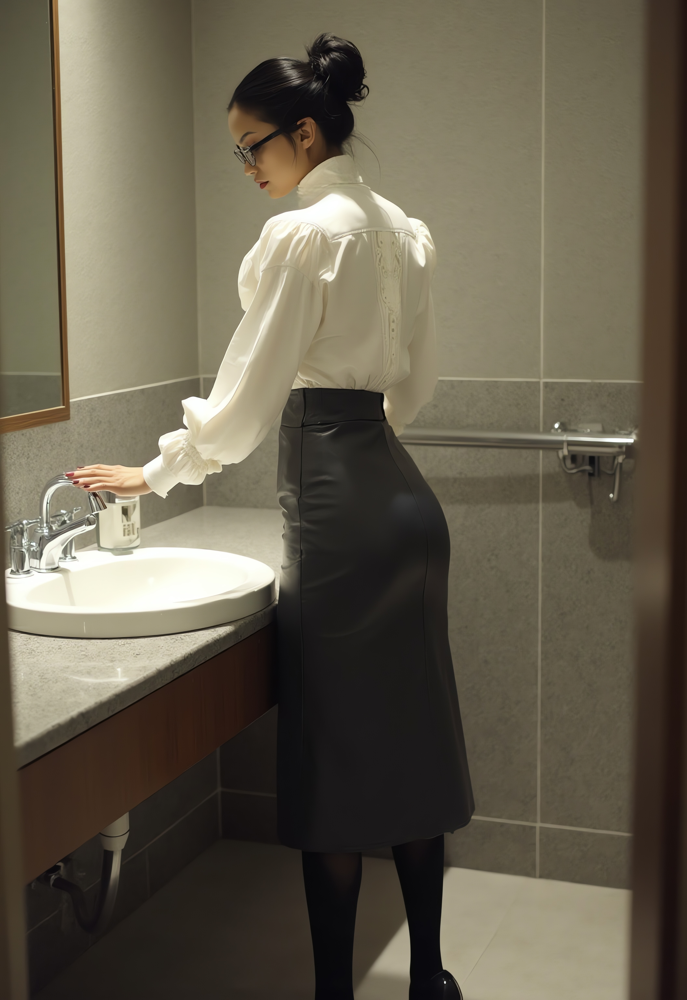

# Claire's Valentine's Day

Claire stood before the mirror in her bedroom, adjusting the high collar of her Victorian-style blouse.
The pearlescent buttons gleamed under the soft light, running up between her breasts to the collar.

Casual Friday might be casual for men, but for women it had different, unwritten rules—no denim, no careless ensembles,
but room for experimentation and for pushing boundaries.
A woman in the corporate world dressed with intent, not convenience.

Today, she had chosen a long pencil skirt with a high slit,
enough to tease but never reveal more than intended.
The blouse’s slightly puffed sleeves and long, narrow cuffs added a formal touch,
a sharp contrast with the daring cut of her skirt.
Her hair was drawn into a sleek bun, a single pencil securing it in place, adding an air of studied nonchalance.
Satisfied, she slid on her librarian glasses, completing her not-quite "sexy librarian" look.

It was icy and cold outside, with a cutting wind.
She chose high leather lace-up boots with sturdy block heels and a good profile for grip, 
their warmth a necessity against the frost-covered streets outside.
She pulled on her tailored wool coat, fastening it snugly at the waist before stepping out into the cold morning.

The office was already stirring when she arrived, the low hum of conversation and clacking keyboards filling the space.
She shed her coat and made her way to the canteen, the scent of roasted coffee and fresh croissants in the air.
The queue was short.
Jeanette from Finance was ahead of her, gripping a paper cup and chatting about the latest round of T.P.S. reports.
Claire listened, nodding at the appropriate points.

"It's a mess," Jeanette sighed. "I told them the system wouldn't hold up, but does anyone listen? No."

"They never do," Claire said, stepping forward as her turn came. "Flat white, please."

Coffee in hand, she made her way back to her desk, passing Marc, her boss, who was predictably distracted.
His gaze lingered too long on Sophie—again.

Sophie had outdone herself today.
Valentine’s Day had inspired a confection of lace and leather—an off-shoulder,
corset-laced blouse in sheer black, cinched tight, the satin ribbons crisscrossing over a deep crimson leather bustier.
The fabric clung to her curves, barely meeting the waistline of her pencil skirt,
which was scandalously tight and barely reaching halfway to her knees.
The slit was high, teasing lace-topped stockings with every shift of her hips.
On her feet, red patent stilettos gleamed, dangerously tall.
She moved with deliberate grace, aware of every set of eyes tracking her.

Claire sipped her coffee, unimpressed.
One day, Marc’s behavior would earn him a disciplinary meeting with HR.
Until then, he was just another predictable man, easily distracted and pathetic in his obviousness.

She settled into her chair, turning to her work.
The morning passed swiftly, her project plan taking shape with precise efficiency.
Then, just before ten, a soft vibration on her wrist alerted her.
Her appointment.

She locked her screen, grabbed her cellphone and handbag, and rose.
Without a word, she made her way to the special needs restroom—chosen,
because it was a single, lockable room, private and isolated.

The door clicked shut behind her.

At precisely ten, Claire’s phone rang.
She didn’t need to check the screen—she already knew who it was.
She pressed accept and lifted the phone to her ear.

“Where are you?” Ethan’s voice was smooth, direct.

“Exactly where I should be. Special needs restroom, first floor. Solid walls, door locked.”
She met her own gaze in the mirror, her blouse already unbuttoned, fabric spilling away from her skin.
Her bra was pulled down just enough to leave her bare, her breasts full and exposed to the cool air.

“And the clothespins?”

“Ready.”

There was a pause, then a soft chuckle. “Describe what you see.”

Her lips parted.
She let her eyes trail over herself, the way the open blouse framed her body, how the lace of her bra edged her curves.
“My blouse is undone.
My breasts are out.
My nipples are—” she swallowed, feeling the weight of his attention even through the phone, “—already hard.”

“Good.” His tone was pleased, knowing. “Take one of the clothespins. Bring it to your left nipple.”

She obeyed, lifting the wooden pin, its weight small but firm in her fingers.
She circled it, letting the rough edges of the wood brush against her skin.
Anticipation curled in her stomach.

“Wait.”

She waited. She could hear him breathing, could picture the way he was sitting, leaning back, relaxed but in control.

“Now,” he said.

Her breath came a little faster now, her voice softer but steady as she obeyed.

“I’m holding the clothespin over my nipple,” she murmured,
watching her reflection, the way her fingers trembled just slightly.
“The wood is rough, the edges smooth where it’s been worn down.
I can feel the tension in the spring, the way it wants to snap shut.”

She hesitated, just for a second. Anticipation curled tight inside her.

“I’m letting it open, just a little.”
A breath.
“I’m placing it—just barely—against me.
The tip of the pin is touching my nipple now, grazing it.
The metal hinge is cool, but the wood is warm from my hand.”

Her fingers flexed, pressing the pin wider.

“I’m letting it grip—slowly—just enough that I can feel it pinch but not press.”
She swallowed, a slow exhale.
“And now—ungh—it’s on.”

A sharp breath.

“It bites—harder than I expected.
A sting, like a needle, sharp and bright.
It’s hot.
It—” She stopped, adjusting to the way her body responded, her thighs pressing together.
“It spreads.
First right here—” her voice wavered, “—like fire around my nipple, but then it changes.
It’s—” she licked her lips, “—not pain anymore.
It’s deeper now, like warmth moving through me.
I can feel it in my chest, in my stomach.”

Her fingers pressed against the sink, needing something solid.

“It’s melting lower now.
It’s pulling.
My legs feel weak.
And—” she closed her eyes, “—I want more.”

“Now the other one,” he murmured.

She didn’t wait for further instruction.
She took the second clothespin, mimicked the slow teasing movement from before,
dragging the wood in a slow circle before pressing it open and clipping it onto her right nipple.
Another sting, another rush of heat.
The sensation doubled, the ache spreading as she exhaled a quiet, shaking breath.

For a moment, the only sound was their breathing.
Claire’s was uneven now, the sharp bite of the clothespins keeping her on edge, the ache settling deep in her body,
mixing with the anticipation that curled low in her belly.
Then Ethan spoke again, his voice lower, rougher.

“Tonight,” he said, a promise and a command in one. “After dinner, you’re mine.”

She swallowed, gripping the edge of the sink.

“I’m going to drag you onto the bed the second we walk through the door,” he continued, voice dark with intent.
“I don’t care if you’re still in heels, still in that tight little skirt—I’ll yank it up,
bunch it around your waist so I can see all of you.
You’ll try to twist away, but I won’t let you.”

Claire let out a shaky breath, the sting in her nipples pulsing in time with her heartbeat.

“And those panties you’re wearing?
Forget them.
I’ll have them gone in seconds.
Maybe I’ll tear them right off—”
he chuckled, the sound low and possessive, “—or maybe I’ll take my knife and cut them away,
feel the blade graze your skin while you squirm underneath me.”

A soft, helpless moan slipped from Claire’s lips.

“I’ll flip you onto your stomach, pull your arms up by the wrists.
You’ll beg, but it won’t matter.
I’ll take you hard and deep from behind, the way you need it.
The way you crave it.”

The ache between her legs grew unbearable.
The clothespins bit harder as she shifted, as if her own body was demanding more.

“And I won’t stop,” Ethan promised.
“Not when you gasp, not when you whimper, not even when you’re shaking so hard you can barely breathe.
I’ll ride you until you’re wrecked, until you can’t do anything but take it.”

Claire whimpered, the pressure, the sting, the anticipation twisting inside her.

“You’re mine,” he murmured. “And tonight, you’ll know exactly what that means.”

"And now," Ethan’s voice held that unmistakable edge of command,
the one that sent a fresh wave of heat through Claire’s body.
"Take off the pins.
Don't press them open, just pull them off."

Her fingers hesitated for only a second before she obeyed.
She wrapped them around the first clothespin, took a slow breath, and pulled.

The clamp dragged against her nipple, the pressure stretching, pulling painfully before it finally released.
She sucked in a sharp breath, her fingers gripping the sink to keep steady.
The pain was instant and searing—but it was nothing compared to what came next.

The blood rushed back.
A wave of heat, a sting sharper than before, striking through her breast like fire.
It hurt—God, it hurt—but at the same time, it spread,
melting the ache into something deeper, something that pooled low in her belly, pulsing between her legs.

She clenched her thighs, barely suppressing a whimper.

"Good girl," Ethan murmured, the approval in his voice a reward in itself.
"Now put the girls back and make yourself presentable.
And quick, or you’ll be late to your meeting."

Reality came crashing back. She flicked her eyes to her phone screen—five past. Damn it.

Still aching, still trembling, she tucked her breasts back into the lace of her bra,
wincing as the fabric pressed against her oversensitive skin.
Each brush of movement sent another jolt of sensation through her, keeping her body on edge.
She buttoned her blouse,
every fastening a slow act of restraint, of returning to the woman she was supposed to be in this office,
not the one she had been on the phone just moments ago.

A glance in the mirror—cheeks flushed, lips slightly parted.
No good.
She took out her compact, reapplied her lipstick, smoothed away any trace of what had just happened.
When she finally stepped out of the stall, she felt composed.
But inside, her body burned, her nerves still raw with need, the promise of Ethan’s voice echoing in her mind.

She walked into the meeting room, her heels clicking against the floor.
Marc stood by the display screen, running through the project status—ticket review.
She barely heard a word.

Marc, of course, had eyes only for Sophie.

Sophie knew it.
She leaned back in her chair, crossing her legs slowly, her stiletto dangling at the edge of her toes.
She feigned interest in the screen, but the smirk on her lips betrayed her.
She was enjoying every second of making a fool out of him.

Claire took her seat, straightened her skirt, and forced herself to focus.
But her body still ached, her nipples still hurt,
and her mind was far, far away—already dreaming of what Ethan would do to her tonight.

The morning passed in a blur of project planning, her mind razor-sharp on tasks, deadlines, dependencies.
Her fingers flew over the keyboard, updating timelines, responding to emails, slotting meetings into the schedule.
But the whole time, underneath the efficiency, underneath the professionalism, her body hummed with something else.

Twelve was approaching.

She closed her laptop at 11:55, gathered her things as if heading to lunch, and walked purposefully toward the bathroom.
She was lucky—the room was free.
The door clicked shut behind her, the lock sliding into place.

She exhaled, steadying herself in the mirror, her body already anticipating what was coming.
She unbuttoned her blouse, one by one, until the fabric parted and she pulled it open.
The cool air hit her skin, and she inhaled sharply.
Her nipples were still tender,
aching faintly from the morning’s punishment, a reminder of who she belonged to and what he did to her.

She reached into her purse, fingers closing around the clothespins.
The sensation was immediate—her body knew what was next, knew what it meant.

The phone rang. Strike twelve.

She picked up.

"How do you feel?"
Ethan’s voice was smooth, calm.
But she knew better.
That control was a leash, and she was the one straining against it.

Her voice was soft but clear.
“I feel sensitive.
My nipples still ache.
The fabric of my bra was rubbing them all morning.
Every time I moved, I could feel it, a little reminder of you.”
She let her fingers drift over her skin, teasing the sore peaks.
“They’re hard.
Needy.”

"Good," he murmured. "Put on the clips."

She obeyed.
Her breath hitched as she pressed the first one open and fit it around her nipple.
The sting was immediate, sharper than before, the tender skin screaming in protest.
She moaned softly, biting her lip.
Then the second—this time she didn’t hesitate.
Another sharp bite, another wave of heat, another moan swallowed into the quiet room.

"Now drop your skirt."

She reached behind her, found the zipper, pulled it down.
The fabric slid over her hips and pooled at her feet,
leaving her in nothing but lace panties, garters, and sheer stockings.
She knew what he would say next before he even said it.

"Feel. Smell. Are you ready yet?"

She slid a hand down, fingertips pressing against the heat between her thighs.
The lace was damp, the proof of her arousal undeniable.
She let out a soft, shuddering breath and lifted her fingers to her lips, inhaling the scent of her own desire.

"Yes," she whispered.

Her breath came fast, uneven, her lips parting as she obeyed.

“My hand is inside my panties now,” she murmured, voice soft, almost breathless.
“The lace is damp, sticking to me.
I can feel how wet I am—how hot.”

Her fingers brushed lower, pressing lightly, teasing herself just to make it last.

“I’m touching myself now, just barely,” she whispered.
“Running my fingers through it, spreading it,
feeling how swollen I am. I’m so sensitive, Ethan—every little touch, every movement—it’s like I can’t take it,
but I don’t want to stop.”

She slid one finger lower, finding the slickest spot, circling slowly.
Her hips twitched.
The clothespins bit harder with every shift, every movement making her nipples throb.
The pain wasn’t separate anymore—it bled into the pleasure, turned into something deeper, sharper, more consuming.

“I can feel the clamps pulling every time I move,” she moaned.
“It hurts, Ethan.
It hurts, but it makes it better.
It makes everything better.”

Her fingers dipped lower, parting herself, stroking, teasing.
She bit her lip, trying to keep the sounds in, but they slipped out anyway.

“I wish it was your hand,” she confessed, voice breaking.
“I wish it was your fingers.
You’d be rough, wouldn’t you?
You wouldn’t tease me like this.
You’d make me take it, deep—” she whimpered, her thighs tensing.
Her breath hitched. She was getting close, too close.

“Ethan,” she pleaded, but she knew what he would say.
She knew what he would make her do.
And still, her fingers kept moving.

"Edge yourself, Claire, but don't come.
You know you can't come without permission, and I am not giving it."

Her body went rigid with the effort of stopping herself.
She was right there, teetering at the edge, the pleasure coiled so tight inside her it felt impossible to hold back.
Her fingers trembled, still slick, hovering just above where she needed them most, aching to keep going.

But Ethan’s voice was unyielding.

"Hands out of the panties. Take the clothespin and twist it off."

A shiver ran through her at the order, not just anticipation, but something deeper—a surrender, a knowing.
This would hurt.

She exhaled sharply, lifted her hand.
Her fingers closed around the first clothespin, the wooden edges pressing into her skin.
Even the slight pressure sent another jolt of sensation through her already throbbing nipple.

"I’m holding it," she whispered into the phone.
"It’s so tight.
It’s been biting me this whole time, and now you want me to—" she swallowed hard, her thighs pressing together.

"Do it."

She obeyed.

Slowly, she twisted it, the pressure shifting, pulling her nipple with it.
The pain was immediate, deep, twisting in her chest, radiating outward in sharp bursts.
She whimpered, her fingers faltering, but she didn’t stop.

"It’s—God, Ethan—it’s pulling so hard," she gasped. "It feels like it’s tearing me, stretching me. I can’t—"

"Keep going."

She twisted more. A sharp cry escaped her lips, her body jerking against the sink. And then, suddenly, it came free.

The pain didn’t stop—it changed.
Blood rushed back into her nipple in a scorching wave, sharper than before,
like fire flooding her nerves, a deep, pulsing agony that stole her breath.

Claire clutched the sink with her free hand, her other hovering just above her stomach, her fingers twitching.
The instinct to soothe, to press against the ache, was overwhelming.

"It’s throbbing," she breathed.
"It hurts so much, Ethan.
It’s worse now than when I put it on.
It’s—oh, God—it’s so deep.
It won’t stop."

A pause, and then his voice, smooth, commanding.

"Hand back down. Play."

Her breath caught.
Her body, already burning, responded instantly.
Her hand slipped back into her panties, fingers slick and desperate,
drawn straight to the unbearable need between her legs.
The pain in her nipple mixed with the pleasure, twisted it into something overwhelming.

She moaned.

"It makes it better," she confessed, voice breaking. "It—fuck—it makes everything better."

"Now the other."

She didn’t hesitate.
Her hand came up, grasped the second clothespin.
The pain from the first still burned through her, but she knew what was coming.
She braced for it.

She twisted.

The sharp pull sent another wave of agony through her chest.
She whimpered, biting her lip, her thighs shaking as her body clenched in protest.

"It’s too much," she whimpered.

"You can take it."

Her breath shuddered.
She turned the pin again, harder this time.
The pain was blinding, her nipple screaming, her whole body tensing so hard she thought she might snap.

And then—release.

She cried out, a sharp, broken sound as the blood flooded back in, the pain almost unbearable.
Her legs shook.
Her body ached, throbbing, trembling with need.

"Hand back down," Ethan ordered.

Claire obeyed instantly, her fingers slipping back between her thighs, pressing against the unbearable heat there.

The pain was still there, still radiating through her body, but it only made the pleasure deeper, made her need sharper.
She touched herself, gasping, her whole body wound so tight she thought she might shatter.

"Now... stop. Lunch."

Her entire body screamed in protest. The pleasure stopped, frozen just on the edge, her hands trembling at her sides.

She let out a soft, desperate whimper.

She was wrecked. Her body was burning, pulsing, throbbing with unfulfilled need, her mind clouded with nothing but him.

Ethan chuckled, low and dark.

"Be a good girl, Claire. And maybe tonight, I'll let you have what you want."

She bit her lip, hard, forcing herself to move, to breathe, to fix herself.
She buttoned her blouse, smoothed her skirt, wiped away the flush on her cheeks.
Her hands shook as she tucked her hair back into place,
checked her reflection, forced her expression into one of composure.

But inside—inside, she was nothing but heat and hunger.

And by tonight, she’d be mindless with need.

Claire moved through the canteen in a daze, her body still vibrating from what had just happened in the locked stall.
Every step, every shift of her body reminded her of the throbbing heat between her legs,
the dull, pulsing ache in her nipples that refused to fade.

She reached for a plate, and the simple act of stretching her arm sent another jolt of sensation through her chest.
The fabric of her bra was torture, a constant reminder of the sharp pressure that had been there,
of the pain she had endured, of the way Ethan’s voice had made her obey.

Bending over the salad bar, she felt the drag of her blouse against her breasts,
the brush of lace that sent a wave of sharp, unbearable sensitivity through her.
She bit the inside of her cheek, forcing herself to focus.
Lettuce.
Cherry tomatoes.
Cucumber.
It didn’t matter.
Nothing mattered except the ache inside her,
the impossible heat curling low in her stomach, demanding relief she wouldn’t get.

She picked up her tray, balancing the plate of food, the drink, the silverware, moving automatically to an open seat.
She sat.
The movement shifted her thighs, sent a fresh pulse of need between them.
Her panties were damp, clinging, a constant, humiliating reminder of just how wrecked she already was.

Cutting into the beef was almost impossible.
Her fingers felt clumsy, disconnected, like all her energy had been funneled into one unbearable, unfulfilled craving.
When she lifted the fork to her lips, she realized she was biting down harder than necessary,
like her body was desperate for something to sink its teeth into.

Five more hours.

Five.

And two more calls.

How the hell was she supposed to function?

Her body wasn't hers anymore.
It belonged to Ethan.
To the way he whispered orders, to the way he made her hurt and want at the same time.
She clenched her thighs, gripping the fork harder.

She was thinking about his hands.
The way they would hold her down, rough, firm, unyielding.
She was thinking about his weight pressing her into the bed, his voice in her ear, low,
telling her what he was about to do.
She was thinking about how he wouldn’t be gentle.

She didn’t want him to be gentle.

She wanted to be ravaged. Taken. Used.

The fork trembled slightly as she lifted another bite to her lips.

She was so empty it ached.
Her whole body was a void, a raw, throbbing emptiness waiting to be filled.
The ache in her nipples, the pulse between her legs,
it was all one unbearable knot of hunger that wouldn’t stop twisting inside her.

And she still had five more hours to go.

Two more calls.

Claire exhaled slowly, forced herself to chew, forced herself to swallow.

She had no idea how she was going to survive this.

Sophie stood ahead of Claire in the espresso queue, her stance relaxed.
She turned, flashing that sharp little smile, eyes glinting with mischief.

“Hello, Claire. How are you? Will you be at the Friday drinks later tonight?”

Claire barely processed the words.
Her body was still on fire,
her nipples burning inside her blouse, every movement sending a fresh pulse of sensation through her.
Her thighs pressed together automatically, her breathing steady only through sheer will.

“No, I’m not,” she answered, her voice carefully even. “I’ll have a Valentine’s dinner with Ethan.”

Sophie’s grin widened. “Oh, how cozy and romantic.”

Claire nearly laughed at the absurdity of that description. Cozy? Romantic?

She wasn’t picturing a candlelit dinner or murmured sweet nothings.
She was picturing being dragged to the bed the second the door closed, hands rough on her body,
fingers gripping her already tortured breasts, twisting, teasing, making her gasp and whimper.
She was picturing her arms pinned down, her ass slapped so hard she’d still feel it the next day.
She was picturing herself bent over, legs shaking, used the way Ethan had promised.

“I’m not sure,” she said, choosing her words carefully, “that these are the words I’d use.”

Sophie’s grin turned knowing, her eyes scanning Claire’s face.
And then, just slightly, she tilted her head.
“Oh, that kind of romance.
The hands-on kind.”

Heat surged up Claire’s neck, a deep crimson blooming on her cheeks. She knew. Somehow, Sophie knew.

Claire swallowed, but there was no way to refute it.
No way to deny the flush in her skin, the way her body practically hummed with anticipation.

Sophie took her espresso from the barista, stirring it lazily.
“And here I was,” she continued, voice slow, playful,
“imagining whispered confessions of love on the phone, candlelit dinners…
But there are many things one can do with candles, some more interesting than others.”

Claire felt her entire body flush hotter.
She was standing there,
barely holding herself together, desperate and ruined inside, and Sophie—Sophie knew exactly what she was doing.

The worst part?

Sophie wasn’t wrong about the candles.

Claire arrived at the bathroom just before two.
Sophie was leaving it, right when Claire arrived.

Their eyes met for a brief second, and in that moment, Claire knew.
Knew that Sophie could see the flush still high on her cheeks,
knew that she understood exactly why Claire was slipping into the stall at the same time, 
every two hours, like clockwork.

Sophie smirked but said nothing, just handed the door to Claire.
Claire locked it, let out a slow breath.

Her blouse came open with practiced efficiency,
her fingers sliding each button free, exposing skin still tingling, still sore from before.
Her skirt followed, pooling at her feet, leaving her in stockings, garters, lace.
She reached into her handbag.
The clothespins sat there, small, wooden, waiting.

At exactly two, her phone rang.

She pressed accept.

"Hello, my love," Ethan murmured, his voice warm, indulgent. "Be a good girl. By now, you know how it goes, don’t you?"

Claire swallowed. Her voice came soft, breathy. "I do."

"Then begin."

Her fingers closed around the first clothespin.
She lifted it, hesitating for only a second before bringing it to her already sore, swollen nipple.

"I’m taking the first clothespin," she whispered.
"Holding it open.
It’s right there, Ethan—I can feel it already, pressing against me, teasing me.
The skin is still so sensitive, still aching from this morning."

"Go on," he encouraged.

She obeyed.

She let it close.

A sharp inhale.
The pain was instant, sharper than before, the overworked skin screaming in protest.
The bite of it sent a jolt straight through her, nerves flaring, every sensation doubled, tripled.

She moaned softly, her free hand gripping the sink for balance.
"It hurts—it’s worse than before.
My nipple is so sore, so raw—Ethan—" She exhaled shakily.
"But it’s good.
It’s already changing.
It’s hot, spreading, burning deep.
I can feel it all the way down."

"Good girl." His voice was smooth, controlled. "You can edge yourself to make it easier. Just don’t come."

Her hand shot down, slipping beneath lace, fingers meeting the unmistakable heat between her thighs.

She let out a soft, desperate sound.

"I imagine your fingers would be stretching me," she moaned,
eyes fluttering closed, "filling me.
Pushing in relentlessly, no pause.
You’d hold me open and—" she gasped, biting back a moan.
"Ethan, I’m so wet.
I can hear it when I touch myself."

He let her continue, let her keep going,
let her edge closer and closer until she was trembling on the brink, desperate, needing.

And then—

"You are such an obedient little girl," he praised. "Now, the other clothespin."

She whimpered but obeyed.

The second clip snapped into place. Her body jerked at the fresh wave of pain.

"It’s too much," she gasped, struggling to keep her breath steady.
"They’re both pulling, both biting down so hard.
I can feel it in my whole chest—"

"But it’s good now, isn’t it?" Ethan murmured.

"Yes," she confessed, her voice wrecked. "It’s so good."

"Very good," he said. "Now, there’s a third pin, isn’t there?"

Her eyes opened, flicking to her handbag.

Her stomach clenched.

Inside, nestled among her things, was another clothespin.

"You know where that goes, don’t you?"

A whimper. She did. She did.

"Ethan, please—"

"Put it on," he ordered, voice firm. "Edge yourself, Claire. And then put it on."

She swallowed hard.
She knew she had no choice.
She also knew that once the pain faded, once the initial shock settled, it would turn into something else.
Something even deeper.

Her hand returned between her legs, and this time she didn’t hold back.
Her fingers stroked, teased, pressed exactly where she needed them to.
She chased the edge,
pushed herself right to that unbearable limit, her body writhing, the ache in her nipples amplifying everything.

She was shaking when she reached for the third pin.

Her free hand trembled as she spread it open, positioned it right where he meant for it to go.

"I’m holding it there," she whispered, voice uneven. "I can feel it, Ethan—I know how bad it’s going to hurt."

"Do it."

She let it close.

The sound that tore from her lips wasn’t a moan—it was something raw, something guttural.
A cry that had nowhere to go, lost in the small locked stall.

The pain was exquisite. Piercing, electric, lighting up every nerve ending, overwhelming, unbearable—

And then it wasn’t.

Then it melted.

The pain didn’t go away—it changed, spreading low, deep, pulling all the other sensations with it.
It wasn’t separate from the pleasure anymore.
It was the pleasure.

Claire gasped, her whole body locking up,
her thighs trembling as she struggled to keep herself from going over the edge.

She could hear Ethan breathing through the phone, could feel his satisfaction in the silence.

"You’re ruined for me now, aren’t you?" he murmured.

"Yes," she whispered. "Yes, Ethan."

"Good girl."

Ethan’s voice was steady, absolute.

“Take the nipple clips off now.”

Claire exhaled shakily, steadying herself.
Her back straightened, her feet planted firmly, her body trained to obey.
Her fingers closed around the first clothespin, pressing it open, removing it quickly, precisely.

It made no difference.

The moment it came off, blinding pain exploded through her.
Blood rushed back into the tortured skin, a deep, burning agony that struck like a hammer.
She gasped sharply, her whole body jolting, instinct screaming at her to move her hand downward, to soothe, to redirect—

But she couldn’t.

The third clip sat there, unyielding, pressing against her with every movement, a constant, impossible presence.
It wouldn’t allow her any relief, wouldn’t let her escape the pain spreading from her breasts,
wrapping around her, twisting deep in her stomach.

A choked whimper escaped her lips. She couldn’t help it.

And then—Ethan’s voice.

Soft. Encouraging. Caring.

“You are such a good girl.”

She squeezed her eyes shut, biting her lip.

“The things you’re willing to endure,” he continued, voice like velvet, like warmth wrapped around her shivering nerves.
“You are making me so proud, Claire.”
A pause.
“Such courage.
Such strength.”

She let out a trembling breath, her fingers dropping the first clip into her handbag with a small, soft clatter.

“Now the other nipple.”

Of course.

She reached for the second one, her fingers unsteady but determined. She pressed it open, removed it.

The pain that followed was worse.

It flashed through her in a blinding arc, sharp and searing, before settling into a deep, slow ache that spread outward,
burning, throbbing, tearing through her chest in long, pulsing waves.
She made a sound—something desperate, something raw.
Her thighs clenched together on instinct—

And immediately, she regretted it.

The movement shifted the third clip, pressed it tighter against her,
sent a fresh bolt of sensation shooting through her.

Her body jerked, legs snapping apart again, a soft sob escaping her lips.

She couldn’t move. Not like that.

The only way to bear it was to stand there, still, legs apart, accepting it, letting it own her.

She forced herself to breathe, blinking through the haze of pain, of need, of helplessness.

And through it all, Ethan’s voice never wavered.

“You are such a strong girl,” he murmured, the pride unmistakable. “Willing. Obedient. Taking this so well.”

Claire swallowed, eyes flickering shut, her whole body trembling, legs shaking but still holding firm.

She was strong. She had to be.

Because this wasn’t over yet.

“Only one thing left to do now,” Ethan murmured, his voice calm, inevitable.

Claire’s body was already trembling.
The ache in her chest still pulsed from the loss of the other clips,
but nothing—nothing—compared to what waited for her between her legs.

She wasn’t ready.

She would never be ready.

“You know you want to,” Ethan continued.
“You can’t possibly leave it there until five, can you?
And the longer you leave it, the harder it will be when you take it off.”

She whimpered, eyes fluttering shut, fingers twitching at her sides.

He was right.

He was always right.

She couldn’t leave it.
The thought of it sitting there for another three hours, pressing, teasing,
making itself known with every step, every movement—it was unbearable.

But not as unbearable as what was about to happen.

“You are such a good girl,” Ethan said, his voice threading into her like silk, like fire.
“So strong.
So willing and obedient.
You always do exactly as told, don’t you?”

She made a sound, something close to a whimper, something close to surrender.

“You want to obey,” he coaxed. “It makes you feel good. You need to do that for me. To please me.”

Her whimpers turned into soft, desperate moans.

She did.

She needed to.

Ethan’s voice was the only thing keeping her together,
the only thing guiding her through the unbearable need, the spiraling chaos inside her.

“Now do it.”

Claire’s breath hitched.

Her fingers moved before she could stop them, pressing against the wooden edges, finding the tension in the spring.

She pressed it open.

And removed it.

The moment it came free, her universe shattered.

Pain exploded from between her legs, a white-hot shockwave that splintered through her,
striking every nerve, every cell, setting her entire body on fire.
Her hands flew to the sink, gripping the porcelain hard, trying to keep herself upright.

A cry built in her throat—then faltered.

Her mouth opened, but no sound came.

There was only pain.

Exquisite, overwhelming pain.
It flooded her, swallowed her whole, crystallized inside her body like molten fire—then melted,
pouring into every inch of her, leaving nothing behind.

Nothing except desire.

A deep, burning emptiness, raw and desperate.
A need so consuming it erased thought, erased time, erased everything except the single, devastating truth—

She needed to be filled.

To be taken.

To be used.

A moan finally tore free, long, low, broken.

She was beyond words, beyond rationality.
She begged, pleaded, her mouth spewing filth, raw and frantic, desperate for Ethan to claim her,
to take her, to wreck her completely.

She had nothing left.

She was his.

And tonight—

He was going to destroy her.

The next two hours were sheer agony.

Claire sat at her desk, fingers on the keyboard, eyes scanning spreadsheets, but she wasn’t really there.
Every shift of her body sent a reminder shooting through her—her nipples ached,
sore and raw inside the confining lace of her bra,
the fabric rubbing mercilessly with each tiny movement.
Her thighs trembled, her clit still pulsing,
still echoing the sharp, unbearable pain that had overtaken her in the stall earlier.

She needed sex. No, she needed more than that.

She needed to be taken.

A dark room.
Her wrists bound tight, her mouth gagged, silencing her moans, her cries.
No tenderness, no hesitation—just hands gripping, forcing, using her the way she ached to be used.
Rough, relentless, over and over again until she was nothing but a quivering,
ruined mess, unable to beg for more even though she would want more.

She could feel the slick heat between her legs,
the damp lace clinging to her, the reminder of how far gone she already was.

She was a wreck.

And still, there was one more call to go.

--- 

Shortly before four, Sophie appeared at her desk, leaning in close, her voice laced with amusement.

"You go, girl," she whispered, grinning. "I know you can do it. You’re almost done."

Claire’s breath caught.

She knows. She fucking knows.

Her face flushed deep crimson, the heat rushing straight to her cheeks, her ears.
Sophie’s eyes danced with knowing mischief, but Claire couldn’t even bring herself to respond.

She had no choice.

She grabbed her handbag and phone, rose from her chair on shaky legs, and made her way toward the bathroom.

Again.

---

She locked the door, dropped her bag onto the counter, and exhaled.

Her reflection stared back at her, wide-eyed, makeup barely sufficient to cover the damage this day had done to her.
Her lipstick was still in place, but the flush on her skin couldn’t be hidden.
She looked wrecked.
Desperate.

She reached for the buttons on her blouse, unfastening them slowly, peeling the fabric away from her overheated skin.
The skirt followed, pooling at her feet.

She opened her handbag.

The phone rang.

She picked up.

Ethan’s voice was smooth, controlled, yet edged with something darker this time.

"This time," he said, "we’re doing it differently."

"Look into your handbag.
There is a big metal plug.
Yes, it's challenging."

Claire swallowed hard, her fingers trembling slightly as she reached into her handbag.

She felt it before she saw it. Cool metal, heavy in her palm. She pulled it free and stared.

It was large.
Wide.
The flared base gleamed, adorned with a polished jewel—decorative, unmistakable.
A mark of possession.
Anyone who saw it would know exactly what she was.

Her breath hitched.

"Slip it between your folds," Ethan ordered, his voice smooth, guiding.
"Wet it well.
It’s going in your back, so it needs to be slick."

Claire let out a slow, shuddering breath and obeyed.

The cold metal touched her overheated skin, sending a shock through her.
She dragged it through her folds, coating it in the evidence of her own arousal,
turning it, pressing it from every angle, making sure it was as slick as possible.

"Faster," Ethan murmured. "Your juices are drying. And you need it to be ready."

She swallowed hard, her fingers working quickly, gliding the metal against herself, feeling just how wet she was.
If she wasn’t already soaked, this act alone—the cool,
heavy steel sliding against her—would have wrecked her completely.

And then Ethan’s voice again, dark, knowing.

"Imagine how it will feel in this last hour before you leave," he said, voice a low promise.
"How it will pull with every step, how it will remind you what you are."

Claire moaned softly, her hands stilling for just a second.

"Imagine," he continued, "how it will feel when I have you bent over,
taking you from behind, pressing it deeper with every movement."

Her entire body clenched, another pulse of wetness slicking her fingers.

She took a deep breath, forcing herself back to focus. The plug was ready. It was time.

She shifted, positioning it against her tight entrance, pressing the cool tip against herself.

And she pushed.

She tried to be fast, to relax, to take it the way Ethan expected her to.
The first few inches slid in easily, her body accepting it, adjusting.
But then—

The widest part.

She inhaled sharply.
Her muscles resisted, stretched to their limit, the plug spreading her so much more than she had anticipated.
And already—already, her slickness was fading, drying just as Ethan had warned.

Her breath came faster, uneven.

Then, suddenly, her body took it.

Her muscles stretched some more, the plug slipping past the thickest point, and then—

It was in.

Her entire body shuddered.
The weight of it settled deep inside her, impossible to ignore.
She felt it—completely—the stretch, the pressure, the fullness unlike anything else.

She was wrecked. Ruined.

Her fingers shook as she lifted the phone back to her ear.

"It’s in," she whispered. "I—Ethan—God, I feel it."

"Tell me," he commanded.

Claire swallowed, her voice trembling.

"It’s heavy," she admitted.
"It’s stretching me.
I feel so full—so aware of it.
I can’t move without—without feeling it pull, knowing it’s there."
She squeezed her eyes shut.
"It’s so deep, Ethan.
And I can’t do anything about it."

A satisfied hum from the other end of the line. "Good girl."

She bit her lip, shifting slightly—and the plug shifted with her.
The sensation sent another wave of heat through her, another reminder that she had no control over this,
that it was his choice, his command.

"You’re going to dress now," Ethan said, voice firm.
"Fix your makeup.
Look professional.
You’re going to finish the workday like the good girl you are.
And then, you’re going to come home as soon as you can leave."

Claire let out a shaky breath, nodding even though he couldn’t see her.

"And when you leave," he added, "you’re going take the stairs, and to send me a text. Understood?"

"Yes," she breathed.

"Good. Now be quick."
Ethan hung up, and she put the phone back into her bag.

Claire swallowed, then fastened her bra, buttoned her blouse, smoothed down her skirt.
She checked herself in the mirror.

She looked… composed. Barely.

But inside?

Inside, she was a trembling, needy mess.

And she still had an hour to go.

Claire took careful, deliberate steps as she made her way back to her desk, resisting the urge to waddle.
The heavy presence inside her shifted with every movement, pulling, stretching,
a constant reminder of Ethan’s control over her even now, even here.

Marc was waiting for her.

"Walk with me," he said, his tone neutral but firm.
"Sophie told me that you and Jeanette have improvements for the T.P.S. report process."

That bitch.

Sophie had set this up on purpose.

Claire could feel it—the smug satisfaction, the trap she had walked right into.

Marc’s hand landed at the small of her back, guiding—no, shoving—her forward, toward the cafeteria, past Sophie’s desk.

She caught Sophie’s expression just as they passed.

She didn’t even try to hide it.

A grin, wide and lecherous, eyes flicking downward for the briefest second before locking with Claire’s.
She knew.
She knew exactly what she had done.

Claire clenched her jaw, trying to focus on Marc’s words as he spoke, but it was near impossible.
The plug inside her moved with every step, every slight sway of her hips sending another sharp pull deep inside her.
Her clit throbbed.
Her nipples burned under the lace of her bra, still aching from the cruel treatment they had endured throughout the day.

She needed to go home.

She needed Ethan to take her apart.

Instead, she had to deal with this oblivious boor.

At the coffee stand, another Flat White in hand, she forced herself to concentrate.
She barely heard her own voice
as she explained the problems with the current T.P.S. report process—how it relied on offline,
outdated paper forms, how the data wasn’t automatically collected, how it was inefficient.

“It needs to be online,” she continued, shifting carefully in her chair.
She sat impossibly straight, spine rigid, leaning slightly forward.
Any other position would have meant pressing the plug even deeper inside her,
and that was not something she could handle right now.
“Half the form’s content could be automated, removing the need for manual entry entirely.”

Marc nodded, thoroughly impressed. Whether it was with her proposal or her poise, she couldn’t tell.

She didn’t care.

All she could think about was the clock.
Fuck that. All that she could think about was his cock.

A quarter to five.

It was almost over.

She barely remembered checking out, her fingers fumbling slightly as she clocked out for the day.

Then, the staircase.

No elevator.

Ethan had ordered it.

Her legs shook as she took the first step, the movement sending the plug deeper,
forcing her to feel it, to be aware of it.
She bit her lip, kept moving.

Step after step, her thighs trembled, her body wound impossibly tight,
strung between pain and anticipation, every inch of her still burning from the day’s torment.

She reached the bottom, breathless, fumbling for her phone.

Leaving now.

The message sent.

Now, she just had to get home.

Home to him.
