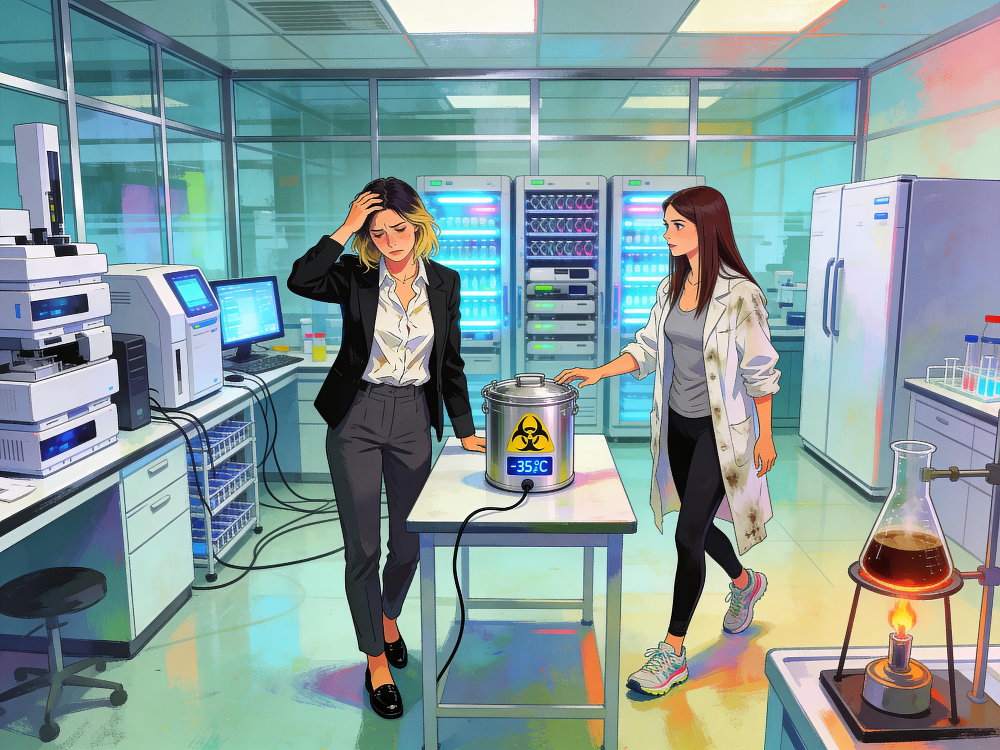

# Friday Evening, Geneva

Sonia flew from Shenzhen back to Geneva with the biohazard container chained to her wrist and plugged in whenever she could get access to power.

There had been no direct flight, so she had changed planes in Frankfurt after a miserable layover spent sitting beside a wall socket, too tired to read and too responsible to wander off for proper food. By the time she stepped out of Geneva airport, her white blouse was crumpled, her charcoal trousers had given up any claim to elegance, and there were dark shadows under her eyes. Only her black blazer had survived the trip with some dignity left.

She took a taxi straight from the airport to Campus Biotech.

"Le Campus Biotech, le laboratoire GAIA, s'il vous plait."

The driver looked back at her in the mirror. "Lequel?"

"Genomic Advancements and Innovations Alliance. Just follow the signs once we're there. C'est facile."

Friday traffic by the lake turned ten kilometers into a crawl. Sonia sat in the back with one hand on the sample case and watched Geneva slide past in broken pieces between stopped cars. She kept returning to the same thought: a virus this large should not exist in such a stable form. It should have been unstable, messy, falling apart as it spread. It was not.

Eventually the taxi pulled into a parking bay in front of the GAIA building, all glass, steel, and mirrored surfaces, set down on Campus Biotech between older blocks, the park by the lake, and the tracks near Geneve-Secheron.

Sonia paid, got out, and went straight inside without dropping her luggage at home. More than anything, she wanted the sample container off her wrist.

Inside, she swiped her access card, scanned her retina, and headed for the elevator. The lift dropped her three floors underground into the sequencing lab that Anna ran.

The setup looked like something taken straight out of a sci-fi flick.
Arrays of PCR machines were paired with AI powered analytics computers for rapid sequencing of unknown viruses.
Screens, blinkenlights, some replacement computer parts, chemical analytics equipment,
freezers and chillers, and a lone Bunsen burner with a tripod and an asbestos plate,
hosting an Erlenmeyer flask.
The latter part was used mostly to make Anna's specialty coffee.

Anna looked up as Sonia stepped out of the lift.

"Salut ma cherie," she said, hurrying over in squeaking running shoes. She wore black leggings, a soft grey long-sleeved top, and an old lab coat that had seen far better days. "Nice to see you again. Qu'est-ce que tu m'apportes?" Then she got a proper look at Sonia's face. "Ma fille, tu as une sale tete. Are you all right?"

Sonia smiled wearily. "I did not get enough sleep. Did I mention that?"

"You look like death after economy class." Anna reached for the cuff at Sonia's wrist. "Come, give me the box. Power and cooling first, then coffee, then science."

"Science first," Sonia said out of habit.

"Non. Coffee first. You can barely stand."

Sonia finally unlocked the container and handed it over, glad to be rid of the weight. Anna carried it to the bench, plugged it in, and checked the status lights until the unit chirped and switched happily from battery to grid.

"Still cold," Anna said. "Bon."

Then she turned to the coffee setup.

*Sonia delivers the container to Anna. She's tired and feels off.*

Sonia sank onto a stool while Anna lit the burner and worked through the ritual with the same concentration she gave the sequencers. The lab slowly filled with the smell of roasted beans and hot glass. When Anna finally put a mug in front of her, Sonia looked at it as if it were medical care.

"Good thing you didn't dress in Maylee Shufoo," Anna said as Sonia stirred in sugar.

Sonia gave a tired grin. "Please. I was already strapped to one terrible device all day. I didn't need a skirt engineered by sadists as well."

"Pity. I was hoping for the full Shenzhen look."

"You wish."

Anna smiled and went through Sonia's paperwork while Sonia drank. Their silence never felt awkward. They had studied together, worked together, taken care of each other through hangovers, deadlines, and a few bad field trips. This was only a more expensive version of the same thing.

"That boutique chain is bizarre," Anna said, flipping one page and glancing at Sonia's notes. "You were right about that. Very expensive cultural madness."

"I told you. Everyday office bondage, sold with a straight face."

"And apparently with enough confidence to make it look fashionable."

"Would you wear it?"

Anna looked offended. "Absolutely not."

"Coward."

"You first, ma cherie."

Sonia laughed and regretted it at once. She was more tired than she wanted to admit.

Anna unboxed the samples with practiced hands, checked the handling notes, and loaded the first trays into the sequencers.

"All right," she said. "Now we do science."

The machines started up with a gentle whine, then settled into their working hum. Outside, somewhere three floors above them, the late spring light faded over the city and the lake.

Sonia leaned against the counter with her empty cup in hand. "How long until you get something useful?"

"For the full genome? Monday if we're lucky." Anna glanced at the first summaries as they appeared. "For enough to be interesting, sooner."

She was right. Initial data crawled onto the screen. Broad structures first. Then flags.

Sonia watched Anna lean closer.

"What?" Sonia asked.

Anna zoomed in on one region. "CRISPR-fold."

Sonia straightened. "You're sure?"

"Yes." Anna pointed to the markers. "These are synthesis leftovers. Nothing in nature produces this pattern by accident."

Sonia stared at the screen.

So it was engineered. Either built from scratch or assembled from existing material and modified well beyond anything that should have been in circulation. The finding did not answer the obvious questions, but it made them impossible to ignore.

"But who did it?" Sonia asked quietly. 
"And why?"

Anna shook her head. "The markers don't tell us that. They only tell us someone made it."

The hum of the machines filled the pause between them.

Then Anna found something else.

"Look at this."

She brought up another section. Sonia stepped close enough that their shoulders nearly touched.

"Transport system," Anna said. "It looks like a mechanism for crossing the blood-brain barrier."

A chill ran up the back of Sonia's neck.
"That could explain the dreams."

Anna nodded.

For a moment neither woman spoke.

Sonia set down the cup. "I've been feeling off since Shenzhen."

Anna turned to look at her properly. "Off how?"

"Maybe only jet lag. Maybe airport food. Maybe recycled air and too little sleep. But I was collecting in active outbreak zones. I followed procedure, of course. Still."

Anna leaned back against the bench, thinking.
"We can't test for it yet. Not until the sequencing is further along and we have proper markers." She watched Sonia's face for another second. "Go home. Isolate. Rest. Keep notes on symptoms."

"You mean cancel tomorrow."

"Yes, I mean cancel tomorrow."

"You were looking forward to brunch."

"I am looking forward to not getting infected in a cafe. Or infecting everyone in there, for that matter. You know the rules."

Sonia grimaced. "Fair."

They stayed another hour, long enough to log the early findings and set the machines to continue through the night. By then Sonia's tiredness had settled into something heavier. Her joints ached and she looked slightly ill even standing still.

"I'm walking you home," Anna said.

"You don't have to."

"I know."

Outside, the air had cooled. They crossed the park, passed the station, and entered Les Grottes with Sonia dragging her case behind her. Anna kept pace easily even though the distance would barely have counted as a warmup for her. Sonia would normally have taken the bus, but tonight she was too tired to argue.

They talked in scraps along the way. Sample handling. The brunch they were not having. Whether Anna's coffee rig should count as chemistry or witchcraft.

At Sonia's building, Anna stopped.

"Tu es sure que ca va aller?"

Sonia tried a smile. "Avec un peu de chance, c'est seulement le decalage horaire. I'll sleep, and we'll know more tomorrow."

"D'accord. But call me if it gets worse." Anna tucked her hands into the pockets of her coat. "I mean it. It is only a short walk."

"I know. Merci."

"Bonne nuit, Sonia."

"Bonne nuit, Anna."

Anna watched her disappear inside, then walked the last blocks home.

Back in her own flat, she kicked off her sneakers, checked the sequencers remotely, and found nothing new beyond steady progress through a monster genome. The early results were still there waiting for her: engineered structure, CRISPR-fold markers, blood-brain-barrier access.

She went to bed with all of it in her head.

Sleep came, but lightly, and the night was full of uneasy fragments she could not remember clearly in the morning.
