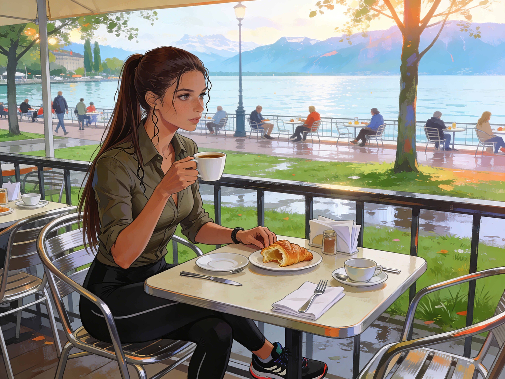

# A Run by the Lake and Breakfast

Anna woke early and went out before she had time to think herself into staying home.

The lake air still carried the night's cold. It bit pleasantly at the back of her throat as she ran north along the shore, past wet grass and dark tree trunks, with the city only half awake behind her. The first stretch felt easy. The second did what she had gone out there for and burned through the restless energy she had brought back from the lab.

She pushed the pace in short bursts, then eased off, then pushed again. By the time she turned for home, her legs were warm and heavy and her mind had settled into the blunt, useful rhythm of breath and footfall.

It did not last.

Back in her apartment, she left a trail of damp clothes on the way to the shower and stood under hot water until the chill went out of her skin. Then, still barefoot, she sat at her desk and checked the sequencers through the GAIA VPN.

Everything was still running.
No errors.
No dramatic new result waiting for her overnight.
The data would come when it came.

She should have been relieved.
Instead the familiar unease tightened again.

CRISPR-fold markers.
Blood-brain-barrier access.
Dream symptoms attached to a virus with a grotesquely oversized genome that looked elegant under analysis, as if someone had gone to considerable trouble to make it behave well.

People did not build things like that for no reason.

Anna closed the laptop and dressed for breakfast in her usual weekend version of herself: comfortable, tidy, ready to pass for relaxed while thinking much too hard.

She had planned to meet Sonia at the Lakeside Cafe. That was off now. Sonia needed sleep, isolation, and luck. Still, habit pulled Anna down toward the water, and she was hungry enough to let habit win.

The terrace was already filling when she arrived.

She ordered coffee and a croissant and chose a table with a little distance from the others. Not true isolation, but enough to quiet her conscience. The lake lay flat and pale beyond the railing. Cups touched saucers. Cutlery chimed. A child somewhere behind her laughed and was immediately hushed by a parent.

Anna tore off a piece of croissant and found herself thinking about Sonia anyway.

*Anna at breakfast, at the lakeside cafe.*

Sonia had looked awful last night, and not only in the usual field-trip way. Anna knew that particular exhaustion well: long flights, stale air, airport food, a body running on caffeine and stubbornness. What unsettled her was what sat underneath it. That slight heaviness in Sonia's face. The way she had admitted feeling off and then tried to minimize it at once.

Anna reached for her coffee and stopped mid-motion when she heard the sentence from the next table.

"It's just not practical."

There it was.
Delivered in a patient male voice, smooth with the confidence that the discussion had already been won.

Anna turned her head.

Three people sat at the neighboring table, all around her age or a little older, dressed in the half-casual, half-professional way that screamed scientific institution on a weekend. The woman had short dark hair, a narrow face, and the expression of someone trying very hard not to show how angry she was. British, Anna guessed from the accent. The men with her were already leaning into the familiar posture of reasonable correction.

"I'm not saying throw it straight into production," the woman said. "I'm saying run a proper pilot instead of dismissing it before anyone even tests it."

"Sienna," said the blond one, German by the sound of him, "you are talking about replacing materials in accelerator systems, not changing the office coffee machine."

The other man gave a little laugh into his cup.
"Exactly. If the simulations are wrong, we lose time and money for a marginal gain."

Sienna put her cup down too hard.
"Twenty percent is not marginal."

"In a simulation."

"Yes, Luca, in a simulation. That is how preliminary work functions."

Anna looked away for a second and out toward the lake, because she already knew what would happen next if she let it go. The men would keep smiling. Sienna would sharpen. They would call her emotional without using the word. By the end of breakfast, she would be the one who had made the conversation difficult.

It hit too close.

She had seen the pattern in labs, in meetings, in conferences, in classrooms. She had seen it happen to herself. She had seen it happen to her mother so often that some part of her nervous system now lit up the moment a woman's argument was treated like a personality flaw.

Sienna was speaking again.
"I've run the thermal models six times with different stress assumptions. The composite holds. If we use it in the next magnet upgrade, we get efficiency and lower maintenance."

Markus shook his head.
"You keep saying if. That is the whole point."

Luca leaned back in his chair. "Maybe save the revolution for after validation."

That did it.

Anna stood up with her coffee in hand and crossed over before she could talk herself out of it.

"Excuse me," she said. "I know this is rude, but I've been sitting right there listening to the oldest conversation in Europe and it's starting to annoy me."

Three faces turned toward her.

Sienna blinked first, surprised into a short laugh.
"That is an unusual opening."

"I know. Sorry. I'm Anna." She looked at the men. "And unless either of you has already run the pilot she is asking for, telling her it's impractical this early is just a more polished way of saying no."

The blond man straightened.
"Markus," he said. "And we are actually discussing engineering constraints, not staging a gender seminar."

"Convenient for you," Anna said.

Luca's brows went up. "Excuse me?"

"You heard me."

Sienna sat very still now, watching Anna with open interest and what looked dangerously close to hope.

Anna turned to her. "CERN?"

"Unfortunately yes," Sienna said. "Materials group."

"Thought so."

Markus gave a dry smile. "And what group are you from, since we're collecting interventions from adjacent tables?"

"Virology. GAIA." Anna sipped her coffee and kept her voice level. "Which means I'm professionally familiar with men declaring things unrealistic before they've understood the proposal."

Luca gave a little shrug that was meant to read as amused patience.
"We understood it. We just don't think simulation output is enough."

"She didn't say it was enough," Anna said. "She said run a pilot."

"A pilot still takes budget."

"Then argue budget honestly instead of pretending the idea is unserious."

There was a brief silence. The sort that makes nearby tables start listening without looking as if they are listening.

Sienna leaned forward.
"Thank you."

"You're welcome."

Markus folded his arms.
"All right. Since we're apparently doing this in public, let me be direct. Novel materials sound exciting every year. Most of them fail under real conditions. We work with systems that don't reward optimism."

Anna nodded once.
"Fine. That's finally a real objection."

He looked almost disappointed she had agreed.
"It is the obvious objection."

"Yes, and it's very different from telling her the whole thing isn't practical."

Luca tried again. "You are turning a technical disagreement into a moral event."

Anna gave him a look.
"No. I'm objecting to the ritual where a woman says something ambitious and two men immediately appoint themselves custodians of reality."

Sienna coughed into her hand to hide a grin.

Markus reddened slightly. "That is unfair."

"Maybe." Anna tilted her head. "Then prove it. Ask her what validation she wants. Ask what scale of test she is proposing. Ask what would change your minds. You're scientists. Behave like it."

For a second nobody spoke.

Then Sienna, with a composure Anna admired at once, slid a notebook across the table toward the two men.
"Fine. Pilot proposal. Small-scale component test under current load assumptions, then thermal cycling, then stress comparison against the current standard. If it fails, you can both say I told you so for the rest of the year."

Luca looked down at the notes despite himself.
"You already sketched it out?"

"Obviously."

Markus read over his shoulder.
"This cost estimate is too low."

"Good," Sienna said. "Now we're discussing the actual proposal."

Anna felt her anger loosen, not because the men had transformed into better people in the span of a minute, but because the conversation had been dragged onto honest ground. That was often the best victory available.

Sienna looked up at her again.
"Do you want to sit down? Since you've already detonated the table, you may as well stay."

Anna laughed and took the empty chair.
"Only for a minute. I was supposed to be having a quiet breakfast and failing at it."

Sienna introduced them properly after that. Markus, materials engineering. Luca, systems integration. Herself, computational modelling. Anna gave them only the short version in return.

"GAIA?" Sienna said. "Virus people?"

"Among other things."

"That sounds cheerful."

"It isn't, at the moment."

Sienna caught something in that answer and let it pass. Anna appreciated that.

What followed was better. Not perfect. Markus still pushed too hard on cost. Luca still had the habit of translating Sienna's ideas into safer language as if they improved by passing through him. Sienna pushed back every time, and Anna, when she had to, pushed with her.

By the end, the air at the table had changed.

Markus tapped the edge of the notebook.
"All right. Send me the latest model version and I'll look at the materials assumptions."

Luca nodded more reluctantly.
"If the numbers hold, I can ask around about test capacity."

Sienna sat back and let out a breath through her nose.
"That is all I wanted in the first place."

"I know," Anna said.

Sienna's mouth curved.
"You do, apparently."

Anna stood.
"Now I am going back to my coffee before I become fully unbearable."

"Too late," Luca said.

"Almost certainly," Anna agreed.

Sienna stood as well and offered her hand.
"Thank you. Seriously."

Anna shook it.
"Any time."

She carried her coffee back to her own table while the four of them were still faintly smiling in the way people do after a near-argument that became productive at the last possible second.

Only after she sat down did the old memory rise.

Paris.
She had been ten and unbearably pleased to be allowed to travel with her mother to a conference on computational biology. The hotel dining room had seemed impossibly adult to her then, all glass, pale linen, and people speaking with intensity over lunch as if every meal were a continuation of a paper.

Professor Martin Keller had been one of those men who took up more social space than his body required. Pleasant voice. Established name. A way of explaining things that sounded generous right up until you noticed he was always explaining them to women.

Elena had been discussing biomathematical models of viral replication with him when Keller said, with all the warmth of a man bestowing a useful tip, "You should really read Lefevre et al. on the subject."

Anna could still see the flicker in her mother's face before the answer.

Elena put down her fork, touched her conference badge, and said, "I am Lefevre et al."

The people around them laughed. Keller flushed dark red. Then, because he was not a fool, he recovered and asked a better question than the one he had started with.

Anna had remembered the line for years because it was funny, but also because it showed her the way the world worked for women.
Her mother had not smiled to soften it. She had not apologized for embarrassing him. She had corrected him cleanly and gone on speaking as if that were the most natural thing in the world.

That was the part that stayed:
The expectation that her work should be met at full height.

Anna looked out over the lake with her coffee cooling in her hand.
She wished, sharply and unexpectedly, that she could call Elena right then and tell her about the table next to hers, about Sienna, about the virus, about Sonia at home in isolation and a genome she could not stop worrying at.

Instead she sat in the morning light and let the memory settle.
