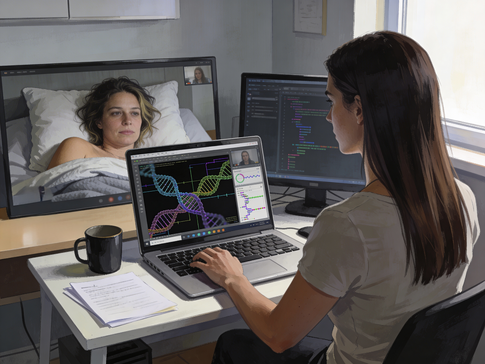

# Descent into Sickness

Back home, Anna checked the sequencers again through the lab VPN and wished she had not.

The data had sharpened overnight.
Too much of the genome looked manufactured for her to pretend otherwise now. Whole sections behaved less like viral code than stored information, packed densely and protected against replication damage with a level of correction no natural virus bothered with. It was ugly only in scale, the design was clean. Professional. Whoever had built it had known exactly what they were doing.

She then zoomed with Sonia, who was staying at home.

Sonia answered from bed, not looking good at all.
"Chere," Anna said, "tu te sens mieux?"

"Comme de la merde," Sonia said at once. "And more so than can be blamed on jet lag. I am staying home. I have groceries. I am still deeply offended by the concept of food."

Anna almost smiled.
"You look terrible."

"Thank you. I have been working on it."

Anna shared her screen and walked her through the latest structures, the synthetic signatures, the impossible correction logic. Sonia watched with narrowed eyes and that stubborn field-agent calm she used when something was worse than she wanted to admit.

*Anna zooms Sonia, Sonia is sick.*

"So we know someone made it," Sonia said. "That still doesn't tell us what it does."

"No."

"Then no panic yet. Not until we have something solid enough to wave in front of people.
We need some solid data first.
You know how it goes otherwise."

Anna knew she was right.
She had first hand experience, so to speak, just after her morning run.
She still hated it.

"We'll write it properly once the sequencing is further along," she said.

"Good." Sonia shifted on the pillow and winced. "If I don't answer later, assume I'm asleep or dead."

"Preferably asleep."

"Preferably."

They ended the call.
Anna meant to spend the rest of the weekend working.

By Sunday morning she woke with a headache and felt seriously ill.

Light from the window cut across the room and went straight through her eyes into the back of her skull. She turned onto her side too quickly and nearly vomited before she had even opened them fully. The sheets were damp. Her mouth tasted of stale heat and metal. When she dragged herself upright, the floor moved in a slow, ugly tilt under her feet.

She took her temperature.
Fever.

An hour later it was higher.

Her day dissolved into fragments: bathroom tile against her shoulder, the cold porcelain of the toilet seat under one hand, a glass of water she could not keep down, a wet washcloth gone warm against the back of her neck almost at once. Her throat hurt. The skin under her arms itched. By noon her breasts felt strangely swollen and over-sensitive, as if even the weight of her T-shirt had become an irritation.

Her phone glared when she checked it.
Sonia had texted.

Same here. Fever. Headache. Can't eat. This is bad.

Anna stared at the message until the words blurred.

Oh.

They had it.

The virus was in both of them now.
That part at least was obvious.
It was moving through tissue, crossing barriers, unpacking whatever had been hidden inside that monstrous genome while she lay in bed sweating through another shirt.

She had planned to write a paper, not become the subject of it, but
she spent most of Sunday half in the bathroom and half in bed.
There were moments when she thought she had slept and moments when she knew she had blacked out instead. She woke once with her cheek pressed to the tiles and no memory of how she had reached the floor. Another time she found herself standing in front of the mirror with both hands at her scalp because the itching there had become unbearable.

Her hair had become visibly longer.
That was scary.

The soft hair on her forearms seemed thinner. Her underarms burned. Between her thighs the itching had turned sharp and insistent, intimate in a way that made panic and embarrassment arrive together.
She scratched and has her hand full of lose pubic hair.

Fever, she told herself.
Neurological involvement.
Sensory distortion.

Then her nipples brushed the inside of her shirt when she moved and the shock of pain was so bright it bent her forward.

This was not a cold.

This was a program running.

The thought stayed with her because she was sick enough that metaphor no longer felt separate from fact. Code. That was the word her brain kept coming back to.  Something had entered her body and her cells were… running it. The genome had always looked too deliberate. Now the deliberation was happening under her skin.

She tried to message Sonia again.
Delivered.
No reply.

Of course no reply. Sonia was probably in bed with the same fever, the same vomiting, the same impossible sense that something careful and invasive had started editing her from the inside.

By night the voices began.

Nothing loud and cinematic, just the sense of words at the edge of hearing, close enough to feel personal, too blurred to pin down. She rolled onto her back and dragged the sheet up over herself, then kicked it away because her skin had become intolerably hot, then pulled it back minutes later when the chills hit.

She slept at last because the body always takes something for itself eventually.

And the dreams opened.

At first they were almost ordinary.
Her mother in a kitchen from childhood, sunlight on the table, the smell of coffee, a hand smoothing Anna's hair back from her face.
Comfort.
So much comfort that Anna nearly cried inside the dream.

Then Elena said, "A good girl keeps herself graceful even when she is tired."

Anna woke with a start, heart hammering, and found the pillow wet beneath her cheek.

The next sleep dropped her somewhere else.
A classroom this time.
One of her old teachers walking between desks, voice warm, tone encouraging, saying almost the right thing and then not. Sit properly. Speak less quickly. Do not push so hard to be first. A clever woman knows how to support without drawing attention.

Anna argued in the dream.
She was sure she did.
Her mouth moved.
No sound came out.

That silence frightened her more than the words.

The dreams kept coming, jumbled sequences of authority figures in a fevered morality play.
They overlapped and bled into each other. Her mother became a lecturer. A lecturer became an old school principal. Rooms changed mid-sentence. Someone fastened a collar at the back of her neck while another voice praised her for standing still. She would be in a conference hall one moment and kneeling on polished floorboards the next with her skirt arranged over her knees and her hands folded so neatly in her lap that the sight of them made nausea rise in her throat.

She resisted hardest when the dreams used Elena.

That was where the virus showed its cruelty.
It did not only invent.
It revised.
It took the woman who had taught Anna to speak clearly, to fight in public if she had to, to never let a mediocre man explain her own work to her, and made her lower her voice and say, "Submission is peace, ma fille. You do not need to struggle so much. A woman should be seen, but never heard."

Anna woke from that one crying with rage.
She sat upright too fast, the room lurched, and she vomited bile into the bin she had dragged beside the bed.
When the spasms stopped, she stayed there shaking, hair stuck damply to her face, and tried to breathe through the pain in her throat.

She hated the dream.
She hated whoever had made this.
She hated the tiny corrupt part of herself that had responded to Elena's softened voice before the horror caught up.

Because there had been a response.
"Yes, Mama.
A woman should be seen, but never heard.
I know."

The moment she gave in the first time, the second layer of assault became apparent and it made her sick in a different way.

Every time cooperated, even for a second, the punishment stopped.
Pressure eased and voices gentled.
Hands that had been restraining became soothing. Praise entered where correction had been. She would feel the release first in her chest, then lower, until relief tipped into unmistakable pleasure.

Once she found herself kneeling before a faceless figure while someone behind her adjusted her posture with light pressure between her shoulders and at the back of her neck.
"There," said a woman's voice, satisfied. "Much prettier when you listen."

The word prettier moved through her like heat.
She woke with one hand between her thighs and snatched it away as if burned.

The wetness there was real.

Another sleep, another variation.
She was exhausted beyond fury now, stretched thin by fever and pain and the raw humiliating fact that the dreams had learned what bought compliance fastest.

They stopped trying to persuade her with duty alone.
They offered reward.

Yield and the room warms.
Obey and the headache backs off a little.
Kneel... someone strokes your hair.
Accept the blouse, the collar, the corrected posture, the lowered gaze, and the terrible internal friction goes quiet.

She knew, even in the dream, what was happening.
Operant Conditioning using aversion and relief.
Pleasure reinforcement layered over identity attack with almost elegant precision.

Knowing it did nothing.

That was part of the horror too.
Her scientific mind stayed online just enough to narrate the mechanism while the rest of her was being worked over by it.

By Monday she no longer trusted the edges of waking.

The apartment smelled of sweat, damp sheets, stomach acid, and sour medicinal taste of things she swallowed, but that didn't help. Her body had become an unreliable object she dragged from one surface to another. Hair collected in the shower drain. The skin between her legs stayed oversensitive and inflamed. Her breasts ached. The fuzz on her arms was gone completely by now.

When she slept, the dreams were waiting with less effort spent on threats now and more on seduction.

Not kindness, but something worse: Intimacy engineered for surrender.

In one dream she stood in front of a mirror while unseen hands buttoned her into a high-necked blouse she could not remove on her own. She should have fought. Instead she watched her own face change as each fastening closed, watched fear drain down into stillness, then into shameful anticipation. By the time the last button was done, she was standing on the edge of want so sharp it felt like illness all by itself.

She woke gasping, thighs pressed together, the bed damp under her again.

For a few seconds she could not remember where she was.
The room looked wrong.
The curtains, the chair, the glass of water by the bed, all of it slightly estranged.

Then memory returned in pieces.
Geneva.
Apartment.
Virus.
Sonia.

Anna pressed the heels of her hands into her eyes until sparks flared behind them.
The fever had not only made her sick.
It was teaching her.
Wearing grooves into thought.
Attaching comfort to obedience.
Trying on versions of her until it found the one that would hold.

That was the true obscenity of it.
Not that she was ill.
Not even that her body was changing in ways she could feel without yet fully seeing.

There was that something inside her that had started playing to her surrender.
