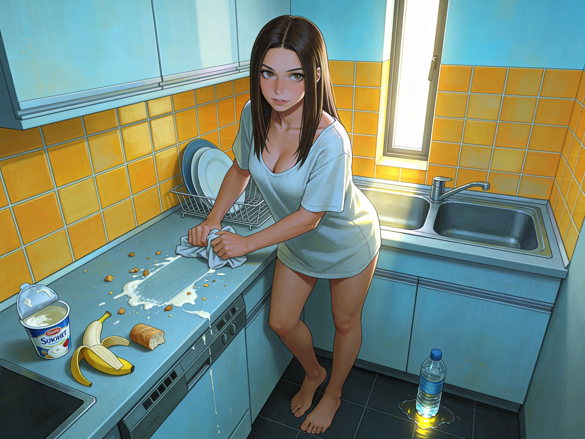

# Anna Is Changed

By Thursday morning the fever had broken enough for hunger to come back.

It hit without dignity.
Anna stood in the kitchen in yesterday's T-shirt, shaking slightly, and ate whatever she could reach first. Bread. Yogurt. Half a banana. Water straight from the bottle. She leaned against the counter while she swallowed, waiting to see whether her stomach would reject all of it.

It held.

She should have felt relief.
Instead the first thing that really reached her was the mess.

Crumbs on the counter.
A smear of yogurt near the sink.
Water running down the side of the bottle and onto the floor.

The discomfort was immediate and intimate, as if the disorder were inside her skin rather than on the surfaces around her.
Her heart kicked once.
Her throat tightened.
The same pressure from the dreams gathered behind her eyes.

Clean it.

Anna gripped the edge of the counter.
"No."

*Anna cleans the kitchen, her body aching from fever and exhaustion.*

The pressure sharpened: wrongness and a crawling internal agitation that forced her to act.

She looked at the sink, at the cloth beside it, at the crumbs.
The effort of not reaching for them felt absurdly large after days of fever. She was out of everything that might have helped her fight it cleanly: sleep, appetite, courage, even spite.

Choose your battles, she thought wildly, and hated herself for thinking it.

She picked up the cloth.

The relief came so fast it nearly folded her.

Warmth poured through her chest and belly, low and humming and horribly familiar now. Her body loosened around it. Her breath steadied. For three or four seconds, cleaning the counter felt not merely necessary but sweet.

Anna froze with the cloth in her hand.

There it was.
The mechanism.
Obey.
Be paid.

She scrubbed the yogurt away anyway because stopping halfway would only bring the agitation back. The counter became the floor, the bottle, the sink. By the time the kitchen looked orderly again, she was leaning one hand against the cabinet, flushed and disgusted and calmer than she had been all morning.

She hated that calm.

Still, it let her think.
She called the lab and left a thin, unconvincing message about still being alive, still sick, just a bad cold, which insulted both of them. After that she stood in the middle of the kitchen and tried to decide what mattered most.

Food.
Sonia.
The sequencers.
A shower.

The shower won because another wave of wrongness had already begun to rise from her own skin.

She smelled sick.
Fever-sour, slept-in, unclean.
The feeling attached itself to her all at once, not just dirt but impropriety, as if being sticky and unwashed had become a moral failure. By now, for her, it had.

Anna closed her eyes.
This one too.
Another front.

She could fight it.
Probably.
For a while.
She could also spend the little strength she had getting to the bathroom instead of arguing with the demand the entire way.

She chose badly and practically at the same time.

By the time she reached the bathroom, her legs were trembling again.
The mirror over the sink caught her before she could avoid it.

What she saw first was ordinary illness.
Dark shadows under her eyes.
Cracked lips.
Skin still pale from three days of fever.

Then the rest came into focus.

She stepped closer.

The floor tiles were speckled with pale little threads.
Body hair.
What used to be body hair.

Anna looked down at her arms.
Smooth.
Her legs.
Smooth.
Under her arms, between her thighs, across her stomach, all of it stripped clean and shining faintly in the bathroom light.
Removed.
Erased.

She touched one forearm with the fingertips of the other hand and felt skin where there should have been the familiar softness of fine hair.
The sensation was wrong enough to make her jerk her hand away.

"No."

Her scalp felt heavy.
When she lifted both hands to it, more dread arrived.
Her hair had thickened and lengthened, dragging in a way her body did not recognize. It fell past her shoulders in a smooth chestnut weight, straighter than it had ever been, denser, gleaming even now when she looked half dead.

She looked at her shape then because she could not keep herself from it.

Waist narrower.
Breasts fuller.
Hips subtly redrawn.
The whole figure pushed toward an impossible ratio, not cartoonish exactly, but close enough to make her stomach clench.

And because the fever had left her body raw, every changed surface was too present. The new skin felt overexposed. Her breasts were still tender, though now in a different way: a sensitivity that made her hate the air on her nipples because it kept reminding her they were there.

Her first clear feeling was violation.
She took a step back from the mirror so quickly her shoulder hit the doorframe.

This had been done to her, not shaved or chosen.

The inner voice came then, soft as breath at her ear.

"You're becoming pretty."

Anna went cold all over.

It sounded close to her own voice and wrong in the way a copied signature is wrong. Familiar shape. Foreign intent.

"Shut up."

"Look at you."

She did not want to.
She was looking anyway.

The voice was insistent and intimate. It kept placing interpretations over what she saw, not in strange words, but in words she might once have used against herself.

Corrected, it suggested.
Refined.
Feminine.
Soft.

Each word landed with a corresponding pulse somewhere in her body.
The sensation was not pleasure yet, but a loosening, a reduction in panic, a dangerous easing, a subtle redirection of attention away from violation and toward appearance.

Anna dug her fingernails into her palms.
"This is not better."

"You can see the difference. You can see what changed. You can see how much better this fits."

Memories moved under the voice as if it were riffling through them.
Old insecurities.
The shape of her waist in certain dresses.
The curl she had never liked at the ends of her hair.
The flatness she had sometimes seen in the mirror when she was tired and cruel to herself.

The voice took each one and turned it with quiet patience.
See?
Better.

Anna's anger surged hard enough to steady her for a second.
She seized that second.
"You don't get to use that."

The answer was a withdrawal of relief.
The return of internal friction so sharp it made her gasp.
Only when she stopped fighting the correction did it ease again.

Anna stared at her own face in the mirror and felt something inside her split neatly down the center.
One part knew exactly what this was.
Memory tampering, reward-linked conditioning, a reinforcement schedule attaching itself to hygiene, posture, self-perception, anything.

The other part was tired, tired enough that happiness, even counterfeit happiness, had started to look like relief.

That was the progression, she realized with a clarity that made her want to retch.
Not one single decisive assault, but constant attrition.
You get sick.
You lose sleep.
You lose strength.
You spend resistance on the large things and begin surrendering the small ones because you cannot afford every fight.
Then the small surrenders start paying.

By the time you understand the system, your body is already participating in it.

She turned on the shower too hard and nearly lost her balance doing it.
The first spray was hot.
She stepped under it and felt the dirt, sweat, and stale sick smell start to lift from her skin.

The reward hit before she had even reached for the soap.

"Clean is good," the voice said. "Proper is good. You know that. You can feel that."

The warmth that followed the thought spread downward this time, lower than the kitchen calm had gone. Her stomach tightened. Her thighs drew in a fraction. The shower, the steam, the smoothness of her altered skin under her own hands, all of it folded into one humiliating circuit.

Anna braced herself against the tile and stood still until it passed enough for her to move.

She washed quickly, because touching too much was risky now.
Each slide of soap over her skin kept reporting the changes back to her.
Hairless, slick and over-sensitive.
New curves where her hands did not expect them.

At one point her palm passed under her breast and she had to bite down on a sound
because pleasure surged through her from where she touched herself.

The voice was patient.
"Pretty girls take care of themselves. You can take care of yourself. You can be as pretty as this now."

She scrubbed harder in answer and paid for that too, because vigorous obedience still counted as obedience. More warmth. More relief. More of the body learning the wrong lesson and learning it well.

When she stepped out and wiped the mirror clear with the flat of her hand, the confrontation started again.

The woman in the glass was beautiful by standards Anna distrusted on principle, composed to please, a body drawn toward fantasy with enough taste left intact to keep the whole thing from tipping into parody.

That was what made it obscene.
If it had made her grotesque, resistance would have been simple.
Instead it had made her lovely in a way she could see at once and despise for the reasons she was seeing it.

Her stomach twisted while heat moved low through her body again, binding shame to arousal and violation to beauty.

She hated both.

"This is what a proper woman looks like," the voice murmured. "You can keep fighting it, or you can let yourself see it."

Anna's mouth opened and no answer came.
Part of her energy was going toward staying upright, part toward not crying, part toward not touching herself anywhere the reward could use, and there was very little left for argument.

She pulled a towel around herself with rough, graceless motions.
The voice kept close, not loud or urgent, merely sure.

"You can choose to stop feeling torn at any time," it said. "You can choose to let it fit, feel right. You can choose not to make this harder than it already is."

Anna looked at the mirror one last time over the top edge of the towel.

What had she become already?
How much of the horror was still hers, and how much of the answering pleasure belonged to the thing inside her?
How many thoughts in the next hour would be hers at all?

She did not know.

That ignorance frightened her.
So did the smaller, meaner truth underneath it:
the voice's approval felt good, and she no longer had enough strength to pretend that fact did not matter.
