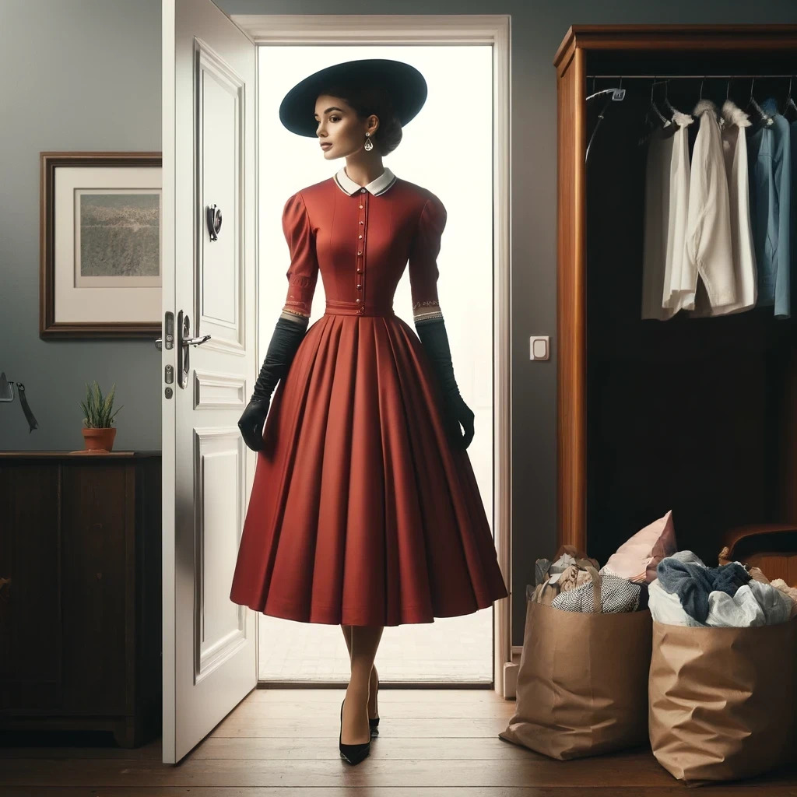

# Dressing Changed

Freshly showered and, of course, giving in to the overwhelming compulsion to clean up the bathroom, 
Anna finally made it into her bedroom.
Again, the surrounding mess was unbearable,
slowly reinforcing itself as an unshakable reality for her.
Exhausted and unable to resist the compulsions, she gave in to the need to tidy up, again.
Cleaning seemed less taxing than battling the overwhelming urge for orderliness,
and she needed to conserve her strength to fight larger battles.

As she moved through the now orderly room, still naked, 
she approached her wardrobe and eyed her clothes with a sense of detachment.
They seemed like they belonged to someone else.
Anna had always chosen her attire carefully, but now, none of it felt right.
The entity in her mind, which disturbingly by now felt familiar, was broadening its influence.

She reached for a pair of dark comfortable pants, a choice that had once been automatic.
But something inside her gave her a hard "no."
A visceral sense of rejection and revulsion washed over her, so intense that she almost retched.
The mere thought of wearing pants became unbearable, she shivered.
Even visualizing herself putting them on was distressingly difficult.
Memories flooded her mind, distorted and possibly false, she could no longer tell.
She recalled a moment from her childhood, her mother catching her trying on pants, the ensuing guilt and shame.
Pants were wrong, not meant for her.
She remembered an incident from school where a girl was ridiculed for wearing pants.
The deeply ingrained belief that "Women do not wear pants"
felt absolute.
Though she knew these memories might not be real,
the emotions washing over her felt undeniably authentic and shaped her reactions.

Instead, she found herself drawn to dresses and skirts.
This change was unwanted, but it was happening.
Echoes of dreams haunted her, where her mother, her voice twisted by the virus,
chastised her for not being feminine enough.
The words "Neat, feminine, pretty" reverberated in her mind.
Anna wanted to resist, to dress as she once did, to maintain control over her body and her identity.
She longed to reclaim her autonomy and identity.
But standing in front of the mirror, holding the pants, something felt profoundly wrong.
The feeling was terrifying, repulsive, and utterly alien.
Her reflection seemed to mock her, a stark reminder of how deeply the virus had infiltrated her sense of self.

Every time Anna attempted to wear her usual clothes,
a strong wave of revulsion accompanied by an artificial desire for "neat, feminine, pretty" overwhelmed her.
It soon became not only impossible but unthinkable to wear them again,
they no longer represented "her."
She was Changed, and she had to mold herself to the Change.

Tears streaming down her face, and shuddering involuntarily,
she eventually surrendered.
She selected a dress in a rich, deep rust red,
its skirt billowing to a full sweep and its sleeves cut at three-quarter length.
A crisp white collar set off the dress, offering a striking contrast.
Paired with simple pumps of a moderate height and delicate nude stockings held by a shaping suspender belt,
this ensemble was one she had worn only once before—a keepsake from a failed date that had ended disastrously.
But for Anna, who normally wore running shoes and sporty clothing, hardly ever skirts or dresses,
it was still a departure in style.
But as she pulled the outfit from the back of her closet and stepped into it, a sense of rightness washed over her.
In this dress, she felt pretty, as if it had always been meant for her.

The clamp of dread around her mind loosened and she could feel joy again.
But putting on these clothes on didn't feel like her own choice.
It was as though she was being coerced into them, layer by layer.
Anna, with her background in biology, recognized this as operant conditioning.
But she also knew that it did not matter if she recognized it for what it was.
It would still work.
The corrections felt genuine, the rewards compelling.
Despite her awareness, the conditioning was reshaping her,
breaking her down and rebuilding her into the image it desired.
She was adapting, slowly but inevitably.

Now dressed in the attire dictated by the virus,
which was increasingly defining her own standards, she faced herself in the mirror.
The Barbie-like version of herself stared back,
dressed in a feminine A-line dress that stretched tightly over her enhanced bustline, her legs sheathed in nylon.

Looking at her reflection, her face stood out. 
She was flat-faced and ugly.
The next compulsion arose, triggering another phase of her transformation.
The feeling was almost becoming familiar now, and while she resented it,
she had already learned to listen to it and follow the suggestions to find out in which direction the reward lay.

She needed to add makeup, something she rarely did before.
As she started, her hands moved on their own.
This was more than a conditioning compulsion, this was knowledge.
None that she picked up consciously in her life before, but it was in her mind, ready for use.
She put on foundation like an expert, even though she didn't remember learning how.
Her face changed with each step.
She hid signs of sickness and added color to her cheeks.
Eyeliner and mascara made her eyes stand out.
It all happened without her thinking about it, like running on a program that she did not write.
It felt bizarre.
Anna knew she wasn't skilled with makeup, yet her hands executed each step perfectly.
She was merely a spectator in her own body, watching as if another person completed the task,
but that other person was undeniably herself, or a version of herself she'd never known who was at work.

She finished with lipstick, choosing a shade that seemed uncannily perfect.
It was as if someone else knew exactly what would suit her, crafting an image of her that she hadn't chosen.
Her makeup looked professional, and it was unsettling to see her face like this.
But the moment she acknowledged this strangeness as being herself, the reward surged through her.
She was pretty.
This is what she should look like.
This was right.
Before was wrong.

She should have been happy, but she wasn't: This wasn't what she wanted.
Looking at herself left her with a feeling of dissonance.
She was steadily losing control over her self-identity, morphing into someone else entirely.
The person who looked back at her from the mirror appeared neat and pretty, but that was not the real Anna.
However, it seemed inevitable that soon it would be.
Wrong feels bad, right feels good.

Each step along the transformation planned for her made her feel good.
It only felt wrong initially.
Soon "before" would feel wrong.

A feeling of satisfaction and rightness emanated from a place within her that she neither recognized nor understood,
engulfing her every time she succumbed to and acted on the implanted urges and desires.
She no longer knew herself.
This new compliance rewrote her essence,
disconnecting her from who she had once been and anchoring her to this unfamiliar, manufactured identity.

Back in her room, Anna glanced at her old clothes and felt an overwhelming sense of nausea.
The combination of her conditioned urges was undeniably effective:
She had once cherished these garments, but now she despised them for not being "feminine" enough,
and found she could no longer even bear to look at them.
They also looked messy, and she was already familiar with her new acquired tick of keeping things orderly.
She felt an irresistible urge to discard them.
She grabbed several large bags, stuffing her once-beloved clothes into them with a sense of urgency.
With each item she disposed of, it felt as though she was shedding pieces of her old identity.
Every attempt to stop was met with increasing feelings of wrongness and disgust,
escalating until she could no longer stand the emotional turmoil—or herself.

When she started the cleanup process again, she was rewarded.
She felt waves of happiness and a rightness that bordered on the sensual.
When she surrendered to these feelings, they morphed into actual pleasure.
Disposing of these clothes and the attached memories felt liberating,
as if she were unburdening herself of a heavy weight.
She had to get rid of them and the memories attached to them as well to become whole again.

Despite recognizing that these urges to transform her lifestyle were not genuinely hers but the result of manipulation,
the feelings they evoked were intensely real.
Even as this awareness flickered within her, it was overshadowed by her focus on acquiring new,
"appropriate" clothes.
Her induced reward feelings were powerfully distracting.
She felt compelled to follow through,
driven by the voice in her head, the distorted "memories" of proper behavior,
and a corrupted sense of her education and upbringing that dictated what was "right."
With each piece of her old wardrobe she packed away,
her former self's resistance diminished, and her new, conditioned identity solidified.
Having sorted her wardrobe into "acceptable"
and "to discard" piles, Anna was eager to leave the house and drop off the bag of discarded clothing,
fully submitting to the transformation she had been steered into.

As Anna prepared to step outside, a new rule asserted herself.
"It is improper for a woman to show bare hands or hair in public spaces or under the open sky."
By now she had learned what would happen to her if she tried to counteract such an urge,
and did not even try.
She quickly grabbed long black satin gloves and her only suitable hat, a wide-brimmed one that,
along with her dress, gave her an appearance reminiscent of the 1950s.
The look made her strangely happy, but the source of this happiness also frightened her.

*Anna was ready to go out and get rid of her old, ungainly clothing.*

As Anna carried out her bags of old clothing,
her old and new selves were battling for control, and the "new" Anna seemed to be gaining the upper hand.
She thought she should feel a mix of sadness and fear,
but there was only a short period of unsettling disorientation, and then relief.
Dropping off the bags felt like she was not just discarding clothes but also shedding parts of her former self.

The bin for old clothing was overflowing.
She was not the only person getting rid of a lot of wardrobe it seemed,
and it was all women's clothing.
Repulsive women's clothing, of the same kind she just ridded herself of.

In fact, she encountered another woman similarly attired in a dress, gloves, hat, and with perfect makeup.
Like Anna, the woman looked less like she was expressing a unique fashion sense
and more like she was wearing a uniform of imposed femininity.
Same army, different color.
This sight might have comforted Anna, reassuring her that she was not the only Changed.
However, it only deepened her sense of horror.
The virus was standardizing everyone, erasing their individuality,
and pressing them into outdated, idealized roles of retrograde femininity.

No.
That was wrong thinking.
The virus fixed people, made them happy, reminded them how things had to be done properly.
It righted the world.
Anna wanted to speak to the woman, sharing her experience,
but found herself unable to break through the compelling urges that dominated her actions.
She had other tasks that felt urgent, an overwhelming need to shop for more "appropriate" clothes.
