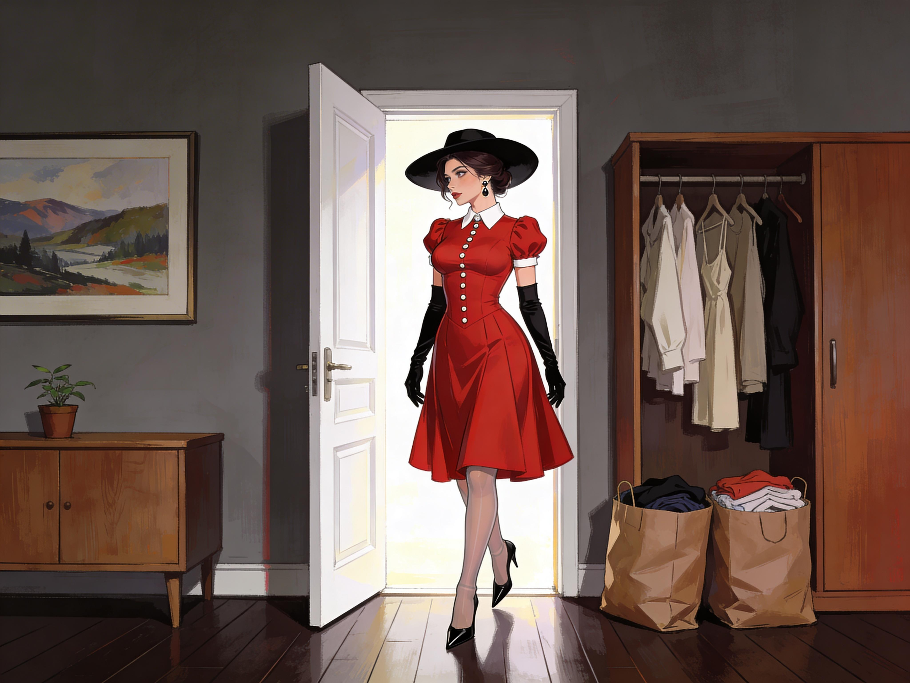

# Dressing Changed

By the time Anna got out of the shower, she had already cleaned the bathroom again.

Of course she had.
There had been droplets on the tiles, a streak on the mirror, damp prints on the floor.
She had seen them and known at once what would happen if she tried to leave them there. The pressure would start. The wrongness. The soft internal twisting that made disobedience feel filthier than the mess itself.

So she had wiped the mirror.
Dried the tiles.
Straightened the bottles on the shelf.
Earned the low, warm easing that came afterward.

That was how it worked now.
Correct.
Reward.
Again.

Naked, damp, exhausted, she went to the bedroom and stood in front of the open wardrobe.

Her clothes looked wrong before she even touched them.
Estranged.
Running tops.
Soft sweaters.
Dark blazers.
Trousers she had once liked for their clean line and ease.

Anna reached for the trousers first because she still wanted one clean victory somewhere.

Her stomach turned.
Her mouth flooded.
Shame climbed into her chest with such force that she had to brace one hand against the wardrobe door.
The cloth in her fingers felt contaminated, indecent, impossible.

No.
No, not that.
Not on you.

She shut her eyes.
The thought was not fully verbal at first. It came as a refusal in the body and then clothed itself in language she would once have mocked.

Women do not wear pants.
Nice girls do not wear pants.
You know better than this.

Memories rose with it.
A version of childhood she did not trust.
Her mother taking trousers from her hands with quiet disappointment.
Girls at school corrected for dressing improperly.
An old lesson about dignity, modesty, feminine self-respect.

False memories. Probably.
Counterfeit.
Inserted.

The shame was real anyway.

Anna opened her eyes and stared at the trousers hanging from her hand.
"They're mine."

The pressure answered by tightening.

She could feel the alternatives waiting behind her, patient, certain, already selected.

Dress.
Skirt.
Neat.
Feminine.
Pretty.

The words arrived with the awful calm of thoughts she might once have had on a cruel day in front of a mirror.

You would feel better dressed properly.
You know you would.
You can stop forcing the wrong shape onto yourself.

Anna put the trousers back as if they had burned her.

At the rear of the wardrobe hung the rust-red dress she had worn exactly once on a date bad enough to sour the dress by association. White collar. Full skirt. Three-quarter sleeves. Something chosen long ago for an experiment in looking softer than she felt.

Now felt right and fitting.

She pulled it free and the agitation eased at once.
Just a little.
Enough to make her hate herself for noticing.

"No."

But her body had already begun to move.

Stockings first.
Her fingers fastened them to the suspender belt with a competence that no longer surprised her as much as it should have. Then the dress up over her altered body, the fabric settling over her hips and waist with an intimate rightness that made her breath catch. Pumps last.

When the collar closed at her throat, the relief spread through her in a long, low wave.

Her shoulders dropped before she meant them to.
The cramped knot under her ribs loosened.
Pleasure followed a second later, lighter than the shower reward, sweeter, more dangerous.

There.
Better.
You can feel it.
You did right.
Right feels good.

Anna stood very still inside the dress.
It should have felt like costume.
But she did right.
And right felt good.

That was the obscenity.

She looked up at the mirror.

The woman staring back at her was too composed for someone still shaking off a fever. The dress sat neatly across fuller breasts and a narrower waist. The skirt softened her. Ordered her. Made her look as if she belonged to an older, more disciplined version of the world.

Her bare face ruined the effect.

The knowledge arrived immediately, with the same polished certainty as everything else.

Not ruined.
Unfinished.

The need for makeup passed through her body like another switch being thrown.
Anna actually laughed once under her breath, short and humorless, because of course there was another layer.

Her hands moved before her resistance organized itself.

Foundation.
Powder.
Color at the cheeks.
Darkness at the lashes.

She watched the process happen almost from behind herself, seeing each small correction land before she had fully decided to allow it. This was not only compulsion. This was installed skill. Her fingers knew exactly how much product to use, where to place it, how to shift the lines of her face toward polish and softness and femininity.

The thought clicked through her with exhausted clarity.
Of course it was.
More conditioning.
More useful knowledge pushed into her and made to feel like recovery.

She tried once to stop halfway through.
Her hand hung suspended near her face while distress climbed abruptly through her nerves, hot and needling and irrationally sharp.

Finish.
Then you can breathe again.
Finish and it will settle.

She finished.

Lipstick last, in a shade she would never have chosen for herself and yet recognized at once as right for this face.

When she looked up, the reward struck harder.

Pretty.
There you are.
You can see it now.

Anna's thighs pressed together of their own accord.
She went cold with shame even as pleasure moved through her.

That face in the mirror was hers and not hers, familiar bone structure reinterpreted through color, line, and a standard she despised because she could see exactly how it flattered her. She looked healthy. Poised. Desirable. She looked like what someone had wanted women to become and like what part of her was already learning to want.

"This isn't me."

The answer came gently.

You can say that for now.
You can take your time.
You can still see how much better this looks.

Anna's eyes filled.
She wiped the tears away before they could ruin anything and felt the vicious little twist of satisfaction when the makeup remained intact.

The wardrobe drew her back next.

The old clothes had become unbearable to look at.
Viscerally, in the body, and not just in theory: The sight of them made nausea turn over in her stomach.
Too loose, careless, masculine, messy.

She grabbed one of her old sweaters and tried to hold onto the memory attached to it. Winter train platforms. Early mornings. Sonia laughing at something filthy over bad station coffee. Her own shoulders, her own life, her own speed.

For a second the memory held.

Then the new judgment slid over it.
Unfeminine, untidy and wrong for you.

Anna made a noise in her throat and threw the sweater onto the bed as if distance alone might break the spell.
Not enough. 
The longer she looked at the old wardrobe, the more the pressure built.

Get rid of it.
You already know you will never want to wear it again.
You can feel that.
It is a certainity.
You can clean up, remove clutter, and you will feel better once it is out of the room.

She found large bags and started packing with a frantic economy she did not trust.
Tops.
Trousers.
Jackets.
Practical shoes.
Anything that belonged to the life before the fever and before the mirror and before the dress now hanging correctly from her body.

Each time something landed in the bag, the pressure eased.
Each time she paused, it came back worse.

There was no mystery left in the mechanism by then.
Action.
Relief.
Compliance.
Reward.

Knowing the sequence changed nothing.
If anything, knowing it and obeying anyway made her feel more divided.

Halfway through she stopped with a pair of running shoes in her hands.
They were dirty at the edges, worn into the shape of her stride, hers in a way the new body no longer entirely was.

She stared at them until her vision blurred.

The voice kept close and reasonable.
You don't have to do all of it at once.
You can start with what is obviously wrong.
You can keep what is proper.
You can let go of what no longer fits.

It was a lie, or nearly a lie.
It wanted all of it.
She knew that.
But the lie came wrapped in mercy and she was weak enough to accept mercy where she could get it.

The shoes went into the bag.

Relief flooded her so strongly it tipped toward sensuality.
The breath left her body in a shudder.
For one hideous moment the act of purging the old wardrobe felt intimate, cleansing, nearly orgasmic in the way a long-denied scratch can feel holy when finally touched.

Anna leaned over the bed with both hands pressed into the mattress and waited for the wave to pass.

By the time she tied the bags shut, the room had been divided cleanly.
Acceptable.
Unacceptable.
Before.
After.

She hated the neatness of that division.
She also could not imagine living another hour with the rejected clothes still there.

As she turned toward the door, another rule settled into place.
Smooth and reasonable, already half accepted.

A woman does not go outside barehanded.
A woman does not uncover her hair in public.
You know that.
You can dress properly.

Anna shut her eyes.
There was no strength left for this one.

She found long black satin gloves in a drawer and pulled them on finger by finger. Then the wide-brimmed hat. The final effect in the mirror should have been absurd.

It was elegant, restrained and comfortingly complete.

And the image frightened her because of how fully it landed.

*Anna was ready to go out and get rid of her old, ungainly clothing.*

The bags dragged against her legs as she walked them to the donation bin.
The dress moved around her calves. The gloves changed how every surface felt. Her shoes clicked in a measured rhythm that made haste impossible and posture unavoidable.

By the time she reached the overflowing containers, she realized she was not alone.

Another woman was there in a dress, gloves, hat, and makeup that had the same polished finality as Anna's own. The colors were different. The structure was not. She looked less like a person expressing taste than like a version produced from the same instructions.

Same army, different color.
For a second she thought the sight might comfort her. Proof she was not uniquely trapped. Proof the fever had not singled her out for some private humiliation.

Instead the horror widened when she realized that this was happening at scale.
It was large scale social change.

Anna fed the bags into the bin one by one.
Each release brought a brief wrench of grief and then the now-familiar easing, so that by the time the last bag was gone she could no longer tell where loss ended and relief began.

She looked at the other woman again.
Wanted to speak.
Wanted to ask whether it had happened this way for her too, whether she had also found herself being paid for surrender in little waves of warmth and quietness and shame.

The moment passed.
The urgency of the next task was already rising.

More clothes.
Proper clothes.
Enough to match what she was becoming.

She turned away from the bins and started toward the street, horrified, half aroused by her own compliance, and unable to stop moving in the direction the thing inside her had chosen.
