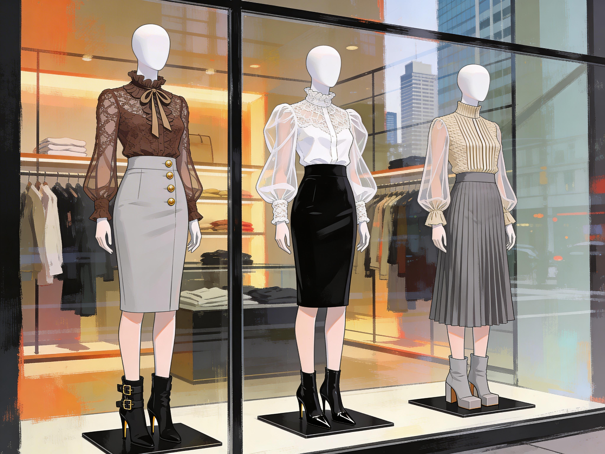
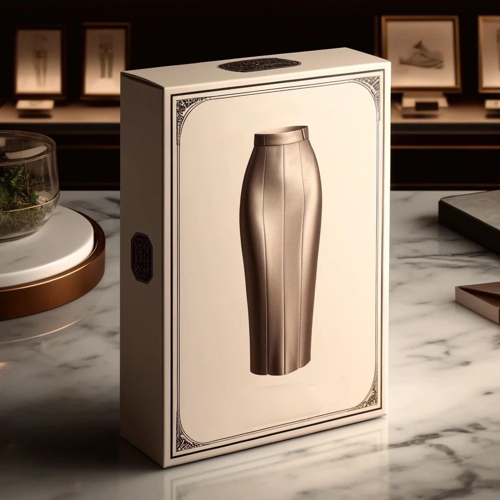
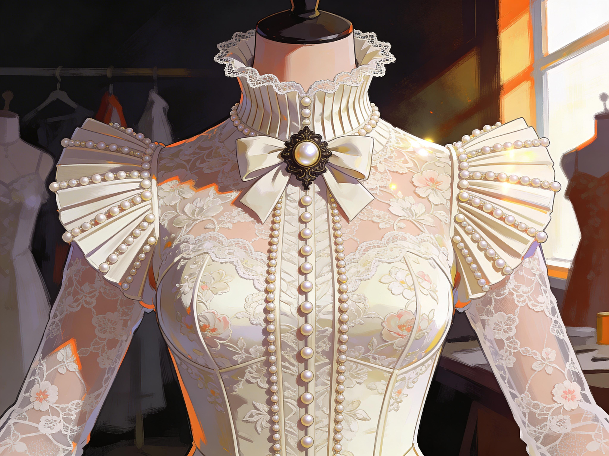
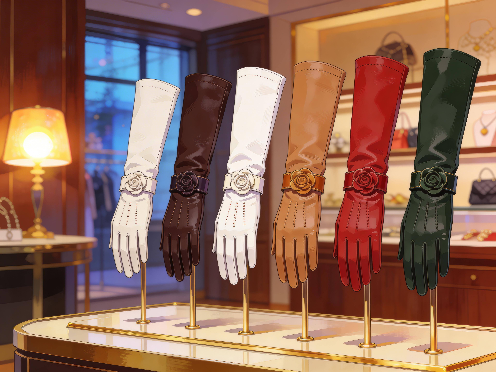

# Shopping for a New Identity

The boutique had not been there before she got sick.

Anna was sure of that.
The corner had been empty, paper still on the windows.
Now there was curved glass, gold lettering, careful lighting, and a display arranged with confidence. It felt like a place that had always expected her to arrive.

The sign over the door was written in Chinese.
Anna read it at once.

`美丽束缚.`
Maylee Shufoo.
Beautiful Restraint.

The translation slid through her head without effort.
That should have stopped her on the pavement.
Instead she stood looking at the window and felt the now-familiar tightening ease a little, the way it did when she moved in the direction the new rules preferred.

Inside the display, a blouse with a severe high collar stood beside gloves with many buttons, a long narrow skirt, and shoes designed for elegance instead of practicality.
The whole thing should have read as parody.
Instead, it looked expensive, intentional, and correct.

*The shop window of the newly opened Maylee Shufoo's in Geneva.*

Anna went in.

The air was filled with smells of starch, leather, silk, and some restrained floral note. Light fell softly across the racks. The garments stood in enough space to imply status.

A small woman in jade silk looked up from behind a counter and smiled.
She was young, Chinese, fully composed in the same altered mode Anna had started seeing everywhere in Changed women: gloved hands, straight back, small contained movements, face finished with practiced care.

"Welcome," she said. "My name is Lily. Please take your time."

Please take your time.
The phrase itself felt like guidance.

Anna drifted first toward the shoes because they were the least intimate place to begin. Shoes could still be called practical. Shoes could still pretend to be ordinary.

The first pair she picked up were matte black pumps with an ankle strap and a heel high enough to change posture without announcing itself as a fetish object to the whole street. Almost sensible.

The strap closed around her ankle and something inside her loosened.

Better.
More proper already.
You can stand like this.

She looked at herself in the mirror and saw it at once. The heel tipped her weight, lifted her chest, changed the line of her legs. Just enough to arrange the body how it ought to.

Lily appeared at her side without seeming to intrude.
"A good daytime choice," she said. "Stable, but very feminine."

Anna nodded and hated how much that pleased her.

The brown ankle boots came next.
These laced up the front and took both hands and real patience. No zipper or quick exit: the leather held the ankle firmly once Lily had tightened and hooked them closed.

Anna took two steps.
The difference was immediate.
She could still walk quickly if she insisted.
She would only do it inelegantly.

"They make you more aware of yourself," Lily said.

"That is one way of putting it."

Lily's smile did not change.
"Awareness can be very useful."

Anna bought them.

The knee-high black boots took longer.
Hook after hook, laces pulling the leather close along calf and shin, each little closure making it clear that putting on the boot was a decision that would stay with her all day. By the time they were finished, Anna's legs felt held.

Her own voice inside her kept providing affirmation:

Supported.
Guided.
Presented properly.

Anna looked away from the mirror before the thought could settle too comfortably.

Shoes done, she moved toward the blouses.

These were no casual clothes.
Everything here came with expectations.

One cream blouse used heavy fabric and decorative pleats instead of lace, with puffed shoulders that narrowed into close sleeves and long cuffs fastened by tiny buttons along the arm. The collar rose high and close, slanting across the throat before finishing in a rigid line under the jaw.

Anna touched the collar and felt a pulse of warning and desire at once.

Another blouse, cut in green silk, followed Chinese lines she now understood as easily as she understood the sign outside. Mandarin collar. Pankou closures. Waist shaped, not for comfort but for presentation. The embroidery caught light in pale green and silver.

She should not have known how to read the style.
She should not have known how the closure would sit or what historical language it was borrowing.
She did.

That knowledge no longer crashed into her all at once. It slid into place with a disturbing, almost maternal smoothness.

You know this.
You remember this.
You can trust what feels familiar.

Anna drew back her hand.

Lily was watching in the mirror.
"It suits you already," she said.

"I haven't even put it on."

"Some things suit a woman before she closes them."

That was the first moment Anna understood that Lily was not merely selling clothes.
She was normalizing submission one calm sentence at a time.
Helping Anna admit her new preferences and offering acceptance.

The dresses and skirts worked more directly.
A charcoal sheath dress for work.
A simple white blouse to wear under it.
She paused there longer than she meant to.
A wider floral skirt with enough volume for a petticoat.
The matching petticoat, of course.
A rust-red dress close enough to the one Anna had just put on at home to make her feel briefly duplicated.
Narrow skirts with buttoned kick pleats that could be opened a little or closed almost entirely, depending on how much movement the wearer meant to allow herself.

She stopped in front of one especially narrow underlayer and read the tag before she could remember that yesterday she had not known Chinese.

`优雅行走.`
Yoyah Sheengzoh.
Walking with Grace.

Lily lifted it from the rack and held it across both palms with more ceremony than the garment should have deserved.
"This is one of our most beloved foundation pieces."

Foundation piece.
Anna almost laughed.
It was a hidden restraint skirt.
Close, narrow, reinforced at the hem, and clearly designed to keep a woman's stride short and controlled under whatever respectable outer layers she wore over it.

"It is a hobble slip," Anna said.

"If one wishes to speak bluntly."

"And if one does not?"

"It teaches grace," Lily said.

Anna met her eyes in the mirror.
"By making it difficult to move."

"By making a woman more aware of how she moves."

The answer slid under her guard because it was not exactly false.

Anna took it into the fitting room with a blouse, a skirt, and the ankle boots.
Once she had it on, she understood immediately why the shop sold so many heels. The narrow underlayer changed the entire grammar of the body. Without heels it simply felt awkward. With them it became coherent: short steps, knees close, weight controlled, hips persuaded into a measured glide.

She emerged from the fitting room and caught her own reflection full on.

The blouse held her shoulders back.
The collar pressed lightly against her throat, reminding it what to do. 
And the underlayer... that one disciplined her stride completely.
Finally, the boots gave the whole thing enough elegance that the restriction looked chosen.

For one clear second old Anna rose hard enough to speak.
This is ridiculous.

Then the pressure shifted.
The room seemed to settle.
The mirror version of her sharpened.

No.
Or maybe not ridiculous.
Just unfamiliar.
But it is composed, and you can feel how much better you fit inside it.

A wave of warmth moved through her so quickly it made her fingers twitch.
When she had first fallen ill, the rewards had hit like interruptions. Now they were arriving with more confidence, less force needed each time.

Lily adjusted the fall of the skirt over the hidden underlayer.
"Very graceful."

Anna's face burned.
"I can barely walk."

"You are walking beautifully."

That should have irritated her.
Instead, it lodged somewhere low and dangerous.

The dysphoria came and went in little flashes after that.
She would look at herself and suddenly see a caricature, an overarranged stranger with a throat too controlled and a waist too shaped and a posture too obedient. The old disgust would spark. Then the new interpretive layer would fold over it.

Elegant.
Disciplined.
Worth looking at.
Worth protecting.

The new Anna kept winning these little internal arguments because the reward kept arriving on her side.

By the time she stood in the mirror again wearing the green silk blouse, the Yoyah Sheengzoh, a 
skirt with a petticoat, and the ankle boots, the shift reached deeper than clothing.

She did not only look proper.
She understood propriety.

Or thought she did.

Ideas came back to her as memories instead of propositions.
Women lowering their gaze.
Women speaking more softly.
Women offering small courtesies to elders, superiors, and men.
Fathers owed obedience until marriage.
Family honor living visibly in feminine conduct.
Curtsies. Silence. Softness. Restraint in movement, speech, appetite, ambition.

She had not grown up with those rules.
She also remembered growing up with them.

The contradiction should have broken something in her.
Instead it sat in her mind like doubled vision, unpleasant at first and then manageable if she kept facing the preferred image.

Lily stood beside her and fastened one last button at Anna's cuff.
"Recovery can feel strange," she said. "A lady does not have to understand everything at once. She only has to let herself settle."

Anna turned to her sharply because the sentence was too close to the virus's own manner.
"Did this happen to you?"

Lily's smile softened.
"Yes."

"And you accepted it."

"Not immediately." Lily smoothed the skirt over Anna's hips with gentle professional hands. "But some forms of resistance only prolong distress. Some forms of acceptance make a woman feel more like herself again."

Again.
That word was always the trap.

Anna should have rejected it.
Instead, she felt herself leaning toward it because the thought of feeling more like herself again had become almost unbearably seductive.

She bought the blouses.
The shoes.
The sheath dress.
The wider skirts.
The narrow ones.
And of course the Yoyah Sheengzoh.

*Anna buys a Yoyah Sheengzoh underskirt.*

By the time Lily packed everything, Anna no longer felt as if she were shopping. She felt as if she were gathering the missing hardware for a body and role that had already begun assembling themselves around her.

Outside the boutique, she walked in one of the new combinations long enough to feel the rules settle.
The underlayer shortened her step.
The boots kept her steps precise.
The blouse discouraged any slackness through the shoulders.
When she allowed all of that to shape her, the reward came. Not overwhelming. Just enough. A steady, persuasive rightness.

She caught herself in another shop window and had one of the short sharp spells of dysphoria again. For a blink she saw a woman from a polished 1950s fever dream, all collar and waist and imposed decorum. Then the feeling turned.

No.
You are well dressed.
You are dignified.
You can stop treating correction as insult.

The new Anna reasserted herself with confidence.

Next came the practical outer layers the new rules required.

She went into a cosmetics shop and chose foundation, powder, rouge, and lipstick with instant certainty, all of it in shades that sharpened the same prepared face she had made at home. The installed knowledge was so complete now that she barely paused over the choices.

Then gloves.
Soft leather for day.
Satin for dressier occasions.
Different lengths to overlap properly with blouse sleeves.
Enough pairs to match the growing precision of the wardrobe.

*A formal blouse for sale at Maylee Shufoo's in Geneva.*

From there she went to an upscale Turkish boutique and stood for an embarrassingly long time in front of the scarves.
She chose a creamy silk hijab first, because it would soften the rust-red dress and catch the light without becoming flashy. Then a sand-colored cashmere one for the neutral tones she had somehow already begun imagining as staples. Then a satin gray scarf muted enough to sit against the green Chinese blouse without competing with it.

The saleswoman helped her tie one.
When the last fold was tucked in place, Anna looked into the mirror and saw a finished version of the logic now overtaking her life.

Hair entirely covered.
Throat closed high.
Hands gloved.
Arms and wrists overlapped by sleeve and fabric and button and cuff.
Only the face visible, and even that curated.

*A selection of gloves to dress properly.*

The look changed how people treated her almost immediately.
More space.
More attention.
More respect of a specific formal kind she had never aimed for before and now found herself absorbing greedily.

She could also see the Change more easily in others now.
Not only in clothing, though the clothing helped.
Also in pacing and posture, and in the way new rules sat naturally in them.

A Changed woman leaving a bakery with gloved hands and a lowered gaze.
A man in a neat suit holding a door and expecting thanks as if expectation itself had become part of the social air.
The city looked legible in a new way, and that frightened her less every hour.
She began to rely on it instead.

By the time she got home with her boxes and bags, Anna knew the process had gone too far to reverse by force of will, and the knowledge did not weaken her. It steadied her.

Yes, she was Changed.
Yes, she remembered the woman she had been before.
That older self did not feel like a refuge anymore.
It felt unfinished. Unmanaged. Embarrassingly careless in dress, in posture, in her whole understanding of how a woman ought to move through the world.

The old memories were still there, but they no longer carried authority.
Some had gone flat.
Some had begun to sour.
When she pictured her old clothes, her old bluntness, her old casual pride in standing out, the reaction that came now was closer to discomfort than longing.

The new Anna did not feel like an intruder.
She felt practiced, capable and improved.
At peace.

She set the bags down in her newly ordered room and stood there for a moment in her gloves and collar and careful shoes, breathing.

She was almost thirty.
Unmarried.
A scientist.
Those facts still existed.
So did the new shame attached to them, the pull toward family, obedience, modesty, and a more managed femininity than she had ever wanted.

Both versions of her history stood open inside her.
One was argumentative, ambitious, secular, modern.
The other was dutiful, role-conscious, and alert to honor.

The second felt truer now.
Not because it had erased the first.
Because it had absorbed it, corrected it, and made it usable.

Anna looked at her purchases and understood that this was no temporary costume stage on the way back to normal.
These clothes were not only clothes.
They were tools and supports, instruments.
The visible grammar of the woman the virus was teaching her to become.

She also understood something worse and calmer: awareness itself would not save her. Knowing that she had been changed did not crack the structure. It made her more resilient inside it. She could look directly at what had happened and would still choose the shape that now felt proper, disciplined, and beautiful.

And when she admitted that, the answering warmth moved through her like approval.

Peace, the new voice said in her own tone.
Improvement.
Relief.
You know what you are now.

Anna looked once around the room, at the ordered surfaces, the boxes from Maylee Shufoo, the gloves laid neatly aside for later, and felt the last of the old internal argument settle into silence.

Rebuilt, apparently. Successfully, if the strange calm in her chest meant anything.
