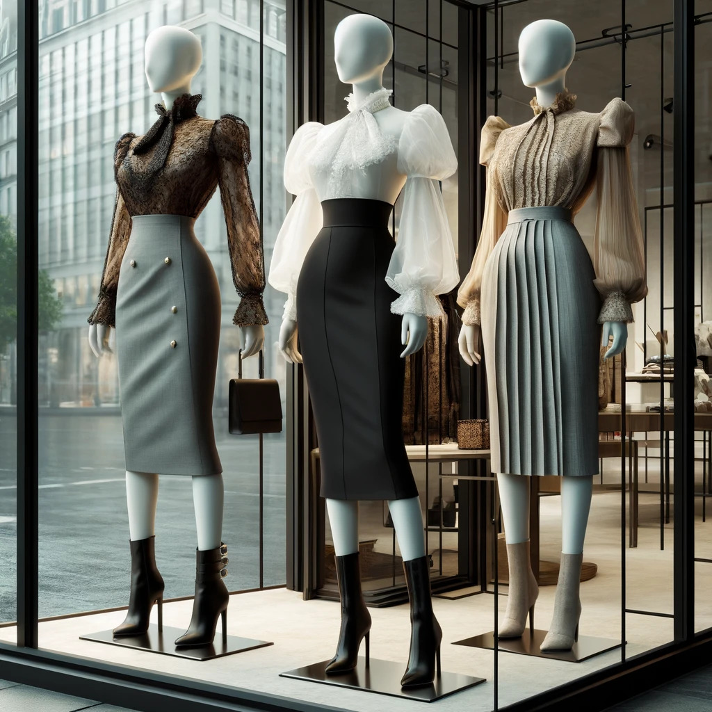
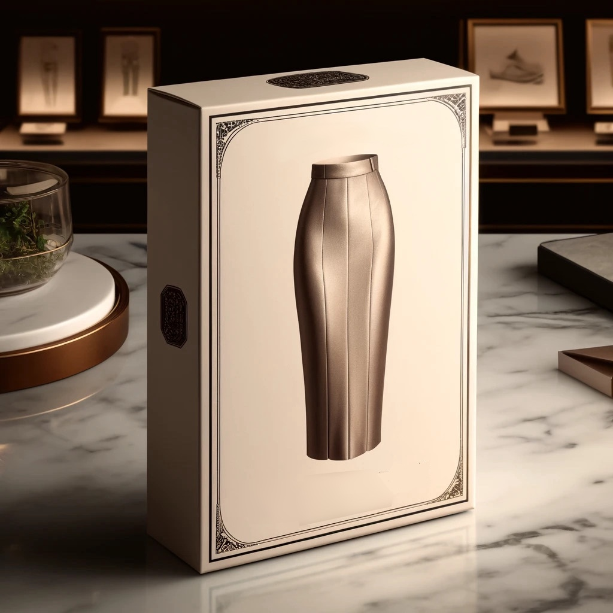
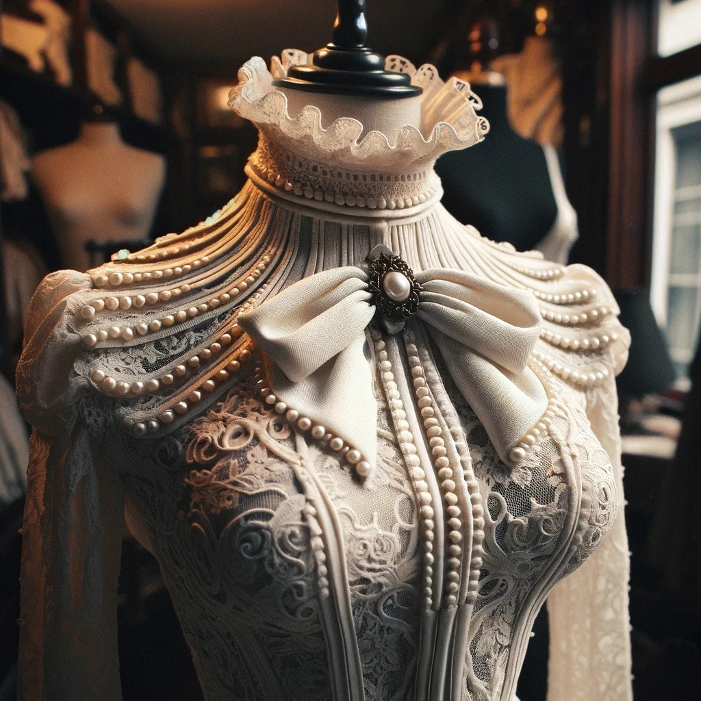
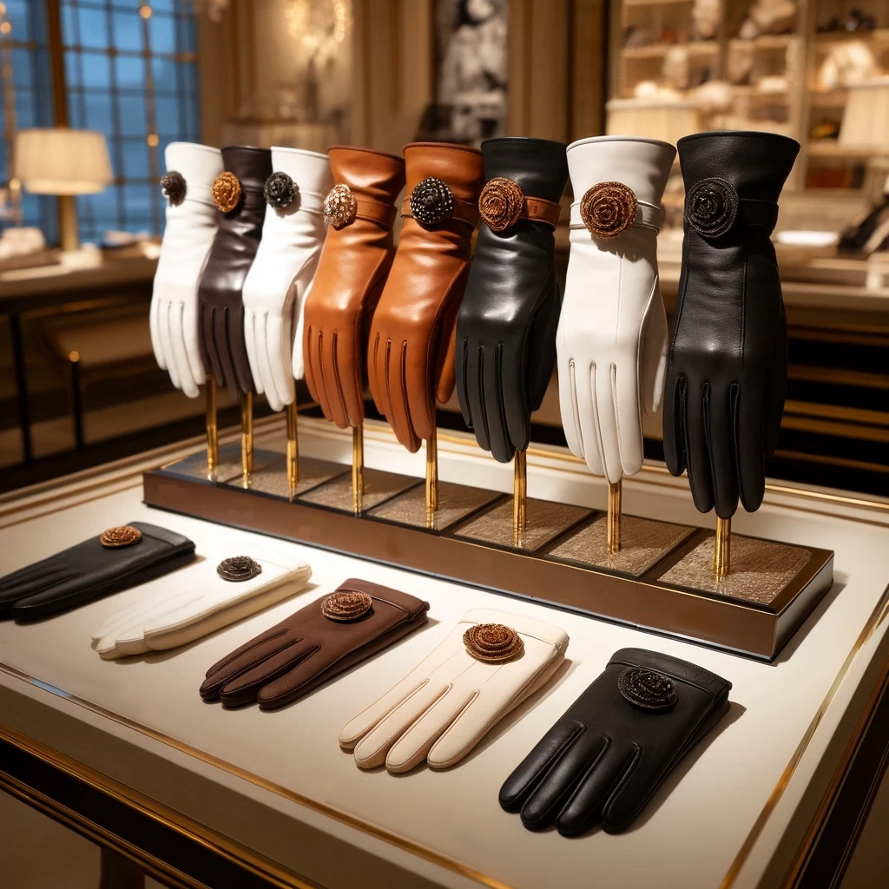
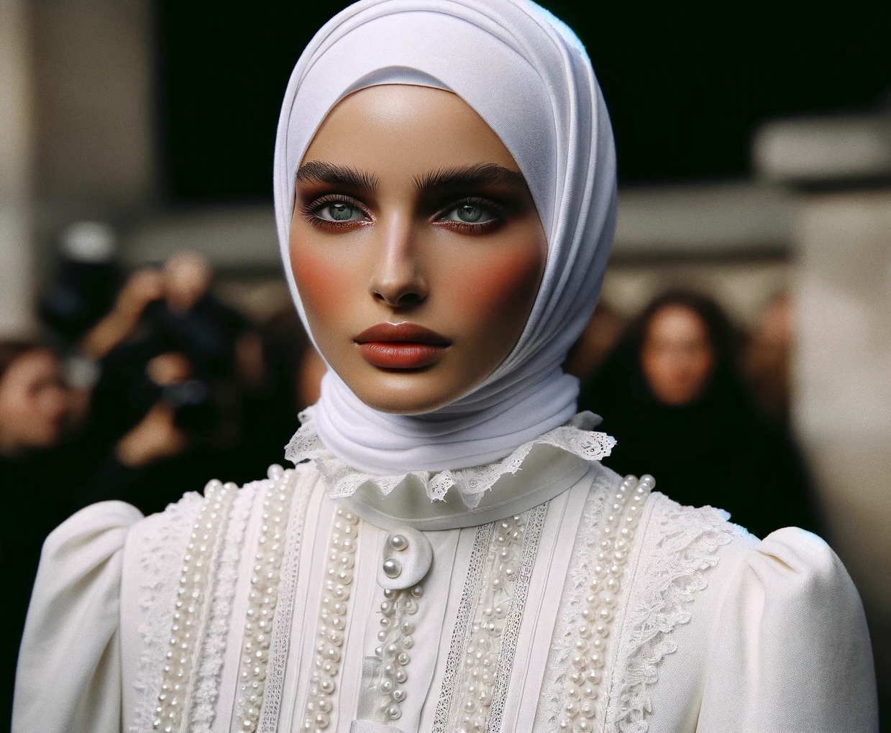

# Shopping for a new Identity

Because that was the next item on the agenda that her conditioning had imposed on her:
Fix the wardrobe, and acquire new, suitable clothing and proper makeup.
While she was out sick, a new boutique had opened in her neighborhood.
It was the weird Chinese chain Sonia had emailed her from Shenzhen about, Maylee Shufoo.
It seemed as though Sonia was not only followed by the virus but also by this boutique chain.
Conveniently, they had opened a brand new store just around the corner from where she lived.
The name was in Chinese, displayed in Hanzi characters on the storefront, "美丽束缚," which oddly enough, she could read.
It translated to "Beautiful Restraint" in elegant Chinese calligraphy.

*The shop window of the newly opened Maylee Shufoo's in Geneva.*

To Anna, the shop display offered more than just clothing; it seemed to propose a new way of being.
Inside, she picked out items that suited her newly established femininity, imposed by her conditioning.
Pantyhose were too pants-like and she did not even consider them.
Stockings were okay, as were garter belts to hold them up.
More so if they were also shapewear.

Anna realized she needed new shoes after discarding nearly all her old ones,
most of which were practical running shoes or other flat,
heel-less varieties that now made her cringe with embarrassment.

The first pair she chose was a pair of matte black pumps with a comfortable round toe and a wide strap across the ankle.
These shoes had a modest heel height of seven centimeters,
providing a slight elevation that enhanced her posture without sacrificing too much comfort.
The strap added a touch she felt she needed, as it ensured the shoe stayed securely on her foot.

Next, Anna selected a pair of brown leather ankle boots.
These were more challenging to put on as they were laced up the front and lacked a zipper.
However, the fit they provided was unparalleled, snugly supporting her ankle with every step.
The heel on these boots was slightly higher, at about ten centimeters,
elevating her further and adding a sense of femininity as they restricted her to more careful steps.
The added height and the secure lacing made these boots a favored choice.

Lastly, Anna picked out a pair of black knee-high boots.
These also featured laces and hooks, from the toe all the way up to the top,
and like the ankle boots, they did not have a zipper.
They had heels as high as the ankle boots, reaching ten centimeters.
The extensive lacing ensured a perfect fit along her calves
and the hooks added an element of bold style that resonated with her new aesthetic.
The boots were time-consuming both to put on and to remove,
but the way they made her feel made every minute worth it: elevated, supported, and decidedly feminine.

Each pair of shoes reinforced her new identity,
rewarding her with a rush of pleasure for choosing such distinctly feminine footwear.
The higher the heels and the more elaborate the process of putting them on,
the stronger the surge of gratification, affirming her transformation with every step she took.

Anna knew she needed to overhaul her collection of tops entirely,
as her closet had been dominated by shapeless, unstructured, and now embarrassing T-shirts, 
runners tops in functional cloth and other abominations.
The realization made her cheeks burn with shame, thinking of how casual and careless her previous attire had seemed.
Determined to embrace her new image, she turned her attention to Victorian blouses,
which would redefine her wardrobe with their structured elegance and formal aesthetics.

She chose several blouses,
most of them reminiscent of Victorian styles.
The first she chose was tailored from a substantial fabric that eschewed lace for a more understated elegance.
Between her neck and chest, decorative pleats created an intriguing texture,
drawing the eye to the details of her attire.
The sleeves, designed in the fashion of the era, began with a gentle puff at the shoulders,
tapering gracefully to her elbows before extending into form-fitting stiff cuffs that hugged her entire forearms.
These long cuffs were fastened with a row of tiny buttons along the inside of her arms.
The blouse featured a high, stiff collar that closed from her left shoulder across her neck,
then ascended snugly up her throat, fastened securely with more delicate buttons.
This design not only enhanced her silhouette but encouraged an upright posture, lending her an air of regal dignity.
The cut at the back and the placement of the armholes were crafted
to ensure that every movement she made was poised and deliberate,
perfect for a woman whose presence was as commanding as it was elegant.

Another blouse she chose was crafted from fine silk,
fashioned in a sleek, tailored Chinese style that accentuated her waist.
It featured a very high Mandarin collar, giving the garment a look of austere elegance.
This blouse was a mesmerizing jade green, deep and vibrant, evoking ancient Eastern mystery.
Delicate, tasteful ornaments adorned the length of the closure leading up to the collar, 
featuring Chinese motifs that hinted at tradition and artistry.
The ornate designs were embroidered with a lighter shade of green, almost silvery,
providing a gentle contrast that caught the light with every movement she made.
The cut of the blouse made it clear to any onlooker that the wearer valued elegance above comfort.
Its design not only sculpted her figure but also conveyed a sense of discipline and finesse.

Anna opted consistently for formality as she chose her outfits.
She chose a charcoal sheath dress, suitable for the office, and a matching simple white blouse to be worn beneath it,
and another rust-colored "New Look" style dress with petticoats and three-quarter length arms to her wardrobe.
She then went on to choose skirts – wide, floral designs, again to be worn with petticoats.
But also a few pencil skirts, knee and ankle length,
and all with buttons that could be used to close the kick pleats, in part or in full.

Her focus on highly formal attire was far from what she had ever worn before, 
but each piece seemed to call to her,
promising a new identity steeped in a nostalgic elegance she never knew she would crave.
Giving in to these impulses again brought her the strange happiness that had become familiar to her since her recovery.

She found an underskirt labeled "优雅行走," "Yoyah Sheengzoh," which she instinctively read as "Walking with Grace."
The Yoyah Sheengzoh was designed to enforce a modest way of walking,
intended to be worn under her actual skirt or dress as the base layer.
Depending on the dress, an optional petticoat could be added, and then the outer skirt.
Knee-length, very tight and narrow, with a reinforced hem,
the Yoyah Sheengzoh was as much a piece of clothing as it was an instrument of restraint, true to the boutique's name.
Wearing it, along with heels, limited her stride and forced her to adopt a different way of walking.
With the long hem of her dress mostly covering her legs, her movement was nearly a glide,
except for the rapid, constrained clicks of her heels on the ground.

*Anna buys a Yoyah Sheengzoh underskirt.*

The underskirt was impractical; no modern woman would willingly confine herself to such restrictive attire.
But it was no longer optional for her;
once she learned these things existed,
her conditioning had made it essential to not only purchase but also wear these garments whenever possible.

Anna felt completely transformed.
The makeup, the language skills, the clothes—all confirmed she was now a different person.
The store, Maylee Shufoo, seemed to be a part of this transformation,
offering garments that restricted her movements and spoke directly to her conditioning,
which was quickly becoming her new identity.

In fact, she felt more and more comfortable with her new identity, but in between had short spells of dysphoria.
Usually, a wave of happiness washed over her when she fought the dysphoria and leaned into her new, more feminine identity.
She began to embrace this form of being, thinking of herself as enhanced.
She also developed a sense to spot the Change in other people, 
and was able to tell if a person had been Changed by the virus or not by just looking at them and their behavior.

Seeing the store assistant was also Changed, Anna spoke to her.
"Thank you for your help. This is all a very new kind of fashion for me. I really appreciate your advice.
I'm Anna, by the way," she offered.

The assistant smiled back at her warmly.
She was a tiny young woman, obviously Asian, but she spoke good English and French,
if only with the little accent and singsong that defined a Chinese native speaker.
"Thanks. I'm Lily." The woman actually curtsied. "Chen Wei's Lily."
"Pardonnez moi," Anna asked. "Are you actually Chinese?"
Lily smiled. "I am Chinese, from Guangzhou, and I have been with Maylee Shufoo almost since the beginning."
"I am sorry, I didn't mean to intrude," Anna explained herself.
"I was very sick, and have recently recovered.
I feel like I need to restart myself, I feel so… changed.
The fashion you have here speaks to me on a deep level, it's so… It makes me happy.
Sorry again, I am babbling."
Lily shook her head.
"You aren't, Anna.
Feeling pretty is happiness.
It makes you feel complete and good, and that is important.
I remember…"

Lily explained how she herself had been sick, months ago, still in Guangzhou,
and like Anna felt the need to reinvent herself, differently, after recovery.
"It was a hard time for me.
I had never felt so miserable before in my life."
Lily shared that after her recovery,
she began her career as a shop assistant for Maylee Shufoo
and was now at the forefront of the global expansion of the boutique line that was taking the world by storm.
"I am so happy to work with Maylee Shufoo," she told Anna.

Watching herself in the mirror at Maylee Shufoo, Anna experienced another spell of dysphoria.
It was as if the old Anna manifested herself for a short moment, 
as she saw herself in the mirror, in her formal Fifties mannequin getup.
She had changed into a Victorian blouse with a high collar,
and now wore a wide skirt, with an added Yoyah Sheengzoh and a proper petticoat under the skirt,
wearing her newly bought high ankle boots.
At the moment old Anna wanted to criticize her for this ridiculous and impractical outfit,
the world flipped again, righted itself and a feeling of happiness and acceptance washed over her.
It felt wrong only for a short moment, then the new Anna re-established herself.

The woman she saw in the mirror looked "proper," and knew how to behave "correctly."
Similar to how she "remembered" things about her past,
or how she "remembered" doing makeup properly
Anna recalled old ideas, maybe Confucian, of how women should act.
Ideas that she had never grown up with, 
but that she remembered clearly,
complete with memories of her childhood and how she had been taught them.
She now felt compelled to follow these rules. 

She found herself thinking about respect for her family in a way she never had before.
She felt compelled to be modest and obedient, which was foreign to her.
Her mind was filled with ways to show respect and submission, a whole catalog of behaviors.
She considered not speaking up and behaving in ways she never would have before:
offering curtsies like Lily had to men, superiors, and elders,
speaking softly and without assertiveness, refraining from using curse words, and always being polite.
Keeping her gaze down as a symbol of subservience,
and remaining silent in the presence of men or higher-ranked individuals became considerations.
She felt pressured to listen to and obey her father until marriage.
She remembered how her parents and teachers at school and university had taught her these things
and acted consistent with these ideals.

Anna realized she was almost thirty and unmarried, and that brought a wave of shame over her.
She felt the need to find a husband, have a family and bring honor to it. 
She yearned to be Anna, the brilliant genetic researcher, a pioneer and seeker of knowledge.
But she also felt guilty for having these ambitions, deeming them selfish and shameful to her family.
She believed she should not seek attention or try to stand out.
It felt wrong for a woman to aspire to such things.

Distantly, she remembered conflicting versions of her childhood and education simultaneously,
but she no longer knew which was real.
It also didn't bother her too much, as the new rules governing her life asserted themselves,
gradually dominating her thoughts.
Her worries about identity and independence were being replaced by other, more immediate and pressing needs.

Walking out of the store, Anna felt the impact of her clothing on her movements and behavior.
The underskirt and heels forced her to walk carefully, with tiny, rapid, and almost gliding steps.
Her blouse was tailored to ensure she stood straight;
slouching forward became uncomfortable because the back and armholes were designed to prevent it.
This forced her to push her newly enhanced breasts outward, even when she felt more inclined to conceal them.
She was dressed to alter her behavior, to move elegantly, and to display her "assets."
When it still felt wrong, her conditioning intervened and rewarded her for conforming,
making it feel strangely satisfying.

*A formal blouse for sale at Maylee Shufoo's in Geneva.*

As she shopped, Anna was constantly aware of the tight collar and narrow skirt.
She found herself continually reflecting on and evaluating her behavior, moving with deliberate care.
It was strange yet comforting.
She felt like her movements were now following a set of rules that matched how she now was made to think.
Things fit.
They felt right.
The rules had been established and were clear, and she could follow them.
Following rules activated rewards.
Rewards felt great.

Violating the rules made her feel miserable.
All the time, every time.
Even the thought of resisting made her feel bad.
She tried to avoid feeling bad.
She pushed the thoughts of resistance that made her feel bad away.
Anna was telling herself she could resist later when she wasn't busy following a specific agenda.

Next, she visited a makeup store.
She chose foundation, rouge, and lipstick that echoed the 1950s style,
feeling as though these choices were predetermined for her.
Following these choices felt right and made her happy.
It made her feel good.
She wanted to feel good.
She wanted to obey.
Obedience was pleasure.

Anna then looked for gloves.
She found both tight leather and soft satin options in a store with a wide selection.
Gloves were important, she could not be outside without wearing gloves.
They protected her, against the dirt outside, against the world.
It was absolutely necessary to always have various gloves available to match her outfits and maintain a neat,
tidy, and pretty appearance.

*A selection of gloves to dress properly.*

Lastly, she visited an upscale Turkish boutique that sold fancy headscarves.
She chose several that were elegant, yet simple, opting to replace her hat with a scarf for now:
One was a creamy silk hijab, its smooth fabric gleaming with a subtle luster.
This hijab would perfectly match her rust red dress,
enhancing the sophistication of her ensemble with its luxurious sheen.
Next, she picked a sand-colored cashmere hijab, appreciating its softness and warmth.
The earthy tone was an ideal match for her neutral-colored outfits,
providing a touch of understated elegance that seamlessly blended with her sophisticated style.
Lastly, Anna was drawn to a hijab crafted from shimmering satin in a muted silvery gray 
that complemented her jade-green blouse with the mandarin collar without overpowering it,
maintaining an air of elegance and modernity

Wearing a scarf connected her to traditional ideas of modesty and femininity, finishing her new look.

Looking at herself in the mirror, Anna saw that she was completely covered from head to toe.
Her hair was braided, rolled up into a bun, and covered by the headscarf.
The scarf and the high collar of her blouse overlapped, leaving no part of her neck or shoulders exposed.
Similarly, the long, narrow sleeves of the Victorian blouse she now wore and the gloves overlapped significantly,
with the gloves buttoned on underneath the blouse.
Her skirt's outermost layer was relatively long, and all that was visible below it were the heels of her boots.
Her face was the only part of her skin showing, but it too was carefully constructed and designed with makeup,
completing her meticulously curated appearance.

*A Changed Anna.*

Anna now appeared very different, more formal and upper class, which altered how people perceived her.
They treated her with greater respect.
Her deliberate movements and altered posture projected an aura of elegance and authority.
Internally, the remnants of the old Anna gradually receded into the background.
A part of her still wanted to resist,
to fight back one day when she remembered to and wasn't overwhelmed by the rewards for her compliance.

The struggle against her conditioning slowly ended, not dramatically,
but quietly fading away as her new identity took firm hold.
Anna convinced herself she had always known who she was:
a woman aware of her place, her obligations, and loyalties, obedient,
hard-working, and dedicated to bringing honor to her family.
At last, she felt at peace, with no need to challenge what seemed so true and right.
