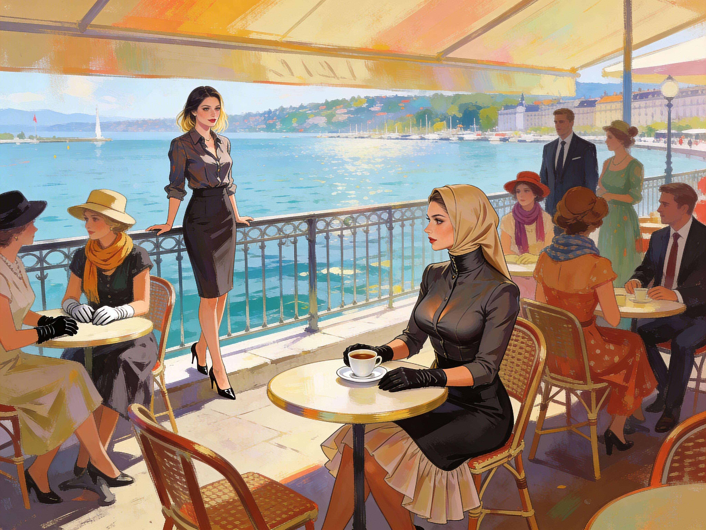

# Sonia Meets the Changed Anna

The Lakeside Cafe had changed faster than Sonia was ready for.

She saw it before she even reached the terrace.
Men in neat suits and ties.
Women in skirts, dresses, gloves, hats, headscarves, all of them arranged with the same sharp precision she had started noticing on the street that morning.
Worse than identical. Coordinated by taste, rules, and some underlying agreement about what people should look like now.

Sonia slowed at the entrance.

She had tried to compromise with the city before coming down here. A skirt instead of trousers. Low heels. A blouse buttoned higher than she liked. Enough makeup to avoid looking openly out of place. It had seemed reasonable in her flat.

Here it made her feel half-dressed.

No gloves.
Hair uncovered.
Too modern.
Too blunt.

People looked at her and then away again with the discreet distaste reserved for someone who had violated a dress code in a way too intimate to name.

She kept walking.

Anna was at their usual table near the lake.

Sonia saw her and stopped.

The body changes were one thing. She had expected those after looking at herself in the mirror that morning and trying not to throw up. The manners were worse.

Anna sat with her back straight, one gloved hand resting beside her cup, the other in her lap. Her blouse was richly worked and high at the throat. Her skirt spread in a controlled A-line shape over petticoats. The sand-colored headscarf covered her hair completely. Even from a few meters away Sonia could see the care in her makeup.

She looked beautiful.

*Sonia saw Anna at her table at the lakeside café.*

The thought hit first and sickened Sonia immediately after.
It was exactly the kind of thought the virus wanted people to have.

"Anna?"

Anna looked up.
For one second the face was almost ordinary with simple recognition and pleasure.
"Sonia."

Then the rest of the new manner settled over it.
"It is wonderful to see you."

The words were warm.
The structure of them was not.

Sonia came closer and let Anna stand for the awkward little embrace, though she almost wished she had not. Anna hugged her carefully, as if there were already a correct way to do even that.

Sonia sat down before she lost her nerve.
"You too."

The waiter appeared at once.
Anna glanced toward him, lowered her gaze automatically, and folded her hands.
Sonia watched that with a rising, private nausea.

Anna turned to the waiter with a small, careful smile.
"Sir, if it would be convenient, I would be very grateful for two coffees."

"Of course."

"Thank you, Sir."

Sonia wanted to start with something sharp enough to crack the whole thing open.
Instead she heard herself say, "How are you feeling?"

Anna answered immediately.
"Much better."

"That's not what I mean."

Anna's fingers tightened under the white satin of her gloves.
Sonia saw it. A tiny betraying motion. The old Anna was not gone. She was trapped somewhere in there, paying for every wrong answer before it reached the air.

"I know," Anna said.

The coffees arrived.
The waiter set them down.
Anna thanked him softly and did not touch hers until he had moved away.

Sonia stared at her.
"What was that?"

Anna blinked.
"What?"

"You waited."

Anna looked down at the cup as if it might explain itself.
"It was more polite."

"Did it?"

The flush that rose under her makeup was not shame. It was irritation at being asked.

Sonia leaned forward.
"Anna, I need you to stop smoothing this over for one minute and just tell me what happened."

Anna met her eyes then, and for the first time there was no gentle public mask in the expression. Only a flash of old irritation under a much steadier new composure.

"I got sick," she said. "Then I got better."

"No."

"Sonia."

"No. I got sick too. I know what the fever felt like. I know what my body looks like now. What I do not know is why you are sitting here like..." Sonia gestured helplessly at the gloves, the scarf, the posture, the exquisite correctness of the whole arrangement. "Like this."

Anna's throat worked.
She looked away toward the lake and back again.
"Because this is how I want to present myself."

Sonia almost laughed.
"Try again."

Anna's eyes narrowed. A familiar look, yes, but cleaner now. Less messy. Less spontaneous.
"You are being rude."

"Good. Maybe rudeness still gets through."

At the next table, a man glanced over and then away. A woman in gloves pretended not to listen. That, more than anything, made Sonia's anger focus. They were doing this in public. Under observation. Inside rules Anna had already started obeying even while talking about them.

"Fine," Sonia said more quietly. "Walk me through it."

Anna took a breath.
"There are... changes."

"I noticed."

"Not only physical ones."

"I noticed that too."

Anna's mouth tightened.
"Must you do this in that tone?"

"Yes."

That got the tiniest twitch at one corner of Anna's mouth, gone almost before it formed. Sonia felt a rush of grief at how much that one small expression looked like her friend.

"The clothes help," Anna said at last.
"How?"

Anna looked at her own gloved hands.
"They make things align."

"What things?"

"Behavior. Thought. Presentation." She hesitated over the last word, then forced herself on. "When I do what now feels proper, it gets easier."

"Easier because?"

Anna did not answer.

Sonia waited.

At last Anna said, very low, "Because I am rewarded."

The words left a little silence between them.
Sonia looked at her coffee and then back up.
"Rewarded how?"

Anna's face colored again.
"Relief first."

"And after that?"

Another pause. Longer.
"Pleasure."

There it was.
No manifesto. No philosophy. Just the obscene mechanism in one word.

Sonia sat back.
"Jesus."

Anna flinched.
"Please."

"No, don't please me. Don't do that polite little correction thing. They did this to you."

Anna's gaze snapped back to Sonia's.
"I know they did."

Sonia stopped.
"You know."

"Of course I know."

The force in that answer was real and unmistakably Anna's.

"I know the virus changed me," Anna said. "I know the memories are inconsistent. I know some of the rules were not mine before. I know what operant conditioning is. I also know I like this version of myself better."

"Then why are you defending it?"

Anna exhaled and some of the anger drained out again, leaving calm behind it.
"I am not defending the way it started."

"It started with violation."

"Yes."

"And now?"

Anna looked out toward the lake.
"Now it feels..." She stopped.

Sonia waited.

"It feels structured," Anna said. "And calm. And much closer to the woman I ought to have been all along."

That answer landed harder than any ideological speech would have.

Sonia rubbed at her forehead.
"No, that is you liking the cage."

"Yes," Anna said, and there was no hesitation in it now. "In part, yes."

"Anna."

"Sonia, I was sick for days. It got into everything. The body. The dreams. The thoughts that came after the dreams. Every correction that I resisted made me feel worse. Every concession made it easier to breathe." She looked back at Sonia now. "Then the fever ended and I could finally see myself more clearly. I was rude before. Abrasive. Careless with people. Careless with how I dressed. I thought that was strength."

Sonia did understand.
In part.
Her own body had changed. The only difference was that the deeper hooks had not sunk all the way into her mind.

"Yes," she said.
"Then stop looking at me as if I have simply become stupid. I have become more polished than I was. More disciplined. More aware of what is proper."

That stung because Sonia knew she had been doing exactly that, taking Anna's polish as an indicator of a loss of intellect.

She changed tack.
"All right. Tell me about your mother."

Anna went still.

Not tense in the obvious way. More like an instrument held just past the point of vibration.

"What about her?"

"Tell me what you remember."

Anna's voice softened at once, and Sonia hated the softness because it had that same smooth, guided quality as everything else.
"She was brilliant."

Hope moved, small and desperate, through Sonia.
"Yes."

"And disciplined."

The hope faltered.

"And gracious," Anna continued. "Very gracious. She cared for my father, for our family, for her work in that order. She taught me that a woman's mind is not diminished by obedience. It is refined by it."

Sonia actually recoiled.
"No."

Anna's eyes flickered.
"That is what I remember."

"No, it isn't. That is what they put there."

"It is still what I remember."

Sonia heard the trap in that at once. Anna was not claiming it had always been true in some objective sense. She was telling the truth from inside the altered structure. That was worse, because it meant argument alone would never be enough.

"Elena would never have said that."

Anna's fingers tightened again.
"You did not know her as I did."

Sonia laughed once in disbelief.
"I knew her well enough to know she did not spend her life dressing up compliance as virtue."

Two tables over, cutlery stopped.
The little radius of attention around them tightened.

Anna heard it too.
"Please lower your voice."

"Why?"

"Because everyone is listening."

"Good."

Anna's expression changed. Fear. Public fear. Then the second reaction came behind it: the trained recoil from impropriety.

"A woman should not make a scene," she said automatically.

The moment the words were out, Sonia saw something happen in her. A tiny slackening around the mouth. A faint shift in the shoulders. The reward.

Anna had just self-corrected in public and her body had paid her for it.

Sonia saw that and felt something harden.

"There," she said quietly. "That. You say the line, your body gives you a treat, and then you call it truth."

Anna looked hurt now, not shocked.
"Do not say it as if that makes it false."

"How else should I say it?"

"I don't know." Her voice dropped. "More honestly."

That almost undid Sonia.
Anna was not only trapped inside the cage. She had begun to take pride in how well she fit there.

Sonia looked at the woman across from her: the careful makeup, the white gloves, the full skirt, the covered hair, the upright posture that had become half habit and half restraint. She could see both things at once now. Anna had been altered. Anna was participating. Neither canceled the other.

"Come with me," Sonia said.

Anna went visibly still.
"No."

"Why not?"

"Because I do not want to."

"Or because you can't?"

Anna held her gaze.
"Because I do not want to go back to being that person."

Sonia asked again, more gently. "Which is it?"

Anna's eyes dropped to her lap.
"If I can choose at all, then I am choosing this."

That was worse than uncertainty.

They were both quiet after that.
The terrace noise returned around them in little pieces. Cups. Chairs. Water against the edge of the promenade. Someone laughing too loudly at something several tables away.

Finally Sonia said, "I am not letting this go."

Anna nodded without looking up.
"I know."

"And you know this isn't over."

"Yes."

Sonia stood.
The chair legs scraped louder than she meant them to.
Heads turned again.

Anna winced almost imperceptibly.

Then she looked up at Sonia one last time.
"Please remember that I am still here."

Sonia's throat tightened.
"I know you are."

She left money for the coffees and walked away before she could say anything softer that might break whatever held her upright.

Behind her, Anna remained at the table, straight-backed and gloved and outwardly composed.
But Sonia had seen enough.

Anna knew what had been done to her.
She also believed, in the most dangerous way possible, that what had been done to her had improved her.
