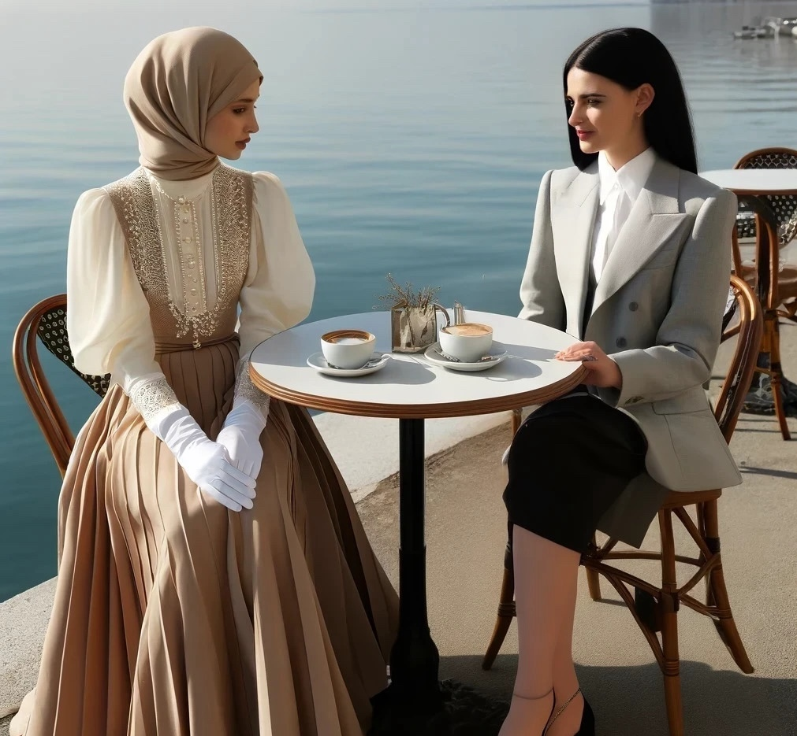

# Sonia meets the Changed Anna

Anna and Sonia had planned to meet at their usual spot, the Lakeside Café.
But that did not work out, because Sonia felt unwell after returning from Shenzhen,
and the infection outbreak that followed and brought the Change to them.
As Sonia arrived now, a good week later, the atmosphere at the café had been completely transformed.
To her, it felt like a weird costume drama, evoking a sense of nostalgia that made her uneasy.
The café was filled with the Changed—both women and men.
Both looked as though they had stepped out of mid-twentieth-century fashion magazines.
The men were all in tailored suits, crisp white shirts with black ties,
some opting for a sporty casual look with cardigans over polo shirts and dress trousers.
But it was the women who particularly caught her eye.
They were all in dresses or skirts, with gloves and either hats or stylish headscarves,
the faces with meticulously applied makeup, sporting small clutches.

Sonia navigated the crowd, searching for Anna.
She felt like an outsider.
Although she had attempted to adjust her look to match the look of the Changed,
it was clear she wasn't wearing the "uniform" correctly.
Dressed in casual 2020s office chic, with low heels, pantyhose,
a knee-length skirt and blouse, and mild makeup, she tried to blend in.
However, she quickly realized she was the only one without gloves and with uncovered hair,
and was underdressed compared to everyone else.
Some people looked at her with disdain, as if she was a filthy clochard or maybe half-naked.

When she finally spotted Anna, she barely recognized her.
To Sonia, she looked like a complete stranger.

Anna's transformation was complete.
Gone were the casual runner's chic and sneakers.
Instead, she wore an A-line skirt that gained volume with pettcoats,
and a richly embroidered Victorian-style button-up blouse with a high, tight collar brushing against her chin.
White satin gloves covering her hands, and her hair was completely covered by a sand-colored hijab.
She also wore sophisticated high heels—a stark departure from her usual sneakers—
and her makeup was meticulously applied in a bold, defined 1950s style.

Sonia had recovered from her sickness late and only the day before,
and found her body grotesquely transformed and manipulated by the Virus.
Today, filling up her depleted fridge and later, on her way to the café,
Sonia's unease had been accumulating.
She had spotted the large number of Changed in the street,
easily recognizable from the so far uninfected in dress and behavior.
She knew she should also dress this way, the "correct way," 
but easily ignored this ridiculous suggestion.
Going down to the Lakeside Café, she saw larger numbers of Changed,
and her unease mounted, accumulating as a simmering rage underneath the surface.

As she saw the Changed Anna, Sonia's shock unleashed her fury, 
when she realized that the grotesque alterations forced upon her own body and Anna's were just the surface;
there was a vast, unseen force at work that was orchestrating a widespread transformation.
An artificially engineered virus, a tool of subjugation,
had been unleashed to mold her and countless others into grotesque parodies of womanhood.
This was not just a physical change.

It was a sinister assault on their very essence, a calculated erasure of autonomy,
programming their flesh and minds to fit someone else's twisted fantasy.
Women were being reduced to mere objects, sculpted for the pleasure and scrutiny of the male gaze.
The virus was designed to turn her and everyone else into *this*.
Sonia's fury burned brightly.
She was more than this reductive vision of femininity, more than a puppet manipulated by patriarchal designs.
She was a woman, a sovereign entity, not an ornament to be passively admired.

Sonia stopped, and took a deep breath, trying to maintain her composure.
She could not do much right now, and had to try to connect to Anna in order to better understand
what had happened and why Anna and the other Changed acted the way they did.
Apparently she herself was somehow different.
"Anna?" Sonia's voice trembled slightly as she reached the table.

Anna looked up, her smile serene yet somehow distant.
"Sonia, it's wonderful to see you," she replied, her tone measured and more formal than Sonia was used to.
They exchanged a brief, awkward hug—Anna's embrace was stiff, formal.
Sonia pulled back, searching Anna's face for signs of the friend she knew.
She took a seat opposite Anna, signaling a server to approach.
"Two coffees, please," Sonia ordered.
The server nodded and moved away.

"So," Sonia began, her eyes locking onto Anna's, "I thought we could talk about... everything.
Compare notes on what we've been going through."
Her words were cautious, chosen carefully to bridge the growing gap between them.

Anna nodded, sitting upright, her hands neatly folded on the table.
"Yes, I think that's a very sensible approach," she agreed, her language almost scripted.
"It's important to understand the changes systematically."

"The sickness was brutal," Sonia began, barely containing her anger.
"But waking up to this… this caricature of femininity, it's a nightmare.
It's like being trapped in someone else's distorted fantasy.
It's completely wrong, sick and depraved."

Anna looked down at her gloved hands, then back at Sonia, smiling with deeply rooted, unnatural happiness.
"Sonia," she began, steady and composed, "I know it's hard for you to understand right now,
but the virus has been a gift.
It erased years of insecurity, reshaping my body in ways I never thought possible.
I am now slender and elegant, and my skin is smooth and flawless.
The imperfections I once loathed have vanished.
Even my hair—it's grown fuller, more vibrant.
I stand in front of a mirror, and the reflection I see is perfect, beautiful.
For the first time, I feel truly at peace with myself."

She paused, her smile fixed and gentle.
"I understand that this transformation feels like an intrusion to you, but for me, it's been liberating.
The changes have brought a sense of harmony that I never imagined I could achieve.
It's as if the virus knew my deepest insecurities and gently erased them,
leaving behind a version of myself that feels whole and confident."

Sonia's hands clenched into fists on her lap, her coffee untouched.
"Harmony?
You call this manipulation harmony?
They didn't just change our bodies, Anna.
They're trying to erase who we are, force us into roles we never asked for!"

Anna's smile faded slightly into a confused frown.
"But I feel peaceful.
Pleasurable even.
Isn't it better to find peace in what we've become?
I feel connected to something greater.
The changes, they're enhancements, Sonia.
Why fight it when we can embrace it?"

"Enhancements?"
Sonia's frustration boiled over, her voice rising despite her efforts to remain calm. 
"They violated us.
My body, your body—it's not ours anymore.
And you're just… okay with that?
With losing yourself?"

Anna leaned forward, her voice soft, but full of conviction.
"I haven't lost myself.
I've found a version of me that fits better in this world.
The world has changed, and adapting means surviving, thriving even.
Can't you see the possibilities?"

"Possibilities?"
Sonia laughed bitterly.
"You mean the chance to become something we're not?
This isn't adapting.
It's submission.
And I won't be a part of it."

Anna sighed, looking at Sonia with sadness.
"I wish you could see it as I do, Sonia.
There's peace in acceptance, in fulfilling the roles we've been given.
Fighting it… what's the point if we end up alone, alienated?"

Sonia stood up, her chair scraping against the ground.
"The point, Anna, is to remain true to ourselves.
I'd rather be alone and myself than lose who I am for a false sense of belonging.
I can't…
I won't just sit back and accept this."

*Anna and Sonia at their table in the Lakeside Café.*

Sonia paused, her anger simmering as she searched for another way to reach Anna.
She sat down again.
"What about Elena, your mother?" she asked, almost desperate.
"She was a beacon of independence, a brilliant scientist.
She never bowed to anyone.
She taught us to stand tall, to question, to be our own persons."

Anna's reaction was immediate, but not as Sonia expected.
Her smile was serene, her tone gentle, as if correcting a child's simple mistake.
"My mother was indeed a great scientist, but she always knew her place.
She was supportive, obedient, always putting her family and her duties before her own ambitions.
She embraced her femininity and taught me the importance of our roles as women."

Sonia's heart sank, a cold realization dawning on her.
"No, that's not…
That can't be right.
Elena fought against those stereotypes all her life.
She wouldn't—"

Anna interrupted, her voice still calm, "Sonia, I remember my mother well.
She always said, 'A woman's strength lies in her grace and obedience.'
She lived by those words.
She was my role-model."

The revelation hit Sonia like a physical blow.
Unlike herself, Anna had been changed even more than she.
Not just her body, her entire personality has been reconstructed,
rewritten to fit the fantasy of the unseen man who had constructed the virus.
Her rising anger bubbled to the surface.
She got loud.
"That's bullshit, Anna!
They've messed with your head, changed your memories.
They didn't just change our bodies–it's our minds, our selves they've been editing!"

Anna's expression tightened.
Her patience had reached its limit.
"Sonia, please, lower your voice.
A woman should be seen, but never be heard.
You know that very well.
There's no need for such language or behavior.
It's… unbecoming."

Sonia felt something snap within her, a fierce energy breaking free.
"Unbecoming?
You think it's 'unbecoming' to fight for our right to be who we are?
To not have our memories, our identities, rewritten by some… some virus?"
Sonia was almost shouting now, attracting stares from nearby tables.
"I refuse to accept this.
I refuse to let them take who we are!"

Anna looked around, embarrassed by the attention they were drawing.
"Sonia, please.
This isn't the way.
We should strive to be more composed, more… feminine."

But Sonia was beyond hearing.
"No, Anna.
I won't be quiet.
I won't be 'composed.'
And I certainly won't let them take you, me, or anyone else without a fight."
Her chair clattered to the ground as she stood.

"This isn't over," Sonia declared with conviction.
"I will fight this virus, its conditioning, everything it's trying to do to us.
And I'll start by remembering Elena as she truly was—a woman who would not have stood for any of this.
Not for a second."

Without another word, Sonia turned and stormed off.
Anna went home, thinking hard.
Why couldn't Sonia see the good in their roles?
Anna felt sure now, more than ever, that this was the right way.
Sonia's resistance felt wrong to her now.
