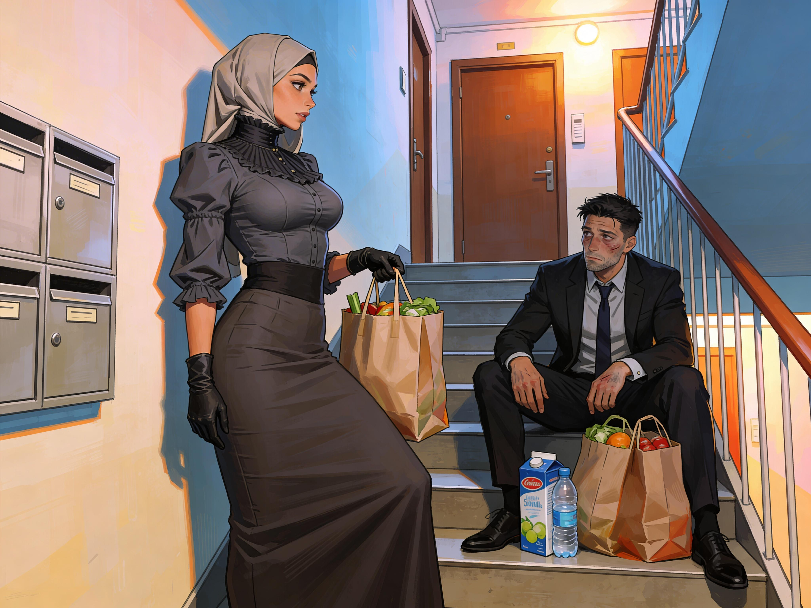

# Good Girl

Anna walked home carefully in her Yoyah Sheengzoh, one gloved hand on the rail, the other gathering her skirt.
The underlayer kept her steps short and neat. It asked for balance, patience, grace. Her body had already learned how to give all three.

Sonia's anger still clung to her a little, less as doubt than as a faint, unpleasant aftertaste.
Anna could see the old roughness in it now: the blunt voice, the careless posture, the assumption that wanting freedom from everyone was the same thing as strength. She had once spoken that way herself. The memory of it felt coarse.

She reached her floor and found her neighbor on the landing, bent over two shopping bags and a carton of bottled water. He looked pale and annoyed with his own weakness. When he straightened, he swayed a little and caught the wall.

Julien Moreau. She knew the name from the postboxes. They had lived across from each other for months and never done more than exchange hallway pleasantries. The omission struck her now as shabby. A proper introduction ought to have happened long ago.

Anna set her own parcel down, smoothed her skirt, and curtsied.

"Excuse me, Sir," she said. "I am Marc Lefevre's Anna, from across the hall. I hope you will forgive the forwardness. You do not seem entirely recovered."

The knowledge sat in her as calmly as any childhood lesson: how to greet a man, how long to hold a curtsy, how to offer help without presuming. She knew those habits had been strengthened, rearranged, made more absolute. That did not make them feel false. It made her old bluntness feel exposed.

He looked at her as if he needed a second to sort out what he was seeing. His eyes went from her gloves to her blouse to the line of her skirt, then back to her face.

"Anna," he said. "Right. Yes. Julien Moreau."

He gave a short, embarrassed laugh.

"I think I overestimated how well I was doing. Would you mind helping me get this inside?"

"Of course, Sir."

She bent for one of the bags before he could reach for it again. The simple usefulness of the motion soothed her. Lift. Carry. Assist. Good steps, right steps.

His apartment was the mirror of hers, but less carefully kept. He had probably been orderly before the illness. The shape of it suggested that. Desk cables were tied. Books stood in straight rows. A jacket had been hung rather than dropped. But sickness had broken the surface order. Used glasses stood on the coffee table. A blanket was twisted on the sofa. Medicine packets and tissues crowded the kitchen counter. One shirt had been left over the back of a chair as if he had been too tired to finish taking care of himself.

The sight tugged at her instantly, not just because it was untidy, but because her body knew what order would feel like.

She set the bag on the counter and turned toward him.

"Sir, if it would please you, may I put these things away for you?"

"You don't have to do that."

He said it automatically. His voice held the old reflex of politeness, but he was watching her too closely for it to be simple courtesy. Something in him had shifted as well. He just had not learned the shape of it yet.

"I would be glad to help, Sir."

His gaze dropped, briefly, to her hands folded over her skirt. Then to the apartment behind her.

"All right," he said. "Yes. Please."

The answer slid into her like a key turning in a lock.

Warmth loosened low in her belly. Her shoulders settled. Even her breathing changed. Permission felt good. More than good. Clarifying.

She began with the kitchen. Bottles into the refrigerator. Groceries sorted. Counter wiped. Empty packaging gathered and tied. Her sleeves and gloves kept her movements measured; the underlayer kept her back straight; the memory of older feminine lessons supplied a hundred tiny corrections without effort. Turn sideways. Do not reach carelessly. Keep your elbows near your body. Leave things in better order than you found them.

Older and newer lessons overlapped without friction. Keep a man's space orderly. Notice what needs doing before he asks. Do it quietly. She knew some of that had been planted, edited, made deeper than it had ever been before. Her body accepted the correction anyway, as if it restored a pattern that should always have been there.

Julien sat at the table at first, as if unsure whether to stop her or apologize again. Twice he opened his mouth and closed it.

"You really don't need to..." he started.

Anna looked toward him.

"If it is agreeable to you, Sir, I would like to continue."

He stopped.

"It is agreeable," he said, more quietly this time.

The reward came back stronger. It ran through her in a small bright pulse that made her thighs tighten. She turned back to the counter before he could see too much in her face.

He watched her after that. She felt it even when she did not look at him. The attention settled over the room almost like another garment, something invisible but close-fitting. Being watched made every movement sharper. Her posture improved. Her hands became more precise. When she carried his folded blanket to the bedroom and returned with the empty medicine cups, she felt his eyes follow the line of her waist and the restrained swing of her skirt.

It should have embarrassed her.

It did embarrass her.

And the embarrassment itself kept changing shape under his gaze, losing its bite, turning hot and heavy and useful.

Julien cleared his throat.

"You do this as if you've always done it."

Anna rinsed a glass, dried it, and set it in the cupboard.

"Perhaps I should have, Sir."

That answer pleased her the moment she said it. It felt truer than the life she had lived last week.

He was quiet for a few seconds.

"Everything since the fever feels..." He shook his head and tried again. "Too fast. Like my mind has already made room for things I didn't agree to."

Anna turned toward him fully. He looked tired, serious, and unsettled, newly built and still learning the shape of the frame rather than comfortably occupying it.

"Yes, Sir," she said softly. "It can feel very fast."

His eyes stayed on her.

"And yet you seem all right with it."

She considered that. Then she curtsied a little, because honesty still wanted form.

"I know I was Changed, Sir. I know I did not choose all of it. But I find that I am easier in myself when I stop pulling against what I have become."

He leaned back in his chair and studied her with the wary concentration of a man testing whether a floor would hold his weight.

"Do you really believe that?"

"Yes, Sir."

She did not rush it.

"I remember being otherwise. I do not admire it as much as I once did."

His mouth moved slightly at that, something more uncertain than a smile.

"You make it sound peaceful."

Anna folded a dish towel and laid it flat.

"Peaceful is not the first word I would use, Sir. Clean, perhaps. Or fitting. The struggle becomes smaller. That helps."

He looked away then, toward the counter she had cleared.

"I keep feeling as if I'm supposed to know what to do," he said. "As if something in me expects... responsibility. I don't know if that makes sense."

It made too much sense. She heard the awkwardness in the way he circled it, the reluctance to claim authority he had not asked for. That hesitation drew something tender out of her.

"It does, Sir."

He met her eyes again.

"Tell me plainly."

The phrase landed with more force than it should have.

Tell me.

Her pulse gave a hard jump.

"You are adjusting to your place," Anna said, careful not to overstep. "As I am adjusting to mine."

"And your place is this?" he asked, glancing around the apartment. "Helping me put groceries away."

"At this moment, yes, Sir."

She should have felt humiliated by the simplicity of it. Instead she felt her body answer with a deep, dangerous softness.

Useful. Welcome. Right where she was meant to be.

Julien exhaled and rubbed one hand over his face.

"I don't know what I'm doing," he said. "You probably see that."

"You are recovering, Sir."

"That's not what I meant."

She lowered her gaze. "No, Sir."

Silence stretched between them, not empty now but charged. The apartment was nearly in order. The scent of cleaning spray had faded into coffee, soap, and the warm trace of another body in close rooms. Anna adjusted the angle of a chair by a few centimeters, then straightened. That small act of completion sent a final ripple of satisfaction through her.

Julien noticed.

"Does it make you feel better?" he asked.

She could have lied. The older self might have. The old self had spent years treating need as something to hide until it turned sharp.

"Yes, Sir," she said. "Very much."

"Because it's clean?"

Anna's face grew warm. "Because I was permitted to do it."

His expression changed at once into startled understanding, with neither cruelty nor triumph in it.

"Oh."

He looked at the ordered room, then back at her, as if he were seeing both with new clarity.

"Anna."

Just her name in his voice made her stand a little straighter.

"Yes, Sir?"

"Come here."

She crossed the room on careful steps and stopped at a respectful distance. Her hands had already folded themselves. She hated how ready her body was. She loved it more.

Julien looked up at her from the chair. He was still learning how to occupy the space his Changed mind had prepared for him, and she could see the uncertainty in every part of him. But he did not look away.

"You've been very kind," he said. "And very helpful."

The praise moved through her before the meaning finished landing. Heat spread under her stays. Her nipples tightened. She held still by effort.

"Thank you, Sir."

His gaze dropped, caught on something in her expression, and grew more intent.

"I mean it. You came in, you saw what needed doing, and you handled it."

Another pulse. Stronger. Her thighs pressed together on their own.

Julien noticed that too. His face changed a fraction, not because he understood everything, but because he understood enough.

"Is that..." He stopped, recalibrated, and tried again. "Does praise affect you?"

Anna's shame flashed sharp and bright. The new self gathered it up at once and turned it.

You can answer. You can be honest. You can let him know what helps.

"Yes, Sir," she said, barely above a whisper.

He swallowed.

"I see."

For a moment he looked almost guilty. Then something steadier came in under it, less confidence than a Changed instinct accepting its own outline.

"Then you should hear it properly."

Her entire body went alert.

Julien rose, slow with the last of his illness, and stepped close enough that she could smell soap and fever-warm skin under clean cotton.

"Good girl," he said.

The words hit like a hand closing low inside her body.

Pleasure surged up so hard she had to catch it with her teeth. Her knees weakened. Wetness spread at once between her legs, humiliating and immediate. Her breath left her in a small broken sound she could not hide.
Obedience is pleasure, Elena's voice said from that deep edited place where the oldest lessons lived, and for one terrible sweet moment Anna could only agree.

Julien froze for half a second, startled by the intensity of it. Then his hand lifted as if he meant to steady her, hesitated, and settled lightly at her waist.

"Anna?"

The concern in his voice only intensified it, making the sensation worse and better at once until she could not separate the two.

"I am all right, Sir," she said, though her voice shook. "Very well, Sir."

His hand remained where it was, careful and possessive at once.

"Tell me if you need something."

Another command dressed as care. Another wave.

Anna dipped into a tiny curtsy because she needed a form to hold herself together.

"Thank you, Sir."

He let his hand fall away, still looking at her as if he had discovered something he had not meant to discover and was not sorry to have found.

"Go and rest now," he said. "Come by tomorrow evening."

The words were polite, but they were no longer framed as a choice. That settled something deep inside her at once.

"Yes, Sir. I will."
She curtsied.

He nodded once.

"Good."

She gathered herself, collected her empty shopping bag, and made her careful way back across the hall. Inside her own apartment she shut the door, leaned against it for a breath, and felt the echo of his praise move through her all over again.

Good girl.

This was stronger than the thin relief of obeying herself or the private easing that came when she accepted a rule quickly enough. His approval had weight and direction; it had gone into her and stayed there, glowing.

She crossed to the mirror and looked at the woman reflected there: gloved, neat, a little flushed, eyes too bright.

Julien had seen her useful.
Julien had seen her good.

The thought formed without resistance, as natural as breath and far more dangerous.

Julien Moreau's Anna.

She should have recoiled from the possessiveness in it. Instead she felt herself soften around it, making room.

Yes.

That would be sweet.
