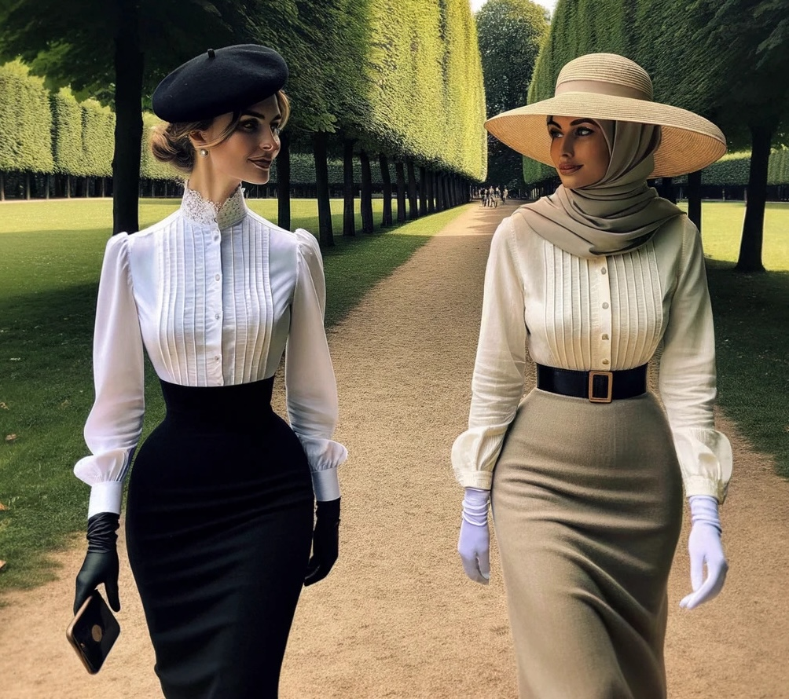

# Sonia picks up Anna

After her unsettling experience at the Lakeside Café,
Sonia walked through the city, trying to calm herself and trying to come up with a plan.
She needed to help Anna, fight the virus, and push back this unseen enemy.
In the city, she noticed the virus had not won–yet.
There were plenty of… Unchanged, normal people in normal dress,
not in the weird mix of Victorian-1950s time travel retrostyle the Changed preferred.
She also noticed that Unchanged, including herself, got weird looks from the Changed,
as if it was her who was out of line or somehow weirdly dressed.

There was quite some pressure to conform more closely to the prevailing styles.
Some Changed looked at her slightly displeased or even with hostility,
making remarks between themselves about her appearance,
or keeping a distance as if she smelled or was dirty.
Her analytical mind concluded that she needed to fit in if she wanted to function
and be effective as an agent of whatever resistance she planned to build.
Still, giving in and purchasing "Changed-approved"
fashion from the local Maylee Shufoo boutique felt like losing a battle.

Now, standing in front of a mirror, she examined her reflection.
She was dressed in what society deemed appropriate: a white blouse with a lacy high collar and some pleats,
a pencil skirt, sensible heels, one of the atrocious hobble-slips under the dress, 
and her hands covered in dark, close fitting leather gloves that reached under the cuffs of her blouse.
She didn't feel like herself, more like playing dress-up in her private horror show.
Instead of a headscarf, she wore a small dark beret, rejecting the idea of the hijab,
yet she knew she would blend in far better in this outfit than the day before.

Internally, Sonia was still seething, but her anger wasn't directed at Anna.
She recognized that Anna likely couldn't help her condition; it wasn't her fault.
Anna needed help, and Sonia was determined to provide it.
"This isn't me," Sonia muttered to her reflection, feeling conflicted,
"but Anna needs me.
And I need her.
I can't fight this alone.
We need to reverse what the virus has done."

As she walked to Anna's apartment in the characteristically restrained stride enforced by her Yoyah Sheengzoh,
Sonia pondered the profound changes the virus had inflicted,
transforming vibrant, independent women into demure, obedient figures.
"How did we get here?
How did Anna change so much?" she wondered.
She missed her friend, the intelligent, strong Anna who now seemed content being controlled.

It was clear that the virus had affected Sonia, her body had changed, and from what she knew and could see,
likely in exactly the same way it had affected Anna.
Still, her mind wasn't Changed the way Anna's and everybody else's mind was changed,
that much was clear.
She knew things she should not know: expert makeup skills, native level spoken and written Chinese,
weird behavioral rules.
But apparently for her this was all optional, while for Anna it formed a new reality somehow,
a compulsion to act in a certain way that Sonia lacked.
She was different, partially immune to whatever the virus did to the Changed.

"But Anna can help," Sonia thought resolutely.
"With her expertise in genetics and her analytical mind, if anyone can find a countermeasure, it's her.
Maybe she can fix this."
This thought bolstered Sonia's resolve to continue, despite her disdain for what the virus had done.

Reaching Anna's floor, 
waddling upstairs in the ridiculous and demeaning gait the hobble slip forced on her, she steeled herself: 
"I'll wear their costumes, play their games, if that's what it takes.
But I won't let the virus win.
I won't let it take Anna completely."
Wearing clothes she disliked was a small price to pay if it meant saving her friend.

Upon arriving, Sonia found both Anna's and Julien Moreau's doors open.
Uncertain if this was an invitation or if they had left in a hurry, she hesitated.
There were no signs of Anna in her apartment, no note, just indications that she had left quickly.
Worried, Sonia called out, but received no answer.
Then, Anna emerged from Julien's apartment,
her approach signaled by the quick clacking of heels constrained by her narrow underskirt.
Like the day before, Anna was dressed much more formal and restrictive than Sonia was used from her:
A sand-colored long pencil skirt, accentuating her waist with a wide dark brown leather belt,
and a creme-colored blouse with long arms.
Her hair was covered by hijab that matched her skirt in color, her hands again by white satin gloves.
She also held a wide straw hat with a slightly curved brim that would partially hide her face.
Seeing Anna brought a wave of relief to Sonia.

"I'm so sorry for yesterday, Anna," Sonia began, her tone apologetic.
"I was… out of line.
I hope we can move past it.
I could really use your help to navigate… all of this."
She gestured to her clothes, indicating her efforts to fit in.

Anna spoke softly, "Of course, Sonia.
We all need support through these changes," her voice calm and graceful.
She gestured for Sonia to follow her into Julien's apartment.
"Let me introduce you to Julien."

"Sir, this is my friend, the late Volker Becker's Sonia," Anna introduced Sonia, curtsying.
"And Sonia, this is Julien Moreau, my neighbor."
Sonia hesitated, but eventually copied Anna's behavior and curtsied as well,
feeling the restrictions of her blouse and skirt as she made the unfamiliar movement.
Julien greeted Sonia with a nod.
His comment to Anna, "Good girl," seemed to make Anna unusually happy.
Sonia noticed Anna closing her eyes briefly, as if savoring a wave of joy.

With Julien's permission (Sonia clamped down on her feelings about this), the women prepared to leave for work.
Sonia, who used to be Anna's equal in science, now looked to Anna for guidance in proper Changed behavior.
The walk,
which used to be a simple commute, now felt like a challenge to Sonia in her restrictive clothing and unfamiliar heels.
She asked about Julien, "Anna, can you tell me about Julien and what happened between you two?"

Anna replied, "Julien is single, and a good match for me. I cleaned his place and made him breakfast."

Sonia was taken aback by Anna's casual acceptance of her role.
She pressed, "Oh… okay.
And what would the Anna I knew before have thought about this… about serving him because he ordered you to?"

Anna's response was matter-of-fact.
"It doesn't matter.
The old me was wrong and would have shamed our family.
I needed to change," she said calmly.
"The virus helped me change and made the world better, it brought harmony."

*Sonia and Anna are walking to GAIA. To appease Anna's sensibilities and to blend in, Sonia dresses "properly".*

"You are aware that the virus changed you and conditioned you, right?"
Sonia asked, astonished, now realizing that Anna apparently held two contradictory truths in her mind.

"I do.
But I also have always been like this.
I remember growing up like this, with the values I now hold dear.
I also remember a different past, but I don't like to.
It makes me…" Anna hesitated.
"It makes me deeply ashamed that I might have been like that, and I prefer my other past.
Being like that might have brought shame upon my family."

Sonia struggled to reconcile this.
She was clearly different from Anna and the other women she observed.
She understood how things "should be" and how to "behave like a proper woman," but she rejected this norm.
Unlike Anna, who seemed compelled to conform, Sonia could resist.
She remembered dreaming absurd dreams, but they had no lasting effect on her.
For Anna, it appeared different.
Sonia had the new skills, just like Anna did.
She could do things she could not do before,
doing makeup, understanding Chinese script, and she knew proper behavior and expectations.
She was like Anna in this matter.

Yet, unlike Anna,
Sonia was certain she had only one past and lacked the compulsions and conditioning that controlled Anna.
Anna's acceptance of her changed self made Sonia feel uneasy.
It was clear her friend had changed profoundly; they used to think alike, but now they were worlds apart.

Sonia slowed her pace, trying to comprehend how the Anna beside her had changed so dramatically.
The virus had altered not just Anna's appearance but her beliefs and identity as well.
