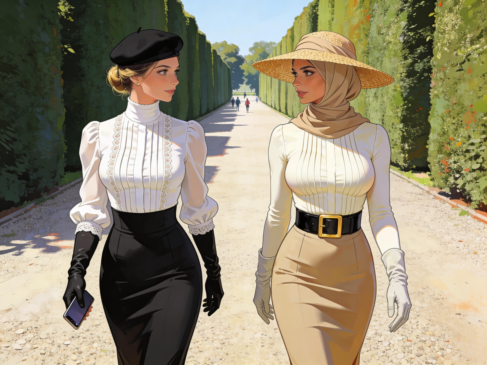

# Sonia picks up Anna

The next day, Sonia did not go back to the lab directly.

She went shopping, and returning home, shut the door, and stood in front of the mirror with a small pile of purchases from Maylee Shufoo spread across her bed like evidence.

The blouse had too much structure in the collar. The skirt was too narrow through the knees. The gloves made her hands look elegant but were entirely impractical. Worst of all was the Yoyah Sheengzoh folded on the blanket beside them, neat and obscene in its restrictiveness. Walking with Grace. The saleswoman had translated the name for her with a warm, approving smile, as if managed movement were an obvious kindness.

Sonia stripped and dressed again in stages, angrily, methodically.

Blouse first. Buttons. Hooks. Collar.
Then the underlayer, which immediately shortened her stride and told her hips what they were no longer free to do.
Skirt. Heels. Gloves.

She stared at herself.

The woman in the mirror looked plausible, which was the point: not herself, not remotely, but plausible enough to move through the Changed city without drawing every eye.

It disgusted her that it worked.

She adjusted the beret instead of the hijab folded beside it. That was as far as she was willing to go today.

"Fine," she said to the reflection. "I will wear the costume."

She almost corrected herself to camouflage, because that was the cleaner word for what she was doing.

That thought settled her.

This was fieldwork now. Observe the system. Blend in enough to see how it moves. Get to Anna. See what was left.

The descent to the street in heels and a hobble slip was humiliating. She had to take the stairs slowly, one hand on the rail, feeling the narrow discipline of the thing at every step. Women passed her in skirts and fitted jackets, gloves, scarves, hats, masks, moving with practiced economy. No one stared outright. They only registered her, assessed her, and looked away without the little recoil she had earned yesterday in jeans.

Better.

That alone made her feel ill.

By the time she reached Anna's building, Sonia had the walk mostly under control, not comfortable but passable.

That would do.

Both Anna's door and the one across the hall stood open.

Sonia stopped on the landing and listened.

No sign of struggle. No raised voice. No broken glass. From across the hall came a man's voice, low and indistinct, then Anna's lighter one answering in the softened formal register that had already started to feel like an affront.

Sonia stepped toward Anna's doorway first. The apartment looked orderly, almost aggressively so. No note. No bag left open in haste. Whatever had happened, Anna had not been dragged anywhere.

Heels sounded behind her, close and quick despite the shortened step.

"Sonia."

Relief hit first. Then the rest of it.

Anna came out of the neighbor's apartment carrying a folded dish towel she seemed not to realize she still held. She wore a cream blouse closed high at the throat, a sand-colored skirt that held her legs to a disciplined line, satin gloves, and a matching hijab. A wide straw hat hung from one hand. She looked polished, composed, and completely at ease inside a version of femininity that should have read as costume and somehow no longer did.

Sonia saw the problem at once. It was deeper than the clothes.

Anna believed them.

"I'm sorry about yesterday," Sonia said before Anna could speak. "I pushed too hard and made it worse. I need your help, and I am trying not to make your life harder while I ask for it."

She lifted one gloved hand, a bitter little gesture toward her own outfit.

"I got the memo."

Anna's mouth softened.

"Thank you for saying so."

Then, with a glance toward the open door behind her:

"Will you come in for a moment? I should introduce you properly."

Should, Sonia thought. Not want. Should.

Sonia almost refused on reflex. Then she saw the shape of the room beyond Anna's shoulder and understood that this mattered to Anna in a way refusal would only complicate.

"All right."

She followed Anna into Julien Moreau's apartment.

It was clean enough to look recently cleaned. Deep cleaned. Kitchen counters clear. Groceries put away. Throw blanket folded. Medicine packaging collected into a neat stack by the bin. Evidence everywhere of feminine labor quietly completed and made invisible.

Julien stood near the table in shirtsleeves, one hand braced on the chair back. He still looked like someone climbing out of a fever: pale, not fully steady, annoyed at the fact of his own weakness. He was also watching Anna in a way Sonia did not like at all, with the focused attention of a man who had learned overnight that approval from him mattered.

Anna curtsied.

"Sir, this is my friend, the late Volker Becker's Sonia."

The words landed hard. Sonia had not heard Anna present herself through a man before. Father first. Now dead fiance for Sonia. The old order had been retrofitted into their introductions as if it had always been there.

Anna turned slightly.

"Sonia, this is Julien Moreau."

Julien nodded to Sonia, neither impolite nor warm, only careful.

"Miss Sonia."

Sonia gave him a shallow approximation of Anna's curtsy because standing there like an unchanged challenge would have been stupid.

"Sir."

The word tasted ridiculous.

Julien's eyes flicked over her outfit, registered the compromise of the beret, and moved on. He was new enough to all this that he did not seem to know whether to correct her or let it pass.

Interesting.

Anna set the dish towel down and folded her hands.

"Sir, if it is agreeable to you, Sonia and I should leave for work."

Should leave. Agreeable to you.

Sonia felt the sentence like a slap and kept her face still.

Julien looked from Anna to Sonia and back again. His uncertainty showed, but so did the new instinct under it, the one that expected to be asked.

"Yes," he said. "Go on. And Anna, take care on the stairs."

"Yes, Sir."

Something changed in her on those two words, not outwardly by much, but in a tiny drop of the shoulders and a softening around the mouth, satisfaction so quick and involuntary that Sonia might have missed it if she had not been staring for exactly that kind of thing.

Julien saw it too.

His attention sharpened.

"Good girl," he said, quietly, as if testing the phrase and finding it answered.

Anna closed her eyes for a beat.

When she opened them again, her face was composed, but color had risen under her skin. She looked steadier after the praise, not less. Settled.

So that was real: not metaphor or guesswork, but reward.

Sonia filed it away and hated the part of herself that was impressed by the elegance of the mechanism.

"Thank you, Sir," Anna said.

Julien's gaze lingered on her another second.

"Go along, then."

Outside in the corridor, Anna replaced the hat over her covered hair and adjusted it with practiced fingers.

Sonia waited until they were halfway down the first flight before speaking.

"You were in there cleaning for him."

"Yes."

"And that was normal?"

Anna glanced back over her shoulder.

"It was useful."

"That wasn't what I asked."

Anna made the stairs in the small sideways rhythm her skirt required, one hand on the rail, the other gathering the fabric clear. Sonia had to mimic the same constrained descent and hated that she had already learned enough to do it.

"It is normal now," Anna said. "And before you ask, yes, I know what you mean by that question."

Sonia almost lost a step.

"Do you."

"Yes. I know I was Changed."

She said it evenly, as if discussing weather or train times.

They reached the street and turned toward GAIA. Morning Geneva moved around them in skirts, coats, gloves, dark shoes, the occasional flash of bright lipstick, the quieter authority of suited men threading through it all. Sonia heard heels on pavement everywhere now. Felt her own answering them.

"Then help me understand this," Sonia said. "You know something was done to you, and you still talk as if this is right."

Anna's expression did not crack.

"Because knowing it was done to me does not undo that it fits."

There it was again. No confusion. No plea to be rescued.

Sonia tried another angle.

"Yesterday you still sounded divided."

"I was tired yesterday."

Anna adjusted one glove at the wrist.

"And you were shouting at me in public."

Fair enough.

They crossed at the light. A tram hissed past, full of women in gloves and skirts. All looked quiet and content in their style of dress.

Sonia lowered her voice.

"What about Julien?"

Anna's answer came too quickly to be invented.

"He is kind. He is adjusting well."

"That's not what I mean either."

That brought the faintest pause.

"His approval has an effect on me."

Direct. Calm. Infuriating.

"An effect," Sonia repeated.

Anna turned her head and met her eyes fully for the first time since they had left the apartment.

"A reward response, if you prefer technical language."

Sonia stared.

Anna went on in the same maddeningly level tone.

"It is stronger from him than when I correct myself alone. The difference is quite obvious."

She knew.
She knew exactly what was happening.
And the knowledge was doing nothing to loosen it.

If anything, it had been incorporated. Named. Filed. Accepted.

Sonia felt the real shape of the problem then. Anna was not trapped by ignorance. She was stabilized by lucidity.

"That should horrify you."

"At moments it does."

Anna said it without drama.

"Then he says something kind, or gives me a clear instruction, or looks pleased with me, and my body answers before the rest of me has finished objecting. It becomes difficult to care about the objection for very long."

The honesty of that unsettled Sonia more than denial would have.

"You hear yourself, right?"

"Perfectly."

They walked in silence for a few steps. Sonia felt the gloves at her wrists, the reduced stride enforced by the underlayer, the social relief of passing without comment in borrowed propriety. Tactical camouflage. Useful.

Also working.

That irritated her enough to clear her thinking.

"I dreamed the same things you did," she said. "Or close enough. Proper behavior. Dresses. Chinese. Makeup. The whole package. But I can ignore it."

Anna's eyes moved over Sonia's outfit with quiet precision.

"Can you?"

Sonia almost snapped back. Instead she looked ahead and let the question sit.

No, not entirely. She had not put this outfit on for pleasure, but she had still put it on. She had read the street correctly. She had adjusted. She had asked Anna for help instead of trying to tear her back into an older shape by force.

That was not surrender, but it was not nothing either.

"I can choose against it," Sonia said.

"That is useful."

The answer came with no envy in it. If anything, Anna sounded faintly sorry for her.

"For what it is worth," Anna added, "I do not think this is temporary."

Sonia turned to her sharply.

"What do you mean?"

Anna kept walking, neat and composed beside her.

"I mean the contradictions are stable. I know I was changed. I know parts of my history were rewritten. I also know I prefer what I am now. Those things do not cancel each other out. They support each other."

The plainness of it chilled Sonia more than any fever dream had.

"Because once I understand what has happened," Anna said, "I can arrange myself around it properly instead of fighting shadows."

They were close enough to GAIA now to see the glass and steel of the campus through the trees.

"That makes it harder to reverse," Sonia said.

"Yes."

No hesitation. No false comfort.

Then Anna looked at her, and for a moment the old intelligence was visible with painful clarity inside the new arrangement.

"But you should still try," she said. "You are different from me, and that difference may matter. Just do not mistake my clarity for hidden resistance. I am not waiting for you to restore me to an older version I no longer want."

That landed harder than anything else she had said all morning.

Sonia believed her.

That was the real loss: not that Anna had forgotten herself, but that she remembered and approved.

They reached the entrance together, two women in proper dress moving easily enough through a changed city for no one to look twice.

Sonia felt absurd, constrained, furious, and newly certain of one thing: if there was a way to break the virus, she would have to find it without counting on Anna to want saving.

*Sonia and Anna are walking to GAIA. To appease Anna's sensibilities and to blend in, Sonia dresses "properly".*
