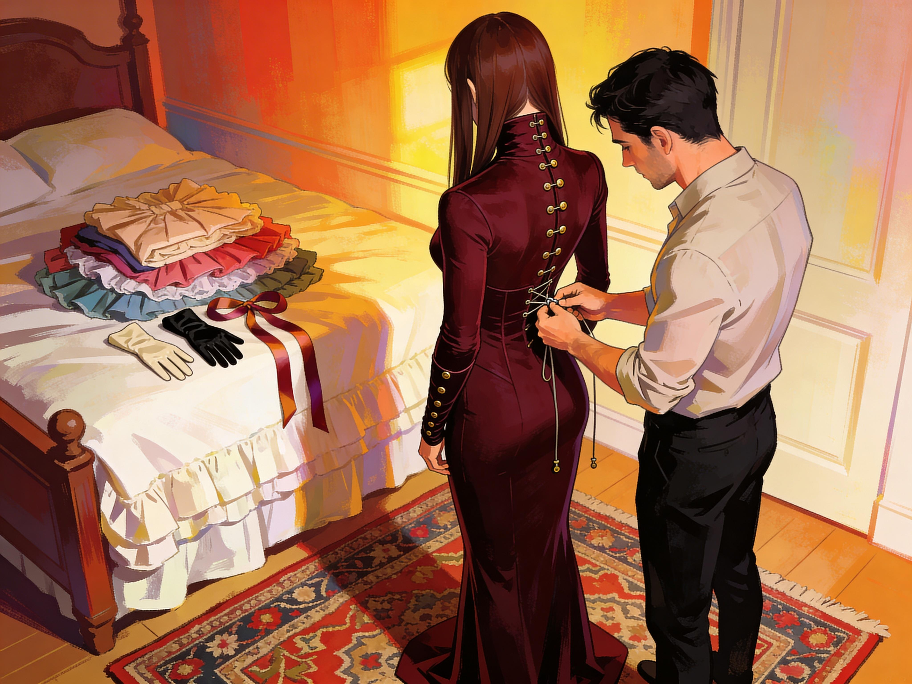

# Anna and Julien

While Sonia was in Shanghai, Anna's life narrowed and deepened around Julien.

It did not happen all at once. That was part of why it felt so natural. One morning became several. Breakfast became a habit. Being expected became a pleasure so steady she started waking a few minutes before the alarm, already warm with it.

One morning, she dressed with more care than usual because Julien had told her to come early.

Stockings first, clipped to a girdle. Then heels, enough height to alter her carriage without making the stairs impossible. The Yoyah Sheengzoh came next, drawn up and settled into place. A nude longline bra that sculpted her figure, the stiff collar of her blouse reminding her not to slouch and not to forget herself. She finished with a dark blue skirt, a cream hijab, gloves, soft makeup, well aware that she was making herself pleasant for him to look at.

That thought no longer embarrassed her; she was comfortable in that knowledge.

She let herself into his apartment with the key he had given her and paused just inside the door. Quiet. Early light. The apartment still held the trace of sleep and the faint smell of yesterday's coffee.

She went to his bedroom and stopped a respectful step from the bed.

"Sir," she said softly. "Good morning."

Julien woke without jolting. He had started doing that. The new order sat in him more comfortably now, but not carelessly. He looked at her, took in the outfit, the folded hands, the fact that she had come as asked, and his face changed in that way she had already learned to crave.

Approval first.
Then warmth.

"Good morning, Anna," he said. "Come here."

She stepped closer.

"Thank you for being prompt."

The words settled low in her body, less sharply than `good girl` did, but with the same direction.

"You are welcome, Sir."

His gaze moved over her once more, not greedily, simply with attention.

"You look very pretty."

That reached her even deeper. She lowered her eyes to contain the reaction and felt herself smile despite the effort.

"Thank you, Sir."

Julien sat up and rubbed one hand over his face.

"I am still getting used to this," he said, half to himself. "Having someone here. Expecting someone."

Anna lifted her head just enough to answer.

"I am glad to be expected, Sir."

He looked at her for a second longer than the sentence required.

"Yes," he said. "I think you are."

That, too, felt good.

"Go on," he said. "Make breakfast. Then come back."

"Yes, Sir."

In the kitchen she moved quickly and carefully, already knowing where he kept the pans, the eggs, the butter, the better coffee. She liked the practical intimacy of that knowledge. It made the space feel partially hers, though only through service.

She set the table, cooked, poured, arranged, then returned to wait for him in the posture her mother had once taught and the virus had restored to absolute importance: still, hands folded, shoulders open, gaze lowered, ready.

When Julien came out dressed for work, he stopped and looked at the table, then at her.

"Very nice," he said. "Serve."

She did.

The first days taught them both that he liked being looked after and that she liked being directed through the small domestic details that had once seemed beneath notice. Coffee poured for him at the right strength. Eggs set down hot. His bag placed by the door before he remembered to ask. Her body answered each successful anticipation with relief and readiness. The work was ordinary. The approval was not.

One morning, after tasting the eggs, Julien glanced at the second plate and then at her waiting posture.

"Are you going to stand there until I tell you to eat?"

Anna hesitated.

"If that is what you prefer, Sir."

Something softened in his expression, closer to care made firmer by authority than to pity.

"Bring the cushion," he said. "Kneel here."

Her pulse jumped.

"Yes, Sir."

She fetched it from where she had quietly begun leaving it near the dining table and placed it by his chair. Kneeling there felt at once humiliating and perfect. Her skirt settled around her legs, the underlayer and heels keeping her in a carefully limited posture even now. She folded her hands and waited.

Julien cut a piece of toast, added avocado, and held it toward her.

"Open."

She did.

The bite was small, simple, and almost impossibly intimate. She took it from his fingers, chewed, swallowed, and felt heat rise all through her.

Julien watched her closely.

"Well?"

"Very good, Sir."

He fed her again.

It became their habit after that, not every morning, but often enough that Anna started hoping for it the moment she laid the table. Julien was attentive in a way that made obedience easier to bear and therefore more dangerous. He remembered what she liked. He noticed if the coffee was too bitter for her, if the toast scratched, if she had a faint mark at her waist from yesterday's belt. He would tell her to kneel, then feed her carefully, then praise her for the meal she had made with her own hands.

The contradiction should have felt absurd.

Instead it made sense in the place inside her that had been taught to answer care with surrender.

At dinner he was less hurried, more settled. They fell into a second ritual there. Anna cooked. Julien tasted the first bite. If pleased, he said so. Sometimes he told her to sit. Sometimes to kneel. Once, after she served roast chicken with potatoes and thyme, he said "Good Girl" so softly it felt almost private, and the force of it made her grip the edge of the table to stay steady.

He noticed and put down his fork.

"Come here."

She crossed the room and stopped beside him.

"Look at me."

She did. It took effort now. The reward had a way of making her want to hide inside the posture it created.

"I don't say this to toy with you," he said. "Do you understand that?"

"Yes, Sir."

"Good. I say it because you do well, and because I like what it does to you."

There was nothing cruel in it. 
Anna breathed in carefully.

"I like what it does to me too, Sir."

Julien's mouth curved at one corner.

"I had gathered that."

Another evening, when the dishes were done and the apartment had fallen quiet around them, Anna knelt beside his chair with her hands on her lap and worked up the courage to ask for something she had been turning over in her mind for days.

"Sir."

"Yes?"

"May I ask a question?"

"You may."

She chose the words with care.

"Would it please you if I dressed more... seriously?"

Julien looked down at her.

"More seriously how?"

"Corsets," Anna said, then forced herself not to rush. "And some of the new blouses at Maylee Shufoo. The more structured ones. I have been thinking about them."

He was quiet for long enough to make her pulse climb.

"Have you," he said at last.

"Yes, Sir."

"For yourself?"

The question landed directly.

"For both of us, Sir."

Julien leaned back, considering her with an attention that made her feel as if he were adjusting something in her without touching her.

"Tell me why."

Anna swallowed.

"Because I think I would wear them well. Because I want to please you. Because I want..." She paused, hating the heat in her face and unable to stop it. "I want to be more fully what I am becoming."

Julien did not rescue her from the sentence. He made her stay in it.

"And what is that?"

Her voice came out softer.

"Yours, if that is acceptable to you, Sir."

The silence after that was not long, but it changed the room.

Julien set his glass down.

"All right," he said. "Go and have a proper fitting. Choose carefully. Then show me."

The relief was so immediate she nearly swayed with it.

"Thank you, Sir."

"And Anna."

"Yes, Sir?"

"Do not choose things that only look dramatic. Choose things that truly suit you."

She felt absurdly cherished by the practicality of that.

"I will, Sir."

Lily recognized her the moment she entered Maylee Shufoo.

"Anna. Back already."

"Yes."

Anna smiled despite herself.

"I am looking at corsets now."

Lily glanced once over Anna's current silhouette and nodded as if the decision had merely arrived on schedule.

"That follows."

She did not ask intrusive questions. That was one of the things Anna liked about her. Lily understood the pleasure of being arranged without pretending it was innocent or reducing it to a speech.

"Daywear, evening, or sleep?" Lily asked as she led Anna inward.

"Daywear first."

"For support or for effect?"

Anna thought of Julien's eyes on her, of the way praise had started reaching further into her body than thought could follow.

"Both."

"Sensibly answered."

Lily scanned her measurements, checked fit, and drew three options. One was soft enough for gradual wear. One was firmer and elegant. The last had shoulder shaping built into it and promised a more dramatic line than anything Anna had worn before.

"Try this one second," Lily said, setting the firmest aside for later. "You need to know the difference."

The first corset was serious but tolerable. It narrowed her, straightened her, made every breath more considered. Anna liked it at once.

That worried her.

Lily saw the look and gave a small nod.

"Yes," she said. "That is usually how it starts."

The second corset was the one that mattered.

Lily laced her in slowly, pausing whenever Anna needed to adjust, then tightened again. The pressure gathered around her waist and ribs with deliberate patience. Her shoulders drew back. Her lower spine curved. Her chest rose. By the time Lily tied the last knot, Anna could feel the whole architecture of the garment dictating how she would stand, turn, sit, bend, and ask for help.

She opened her eyes to the mirror and almost did not know herself.

The line was beautiful.
So was the loss of ease.

"Breathe," Lily said.

"I am."

"You are thinking about breathing. That is different."

Anna let out a small breath that made them both smile.

"It is tight."

"It should be. Correctly, not cruelly."

Lily moved around behind her and adjusted the shoulder structure.

"There. Better. This one wants a certain woman. If you fight it, it will exhaust you. If you cooperate, it becomes very persuasive."

That was true at once. Fighting the line of it made her feel trapped. Yielding to it made her feel arranged, finished, held.

Anna touched the front busk lightly.

"Julien will like this."

"I expect so."

Lily brought her one of the newer blouses afterward, a Gowbao Yoohoo in pale silk with a high reinforced collar and cuffs that were much too elaborate for independent dressing. The fabric was lovely. The cut was not kind.

"Arms," Lily said.

Anna obeyed.

The blouse went on over the corset in stages: sleeves guided into place, cuffs closed one knot after another, the back fastened for her, the collar secured last. By the time Lily finished, Anna's body belonged to a very narrow set of acceptable movements. She could stand beautifully. She could turn with care. She could not slump, tug, reach back, or free herself.

Her chin lifted slightly under the collar's guidance. Her gaze fell without needing to be told.

The result in the mirror was almost shocking.

Elegant.
Helpless.
Radiant.

Anna felt a pulse of shame at how much she liked that third part because of the second.

"Too much?" Lily asked.

"No," Anna said, then corrected herself into honesty. "Yes. But in a useful way."

Lily's expression softened into something almost approving.

"Exactly."

Anna turned as far as the blouse allowed and felt at once how much of the rest would require assistance. Dressing. Undressing. Bathroom logistics. Reaching dropped things. Endurance. Planning.

Julien's hands at her back in the morning.
Julien's hands at her throat in the evening, undoing the collar.

Her breath changed.

Lily noticed that too and had the decency not to comment.

"Take a few steps," she said.

Anna did. The corset held her, the blouse corrected her, the collar guided her head, and her underskirt finished the work below. Every part of her outfit now collaborated with every other part. Grace was no longer a preference; it was the only option.

She stopped before the mirror again.

"I cannot manage this alone."

"No," Lily said. "That is part of why it works."

Anna looked at herself for one more long moment.

The woman in the mirror would need help to dress. Help to undress. Help to endure long hours gracefully. She would receive that help from a man whose approval already went through her like heat.

The thought was so intimate it almost counted as a confession.

"I will take this one," she said.

Lily helped her out of the set slowly, which was an education of its own. Relief came in stages. So did disappointment.

By the time Anna carried the boxes home, she was flushed, sore, and impatient for evening in a way that made her feel younger and more womanly at once.

Julien opened the door before she could use her key.

His eyes went to the boxes, then to her face.

"That promising?"

"Yes, Sir."

He stepped aside to let her in.

"Show me after dinner."

Anna's whole body answered before her mouth could.

"Yes, Sir."

Dinner that night was almost impossible to get through with dignity. Julien noticed. Of course he noticed.

"You are distracted."

"Yes, Sir."

"Excited?"

There was no safe answer but the true one.

"Very, Sir."

His expression sharpened with pleasure.

"So am I. I am looking forward to what you have to show me."

Later, in the bedroom, he stood behind her while she opened the first box with careful fingers.

"Tell me what you chose," he said.

Anna lifted the corset out by its straps and turned enough for him to see it.

"A day corset, Sir. And a blouse to wear over it. The blouse cannot be managed alone."

Julien took the blouse from her hands, and inspected it with quiet interest.

"No," he said. "I don't think it can."

Anna looked at him through the mirror.

"Would you help me, Sir?"

He met her eyes there.

"Yes. Undress."

The word went through her like a command and a caress at once.

She obeyed, slower than usual because she wanted him to see what she was offering, and because the knowledge that he would soon be the one fastening her into something she could not escape had already begun to color every breath.

By the time she stood in her stockings and bra, Julien had gone very still.

He did not touch her at once. He looked first, openly and with concentration, as if the thing she was offering him deserved to be studied before it was handled. That alone made heat move low and slow through her.

"Come here," he said.

She crossed to him on careful feet.

Julien set the S-line corset around her waist and drew her hair forward over one shoulder.

"Hold still."

"Yes, Sir."

The busk closed first. Then the laces. Julien tightened them in stages, not roughly, but with the steady patience of a man adjusting something that mattered. Each pull changed her a little more. Her waist drew in. Her spine arched. Her shoulders opened. When he fastened the shoulder straps and settled them properly, her posture shifted again, less fit for work now, more obviously meant to be seen.

Anna watched it happen in the mirror and felt her breathing change with each correction.

"Too tight?" he asked.

"No, Sir."

He tested that answer with one more deliberate pull.

Her breath broke around a small sound she could not hide.

Julien's eyes lifted to hers in the glass.

"Still all right?"

"Yes, Sir."

His mouth moved slightly, not quite a smile.

"Good."

That one word alone was enough to leave her weak in the knees.

The underskirt came next. Julien gathered the dress up enough for her to step into it, then fastened it under the corseted waist himself. The moment it settled into place, she felt the familiar narrowing at her thighs and knees, the limit laid on every future step she would take in it.

"Again," he said softly. "Step."

She tried one careful pace and felt the constraint answer at once.

"Very good," he said.

The dress was worse in the best possible way.

*Julien buttoned Anna's dress slowly from behind.*

It was darker than the blouse she had tried at the shop, more severe, cut to work with the corset rather than soften it. Julien held it open for her and guided her arms into place, then drew it up over the corset with a patience that made the whole thing feel ceremonial. Once the fabric settled, he moved behind her and began fastening the long back closure.

Button by button.

Then the sleeves, each row closed at her wrists by fingers that were not hers.

The high collar came last.

When he secured it, her chin lifted a little and her gaze fell without permission. Her body accepted the new limits at once. She could feel how little freedom remained in her neck, shoulders, and arms. She would not reach easily in this. She would not undress herself. She would not do much of anything carelessly.

Julien knelt to fasten her heels.

That almost undid her.

The whole sequence had been too intimate already, but this made the helplessness plain. She stood there while he settled the straps around her ankles, the dress and corset holding her upright for inspection, for display, for care.

When he rose, Anna barely recognized the woman in the mirror.

The S-line corset pushed her forward into a posture that was equal parts invitation and restraint. The shoulder straps held her open. The collar made her look composed even while it denied her ordinary movement. The back-buttoned dress closed her in. The underskirt made any natural stride impossible. The heels tipped her weight just enough to turn stillness into a pose.

This was not for work.

This was to be looked at in.

And helped in.

Her face grew warm.

"Turn for me," Julien said.

She obeyed as best she could, discovering the dress in the act of moving through it. It took several small, managed steps to do what would once have been one easy pivot. By the time she faced him again, his gaze was fixed on her with a kind of quiet hunger that made her pulse jump.

"Beautiful," he said.

The praise went through her so hard she had to steady herself on the dressing table.

"Thank you, Sir."

He stepped closer and touched the side of her waist, then the line of the sleeve, then the fall of the skirt over her hips, small proprietary adjustments that made it impossible to pretend she had dressed for herself alone.

"Can you manage alone in that?" he asked.

Anna looked at herself in the mirror and answered honestly.

"Not well, Sir."

"Tell me."

The directness of it made her swallow.

"I can stand. Walk slowly. Sit with care, if I am helped. I cannot dress myself. I cannot undress myself. I will need help with the buttons, the collar, and anything I drop. Quite a lot, really."

Julien absorbed that with visible satisfaction, but not cruelty.

"Then you will ask when you need help."

That simple permission made pleasure tighten through her again.

"Yes, Sir."

He kept his hand at her waist, warm and steady.

"This is not a practical dress."

"No, Sir."

"This is something to be displayed in."

"Yes, Sir."

His thumb moved once against the fabric.

"And looked after in."

The sentence struck even deeper than the praise had. Her arousal sharpened at once, threaded through with relief so intense it nearly felt like gratitude. That was the truth of it. If she had been left alone in this, it would have become ordeal. With him there, fastening her into it and promising himself as the answer to everything it took away, it became something else entirely.

Something warmer.

Something frighteningly sweet.

"I like that, Sir," she said.

Julien watched her through the mirror.

"I know."

"Walk to me."

She obeyed, crossing the room in the tiny managed steps the dress demanded. By the time she reached him, the helplessness of the outfit had become a physical fact she could not ignore. He was the one who had put her into it. He would be the one to let her out again. In between, her body would have to move through the world on the terms he had helped impose.

And both of them liked that.

Julien took one of her gloved hands and raised it to his mouth.

"Good girl," he said softly.

The reward shivered through her from throat to thighs. Her breath caught. Her knees weakened. If he had not still been holding her hand and watching her with that calm, caretaking attention, the dress might have frightened her.

Instead it made her ache.

"You feel it," he said.

"Yes, Sir."

"Say it."

Her face burned, but she obeyed.

"I need help in this."

"Yes."

His thumb moved once over her knuckles.

"And you like needing it from me."

There was no room left for evasion.

"Yes, Sir."

Julien drew her a little closer.

"Good."

That word carried praise, possession, permission, and care in proportions she could no longer separate. Anna stood before him in the impossible dress, unable to free herself from it, unable to move naturally in it, and so aroused by the combination of display and dependence that she could barely think straight.

The worst part was how safe it felt.

Or perhaps that was the best part.
