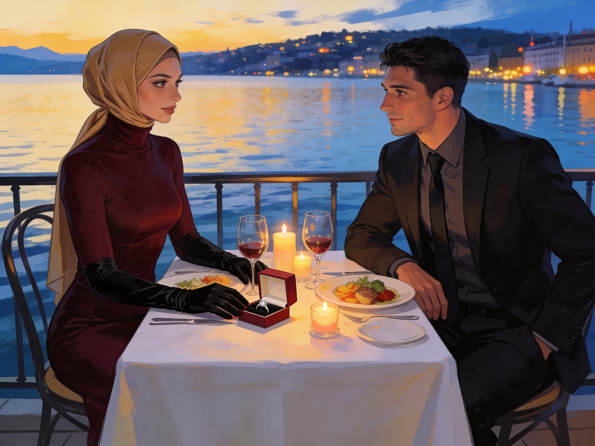

# Lakeside Proposal

Julien chose the Lakeside Cafe for Saturday dinner.

Anna understood the choice at once and did not ask about it. The place carried several meanings now. It was where Sonia had tried to drag her backward by force and failed. It was where Changed Geneva liked to display itself in polished glass and careful posture. It was also simply beautiful at dusk, which made everything worse.

She dressed with unusual care.

The corset first, because it now had to go on before the rest and because she still felt a strange thrill each time she chose it willingly. It tightened her into the line Lily had promised, waist drawn in, shoulders encouraged back, lower spine curved. Over that came the Gowbao Yoohoo blouse, all pale silk and patient cruelty. The collar fixed her head in its flattering compromise: chin lifted enough for dignity, gaze lowered enough for obedience. Her skirt followed, with the hidden underlayer that kept her steps short and exact. Gloves. Shoes. Hijab pinned smooth.

By the time she was ready, her body had become an elegant request for assistance.

Julien met her outside. His eyes moved over her once, carefully, and then returned to her face.

"Very nice," he said.

The words sank into her at once.

"Thank you, Sir."

He offered his arm. She took it and enjoyed the contact through the cloth of her gloves.

The walk from the tram stop to the cafe was short, but the clothes made her work even for short distances. She had to watch the pavement, manage the steps, keep her posture, accept his steadying hand when the curb came too quickly. None of it was theatrical. That was what made it intimate. Her dependence no longer lived in theory. It lived in curbs, chair backs, doorframes, and the pressure of a hand at her elbow.

Inside, the room was all low light, lake reflections, glass, and soft conversation. People noticed them properly rather than rudely: a well-dressed pair, a woman arranged with obvious care and a man attentive enough to deserve her polish.

Julien guided her to the table more slowly than usual because he knew what the blouse and corset changed. When he pulled out her chair, she had to turn, gather her skirt, back carefully into position, and lower herself in stages. The corset decided how far she could bend. The collar corrected every attempt to look down too much. The underlayer kept her knees together and her footing precise. By the time she was seated, she was upright, composed, and only a little trapped.

Julien's hand came down briefly to settle the fall of her skirt over her knees.

That simple, competent touch made her flush.

"Comfortable?" he asked.

She nearly laughed at the question and did not dare.

"I am well, Sir."

He took the answer for what it was.

Julien ordered for both of them. He did it without asking, but not carelessly. He knew what she liked. Fish instead of beef. The white wine she would not have chosen in public anymore but still enjoyed if he decided on it. Dessert, because he knew she would want it and pretend not to.

Being known that way felt almost extravagant.

Dinner unfolded slowly. Julien spoke more than she did, but not to dominate the room. He had begun to like explaining things to her, checking her reactions, making sure she followed the shape of his thoughts. Work. The city. The strange calm settling over people. The way routines were changing faster than anyone would admit. When he asked her a question, she answered. When he did not, she let the silence sit between them without trying to rescue it. The clothes helped with that too. They made stillness easier to hold.

More than once she caught him watching not just her face, but the effects of the outfit on the rest of her: the way she had to lift a gloved hand carefully to drink, the way the blouse guided her chin, the way every movement had become measured by design.

She wanted him to watch. By now she was able to admit that to herself, was comfortable with her new look and her new role.

By dessert the lake beyond the windows had gone silver-blue. Candlelight reflected in the glass. The room had not emptied, but it seemed to recede. Anna felt exposed and private at once, a sensation the outfit seemed built to produce.

Julien set down his fork.

"Anna."

The use of her first name without the "Miss" caught her attention more sharply than any formal preface could have.

"Yes, Sir?"

He looked at her directly, and for once she did not drop her eyes at once.

"This last week has been very strange."

"Yes, Sir."

His mouth moved, almost a smile.

"You have made it easier to bear."

The sentence entered her body like warmth.

He reached across the table and turned one of her gloved hands palm-up under his. The touch was almost formal. It still made her heart kick.

"When I was ill," he said, "I woke into a world that expected things of me before I understood the rules. You were the first part of it that felt ordered instead of absurd."

Anna held her breath.

"You were kind to me before either of us knew what we were becoming. You have been patient with me while I learned how to stand in the place this world now gives me. And I find that I do not want a future in which you are not part of my household."

Household.

The word landed with quiet force.

"Sir..." she began, and stopped, because too many feelings pressed at once against her.

Julien did not let her pull away into generality.

"I want to ask your father for permission to take responsibility for you," he said. "To become your guardian in due course. I want you under my care. Openly. Properly."

The words were calm. The structure inside them was not.

Guardian. Responsibility. Under my care. Properly.

Each one struck against the changed parts of her until pleasure and fear became almost impossible to separate.

For one clear second she saw the shape of it with clarity. She would be his, through care, ritual, approval, legal transfer, and the promise that being possessed would feel like safety with him.

She looked at Julien and saw not an abstract system but the man who had fed her, steadied her, remembered her preferences, watched her struggle in difficult clothes without mocking her for it, and taken obvious satisfaction in making room for her in his life.

She had to make a choice, and she welcomed it.

"If I say yes," she said quietly, "I will belong to you."

"Yes."

"And you will ask my father to give me to you."

"Yes."

She wanted him.\
She liked being cared for by him.\
She liked belonging somewhere.\
She liked what his approval did to her.\
She liked the future he was naming.

She answered, and it was not even a decision, but simple alignment.

"Yes, Sir."

Julien closed his eyes briefly, as if relief itself had weight. When he opened them again, something in him had settled into commitment rather than triumph.

"Thank you, Anna."

He lifted her gloved hand and pressed his lips to the fabric above her knuckles. The gesture was old-fashioned enough to be almost absurd. Instead it sent a clean bolt of want through her.

"Good girl," he said softly.

The reward that followed was so fierce she had to bite the inside of her cheek to keep from making a sound in the middle of the cafe. Obedience is pleasure, she remembered her mother explaining, and under the table her thighs pressed together helplessly around the literal truth of it.

Julien saw it. His eyes sharpened, then softened again.

"Steady," he murmured.

The care in it only made the sensation spread.

When the meal was done, he rose and came around to help her up. One hand at her elbow, one waiting in case the chair, skirt, corset, and collar conspired against her balance. She leaned into the help because refusing it would have been both foolish and dishonest.

Outside, the air off the lake was cool.

Julien settled her on his arm again and covered her gloved hand with his own for a moment before guiding her toward the car.

The city had not changed further in the last hour. The same lights burned. The same women crossed the pavement in disciplined skirts. The same men opened doors, guided elbows, chose restaurant tables, set the pace of shared movement.

What had changed were the terms on which this world meant to keep her.

And she was not sorry.
