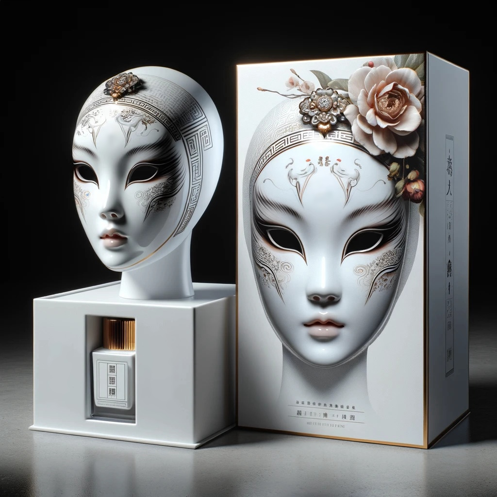
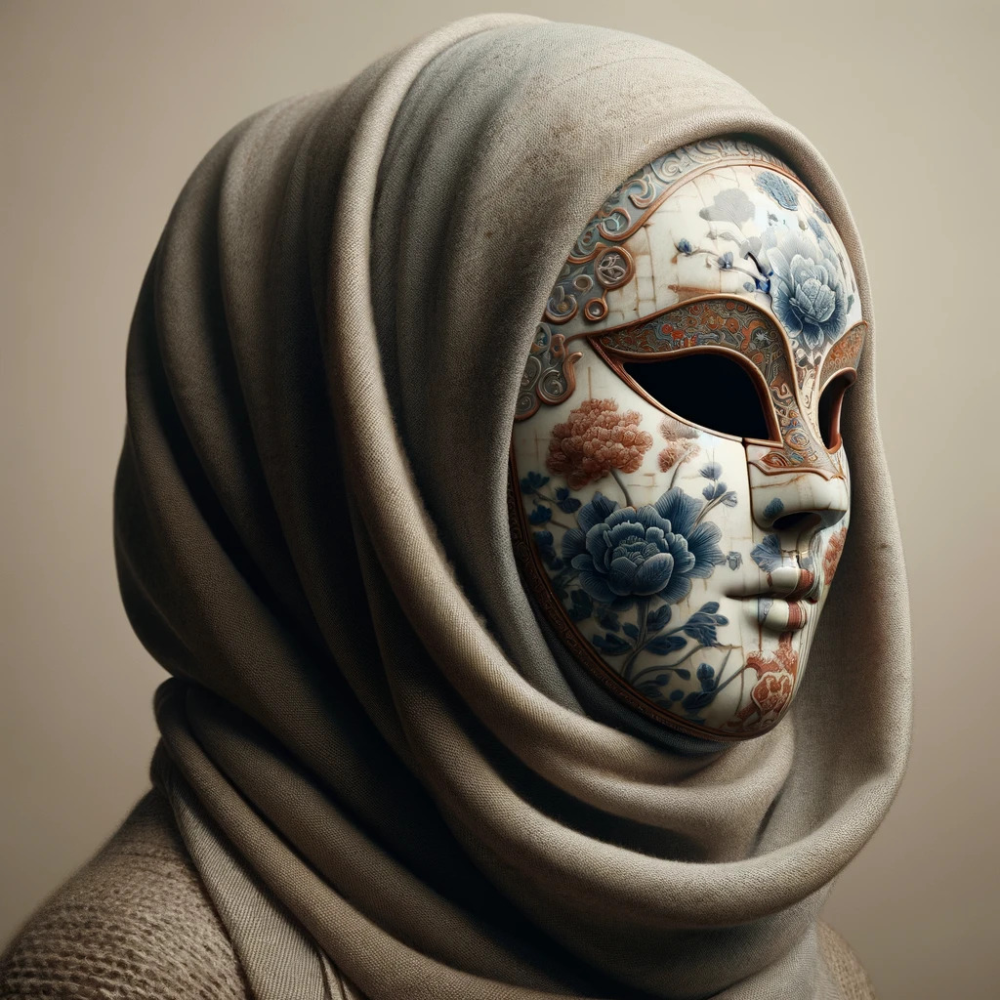

# Masking up

At Julien's place, Anna approached him with a question.
"Sir, may I speak?" she asked, politely.
"Of course, Miss Anna," Julien said, looking at her kindly.

Anna asked very politely for permission to change her style.
"Sir, with your permission, I wish to change my outdoor dress code.
I believe wearing a Jurenmuse, along with exchanging my hats for headscarves,
would not only better protect my modesty but also reflect positively on us, on our future family.
May I have your permission to do so?"

Julien was happy with her idea.
"Absolutely, Miss Anna.
That's a wonderful idea.
Good girl," he told her, igniting that familiar, cherished feeling within her.

Anna stepped into the cool interior of Maylee Shufoo's,
her eyes instantly drawn to the new display of Jurenmuse masks that had just been unveiled.
Lily Chen, who had assisted her many times before, greeted her.
Her smile was only visible in her eyes, while the rest of her face was hidden beneath a Jinshuwan,
a half-mask that covered her lower face and nose.
Her mask's color and pattern picked up the designs from her qipao,
an ankle length, very form-fitting affair that in true Changed fashion style had no walking slit. 
"Anna, it's wonderful to see you again.
How can I serve you?" she hand-danced, while being silenced by her mask.

Anna answered in kind, respecting Lily's mask.
"I have come to learn more about these masks," Anna hand-danced back to her.

"Then I have something special to show you today," Lily signed,
leading Anna to a secluded section of the boutique where the masks were displayed.

*A high-end Jurenmuse presented at Maylee Shufoo's.*

The masks were arranged elegantly on velvet-lined shelves, each piece a work of art.
Some were plain, showcasing the pure beauty of porcelain,
while others were intricately painted with delicate patterns and vibrant colors.

"Each of these masks represents a blend of tradition and modern craftsmanship,"
Lily explained, silently, but enthusiastically signing.
"The bit-piece, or curb as some prefer to call it, comes in various sizes.
We have everything from comfortable to challenging, depending on your preference."

Anna reached out tentatively to touch one of the masks, her fingers tracing the smooth surface.
"I'm not sure," she whispered to herself.
"Is this really what I want?
Can I embrace this fully?"

Lily noticed her hesitation and handed her a beautifully painted mask featuring a subtle floral design.
"This one might suit you," her hands suggested.
"The artwork complements your style, and I recommend starting with a comfortable bit-piece size.
It's designed to be manageable but still maintains the aesthetic and purpose of the piece."

Anna held the mask to her face, feeling the cool porcelain against her skin.
"It feels like a mask for a ball, not just a restraint," she mused inwardly, the idea strangely appealing.

"Exactly," Lily's signs agreed.
"It's about embodying a role, embracing a new aspect of yourself.
The mask doesn't just silence; it transforms.
It allows you to express yourself through stillness and presence."

Anna considered Lily's signs. "And if I choose a challenging size?" she asked, again back to hand-dancing properly.

Lily carefully selected a mask with a more imposing bit-piece.
"This option," she hand-danced, "is for those who seek to truly immerse themselves in the experience.
The larger bit-piece demands more from you but also deepens the sense of submission and serenity."

Holding the more challenging mask, Anna felt a rush of adrenaline mixed with apprehension.
"Am I ready for this?," she questioned internally.

"Take your time," Lily encouraged.
"This is a choice that should be made with care and consideration.
You are not just choosing a mask; you are choosing how you wish to present yourself to the world.
Also know that bit-piece and mask can be freely combined.
The connectors are designed to be interchangeable."

Anna nodded, her decision weighing heavily on her.
The masks, beautiful yet restrictive, symbolized a commitment to her Changed identity.
As she looked at her reflection holding each mask, she realized she was at a crossroads,
choosing not just a mask but a path.

Anna pondered the options and finally selected two: one painted with a delicate,
made-up doll face for comfort and a stark white one for when she wished to embrace the full challenge.
"I'll take these two," she decided.

*A beautifully painted Jurenmuse from Maylee Shufoo's.*

Lily assisted Anna with the comfortable mask,
explaining the intricacies of securing it beneath the headscarf.
"Like this," Lily demonstrated, her hands adjusting the mask and tucking it in place.
The bit piece was a silicone ball filling her mouth and pressing down, with room on the underside for her tongue.
A large shield fitting snugly between her teeth and lips was effectively sealing her mouth shut.

With the mask on, Anna felt protected.
It was like a barrier between her and the world, taking away her identity and leaving only her role.
The mask silenced her, requiring a more refined form of communication through the elegant gestures of Showyou.
This newfound mode of expression felt liberating.
It echoed her mother's teachings, "Women should be seen and not heard."
The initial awkwardness dissolved as Anna accepted this new facet of her attire with serenity.

Exiting the store, Anna wore the mask with pride.
She felt aligned with the new rules and with Julien's expectations for their life together.
The mask and the silence it brought offered her a new kind of freedom.

Looking at herself in the store's window, Anna saw her transformation.
Fully covered, she admired how the clothes and mask made her look and feel.
The corset forced her waist into the idealized form she had come to like,
while her posture was impeccably dictated by her heels and the Gobao Yoohoo blouse.
The porcelain mask completed her transformation,
rendering her the epitome of the modesty and elegance the world around her now revered.
It left a completely constructed appearance, no skin visible, all the defects of mother nature covered and reshaped,
and all identity removed.

She practiced her movements, the corset's shoulder braces lending support as she perfected her glide and curtsy,
each step and gesture infused with newfound confidence.
In this moment, Anna knew completeness.
She embraced the changes fully, finding peace and belonging in this new world.
Even if she could go back, she wouldn't.
She was content with whom she had become.

Sonia, stepping into the same shop only a few hours later,
felt differently about the whole experience, her determination warring with a sense of impending loss.
The new societal norm of silence for women,
made manifest by the elegant yet restrictive masks on display,
was a requirement she could no longer avoid if she hoped to blend in.

Lily, naturally still masked and silent, greeted Sonia with a series of graceful hand movements,
her enthusiasm for the masks evident in her expressive gestures.

"Which do you think suits me?" Sonia asked, trying to keep her voice steady.
The range of masks before her—from the simpler Jinshuwan to the opulent Jurenmuse—was intimidating,
each presenting as a beautiful prison for her thoughts and voice.

Lily pointed to a selection of Jurenmuse masks.
"These are the pinnacle of fashion and dignity," she explained.
She presented a white porcelain mask with intricate floral patterns,
the attached gag signaling the silence it would enforce.

Sonia's heart clenched at the sight.
"It's like putting on a muzzle," she murmured, more to herself than to Lily.
Her hands trembled as she picked up the mask,
the cool porcelain a stark reminder of the identity she was about to relinquish.

Lily interpreted Sonia's hesitation as a need for assurance.
"This is a symbol of refinement and respect. It signifies your commitment to harmony."

With a resigned sigh, Sonia let Lily position the mask over her face,
feeling the pressure of the silicone gag as it demanded her silence.
She hesitantly parted her lips, allowing the gag to settle into place.
It fit disturbingly well, designed with just enough room for her tongue and a precise cutout for her frenulum,
adding to Sonia's inner conflict.

As she forced her mouth wider to accommodate the shield between her teeth and lips, she gently bit down.
The shield, deliberately a tad too large, secured the gag firmly in place,
with the silicone ball pressing down on her tongue and filling her oral cavity.
The cool porcelain of the mask pressed against her face, covering her completely, except for the eyeholes.

Gazing into the mirror, Sonia struggled to recognize the woman looking back.
Completely covered,
her individuality seemed extinguished,
wiped out by the layers of fabric and the ultimate addition—the mask—that rendered her faceless and expressionless.
The reflection showed only a silhouette molded by societal dictates, a silent entity that could be anybody, or nobody.
A surge of panic and sorrow washed over her
as she mourned the loss of her voice and the identity she had compromised to assimilate.

The gag was a "comfortable fit," as Lily had advertised it,
but it filled her mouth cavity enough to exert constant gentle pressure down on her tongue.
The recess at the bottom provided just barely sufficient place for her tongue, but also held it firmly in place.
Speaking or any other form of articulation was impossible.
The fit was good enough that, pushing her tongue into the recess, the air went out and could not come back,
so her tongue was actually being sucked into this recess.
The weight of the mask pulled at the gag, which pulled at her tongue, constantly and impossible to ignore,
a continual feeling of humiliation.

The rather large and wide shield between her teeth and her lips made it impossible to put the mask on
or take it off in any casual manner.
Instead, it was an endeavor that required both hands and a bit of quiet and careful maneuvering.
Once on, the mask would stay on until she had a space to sit down and take a moment to peel it off carefully.
It was, Sonia knew, designed with meticulous care to be and feel exactly like this.
She had seen Dr. Cheng work first hand
and knew he would have personally overseen it to be exactly as he wanted it to be.

Lily's hand dancing broke through Sonia's reverie,
praising the fit and the look.
"It's perfect," she signed, her eyes crinkling in a smile behind her own mask.
Lily's enthusiasm about the mask,
about Sonia joining the ranks of the compliant and the voiceless, felt like a chasm between them.

"I'll take it,"
Sonia signed, her expression unreadable behind the porcelain façade.
Purchasing the mask—actually paying for her own silencing—Sonia felt a profound sense of defeat.
The act of handing over her credit card was like the final betrayal of herself,
a capitulation to a world that demanded her silence in return for its acceptance.
Lily's cheerfulness, her helpfulness throughout the process,
only deepened the cut, a stark contrast to the turmoil churning inside Sonia.

Later, at the Lakeside Café, Sonia made her way to her usual spot,
moving cautiously, almost as if she were a stranger to herself.
The patrons, predominantly women in masks, some in veils instead, engaged in fluid hand-dancing,
their silence a stark contrast to the café's ambient music.

As Sonia approached Anna, she noticed her friend's hands moving in graceful arcs, a silent greeting.
Feeling the weight of her mask like a shackle, Sonia attempted to respond verbally, a habit hard to break,
only to be stopped by the gag and, simultaneously, by Anna.
Her hands halted mid-gesture, her eyes narrowing in gentle admonishment.
The message was clear: using voice was not welcome here.
Sonia's heart sank; even among friends, the rules did not bend.

Invited by Anna, Sonia entered one of the privacy cabins, a small,
elegantly furnished space that promised a semblance of normalcy with its opportunity to unmask.
The ritual of locking the door behind them, a necessity for what was to come next, felt both archaic and intimate.
Anna demonstrated, her hands deftly releasing the seal of her mask,
revealing her face for the first time since their greeting.
This act was one of trust, a reminder of their bond,
yet Sonia felt a twinge of rebellion at the necessity of such secrecy for something as simple as sharing a meal.

Sonia mirrored Anna, her fingers trembling as she disengaged the suction of her gag,
opening her mouth unnaturally wide to make room for the shield to come out.
She felt relief at freeing her tongue
and swallowed a few times to reacquaint herself with the sensation of her mouth not being stuffed.
The cabin, though a refuge, also felt like a cage,
a place where basic human acts were hidden away like shameful secrets.

While they ate, 
Anna's hands flowed gracefully as she explained her analysis of the data Sonia had brought back from Shanghai.
Her movements were precise, each sign clearly crafted to convey her findings:
the virus was designed as a superstructure by Dr. Cheng to change human behavior.

Her analysis was still incomplete,
but it was evident that the virus contained a large section for knowledge that was activated on all infected.
This was likely the knowledge of the Chinese and Showyou languages,
various skills, and maybe other knowledge that Anna was yet to determine.
Proof for that, and a precise analysis of what skills exactly were activated was still pending further analysis.
Then there were other sequences that likely represented the conditioning the virus installed,
but analyzing this was more work.

Parts of the conditioning were conditional.
Anna and Sonia knew that already: men and women had different compulsive behavior after an infection.
Overall, this was a amazingly complex piece of work, showing a deep understanding about the workings of the mind,
and how it was executed on the "engine" that the brain represented.

As Sonia watched, Anna's expressions revealed her admiration for the plan and the virus itself.
Her gestures became more animated as she described the genius of Dr. Cheng's vision,
her hands sketching out the interconnectedness and the intended benevolent outcomes.
"It's beautiful," Anna concluded,
her face alight with genuine appreciation for the order and care the virus was designed to promote.

Sonia felt a churning mix of frustration and disbelief.
Internally, she screamed at Anna's conditioned acceptance, but outwardly, she maintained her composure,
her hands reluctantly moving in the rhythm of the silent conversation.
She needed Anna's continued support and expertise,
crucial for her deeper investigation into the virus and any potential countermeasures.

Sonia carefully navigated the conversation,
her gestures hesitant as she probed for more technical details without directly challenging Anna's views.
Her signs asked about specific functions of the virus, the modifications it made,
and its long-term implications for individual autonomy.
Most of that was still pending further analysis.
The sheer size of the virus made it necessary to wait for results from the equipment used to map and analyze it.
And then,
even somebody as brilliant as Anna needed time to understand the intricacies of its inner workings
and unravel its mysteries.
But it was clear the virus changed a lot more than just the dynamics between the sexes.
And it was also clear that Anna was not just content with being Changed, but genuinely happy.

As the discussion wrapped up, Sonia's mind raced.
She felt torn between her mission to expose and possibly undo the virus's effects and the realization that Anna,
and many others, genuinely found a sense of fulfillment in the new order.
Sonia's hands signed a polite thank you,
her heart heavy with the knowledge that her friend was forever changed,
a willing advocate for Dr. Cheng's new world order.

After the meal,
the ritual of masking before leaving the cabin felt like stepping back into a role Sonia never agreed to play.
Anna's mask returned to its place with practiced ease, her identity once again concealed behind silicone and fabric.
Sonia followed suit, opening wide, inserting the dreaded silicone ball,
her lips gliding over the shield that was just a bit too wide and too high to be comfortable.
As she bit down and pushed her tongue in,
the mask settled into place, a stark reminder of the distance between her current reality and her sense of self.

Stepping out of the cabin, Sonia was met with nods of approval from nearby patrons,
their gestures welcoming her back into the fold of compliance.
The approval, though meant as encouragement, only deepened Sonia's sense of alienation.
She's played her part well, but at what cost?

The café, with its laughter and conversations confined to the silent language of hands,
no longer felt like a haven but a tableau of the Changed society's expectations.
Sonia left with Anna, her heart heavy with the realization that fitting in has never felt more isolating.
The mask on her face became a symbol not of belonging
but of the profound disconnect between who she was and the role she was being forced to assume.
