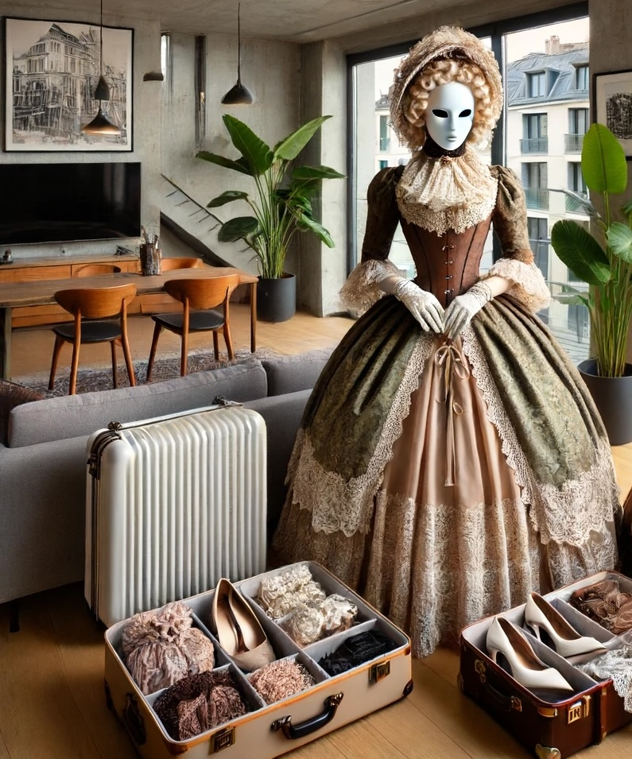

# Anna and Julien's departure for London

As Anna and Julien prepared to embark on their "taking possession" journey to Britain,
Anna was buzzing with excitement about exploring the unique fashion and cultural nuances of Changed Britain.
She had thoroughly researched the adaptations made in response to the region's changing climate.

*Anna standing amidst the luggage in their Geneva home.*

Standing amidst their luggage in their Geneva home, Anna animatedly gestured to Julien.
Her hands moved gracefully in the air, conveying her enthusiasm.
Her fingers danced as she explained the distinctive elements of British Changed fashion.
"I am looking forward to experimenting with British fashion, sir," she signed,
her eyes sparkling with excitement, "Latex catsuits with integrated hoods to shield against the frequent rain.
And capes!
Latex walking skirts!"
Julien watched her with an amused smile, nodding as he followed her descriptions.

"They also have a fascination with visible restraints," Julien added with a smile.
"Arm binders integrated into capes, and muffs that lock around the waist, securing the hands when needed.
You will look splendid in this."

Anna was glad she wore the mask, otherwise, she might have stuck out her tongue at him,
which would have earned her a correction.
Instead, she signed with a flourish, "And the hats, Edwardian styles,
fastened with wide ribbons and adorned with layers of face veils.
It's both protective and incredibly chic."
Her hands painted an image in the air, capturing the elegance and complexity of the attire.

Julien pointed at the travel guide.
"And, for decency and protection, chastity belts are commonly worn," he stated.
As they made their way to the Eurostar station, Anna's gestures continued, her excitement barely contained.
Julien,
fully absorbed by her enthusiasm and the detailed description of their destination's customs,
felt a growing anticipation for the experiences that awaited them.
He appreciated how these cultural insights excited Anna
and was intrigued by how these practices would be woven into the fabric of their honeymoon experience.

Together, they boarded the Eurostar, ready to dive into the rich tapestry of British Changed culture,
exploring both the physical and social landscapes that would add depth and texture to their new life together.
Anna's enthusiasm was infectious,
and Julien found himself looking forward to discovering these unique fashion elements firsthand,
seeing Anna embrace and perhaps even adopt some of these styles during their stay.

Julien had booked first-plus seats for them, a small desk for two,
the size of the usual first-class group seating for four,
and marked it as one male, one female seat in the reservation.
As they made their way to their seats,
he found a comfortable fauteuil-style seat for himself and a cushioned kneeling pad
next to it that provided various attachment points for Anna
so that he could leave her safely unattended by British standards.
It included a lockable belt, attachment points for corsets, and optional heel clamps for complete immobilization.
He guided Anna to her seat and secured her with the belt provided, pocketing the key.
He then proceeded to stow their luggage
and adjusted the information display
so that Anna could conveniently see it without straining against her Gobao Yoohoo collar.

As the train sped towards Paris,
covering the 550 km distance in just three hours,
Anna and Julien settled into their journey with comfort and ease facilitated by the high-speed service.
They would be changing trains in Paris for the continuing leg to London,
and appreciated the efficiency of travel, twice as fast as and way more convenient than by car.

Julien took a moment to review the information brochure which outlined the responsibilities of a Guardian during travel.
It reminded him that he must keep Anna locked or escorted at all times while on board.
He had already secured Anna to her seat with a lockable belt around her corseted waist.

Anna's travel dress was a practical yet elegant charcoal dress with a Yoyah Sheengzoh underneath.
The underskirt restricted her adequately with its knee-binding design.
The stiff collar of her blouse worked together with her corset to ensure her posture remained upright, facing forward,
but Julien was attentive to her needs and watched for any signs she might give.

Anna wore a Jinshuwan half-mask, less obtrusive than her usual full coverage,
and normally had a wide-brimmed hat pinned neatly to her hair,
which was styled in a braided knot at the back of her head.
She opted to remove the hat here inside the train
and had put it neatly on the hook provided for that purpose next to her.
Then she folded her hands, covered in cream-colored gloves, in her lap
and, for the moment, followed the information shown on the display in front of her.

Julien pointed out a feature
integrated into her seat—a docking adapter
meant for use with the full chastity belts that were popular with many British women.
It would handle waste elimination without the need to navigate the complexities of her attire in a train restroom.
Though Anna was skeptical of such an apparatus, she recognized its utility,
especially given the British inclination for elaborate dresses and visible restraints.

While the practicality of the feature intrigued her,
Anna was hesitant to discuss or inquire further about it in the public setting of the train,
wary of others catching her signing.
Instead, her thoughts drifted to what awaited them in London.
In the privacy of their hotel room, Julien would take full possession of her,
a moment she both anticipated and fantasized about.
The idea stirred a mix of excitement and nervousness within her,
as she imagined the deeper submission and intimacy that would mark their new life together.

Julien, aware of her quiet contemplation, gave her hand a reassuring squeeze.
They shared a moment of connection, unspoken yet profound, as the landscapes outside blurred by.
Anna leaned into the security that Julien's presence provided,
her heart filled with both anticipation and trust in him as her guardian and partner.
