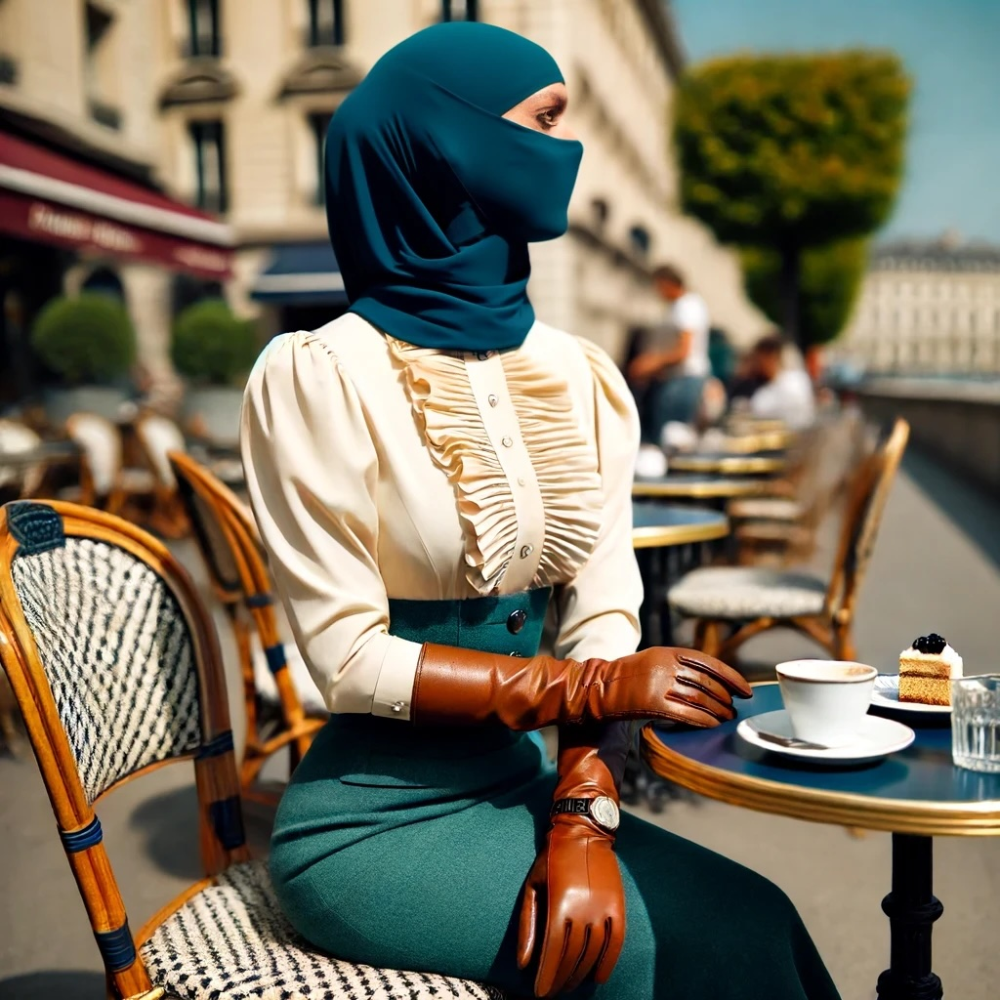

# A Photography Project

While Anna and Julien were making their way to London, Sonia met Henry for lunch at the quaint café "Les Petits Chats",
tucked away at street level in a serene corner building not far from GAIA.
She was seated outside at a small french table, in the shade of a street tree.

*Sonia waits for Henry at the "Les Petits Chats."*

Her attire for the day was a perfect blend of Changed aesthetics and everyday practicality:
a teal pencil skirt that ended below her knees and a tailored waist, 
creating a sharp silhouette against the soft fabric of her cream blouse.
She wore long, form-fitting leather gloves that reached her elbows, a necessary complement to her ensemble,
and her face was hidden behind that delicate mask covered in lace she had ordered to measure recently,
as she rather liked the deviation from the usual smooth dollface porcelain look that currently was so popular.

By the time Henry arrived, she had already eaten.
Since the café did not have privacy boxes, she had donned a niqab after releasing her mask,
passing small bites under her veil elegantly with gloved hands.
Having finished eating, she had put on the mask again.
Even now she still had to handle the front shield of the silencing gag with some effort.
She was working it carefully behind her lips and in front of the teeth, then biting down,
adjusting the fit of the mask for proper vision.

Just as she finished, adjusting to the gentle pressure of the gag filling her mouth, 
Henry arrived.
He wore a tailored suit that he filled out in all the right ways.
He greeted Sonia, who rose and curtsied for him, and seated her again.
As they settled into the conversation, the topic quickly turned to Henry's passion—fashion as an art form.

"Fashion, particularly the kind we cherish, is meant to be worn and not to be kept on mannequins or in chests, Sonia.
It's an art that only truly comes alive when it interacts with people,"
Henry explained earnestly, his eyes alight with enthusiasm.
"This is especially true for restricting fashion, which is designed to alter movement and posture,
to evoke a sense of helplessness and interdependence."

Sonia listened intently, her hands folded neatly on her lap,
occasionally moving in a dance of subtle gestures that conveyed her engagement in the conversation.

"I've been considering a project," Henry continued,
his voice low but filled with a persuasive edge, "to photograph some pieces from my collection.
High-fashion, very artsy setups.
I was wondering if you'd be interested in modeling for it.
There's potential for an exhibition in a gallery afterward."

The idea stirred a mix of excitement and apprehension within Sonia.
To be bound by Henry in such an artistic endeavor required a deep level of trust,
especially given the nature of the garments that would restrict and define her every posture.
Moreover, the thought of being publicized as a model in an exhibition added another layer of vulnerability.

Henry seemed to sense her hesitation.
"I understand it's a big step, especially considering how the dresses are designed to emphasize dependency.
But I assure you, every precaution will be taken, and your comfort will be the top priority at every stage."

Sonia took a moment, her eyes hidden behind her mask, reflecting on the challenge before her.
The thrill of participating in something so unique,
so aligned with her own explorations of self within the confines of Changed society, slowly overcame her initial fears.

"You know, Henry, I think I'd like to try it," Sonia finally signed, her movements deliberate and confident.
"It sounds thrilling, and I trust you to make it a respectful and artistic experience."

Henry's smile was both triumphant and reassuring.
"Excellent!
I promise, we'll create something beautiful together.
Something that will fascinate you, and that also pushes the boundaries of what fashion as art can represent."

Their lunch continued with discussions of potential themes and settings for the shoot.
Henry shared an idea for a shoot.
"One of the dresses I have in mind is an intricate Maylee Shufoo creation, in midnight blue.
It looks good with any light, but especially the ethereal glow of dawn."

He continued, "Another piece is from Mirende Ginciao's latest collection.
Brocade, with an integrated armbinder, a play of light and shadows."

He paused, visualizing a scene in his mind.
"Imagine photographing it in an abandoned manor house I know on the outskirts of Geneva.
The manor's dilapidated elegance, with its overgrown gardens and crumbling stone arches,
would provide a haunting backdrop,
emphasizing the isolation and delicate strength portrayed by the dress."
Sonia listened, captivated by the image Henry painted with his words.
She could almost feel the cool morning air, the eerie silence of the manor adding depth to the scene.

"Or," he suggested, "we could venture into the Alps,
near Valserhône into the Jura mountains reservation.
I know just the place.
The stark,
rugged cliffs and the expansive view of the valley below would provide a dramatic contrast 
to the refined and elaborate nature of the dress.
The juxtaposition of the raw,
natural elements with the sophisticated structure of the gown could evoke 
a powerful narrative of resilience and beauty against harsh realities."

Sonia imagined standing atop a cliff,
the wind billowing the heavy fabric of the gown against the stark, imposing backdrop of the Alps.
She nodded, her enthusiasm growing with each new detail.
She hand-danced,
"These ideas... they're breathtaking.
The thought of bringing these dresses to life in such vivid settings—we'll be telling epic tales through fashion."

As they lingered over the remnants of their lunch, Sonia leaned forward,
her eyes gleaming with a spark of creative fervor behind her lace mask.
"Sir, I've been thinking about experimenting with materials in our project.
What about incorporating latex into Changed fashion?
Imagine the traditional silhouettes and structures, but rendered in latex to add a modern twist."

Henry, always open to innovative ideas, raised his eyebrows in intrigued surprise.
"Latex, you say?
That's quite unconventional.
Tell me more about what you envision."

Sonia's hands danced with excitement as she outlined her concepts.
"Consider a high-waisted, floor-length latex skirt, flared out by multiple layers of petticoats,
paired with a traditional Maylee Shufoo blouse with intricate ruffles and high collars."

Henry's eyes lit up with appreciation for the depth of her insight.
"Indeed, it does.
Your idea could reflect not just the physical but also the metaphorical aspects of our society's dress norms.
It's a provocative statement, Sonia.
Let's sketch out some designs.
If we choose our pieces carefully, this could become a standout element of the exhibit."
He sipped his coffee slowly, setting the cup down with a deliberate gesture that caught Sonia's attention.
A knowing smile played at the edges of his mouth, signaling he was about to raise the stakes.

"Imagine incorporating outright bondage elements into the setup.
You already have worn a mask with a feed gag and attire with attachment points."
Henry leaned in closer, lowering his voice as if sharing a secret.
"Or, picture this—a full leather hood integrated with a traditional high-collar blouse.
And for a dramatic narrative piece,
how about a set of heavy metal chains combined with a richly adorned wide skirt and a luxurious top,
evoking the image of a captured queen, photographed amidst the ruins of a castle?"

The imagery Henry conjured was vivid and evocative.
Sonia listened, enraptured by the depth of the visual story Henry proposed.
Her initial excitement morphed into awe at the narrative potential.
"Henry, that's... that's brilliant," she signed, her movements slow, reflecting her absorption.
"The symbolism, the contrast—it would be a powerful expression of loss and beauty.
It's daring, more so than anything I had in mind."

Henry nodded, pleased with her response.
"It's a collaboration, Sonia.
Your ideas sparked this concept.
We could explore themes of control, vulnerability, and perhaps even rebirth amidst the ruins.
What do you think?
Would you be willing to embody such a role in our project?"

Sonia's eyes, visible through her mask, shone with a mix of nervousness and determination.
After a moment of contemplation, she replied with a series of graceful gestures, "Yes, Sir. I'm in.
Let's create something unforgettable, something that challenges and transcends traditional boundaries."

Their conversation deepened, drifting into logistical planning and creative brainstorming.
As they discussed the practical aspects of their ambitious project, both felt a growing anticipation.
This collaboration was not merely an artistic endeavor but a journey into a realm where fashion,
bondage, and historical narrative intertwined to tell a story both haunting and beautiful.
