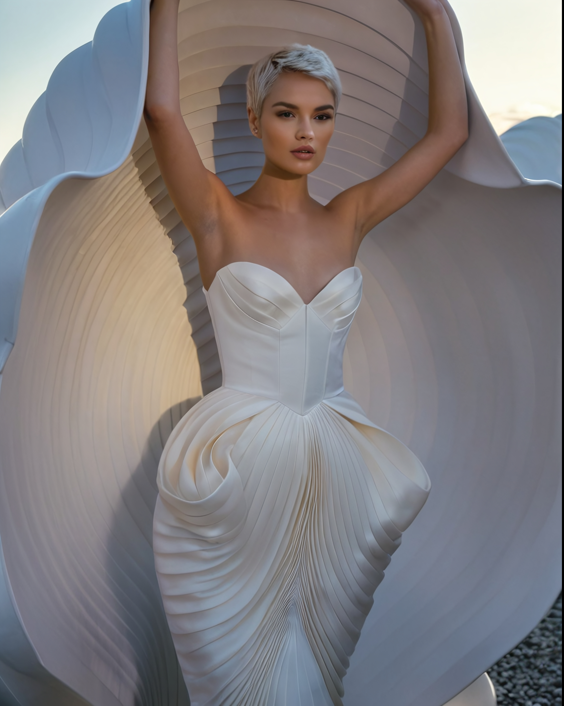
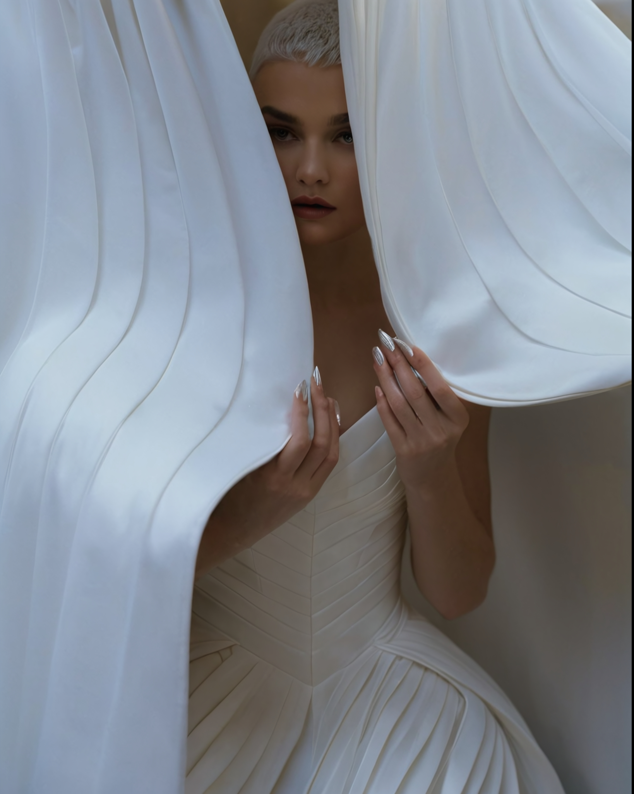
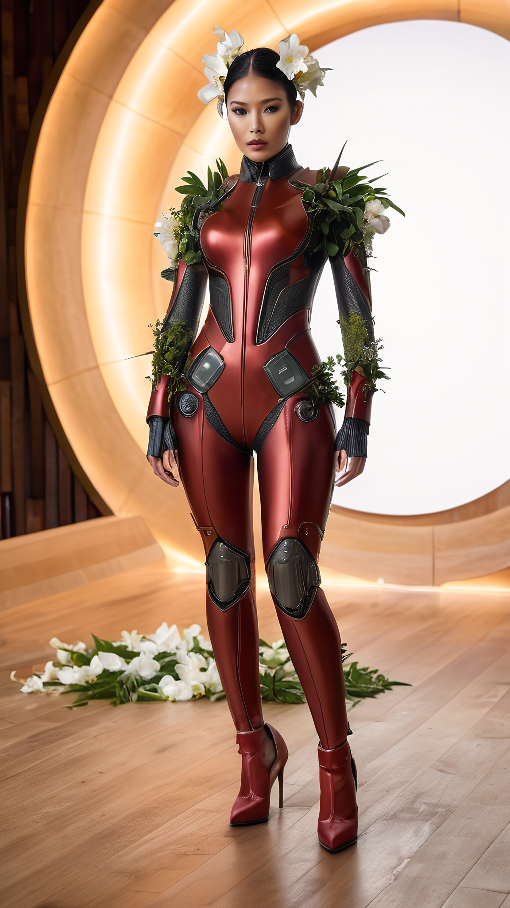

# The Green Gala opens

The day of the Green Gala was busy, with Mara working alongside Fleur and her staff to make sure everything was perfect.
Once the final touches were in place, it was time for Mara to dress.

Philippe had arranged a hotel suite where she could change, and Liliane, a skilled dresser and makeup artist, was there to help.
Mara smiled behind her mask when she noticed the floral theme even in the staff names.
Increasingly, shops and venues were putting their women into matching uniforms, and the hotel had taken that one step further, making the name plates part of the scheme.

Liliane began with Mara's hair and makeup, enhancing her natural beauty while keeping things simple within the limits of the outfit.
Philippe made sure everything else was ready.
Mara undressed down to the iGuardian and slipped into the base layer first: ballet boots and a latex suit that clung to her body.

Then came the main part of the ensemble.
Liliane and Philippe helped her into a stiff hobble skirt designed to resemble the bark of an ancient tree.
The skirt was so tight that it kept her legs close together and limited her to tiny steps.
From there the outfit rose upward, covering her torso and face in bark-like material.
Her face was completely hidden except for a concealed feed port and tiny eyeholes.
The headdress was a large green crown shaped like a canopy of leaves.

Her arms were covered too, the bark-like material giving them the appearance of moss-covered branches.
She could still sign, though slowly, even if gripping anything was impossible.

When Mara looked in the mirror, she saw a figure that resembled an ancient moving tree.
The stiffness of the dress and the bark-like surface made it obvious that she would not be able to sit, and certainly not move quickly.
She felt a strange mixture of vulnerability and security, silenced and slowed, yet still able to communicate with her hands.

Philippe noticed the intensity with which she was studying her reflection.

"Are you comfortable, Mara?" he asked gently.

*Yes, Sir. Different, but I will manage,* she signed.

Philippe smiled and rested a reassuring hand on her shoulder.

"You look stunning. I know it is a demanding dress. Keep in mind that I am here to help you through the evening."

Mara took a small step, feeling the stiffness of the dress and the severe restriction of her movement.

*Thank you, Sir. I appreciate your support.*

As they prepared to leave the suite, Philippe guided her with a touch that was firm but caring, making sure she felt secure despite how little movement the dress allowed.
The hobble skirt, the heavy crown, and the stiff bark covering made every motion slow and deliberate.
Even so, there was comfort in knowing Philippe would be there to guide her through it.

"Let us make this an evening to remember," Philippe said as he led Mara to the lift that would carry them down to the entrance.

As the guests began to arrive, Mara and Philippe stood at the entrance of the grand ballroom, ready to greet them.
The guests themselves showed the distinctive blend of elegance and restriction that defined Changed society.

Some came in ballgowns with floral Victorian skirts or hair adorned with green vines, embodying the theme of Nature's Elegance.
They curtsied politely to Mara and Philippe and exchanged formal pleasantries.

*Lord Hargreaves' Caroline emerged from the limousine, the back of her dress rising and engulfing her in a protective shell.*

Then came Lord Hargreaves, the well-known British philanthropist.
He helped his ward Caroline out of the limousine.
She emerged in a complicated white gown reminiscent of lotus petals, scandalously leaving her shoulders, head, face, and hair uncovered.

But Mara barely caught more than a glimpse of Caroline's slender body and platinum-blonde hair before the back of the dress came alive.
It rose over her head, caught hold of her, and engulfed her in a pearlescent protective shell, leaving only a narrow slit through which she could see.
Lord Hargreaves guided her with a hand that was gentle and firm at once.

*Caroline's dress clammed shut, engulfing her in a protective shell and leaving only a narrow slit through which she could see.*

"Good evening, Lord Hargreaves," Philippe said politely. "Caroline, your outfit is exquisite."

"Thank you, Philippe," Lord Hargreaves replied with obvious pride. "Bioengineering is making remarkable progress these days. It helps keep us alive, and it creates art and fashion."

Mara was deeply impressed by Caroline's living breathing work of art.

*You look beautiful, Caroline,* she signed.

Caroline's enclosed form curtsied, and Mara heard a faint murmur from within the shell.

"Thank you, Madam Mara."

The next limousine arrived, and Henry and Sonia stepped out.
Philippe smiled warmly at their elegant matching ensembles.

Sonia's dress was a striking combination of latex and silk in layered shades of green, decorated with real pieces of bamboo.
The bodice was a high-necked corset with intricate patterns imitating bamboo stalks, tightly laced to enforce impeccable posture.
The skirt, layered in latex leaves, created the illusion of a flowing bamboo forest, though it narrowed sharply toward the hem into a restrictive hobble line.

The sleeves were long and fitted, ending in delicate mittens attached to the dress by thin decorative chains that kept her hands near her sides.
A high stiff collar framed her neck, rising into a beautifully crafted mask shaped like overlapping bamboo leaves, set with small sparkling emeralds.
The mask covered her face but left her mouth free.
Her hair had been arranged in an elegant updo and pinned with bamboo-shaped ornaments.

Henry wore a classic suit in shades of green and gold to complement Sonia's dress, cut with the easy authority that always suited him.
He helped her from the car and guided her with a gentle but firm hand at the small of her back.

"Good evening, Henry," Philippe said warmly. "Sonia, you look absolutely enchanting."

Sonia curtsied with Henry's assistance.

"Good evening, Sir. Thank you for your kind words. The theme of Nature's Elegance truly inspired us."

Mara admired the dress.

*Your outfit masterpiece, Sonia. Bamboo elements striking.*

"Thank you, Mara," Sonia replied gently. "We wanted to embrace the theme as fully as possible."

Henry nodded, pride bright in his eyes.

"Maylee Shufoo outdid themselves with Enchanted Bamboo. It is beautiful and symbolic of our commitment to sustainability."

Philippe nodded appreciatively.

"Indeed. The craftsmanship is remarkable. I am pleased to see such dedication to the theme."

As Henry guided Sonia deeper into the ballroom, William Lemieux and his ward Helena arrived.
Helena was encased in a thick black latex catsuit covering her from head to toe, with matching eye covers.
The only visible openings were the breathing holes at the nose and a cleverly concealed feed port below her left ear.
Over the latex she wore a wide skirt of layered transparent white gauze and a flowing harem blouse that revealed the glossy black beneath.

"Sir William," Philippe greeted him warmly. "Your ward's ensemble is truly remarkable."

"Thank you, Philippe," William replied with pride. "Helena put a great deal of effort into this."

Mara looked at Helena and signed gently.

*Helena, you look stunning. Combination of textures beautiful.*

Helena nodded, the faint shape of a smile visible through the latex.
She glanced to William, and when he nodded his assent, she signed back.

*Thank you, Mara. You look enchanting as well.*

Excitement grew as the celebrity guests arrived.
Photographers and reporters buzzed with anticipation, cameras ready.
Harry Styles was the first to emerge from an electric limousine.

His outfit caught everyone's attention immediately.
He wore a formal Victorian tailcoat made entirely from living green leaves.
Reporters flocked toward him, admiring and curious.

"Harry, can you tell us about your outfit?" one of them called.

Harry smiled and turned slightly so the cameras could catch the effect.

"This dress is a creation of BioGreen Innovations," he explained. "It was grown on me using the latest British biotech. The leaves are alive and will keep growing throughout the evening. It is all about celebrating nature and sustainability."

The name BioGreen Innovations immediately turned into a buzzword among the reporters, who marveled at the living breathing masterpiece.
The outfit fit the Green Gala's theme perfectly.

Then the crowd's attention shifted as a loud whirring announced Zendaya's arrival in an electric hexacopter.
She stepped out to a wave of gasps.

*Zendaya stepped before the crowd with her head and face uncovered.*

Zendaya wore a metallic red full-body suit that showed every curve of her body.
Flowers and leaves sprouted from the joints, suggesting nature reclaiming the machinery.
A crown of thorns and flowers rested on her head, barely covering her hair.
The outfit represented a fusion of technology and nature.

Reporters immediately seized on the most shocking detail.

"Zendaya, you are not wearing a mask or head covering. This is unprecedented!"

Her bare face and uncovered hair stood out violently against the strict norms of Changed society.
Zendaya smiled with confidence.

"Tonight is about celebrating harmony between nature and technology. My outfit represents the decay of old technologies and the resurgence of nature. It is about balance."

Mara stood beside Philippe, suddenly uneasy.

*Her outfit fantastic, but Zendaya's face-immodesty worries me deeply. Quick, what can we do?*

Bound and restricted as she was, she could not intervene herself.

Disapproval spread through the crowd.
Reporters and more traditional guests were visibly taken aback.
Whispers of scandal moved through the entrance, and photographers captured every moment of growing outrage.

Event staff, acting as a kind of informal fashion police, hurried toward Zendaya carrying veils and masks.
Before they reached her, Tom Holland emerged from the hexacopter looking alarmed.

"Zendaya, wait!" he called, hurrying after her with the missing part of her ensemble: a robotic headpiece.

The staff stopped and allowed Tom to reach her first.

"I told you to wait and dress properly. This is unacceptable," he said, quiet but stern.

He took the headpiece and, with help from the staff, carefully locked it into place.
The addition completed her outfit, rendering her modestly covered, gagged, and unable to speak.

"Zendaya, you know the expectations," Tom scolded. "You will always be dressed properly, especially at an event like this."

Mara watched Zendaya hand-dance an apology, her fingers moving in clear contrition.

*Apologize, Sir. Thought theme might allow more freedom. Did not mean cause trouble.*

Tom's expression softened slightly, but he remained firm.

"You will always be properly covered. Now let us proceed with the evening as planned."

Once her head was covered, Zendaya became less of a public focal point.
Tom's decisive intervention calmed the crowd, which began to settle and turn its attention back to the event itself.

Throughout the evening, Tom stayed close to her, ensuring she adhered to social expectations.
He guided her through the ballroom with calm authority, and the more traditional guests seemed reassured by the sight.

Mara sensed an opportunity in it at once and turned to Philippe.

*Sir, perhaps we could frame this as bold statement aligned with theme. Would help manage public perception and highlight event's focus on harmony between nature and technology. Zendaya's outfit could become more restrictive as evening advances...*

Philippe nodded thoughtfully.

"An excellent idea, Mara. Here is how we will handle it."

He turned fully toward her, eyes serious.

"We will present Zendaya's initial appearance as a deliberate artistic choice, symbolizing the balance between freedom and restraint, technology and nature. I will speak to the press and explain that the outfit was designed to evolve throughout the evening, representing the dynamic relationship between the natural world and the technologies we create."

He continued, calm and authoritative.

"I will emphasize the thematic relevance and make it clear that the transformation of her outfit was part of the evening's narrative. We need restraint and discipline if we are to live in harmony with nature. That framing will turn the situation to our advantage and underline the event's innovative spirit and commitment to sustainability."

Mara's eyes brightened with admiration.

*Thank you, Sir. Your approach will help control narrative. Perhaps you want inform Tom Holland and suggest he plays along, making Zendaya more restricted as evening advances?*

Philippe smiled and rested a gentle hand on her shoulder.

"Excellent suggestion. You have a keen eye for strategy, Mara. Together we will ensure this evening is remembered for all the right reasons."
