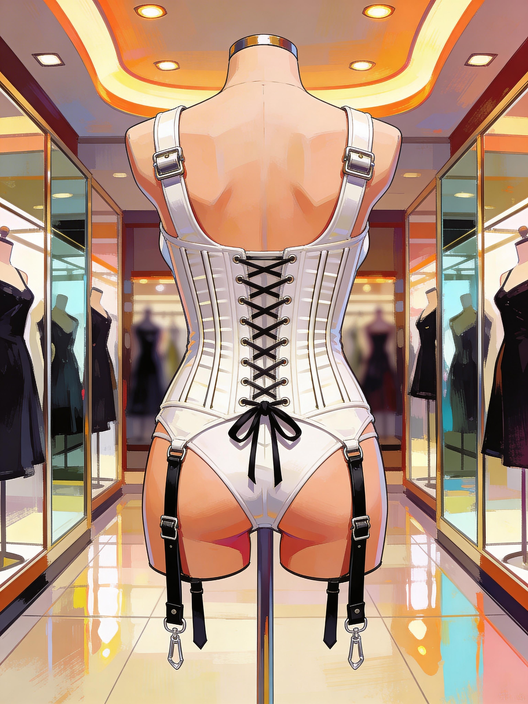

# Books

- [Book 1: Anna - Chapter 1](001-friday-evening-geneva)
- [Book 2: Sonia - Chapter 14](014-in-shanghai)
- [Book 3: Anna and Sonia - Chapter 26](026-fashionista)
- [Book 4: Mara - Chapter 35](035-reunion-in-the-garden)
- [Book 5: Mara - Chapter 45](045-a-day-at-the-races)

# EPUB

Read below, or click on the image for the EPUB download:

# Dedication

To Dave Potter, J Kreeg, and Shmabahamoha, for countless hours of engaging reading and boundless inspiration.
There still weren't enough stories of this kind, so they inspired me to make my own.

A special note of gratitude to Shmabahamoha for serving as a test reader,
contributing numerous inspiring ideas, and diligently identifying all my continuity and spelling errors.
Any remaining errors are mine alone and reflect my own need for further correction,
they should not be attributed to Shmabahamoha.

# Introduction

## Sonia: Meet LASS-VASH-2024

Subject: Meet LASS-VASH-2024

Anna,

I am back in Shenzhen airport, half dead, under-caffeinated, and carrying a sample that makes no sense.

The local reports call it the Large Self-Stabilizing Viral Airborne Shenzhen Strain. I shortened that to `LASS-VASH-2024` because I refuse to type the full thing every time. The symptoms sound almost insulting for something this elaborate: three to five days of fever, vomiting, headaches, and unusually vivid dreams. Nasty, yes. Catastrophic, no.

But the genome is absurd.

I am not talking about “unusually large.” I am talking about something engineered by a team that wanted to show off. It is far too stable for its size. Whole sections look less like viral code and more like stored data with built-in correction. It should fall apart. It does not.

I keep circling back to the same thought: nobody builds something this complicated to cause a bad cold and a few ugly nights.

I’m bringing a chilled sample under permit. If you still want it, I can bring it straight to the lab after I land. Coffee after that, if neither of us is infected with the thing.

Sonia

## Anna: Re: Meet LASS-VASH-2024

Subject: Re: Meet LASS-VASH-2024

Sonia,

Of course I still want it.

You had me at “far too stable for its size.” If the sequencing confirms what you think it does, this is not just unusual. It is designed.

Bring the sample straight to GAIA when you get back. I’ll keep the sequencers ready. We won’t get a full readout right away, but if the structure is as strange as you say, we should at least get enough to know whether we’re looking at something artificial.

And yes, coffee after. Assuming you’re not delirious and I’m not buried under a mountain of data.

Travel safe.

Anna

## Sonia: Maylee Shufoo

Subject: One more thing from Shenzhen

Anna,

There is something else here you’d enjoy hating.

A boutique chain called `Maylee Shufoo` keeps turning up in the shopping districts here. The name is written in Chinese on the windows, and the whole thing looks like a very expensive dare.

The style is impossible to miss. Pencil skirts so tight they change the way women walk. High collars that look half blouse, half restraint. Gloves with too many buttons. Corsets sold as if they were office basics. Some pieces look Victorian, some look like polished corporate wear, some look almost ceremonial. It has that fascinating thing you sometimes get here, where fashion crosses over into discipline and nobody acts as if that is strange.

The almost open, everyday bondage aspect is wild. Not nightclub fashion, not costume, not even subculture exactly. Just a shop on a normal street selling elegance, restraint, and inconvenience as if every woman obviously wants that.

It should look ridiculous. Instead it looks expensive, polished, and weirdly convincing.

I took a photo.

Maybe it means nothing. Maybe it is just Shenzhen being Shenzhen and me being too sleep-deprived to walk past a novelty shop without writing you a field report.

See you tomorrow if I survive customs and jet lag.

Sonia

## Anna: Re: Maylee Shufoo

Subject: Re: One more thing from Shenzhen

Sonia,

That shop looks like someone crossed a boardroom, a bridal salon, and a fetish house, then hired a very serious art director.

So yes, I hate it already.

It also looks like Fifty Shades of Shenzhen opened a flagship store and got a tax break.

I would like to see you wear that blouse with the impossible collar purely in the interests of international cultural understanding.

Bring the photo. Bring the sample. Bring yourself in one piece. If this thing really is engineered, I want to know who made it and what they thought they were doing.

Anna
