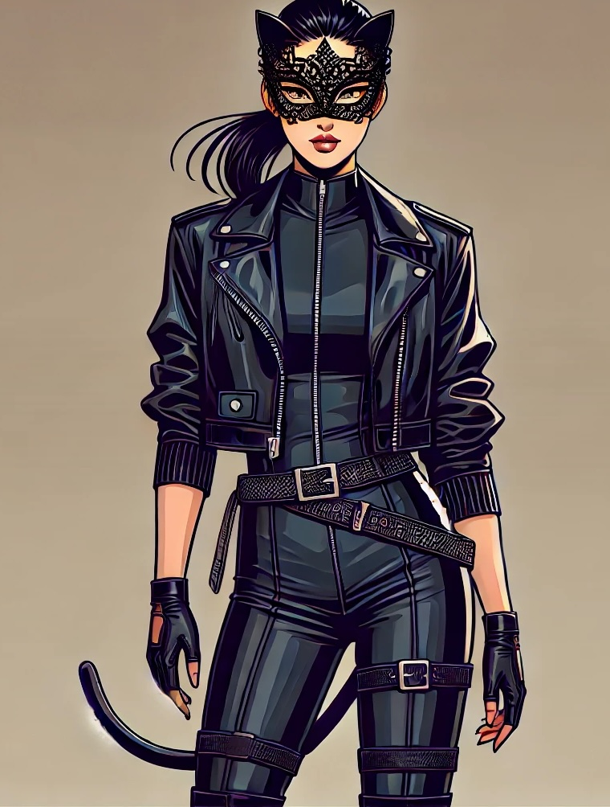
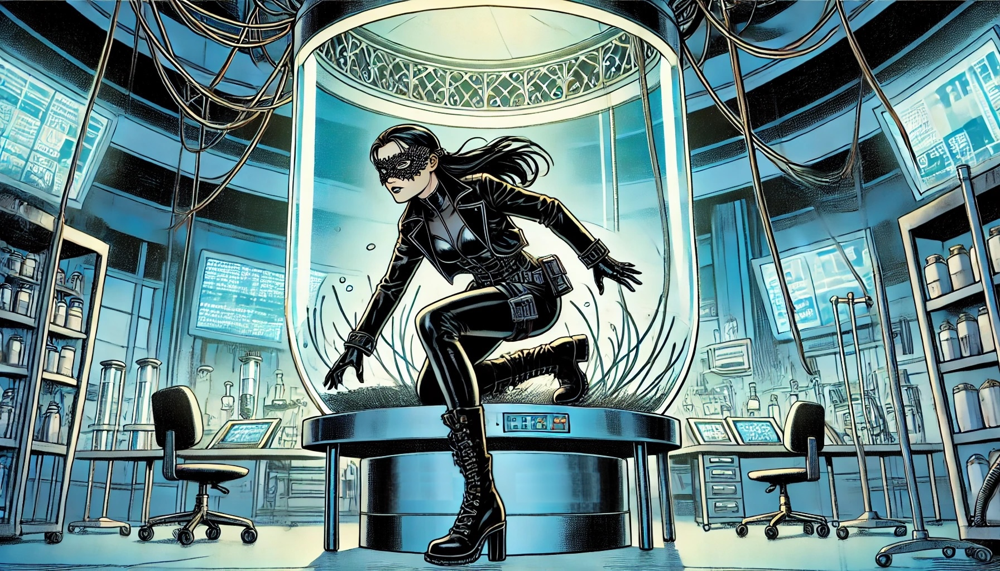

# The Heist

In her dimly lit apartment, Keiko went over every detail of the heist, her mind running through the plan.
"Alright, Keiko.
Time to become the Shadow Siren," she whispered, feeling the familiar adrenaline start to course through her.

She undressed, carefully folding her kimono and setting it aside.
Her undergarments followed, and soon she stood completely bare,
her lithe form silhouetted against the soft glow of the city lights outside.

Taking a steadying breath, she reached for her bodysuit.
The material felt smooth and cool in her hands, promising protection and flexibility.
She started by stepping into it, pulling it over her legs.
The kevlar-reinforced lycra clung to her skin, offering a firm but comforting pressure.
As she slid it up her torso, it molded to her curves, making her feel both protected and agile.

Keiko slipped her arms into the sleeves, the fabric tightening as it enveloped her completely.
It was snug but gave her full freedom of movement.
She adjusted the fit before pulling the zipper on her right shoulder,
feeling the suit tighten slightly as it sealed her in.
The pressure reassured her, a reminder that she was ready for what lay ahead.

Next, she reached for her custom knee-high boots.
The soft leather and reinforced soles fit perfectly, supporting her ankles as she fastened the boots securely.
She stood, testing her balance, her movements silent and smooth.

She zipped up her cropped leather jacket,
the tailored fit accentuating her figure and concealing hidden pockets filled with essential tools.
With a quick motion, she pulled her hair into a sleek ponytail, ensuring it would stay out of the way.

Finally, Keiko slid on her fingerless gloves.
The leather was soft and flexible, providing protection without sacrificing dexterity.
She flexed her fingers, feeling the perfect balance of grip and touch.
Her hands, now shielded and ready, were capable of the precise tasks ahead.

Dressed in her bodysuit, Keiko felt her confidence surge.
The material felt like a second skin, allowing her to move with the grace she was known for.
The suit’s tight fit showed off her lithe figure, but more importantly, it made her feel invincible.

After a final glance in the mirror, she secured her black utility belt,
stocked with lock picks, a mini EMP, a small flashlight, and a vial of sedative.
She double-checked the specialized gear she had prepared: a device to simulate Hartmann's voice,
contact lenses to replicate his iris scan, and thin, 3D-printed rubber overgloves bearing his fingerprints.
She was ready.
The Shadow Siren was ready.

Her thoughts turned to Hartmann.
He hid behind his facade of philanthropy, but Keiko had seen through it.
Stealing the Diadem of Lyria wasn’t just a job—it was payback.
"Hartmann, you despicable asshole," she muttered, her voice hard.
"You deserve this."

With that, she pulled on her face mask, designed to fool facial recognition systems.

*Dressed in her signature outfit, the Shadow Siren emerged.*

Slipping out of her apartment, Keiko navigated the dark streets, her movements precise and smooth.
She reached Hartmann’s estate and scaled the outer walls with practiced ease, moving through the garden like a shadow.
The aftermath of the reception had left things slightly disordered, just as she’d hoped.
Security was lighter, the guards distracted by the cleanup.
Her instincts, sharpened by years of pulling off high-stakes heists, told her this was the perfect moment to strike.

The guard dogs patrolled the grounds below, their senses sharp.
Keiko activated her sonic neutralizer, a small device that emitted high-frequency sounds, disorienting the dogs.
They whimpered and backed away.

With the dogs subdued, she approached the ivy-covered outbuilding, likely holding the lab.
She knew this part of the villa was less guarded, as she had verified earlier.
Using the ivy for support, she climbed the wall with ease and soon reached the skylight.
Her infrared goggles confirmed what she had hoped—no alarms on this window.
Taking a deep breath, she began cutting the glass with her silent glass cutter.
The piece came away cleanly, and she reached through to unlock the window from the inside.

Keiko secured her grappling hook and lowered herself into the lab below, her movements smooth and silent.
Once inside, she quickly assessed her surroundings.
The lab gleamed under the low blue night-lights, its sleek metallic surfaces reflecting the glow.
Machines hummed softly—material synthesizers, nanoparticle assemblers, and analytics equipment.
Her eyes darted around, taking in the layout.

She spotted the door leading further into the villa, but something caught her attention.
In the center of the room stood a glass bowl about a meter wide, filled with a strange black liquid.

Keiko approached cautiously, her curiosity piqued.
The liquid shimmered, rippling as if it were alive.
She almost touched the glass but hesitated, pulling back.
“What is this?” she muttered, her breath fogging the surface.

The liquid seemed to react to her, its movements growing more animated.
She held her hand close to the bowl,
and to her amazement, thin black tentacles rose from the liquid, reaching towards her hand.
She could feel a faint tingling sensation, as if the tentacles were emitting a low-frequency vibration.

“Fascinating,” she whispered, barely audible.

The tentacles inched closer, and Keiko’s heart raced.
She was torn between excitement and caution.
She knew this was uncharted territory, but curiosity had always been her weakness.
A sudden click from the lab equipment startled her, making her flinch.

Her thoughts spun.
What was this liquid?
Why did it react to her?
But there was no time to dwell on it.
She had a mission to complete.

Keiko shifted her focus back to the job.
She needed to find the display room and retrieve the Diadem of Lyria.
The lab’s layout was unfamiliar, but time was slipping away.
Moving swiftly and silently,
she approached the security console by the door and used her EMP device to disable the lock.
The door slid open with a soft hiss, revealing a corridor beyond.

As she slipped through, she couldn’t shake the image of the black tentacles from her mind.
She had stolen many strange artifacts before, but this was different.
Whatever Hartmann was up to, it was beyond mere greed and exploitation.

Moving through the villa’s corridors, she carefully avoided the surveillance cameras' fields of view,
using her knowledge of dead angles to her advantage.
She finally reached the display room.
Her movements were quick and efficient.
At the entrance, she paused, pulling out a small vial of nanoparticle spray.
With a flick of her wrist, she released the fine mist into the air.
The particles created a cloud that masked her presence from the motion detectors.

Keiko adjusted her multi-spectral goggles, watching as the security systems lit up before her eyes.
The pressure plates on the floor, the intersecting laser beams—everything became clear.
Moving with the grace that earned her the name "Shadow Siren," Keiko began a series of fluid, almost dance-like motions.
She twisted and turned, each step precise, avoiding the pressure-sensitive tiles.
Her body weaved through the laser grid, her movements elegant and controlled, resembling a strange but beautiful dance.

At last, she reached the glass case.
The Diadem of Lyria glittered under the soft lighting, its rubies and diamonds glowing, the craftsmanship flawless.
She allowed herself a brief moment of admiration before getting to work.

She took out her custom-made device, the "Circuit Silencer."
It sent out a signal that disrupted the alarm system without triggering any alerts.
Once the security was disabled, she used her contact lenses to mimic Hartmann’s iris scan and the thin,
3D-printed rubber overgloves with his fingerprints.
The system scanned her eye and fingerprint, and the glass case the pedestal clicked open.
The diadem was free.

Keiko carefully lifted the diadem, feeling its weight and beauty in her hands.
She wrapped it in a soft cloth and placed it in her backpack.
Satisfied, she began retracing her steps.

Resetting the security systems took careful attention, but Keiko moved with precision.
She closed the glass case, relocked the doors, and left no trace of her presence.
The Shadow Siren never left a mark.

As she prepared to ascend her grappling rope, her eyes wandered back to the mysterious vat.
The black liquid swirled restlessly, its tentacles rising and falling.
For a moment, Keiko hesitated, her curiosity stronger than her discipline.
