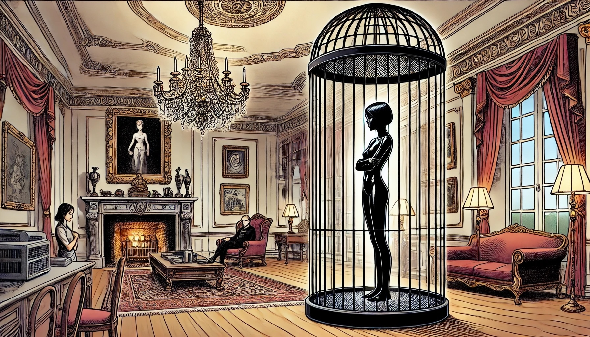

# Caged

*She was on display, right in the middle of the room, confined to round steel birdcage, a prisoner in plain sight.*

Emerging from the torture, Keiko found herself still encased in the latex-like nanomaterial,
its sinister presence invading and obscenely filling every orifice of her body.
The material pulsated slightly, a constant reminder of its invasive grip in her mouth and in her nether regions,
filling and stretching her down below.

Her hands were folded and bound to her body under her breasts,
the tightness a cruel mockery of her former agility and strength.
She could see now, but a thin layer of the material covered her eyes, functioning like dark sunglasses.
It had a lens effect which deliberately left her short-sighted,
teasing her with distorted glimpses of her surroundings and adding to her torment.

Keiko lay in a small birdcage-like structure, the bars made of blackened steel with no visible way out.
The cage was placed in the center of a lavish living room, filled with luxurious furniture and expensive decor.
Hartmann was nearby, ignoring her as if she were nothing more than a piece of living art.

As she turned her head, she felt the cushion of a latex-like wig surrounding it.
Painful jolts surged through her body where the suit touched the floor, forcing her to stand.
With her hands bound in front of her, she awkwardly rose to her feet, standing helplessly in the cage.

Her daily existence was a brutal combination of boredom and degrading procedures, all designed to break her spirit.
Feeding time was particularly humiliating.
The nanomaterial would form a sheath in her mouth, forcing her to consume a tasteless, half-liquid mush from a feeder.
The feeder was a phallic steel rod, twenty centimeters in length and five wide, with a round end.
Keiko had learned the hard way that she had about fifteen minutes to kneel up in front of the rod,
forcing it into her mouth until her lips touched the base, suppressing her gag reflex.
Only when her lips touched the sensors at the base of the rod would the rod push the nutrient mush into her mouth,
making her swallow the tasteless, salty substance.
The experience was degrading, reducing her to an object, stripped of any dignity.

Twenty minutes after her feeding, a maid would push a cat litter box filled with white sand into her cage.
Keiko had to squat down on her heels, legs wide apart, to avoid punishment.
The nanomaterial controlling her bladder and anal plug emptied her without her being able to control it.
The process was public, stripping her of any remaining dignity.

Other than these degrading routines, Keiko was mostly left alone, with one exception.
Hartmann would sometimes come to her, holding the Diadem of Lyria—the very artifact she had tried to steal.
He would open her cage with a click of his phone.
If she stepped back, the bars zapped her, forcing her to stay still.
Trapped between the bars and Hartmann, she could do nothing.

Slowly and carefully, Hartmann placed the priceless artifact on her head.
She felt the nanomaterial reach out and grip the metal of the diadem, securing it on top of her fake blowup hair.
The mocking irony of her situation was not lost on her;
she was now adorned with the same symbol of captivity and subjugation
that had once graced the Greek high priestess of legend,
foreshadowing her own fate.

Days blended into each other.
The lavish surroundings of Hartmann’s living room were a constant reminder of her defeat.
The grand chandelier, plush furniture, and priceless art stood in sharp contrast to her cold, oppressive reality.
No one spoke to her.

Her hands, bound tightly in front of her, often cramped from the strain.
She stood in silence, unable to make any noise.
The rules of her captivity were simple:
When she tried to make noise, she was shocked.
She learned that any attempt to sit down during daylight resulted in a painful zap from the nanomaterial,
she had to stand.
Touching the steel bars of her cage brought the same punishment.
The shocks were excruciating, reinforcing her helplessness and the futility of resistance.
The constant pain, the cramps, and the boredom were overwhelming.

Sometimes, people entered the room, but her impaired vision prevented her from identifying them.
The nanomaterial left her short-sighted, only able to make out blurry shapes and colors.
Occasionally, someone would inspect her like a piece of art,
walking close to the cage without acknowledging her humanity.
They behaved
as if it were completely normal to have a glistening black shiny latex woman as an ornament in the living room.

Keiko's mind raced with memories of her past.
She thought of the skills she had honed, the victories she had achieved.
Bound and helpless, she clung to those memories.
She recalled the katana heist, the thrill of outsmarting Hayashi, and the satisfaction of seeing justice done.
She thought of the people she had helped, the lives she had touched through her heists.

In her moments of silence, she planned.
She studied the cage, the routines, the people who came and went.
She knew she couldn’t escape with brute force, but there had to be a way.
The nanomaterial was powerful, but it couldn’t be flawless.
She observed, waited, and endured, her mind constantly working on a plan.

But despite her efforts, no progress was made.
The days dragged on, with Keiko standing in place, barely able to move.
Her mind was idle, her body cramped, and her situation hopeless.
Nothing happened, and she was left with nothing but her thoughts and the endless torment of her captivity.

A week passed, each day a repeat of the same humiliating routine.
Keiko endured the degrading feeding and littering rituals,
the forced standing, and the painful punishments from the suit whenever she resisted.
She tried to keep her spirit strong, but the constant degradation and torment wore her down.

On the seventh day, Hartmann approached her cage, his expression cold and distant.
He pulled out his phone, and once again, the gag retracted.
Keiko’s mouth, plugged and stretched for so long, struggled to form words.
Her throat was dry, and when she spoke, her voice came out as a hoarse whisper.

“Who are you?
Who sent you?
What were you after?”
Hartmann asked, his tone mocking.
He had placed the diadem on her himself.
He already knew the answers.
This wasn’t about gaining information—it was about breaking her down, stripping away her defiance piece by piece.

Keiko thought about hurling insults again, but the memory of the punishment made her shudder.
Instead, she remained silent, her eyes burning with defiance behind the thin layer of black material covering them.

Hartmann’s smile widened with cruel satisfaction.
“Ah, the silent treatment?
Very well.”
He pressed a button on his phone, and the gag reappeared in Keiko’s mouth.
She braced herself for what would follow.

The pain hit her with the same intensity as before, burning through her body like fire.
She convulsed, her muscles seizing up against the tight grip of the nanomaterial.
Every second dragged on in agony, each moment more unbearable than the last.

Finally, the pain stopped, and Keiko was left alone in her cage.
The same cycle resumed: boredom, humiliation, and unrelenting pain.
Keiko clung to memories of her past victories,
trying to draw strength from the knowledge that she had beaten impossible odds before.

Another week passed, and Keiko felt her resolve crumbling.
The isolation, the routine, and the endless pain were breaking her down.
She realized
that Hartmann had no limits—he would continue this forever if it meant watching her spirit break completely.
That night, she lay curled in the too-small cage,
unable to stretch because touching the cage bars would mean punishment.
She was crying, but the nanomaterial absorbed her tears, erasing even the smallest sign of her suffering.

Keiko understood now.
The only thing that would make any difference to Hartmann was her total compliance.
The realization crushed the last bit of her defiance.
She decided that next time he asked, she would answer him.

When Hartmann returned a week later, he found her standing, head bowed, her spirit dulled.
He activated the phone, and the gag retracted.

“Who are you? Who sent you? What were you after?” His voice was cold, the mocking tone still present.

Keiko’s voice was soft and broken. “My name is Keiko Toda. No one sent me. I was after the Diadem of Lyria.”

Hartmann smiled, satisfied. “Good. That wasn’t so hard, was it?”

Even after she gave him what he wanted, Hartmann reactivated the gag and left her as before—caged and ignored.
Her cooperation had spared her punishment, but it hadn’t changed anything.
The torment continued, with no end in sight.

In her solitude, Keiko faced the full weight of her hopelessness.
She had nothing left to offer Hartmann, nothing to bargain for her freedom.
And even if she had, she knew he would never trade with her.
He was a sadist who derived pleasure from her suffering.
Her fate was sealed.

Hartmann wanted to see her broken, and he had succeeded.
She remembered him telling the story of Lyria, the priestess who wore the same diadem now sitting on her own head.
It was clear what her future would be.
No one would rescue her.
Nobody would oppose someone so rich, nobody would come to rescue her.
Least of all Hartmann himself, who enjoyed her despair.

Keiko’s spirit was gone.
She felt hollow, her strength and defiance crushed.
She had done everything Hartmann asked, but it hadn’t saved her from the cruel monotony of her existence.
There was no hope left, no resistance.
Keiko was no longer the Shadow Siren.
She wasn’t even Keiko anymore.
She was whatever Hartmann wanted her to be, and she would do whatever he ordered her to do.
