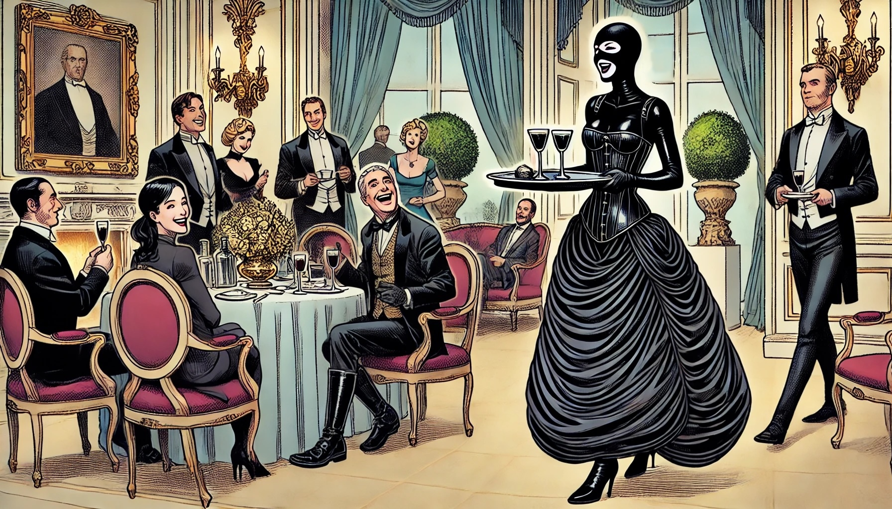

# Entertainment

Keiko's transformation into a silent, obedient ornament was complete.
She moved through Hartmann’s villa with practiced ease, her every action graceful and automatic.
Each command was met with a smile and a polite curtsy, just as she had been trained.

Hartmann felt secure in her obedience, proudly displaying her as his trophy.
For special occasions, the nanomaterial molded into a striking black outfit that emphasized her role.
A tight corset cinched her waist, pushing her breasts up provocatively,
while the material flared into an ornate skirt, resembling luxurious fabric.
Her legs were wrapped in high-heeled boots that forced her into an elegant posture.
A half-hood covered her head, leaving only her eyes and mouth visible.
Her hands were free, allowing her to serve the guests more efficiently.
Looking at her, there was no mistaking her role—she was a living symbol of submission.

*The guests at Hartmann's parties were as cruel as he was.
They took delight in commanding her, knowing that she had no choice but to obey.
Keiko walked among them, serving drinks and offering smiles that never reached her eyes.
Each interaction was a fresh humiliation, a reminder of her complete and utter defeat.*

Sometimes Hartmann would order her to smile, ensuring her expression matched the perfect, polished demeanor he demanded.
Other times, he had her wear the Diadem of Lyria, showing it off to guests, emphasizing her servitude.
And always, he made sure she was available for their pleasure.
The guests took advantage of her, ordering her around with no room for refusal.
The suit and her training made sure she complied with every request.

She was only to speak when spoken to, always polite, always respectful.
The guests reveled in her compliance, each interaction stripping away more of her humanity.
Keiko’s existence had become a constant cycle of enforced obedience, her role as a living trophy solidified.

As Keiko moved among the guests, her actions were smooth and well-practiced.
She carried trays of canapés and drinks, keeping her gaze down.
When addressed, she responded with a soft “Yes, Sir” or “Yes, Ma'am,” her voice devoid of emotion.
The guests treated her as an object, a public plaything.

"What's your story, girl?" one guest asked, a cruel curiosity flickering in his eyes.

Keiko recited what she had been taught.
"My name was Keiko Toda.
I was caught trying to steal from Mr. Hartmann, and I have been taught to serve.
I am grateful for the lessons he has given me."

"And what do you offer?" another guest asked with a lecherous tone.

"I offer drinks, entertainment, and pleasure," Keiko replied without hesitation. "I am here for your enjoyment."

Throughout the night, Keiko was used in various ways.
Some guests made her kneel and service them, while others ordered her to perform degrading tasks for their amusement.
One particularly cruel guest enjoyed making her repeat her story,
delighting in the way her voice cracked slightly with each telling.

"Such a lovely addition to the party," he sneered. "A reminder of what happens when you cross Viktor Hartmann."

Occasionally, guests would compliment Hartmann on his 'trophy.'
In response, Keiko would say, "I am thankful to Mr. Hartmann for teaching me these valuable lessons.
I am honored to serve."

In the center of the room stood her cage, a clear symbol of her captivity.
Keiko's eyes were constantly drawn to it, the bars a stark reminder of her imprisonment.
Some guests would point at it, laughing about her time spent confined within its black steel.

Hartmann watched with satisfaction as Keiko moved through the crowd, a living testament to his power and control.
He knew she was completely broken, her spirit extinguished, and her obedience absolute.
She was a hollow shell, an obedient servant, her past and identity erased by the relentless conditioning.
She was Hartmann's trophy, his obedient servant, and she would remain so until he decided otherwise.

Keiko knew that, like Lyria, she would eventually be sold once Hartmann grew tired of her.
It was a fate she had already accepted.
She understood that she was nothing more than an object to be traded, her value measured by her submission.
The story of the diadem had come full circle—just as Lyria was passed from master to master, so too would Keiko be.

And so she served, silent and obedient, her cage always in view.
It stood as a constant reminder of what she had become,
her fate sealed by the very thing she had once sought to steal—the Diadem of Lyria.
