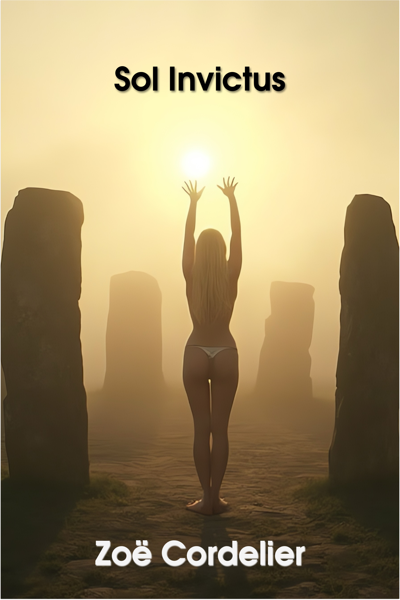
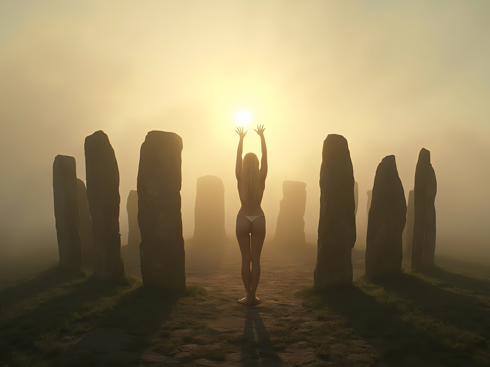

{}

Zoë steps through the gate into a land where ancient stone circles hum with hidden power and cities thrive in harmony with nature.
Drawn into the rhythm of solstice celebrations,
she witnesses a primal ritual led by a High Druidess who bares herself to the dawn,
body painted and crowned in antlers, before a crowd enraptured by light and sound.
Immersed in a culture that merges timeless reverence with modern grace, Zoë tastes its food, music,
and ecstatic devotion, even as her mission threatens to drag her back to a sterile world of control.
What she carries home is more than data: it is the memory of freedom, fire,
and the raw beauty of a world unafraid to celebrate the sacred in flesh.

{}

# EPUB

Read below, or click on the image for the EPUB download:

# Sol Invictus

## Transfer

Zoë stepped through the shimmering haze of the exotic matter gate
and landed on moss so thick it cushioned her boots like a carpet.
Her wool dress clung to her skin from the static discharge of transit,
its subtle olive-green and gray tones blending into the forest's muted palette.
She exhaled a cloud into the sharp air, her breath visible, then took stock.

The grove stood silent, timeless, its great oaks towering like sentinels,
their gnarled limbs reaching toward the fading sun.
The late afternoon light bathed the scene in a golden wash,
highlighting a clearing ahead, dominated by an ancient stone circle atop a rise.
Each menhir stood taller than she was,
their faces carved with swirling motifs and knotwork patterns that suggested both reverence and mystery.

She moved forward cautiously, cataloging: the craftsmanship on the stones was exquisite, likely hand-chiseled.
The preservation suggested active cultural reverence, not archaeological detritus.
Her fingers brushed the surface of one—cold, smooth, and etched with grooves still sharp.
A society that respected its ancient heritage, then.
Not uncommon, but this depth of integration was rare in her baseline world.

A sound reached her: distant singing, soft and polyphonic, weaving through the grove like a spell.
It was accompanied by the faint scent of woodsmoke.
She turned her face to the breeze, searching.
People—nearby, and gathering for something significant.

She began her descent, leaving the grove behind, following a narrow, well-trod path that wound through the underbrush.
The ground beneath her was spongy with leaf litter, her boots crunching softly.
As she walked, the forest thinned, giving way to a vast patchwork of fields and hedgerows, meticulously maintained.
Farmsteads dotted the landscape, their buildings timber-framed and roofed with slate,
but integrated with solar panels angled sharply to catch the low winter sun.
Wind turbines stood on ridges in the distance,
their blades slicing the air with a rhythm that felt somehow... harmonious.

Her breath puffed as she cataloged: renewable energy dominance.
No plumes of smoke from industrial stacks.
No buzzing of overhead power lines, either.
Whatever this society’s energy infrastructure was, it was efficient, hidden, and remarkably quiet.

As she neared a low stone wall marking the edge of the wild grove, the path widened into a track.
A signpost greeted her, carved and painted in bright, natural pigments: "An Delenvor - 5 tregad."
The script was unfamiliar yet close enough to something Celtic to spark recognition,
and the directional arrow was clear.
She adjusted her dress, grateful for the wool’s warmth but already anticipating the cold bite of the coming night.

The track became a narrow road, flanked by hedges now strung with glowing lanterns.
They pulsed faintly, their light fire-like but too steady to be flames.
Bioluminescent?
Some advanced LED variant?
Another point for their tech level—her internal assessment ticked upwards.

The first sign of the city appeared as she crested a rise:
An Delenvor stretched before her like a jewel set against the blue-grey sea.
The modern center bristled with mid-rise towers,
their steel and wood facades latticed with green walls and rooftop gardens.
Trams snaked through the city on raised tracks, their sleek,
minimalist designs blending seamlessly into the urban landscape.
Roads below were empty of cars,
occupied only by bikes, pedestrians, and the occasional quiet hum of an electric delivery van.

Zoë took in the lack of smog, the absence of traffic noise, and the surprising vibrancy of life.
The air was crisp, untainted by urban pollution.
She spotted a pedestrian plaza far below, bustling with people setting up market stalls.
Strings of lanterns crisscrossed the space, swaying in the evening breeze,
and she caught the glint of polished brass instruments as a band struck up a tune.
Traditional Celtic instruments mixed with something electronic, producing a sound both ancient and futuristic.

As she descended into the city, she passed children running along the bike paths,
their laughter carrying in the still air.
Adults walked in small groups, some in brightly woven cloaks, others in long coats lined with fur.
Everyone wore gloves and hats or hoods, and Zoë felt a pang of self-consciousness for her uncovered hair.
She quickly drew her scarf up, wrapping it loosely around her head.

Her boots clicked on the stone-paved road as she entered the outskirts.
Homes here were smaller, their walls whitewashed, with intricate wooden trim painted in bold colors.
Tiny rooftop gardens bristled with hardy herbs and evergreen shrubs, evidence of a deeply ingrained ecological ethic.

The city’s character unfolded with every step.
Even the smallest details—the pervasive use of natural materials,
the integration of technology so seamless it felt organic—spoke of a culture
that had married innovation with respect for the old ways.
Zoë’s fingers brushed the fabric of her dress absently as she whispered to herself, “How did they manage it?”

Ahead, a bonfire blazed in the plaza she had glimpsed from the ridge.
People danced around it in rhythmic, coordinated steps, their shadows flickering against the walls.
Tomorrow was clearly special, the anticipation palpable even here on the periphery.
Winter solstice, she recalled—a time of balance, reflection, and renewal.

As twilight deepened, the warmth of lanterns and hearth fires spilling onto the clean streets.
She passed a small square where musicians played a haunting melody on pipes and string instruments,
the air alive with the anticipation of tomorrow’s festivities.
People bustled between market stalls laden with woven fabrics,
carved wooden goods, and seasonal foods she couldn’t yet identify.
Her stomach growled as the smell of something sweet and nutty wafted past.

The Coth-Tir Inn, where she finally stopped, was a modest building of whitewashed stone and green-trimmed wood.
Its sign swung gently in the sea breeze, painted with a simple spiral design that seemed ubiquitous here.
She entered the lobby, warmed instantly by a crackling fire.
The receptionist greeted her in the melodic, unfamiliar language that Zoë’s implant struggled to parse.

“Room,” she managed, pulling out a small stack of locally-issued coins.
Her contact in this dimension had handed her the money with a wink and an “I wouldn’t ask too many questions
if I were you.”

The receptionist, a wiry man with a neatly braided beard, named a price that seemed fair enough.
She handed over the coins and received a key attached to a wooden tag carved with her room number.
As he handed it over,
he glanced at the clock on the wall—an intricate device with exposed gears and numerals
painted in a Celtic script—and explained something in the halting language.
She pieced it together slowly.

“Sunrise,” he said, tapping the clock. “...uh… noven hag sezh.” Nine-oh-seven, her translation device whispered in her ear. “Procession… Iodhanes Tor… Gwydhed Neryon.”

Tor she understood.
That had to mean the hill she had descended earlier.
Gwydhed Neryon... something about a ritual?
She nodded, keeping her expression attentive.

“High Druidess,” the man said, miming a slow, graceful ascent with his hands.
Then he used a term Zoë’s translator struggled with, but it seemed to mean “birthing the new year.”

She smiled and thanked him as politely as she could.
“Very exciting,” she offered, though her mangled attempt at the local phrase earned only a kind smile.

With her key in hand, she stepped back into the night,
stopping at a nearby market stall to grab a warm, fragrant pastry filled with nuts and honey—a kouign amann,
the vendor called it.
She also picked up a small glass bottle of local wine, its label a swirling pattern of vines and crescent moons.
The vendor wrapped the bottle in paper, handing it over with a practiced efficiency.

Her room in the inn was small but spotless,
with walls paneled in pale wood and a bed covered in a woven blanket that smelled faintly of lavender.
The radiator hummed softly, filling the space with a comforting warmth that chased away the chill of her journey.
A single window looked out over the city, where lanterns now cast an amber glow across the streets.
She could see the outline of the tor in the distance, its silhouette darker than the indigo sky.

She ate the pastry slowly, savoring its sweetness as she sipped from the wine bottle.
The drink was sharp and earthy, its flavor unfamiliar but not unpleasant.
When she finished, she set her alarm for two hours before sunrise,
determined to witness the procession and whatever this world’s winter solstice celebrations entailed.

As she lay down her thoughts raced briefly through the day’s impressions: the harmony of old and new,
the subtle hum of technology blended seamlessly into nature,
and the deep cultural reverence that seemed to permeate every interaction.
But exhaustion overtook her quickly, and she slept, undisturbed, like a stone beneath the earth,
dreaming of druids and torches flickering in the cold night wind.

## The next morning, long before dawn

The climb up the tor began in near-total darkness,
save for the scattered glow of lanterns and the flicker of torches held by some of the ascending crowd.
Zoë pulled her cloak tighter around her as she joined the steady stream of people trudging up the winding path.
The air carried a sharp chill,
biting at her cheeks, but the press of the crowd, the rhythmic beat of the drums echoing from above,
and the palpable anticipation made her forget the cold.

The path was alive with murmurs and soft chants in the mingled Celtic dialect she struggled to decipher.
People wore cloaks and heavy woolen garments,
some adorned with intricate embroidery or metal pins that gleamed faintly in the low light.
Zoë’s ears picked up snatches of conversation and an occasional laugh,
though there was an undercurrent of reverence in the mood.

Reaching the crest of the tor, she found a spot overlooking the sea,
where the sound of waves crashing against unseen cliffs added another layer to the night’s symphony.
The stone circle loomed ahead, its megalithic stones etched in shadow,
their carved patterns catching only the barest hints of the coming dawn.
She could see a pathway from the east winding toward the summit,
lined with lanterns where the procession would soon arrive.

The sky began to shift.
The deep indigo of night gave way to faint bands of gray and blue.
The east teased the first hints of dawn, faint and cold,
with a band of pale orange just beginning to stretch above the horizon.
Above, the stars still sparkled in the cloudless sky, a sharp contrast to the growing light below.

The drumbeats, amplified and resonant, seemed to vibrate in Zoë’s chest, primal and hypnotic.
These weren’t the jaunty folk rhythms of the previous night’s celebrations but something ancient,
a heartbeat of the earth itself rendered through modern speakers.
Then came the chanting: a deep, guttural call from the druids below,
matched by a rising, melodic counterchant from the assembled crowd.
The interplay was mesmerizing, creating a soundscape that felt impossibly old and undeniably alive.

The procession appeared at last.
The High Druidess walked at its center, her white cloak glowing faintly in the growing light.
Red streaks painted her face and arms—blood, whether symbolic or real, Zoë couldn’t tell.
Antlers crowned her head, their tips gleaming as she moved with a slow, deliberate grace.
Her entourage, clad in darker robes, chanted in unison as they climbed,
while those along the path raised their voices in response.

The hum began as the Druidess approached the stone circle.
It wasn’t part of the drums or the chants but a deep, omnipresent vibration that Zoë felt in her very bones.
It was as if the stones themselves were alive, resonating with the energy of the moment.
The crowd fell quieter, their chants softening, replaced by an expectant hush.

The Druidess entered the circle alone.
Her entourage halted at its edges,
and no one–not even the cameramen recording the event–dared cross the invisible boundary,
though thousands of eyes were fixed on her.
She walked to the very center of the circle, facing the eastern capstone.
A faint light glimmered through the carved opening, hinting at the precise alignment with the rising sun.

As the sky in the east ignited in fiery hues—gold, orange,
and crimson—the first ray of sunlight pierced through the capstone.
It struck the Druidess, who threw back her cloak in one fluid motion.
She stood stark naked, her skin painted with red and white patterns that swirled and spiraled over her body,
her arms raised high in greeting to the sun.
The crowd gasped collectively, and then cheers erupted like a wave.

The Druidess seemed otherworldly, a figure from a time before time, her form illuminated by the sun’s first light.
She turned slowly, her arms still lifted, as if offering herself and the moment to the new year.
The drums thundered louder, blending with the chants of her entourage and the hum of the stones.
It was raw and primal, an elemental celebration of life and renewal.

Zoë couldn’t look away.
The air seemed charged, her skin tingling as if she were part of the ritual.
Around her, people embraced, their voices raised in joy.
Some wept openly, others simply stood, transfixed by the beauty and power of the moment.

The Druidess spoke then, her voice carried by unseen amplification, though Zoë couldn’t understand the words.
Whatever she said, it was received with fervent cheers and renewed chants.
The sun climbed higher, bathing the tor in golden light, and the hum that had underpinned everything slowly faded,
leaving only the drums and the people’s voices.

Later, the city was alive with celebration.
The streets filled with small gatherings, though the mood was more introspective than raucous.
Musicians played soft tunes, and vendors offered warm drinks and small cakes made with oats and honey.
People exchanged simple tokens—woven charms, sprigs of evergreen, and candles—symbolizing light and renewal.

Zoë lingered at the edge of the crowd,
sipping spiced cider from a carved wooden cup, the warmth spreading through her hands as much as her chest.
Around her, the streets thrummed with subdued joy.
Musicians played haunting, lilting melodies on pipes and string instruments,
while groups gathered to share bread, roasted chestnuts, and stories.
She sampled what she could: a savory tart filled with leeks and smoked fish,
a dense cake spiced with cinnamon and studded with dried fruits, and a creamy cheese that tasted faintly of the sea.

Her small recording device, hidden in the folds of her cloak, whirred faintly,
capturing snippets of conversation, song, and the ambient sound of celebration.
She scribbled quick notes in a battered journal,
trying to keep up with everything: clothing details,
the intricate dances in the square, the craftsmanship of the lanterns.
Each detail, no matter how mundane, was cataloged with care.

The faint chime in her earpiece broke her focus.
She glanced around, then checked the time.
Her return window was minutes away.

Tucking her notes into the hidden pocket of her dress,
she slipped away from the revelry, her steps quick and purposeful.
The path back up the tor was dark now, save for the occasional glow of lanterns left behind.
She climbed swiftly, her breath visible in the cold air, until she reached the grove.

The stillness was different now, the hum she had felt that morning absent, leaving only silence.
The great stones stood sentinel, their surfaces pale in the faint moonlight.
Zoë turned to face the exact spot where she had first arrived, glancing at the sky one last time.
A small part of her longed to stay,
to lose herself in this world of raw beauty and connection, but the mission came first.

The second chime in her earpiece brought her back to reality.
A flicker appeared in the air ahead—a shimmer, like heat waves distorting the night.
The shimmer grew,
warping and stretching into an impossible shape,
its edges sharp and crystalline but somehow flowing, the colors inside shifting like oil on water.
Mist curled out from the opening, thick and ethereal, wrapping around her feet.
The gate’s mouth gaped wide, a portal to nowhere and everywhere, its geometry an affront to natural law.

Zoë hesitated only a moment, then stepped forward.
The haze enveloped her, cool and damp, before the gate’s gravity sucked her in with a force that twisted her perception.
The mist disappeared as suddenly as it had come, replaced by the cold, sterile reality of her own world.

She landed hard, the impact jarring her knees against the concrete floor.
Overhead, the fluorescent lights hummed, their harsh glare cutting through the disorientation.
Around her, the familiar walls of the gate room at LHC Point 4 loomed, their utilitarian design as unwelcoming as ever.
The faint vibration of machinery reminded her that she was now 152 meters underground,
far from the tor, far from the sunlight, far from freedom.

A voice crackled in her earpiece. “Welcome back, Vanguard Operative Seven. Report to debrief immediately.”

Zoë pushed herself to her feet, brushing dust from her cloak,
which now looked entirely out of place against the cold industrial backdrop.
Her jaw tightened as she squared her shoulders.
She was back in her world—mundane, suffocating, and unforgiving.

Here, she wasn’t an explorer or a participant in a living, breathing culture.
Here, she was a tool.
A prisoner.
And despite everything she had just seen and experienced,
she knew her handlers would only care about the data she had brought back—not the people,
not the lives she had glimpsed, and certainly not her.
