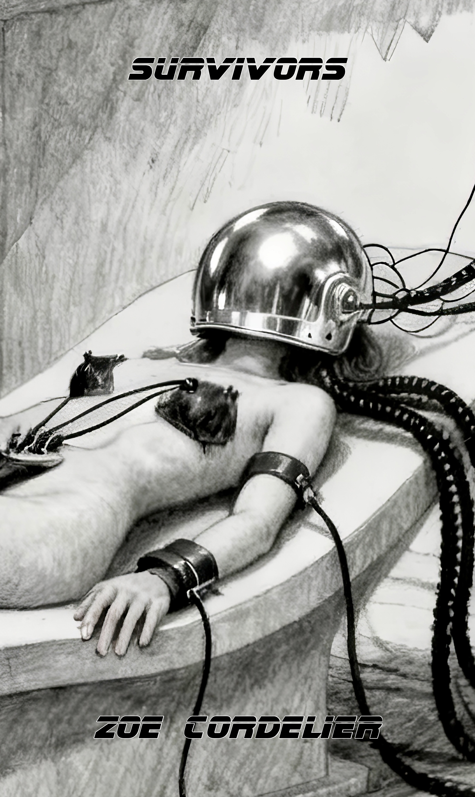
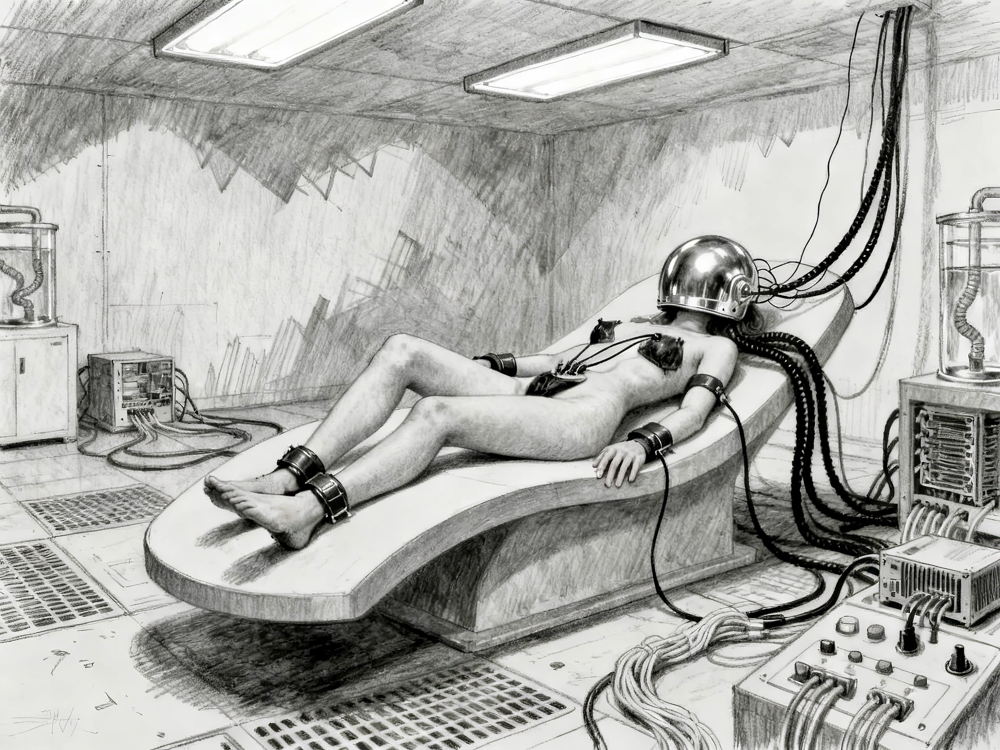

{}
NC, MC, BDSM, D/s, Hypno, Drug, Training, Hum, Pet, Slavery, Drone, Scifi
{}

{}

It began two years ago, somewhere in Dubai, they said.
From there it traveled through China, and then into Europe.
A way to produce real, working mind-control drones, to rewrite minds,
and to make custom beliefs not only normal, but mandatory.

It started as a training and induction system: a neurologist from Damascus, working for a sheikh in Dubai,
was tasked with finding a way to educate his sons and guards faster and more effectively.

Two drugs, Encefactor and Synaptolase: one to increase neuroplasticity and suggestibility,
the other to close the mind again and lock in the lessons, turning them into facts, firm beliefs, axioms.
Between them came the Neuropath units, futuristic helmets and attachments that controlled sensory input,
scanned brainwaves, and in real time adjusted the stimuli to drive results.

The sheikh, of course, used the drugs and the units on his wives,
reducing them to mindlessly obedient puppets, driven only by the desire to serve.
The doctor took his notes and fled to Shenzhen, where the technology was substantially improved.

Now, brothels filled with droned sex slaves have begun to appear in Paris.
RAID — officially Recherche, Assistance, Intervention, Dissuasion — storms these places,
seizes the units and the drugs, and tries to save and reconstruct the broken victims.
On the street, people have begun to call them Réseau Anti-Implantation Domestique — the dome-breakers.

This is supposed to be dark horror for Halloween.


{}



# EPUB

Read below, or click on the image for the EPUB download:

[](survivors.epub)

# RAID

The hum of the electric transporter was low, a whirr that went deep, into the bone.
Vicky sat on the narrow rear bench, knees against her vest, hands inside the warmth of her gloves.
The RAID team rode in silence, their breathing steady under helmets and armored hoods,
the soft clinks of gear shifting with each bump in the road.

Vicky exhaled slowly.
3:02 a.m.
The hour of the wolf.
The time when sleep and nightmares tangled, when the body’s defenses were lowest, and souls felt exposed.

She'd been on four of these raids.
Every one of them was worse than the last.

She was the last inside to put on her helmet. 
Her black combat vest read PSYCHOLOGUE in white block letters, front and back.
She had no gun.
Just a combat shield, and the injector kit on her thigh,
and the weight of her duty like ice water in her veins.

"Get ready," the commander ordered, voice dry through his respirator,
tapping her on her bulletproof vest.
Vicky was ready.
The troopers shifted.
Weapons checked.
HUDs synced.

Ahead of them, an Arbalète 9 rumbled up the white gravel driveway of the villa.
A squat, wheeled urban assault tank with a rounded steel ram in place of a cannon
and a kind of modified cow catcher as a debris shield.
Welders in heavy combat armor rode its sides, hydraulic shears and oxygen lances stowed.
They looked like insects from another planet—bulky, faceless, hunched forward with brutal purpose.
The headlights were dimmed, just enough to see.
The seven-meter hedge loomed like a wall of shadow, dense, 
and electrified fencing inside, behind the foilage.
They crashed through wrought iron gates, over the pristine white gravel pathway, ruining it.
Lights turn on, alarm bells ring, but the tank is fast, the armored transport following it. 

The villa was a pale ghost under the night sky.
Cold white plaster and obsidian shutters, 
restored bones of an old Art Nouveau mansion dressed in high-end surveillance and synthetic quiet.
Le Vésinet. 
The sort of place that didn't call the police, not even when girls screamed.

The plan was simple.
Front and rear breach, simultaneous.
First tank takes the main foyer.
Second takes the rear solarium. 
Then secure, sweep, contain.

The truth was never simple.

Inside that villa—beyond the hedge, behind those black steel shutters—were women.
Dozens.
Maybe more.
She knew what they'd find.
What was left of them.

Victims. Not true persons anymore, not yet survivors either.

Stripped of their names and memories,
often also of their words.
Just automatic smiles and glazed, hungry eyes.
They cooed and moaned and begged for permission to come.
Some were so deep into the protocol, 
they couldn't to anything without an order.

She clenched her jaw and forced her spine straight. No time for softness. No space for revulsion.

"Compassion is not a feeling.
Compassion is an action."
She'd written that in her thesis.
It was truer now than ever.

The transport slowed to a halt.
A low thump.
The signal.

Vicky turned toward the hatch.
Her fingers brushed the injector pouch once, like a reflex.
Her breath had gone shallow.
The armor on her chest felt too tight.
She pushed it down.
This was the job.
This was why they called her.

Collect them for "therapy."
Mostly to rebuild them, after the horror.

“GO!” someone shouted, and the hatch burst open.

Gunmetal night air poured in.
Shouts.
The deep thud of boots hitting gravel.
The whispering crunch underfoot. 

Outside, the tank rolled forward, silent except for the crunch of the wheels.
The steel ram charged and breached the front door.

The villa's grand double doors exploded inward in a blast of white dust and broken black glass.

And Vicky Delmas followed the RAID team into the dark.

The villa's interior was obscene in its silence after the flashbangs went off.
No alarms.
No screams.
Just the sound of boots clearing rooms, shouts of "Clear!",
the electronic chatter of HUD comms—and the dull,
unmistakable throb of low-frequency ambient music piped through hidden speakers.
Bass and breath, designed to sink into the mind and soften it.

Vicky moved past a velvet-curtained archway, 
her steps precise, checking for signs of breath, life, resistance.
Smoke curled in the air.
Incense—mixed with sex and sweat and antiseptic.

Then came the sound. A sharp breath and a giggle.

She turned fast.

At the end of a hall lined with mirrored panels, a wide lounge opened into view.
Blue LED strips ran along the baseboards.
A white sofa.
A bar.
A man in a suit slumped backward in a leather chair, pants down, his mouth slack, his chest riddled with holes.
Blood soaking into his shirt like ink.

And at his feet, between his knees, knelt a woman.

She was naked but for a wide black collar with a silver code tag.
The rest of her was carefully presented—waxed, perfumed, scrubbed.
As if she were an object in a showroom, not a human being.
Chestnut hair in a low twist, eyes wide and shining, lips parted in a hopeful, dazed smile.

When she saw the RAID operator, she leaned forward on her hands and looked up eagerly.

“Oh… are you here to use me?” she asked, softly. 
“I’m ready.
Please.
I’ve been very good.”

Her voice was high and clear, painfully sweet.

Vicky stepped forward.
The trooper beside her raised his weapon instinctively. 
“Target—civilian—”

“Lower it,” Vicky snapped. “She’s not a target. She's a victim.”

The girl—no, woman—tilted her head at Vicky, blinking. “Are you the new mistress?”

Vicky knelt. Slowly. “No. I’m Vicky. You don’t have to do anything right now.”

The woman gasped, suddenly looking distressed. 
“Did I do something wrong?
Please, I can try again, I can—”

“Shh,” Vicky said, and reached for her sedative injector.

It was already loaded. 
Setting 3, default for a woman.
She angled for the thigh, pressed it on and counted, 3, 2, 1.

Skin warm.
Slight tremble.
The woman’s eyes tracked her, still trying to guess what she wanted.

“Please… am I still good?” she whispered. 
“I can learn what you like, just don’t—”

The change was almost immediate.
The tension bled from her limbs.
Her body swayed, once, and she collapsed forward against Vicky’s armored knees.

Vicky held her gently, letting her slide down into recovery position,
turned her head gently to the side,
watching for breath fog and checking pulse at the neck—steady.
Her injector spew a printed sticky tag with an UWB transponder, she fixed it to the woman.
"Ket, 3, 3:06am".

She stood and waved over a combat paramedic.

“Female.
Twenty to thirty.
Fully droned.
Possible residual awareness.
She may be reachable,” Vicky said flatly.
“She was being used when the breach started.
Tag says ‘E-1795’, but don't call her that.
Not even in triage.”

He nodded grimly, unfazed.
Draped a silver trauma blanket over her nakedness,
lifted her onto the collapsible stretcher in practiced silence.
The fabric crinkled softly over her as the straps snapped shut.

As they carried her out, Vicky stood still for a moment. Let the cold come in again.

There would be more like her.

And there would be others, worse.

Some wouldn’t want to be rescued, others would beg to go back.
Because not all programming is about obedience.

She turned away and moved deeper into the villa.

The hunt wasn’t over.

The hallway narrowed, 
twisted into a service corridor where the gilded sin of the villa thinned into sterile plaster and concealed wiring.
Somewhere beneath them, the team breached another level.
Gunfire echoed faintly—tight bursts, suppressed, professional.

Vicky followed three meters behind Team One, weaponless but alert.
A second injector ready in her gloved hand.
The shadows danced with the blue strobe of helmet lights.
No more music now.
Just the hum of power systems and the occasional choking sob, distant, like plumbing moaning.

They passed a woman sprawled in the entry to what looked like a steam room.
She had a perfect, sculpted face.
Silicone lips, lashes, and a blankness that could have passed for haughty stillness,
if not for the red-washed blood pooling beneath her jaw.
One of the RAID officers had shot her clean through the throat.

“She came at us with a blade,” the trooper muttered, almost apologetic.

Vicky crouched beside the body.
The blade was still clutched in her hand, surgical steel.
No emotion. 
Just the command to protect.
Loyalty looped into violence.

“She was programmed to kill for them,” Vicky said. “You did the right thing.”

There had been a time when that sentence had a weight.
Now it just marked another broken person she couldn’t help.

The frontline team moved on.

She paused to tag the body,
then glanced down the hallway where it connected to the main chambers again—more plush carpeting, more silence.

Behind a tinted glass door, another room.

Inside were three women.
Naked, collared.
Kneeling in a triangle on velvet cushions, perfectly still.
Identical posture, identical vacant smiles.

They looked up when she entered. Not in fear.

In hope.

“Hello, Mistress,” one of them said, her voice lilting. “Would you like to play?”

The one in the middle rolled her hips subtly, a deeply conditioned tease.
The third bit her lip and opened her thighs in silence.

Vicky didn't respond. She just pulled the injector from her belt and walked forward.

Each girl went limp in turn, cradled as she lowered them down, one after the other.

Droned.
Deep.
No conscious mind left at the surface, “full wipes.”
Identity dissolved, conditioned to please in any way conceiveable.
They would need months—years, maybe—of rebuilding. 
There might be nothing to recover.

She hit her comms.
“Three more.
Need stretchers.
High priority sedation.
Send blankets.
They’re cold.”

She stood there after, in the quiet.

They were always cold.
The heating was set to the comfort level of guests.
Not for naked toys.

# Domes

The corridor twisted away from the opulent main hall and dipped underground,
past a biometric lock already melted by thermite.
Vicky followed the RAID team through the scorched threshold, the air changing with each step.
Warmer.
Wetter.
Heavier.

The stench hit next—cloying and sour, like overripe perfume smeared with sweat and latex.

The red LED strips on the floor flickered toward a wide chamber: metal-lined,
climate-controlled, with three reclining chairs bolted to the floor—no, not chairs.
Platforms.

Each one was fitted with a Whisperdome.
Thick, rounded, full-head helmets with chromed panels and neuroinput scaffolding along the base.
An array of cables fed into them from above like tangled spider legs.
At the base of each pod, control terminals blinked and scrolled in a language Vicky had only half-learned to decipher.

One of the pods was active.



Inside, a woman lay spread-eagled, wrists and ankles restrained with sculpted magnetic cuffs.
She wore nothing but a choker—no, a signal collar—and had sensor clamps attached to her breasts,
vaginal probes fixed in place, thick cables, like tentacles everywhere.
Tubes ran beneath her pelvis, feeding misting aphrodisiacs and collecting what leaked.

The helmet covered her completely.
She moaned softly—not words, just sound.
Her hips twitched with rhythmic tension.
Her whole body shuddered with programmed arousal.

“She’s mid-cycle,” one of the medics muttered.

“Maybe pleasure-conditioning,” Vicky nooded, looking at the pelvis motions. “Or a reward scaffold phase.”

“I don’t care,” said another. “We cut her out. Now.”

“No.” Vicky raised her voice just enough.

They paused.

She was already kneeling by the console.

The interface was high-level—nonstandard GUI, dynamic glyphs, neural feedback integration.
Live EEG stream.
Multiple layers running.
At least four concurrent behavioral threads.

She scanned the display.

```
> Core Personality Remodeling
> Trigger Cycle: Active
> Multimode Sexuality Conditioning, custom engram base.
> 
> Done: 60%, perineuronal fixation: pending
```

“Custom job,” she muttered. “High-end.”

The lines into the helmet pulsed.
Gases.
Scented.
Likely containing Encefactor — Flash.
Enough to melt memory coherence and open the pleasure centers wide.

There was no sign of Synaptolase yet—no Seal.
But the system was prepped for it, "perineuronal fixation".
One more cycle, then the sealing phase.

“Can you break it?” asked the RAID lead.

“Maybe.”
Her fingers flew across the screen.
“But not fast.
There’s no clean shutdown protocol.
No safety net.
They wanted her bound to this thing until completion.”

Her eyes scanned the looping inputs.
A swirl of arousing visual triggers, compliance affirmations,
moan-pitched tonal harmonics—a symphony of submission.
Whoever designed this knew how to hollow a human out precisely.

She clicked open an admin node.

> Warning: Unsafe Termination.
> 
> Danger of Neural destabilization, compulsion lock, memory fragmentation.

Vicky swore under her breath.

“She’s got a custom neurobase.
Partially preserved personality.
They didn’t wipe her.
They inverted her.
Probably someone important.”

“What if she’s booby-trapped?”

“She probably is,” Vicky said flatly. “But if we wait, she’s gone.”

She found a patch node.

> Manual shutdown. Cascade delay. Bypass reward feedback. 

No spike.

“I can try to end it softly. Might scramble her—won’t fry her. Probably.”

She didn’t wait for approval.

Her thumb hovered, then tapped the final override.

Whatever was done to her was done, the shutdown protocol would fixate it,
but at least her programming would be incomplete.
She might have a chance, there might be something, someone left.

Countdowns, checkmarks.
The helmet cracked open with a hiss of depressurization,
pulling back like a retracting beetle shell — the plates unfurling wetly, 
layered like chitin, glistening where condensation clung to the inner surfaces.
Fluid streamed down its curve, milky and tinged faintly pink, viscous with organic runoff.

Her face was revealed in stages.

First, the lips — stretched around a thick, glistening gag lodged deep in her throat.
Not a ball, but a soft, undulating tube of semi-organic polymer,
shaped to massage the pharyngeal wall with every breath.
It pulsed faintly, still active.
Her throat convulsed as it slid free — inch after inch,
like something being birthed.
A wet pop finally released it from her lips,
and it flopped heavily onto the surgical padding below her head,
glossy and still glistening with saliva and mucus.

The woman choked once, a strangled breath, and moaned.

“…mmmn… did I do well…?”

Her voice was raw, ruined — not from screaming, but from hours, maybe days,
of that thing moving inside her like a tongue made to pleasure the absence of speech.

Vicky didn’t answer.

She stared as the rest of the system disengaged.

The headrest flexed, unlocking spinal stabilizers with soft pneumatic clicks. 
Then came the chest.

Wires retracted from the woman’s temples and the base of her skull with slow,
sticky sounds — each tipped with nodules that looked more like veins than sensors.
As they pulled free, they left tiny bleeding sockets, bright red against her scalp.

The breast clamps came next — suction seals peeled back with reluctant, sticky snaps.
Beneath them, her skin was puckered, overstimulated, nipples flushed dark and swollen.
Vicky could see faint circular bruises, as if she'd been milked dry.

The pelvis module hissed loudly —  almost like an animal, like something exhaling.
Then the central brace unfolded.

It flexed open like a carapace, its frame soft-lined with biopolymer pads soaked in fluid.
Tubes snaked down from her abdomen, attached at intimate points via swollen,
rubbery sockets that looked disturbingly grown rather than manufactured.
Two long insert shafts—one vaginal, one anal—were still lodged deep, 
bulbous ends twitching slightly as if tasting the air.
Their surfaces gleamed with a slime that stank of synthetic aphrodisiac and fermented arousal.

The medtech moved to pull them out, but Vicky stopped him with a hand.

“Slow. They're anchored.”

She stepped in herself.

The first probe came free with a suctioned noise, followed by a thin stream of milky discharge.
The second—wider, textured, with an articulated tip—resisted.
It made the woman moan softly when Vicky eased it loose,
hips giving a tiny reflexive twitch even in sedation.

Her thighs were slick with chemical lubricant, laced with hormones.
The harness had been designed to cycle fluids—what leaked from her,
what was pumped into her, what was collected, analyzed, adjusted, and then reapplied.

A wet, living prison engineered for pleasure and compliance.

Beneath her, the chair's catch basin overflowed with pink-tinted fluid,
slow drips falling like saliva from the base of the unit.

The last restraint — a fine, barbed clamp locked just above her clitoris — retracted with a hiss 
and a flash of red light.
The site twitched violently. 
The woman moaned again, mouth slack, eyes fluttering behind sticky lashes.

The medics stood back, uneasy. One of them retched quietly.

A stretcher was slid beneath her. Lifted. She moaned once more — a breathy, confused noise.
“Get the trauma blanket,” Vicky snapped. “Now.”

She laid it over the woman’s chest herself, shielding the swollen, overstimulated flesh,
and her thighs. The fabric stuck where it touched the fluids, clinging like foil to a warm corpse.

“Tag her: Custom neurobase, 60% remodeling, recovered mid-cycle. Risk: extreme.”

“Name?” the medic asked.

“We’ll find it later.”

She turned to the RAID lead.

“She was someone once. They didn’t erase her. They flipped her. 
Broke her mind open and poured themselves inside.”

The woman’s fingers twitched on the gurney. A whisper, barely audible:
“…please don’t put it back in…”

Vicky looked away.
“Move her,” she said quietly.
Her collar was still on.

And the team carried her out — broken, slick,
and silent beneath the silver blanket — as the Whisperdome hissed behind them,
initiating the cleaning cycle, making itself sterile and ready to be used again.

She was still in it, Vicky thought. Still in the loop.

She’d seen this before.

Grown women, reduced to animals.
Not just bodies — rewritten brains built on chemistry and trauma.
Their thoughts reshaped like wax into praise and obedience and need.

She remembered one case — a woman who apologized for days because she couldn’t orgasm when told.
Another who smiled through broken teeth because “a good girl doesn’t cry unless Master wants tears.”

And now this one.

Custom-built.

Not just a toy. A trophy.

Elegant, well-preserved. Probably cultured. Someone wanted her broken by design.

Probably a man.

Probably rich.

Probably personal.

A vendetta. This was no random girl picked up off the street. This was about ownership.

“Let’s move,” said one of the RAID leads.

Vicky stared at the Whisperdome chair, still moist, the interface still warm from use.

She hated this tech more than anything in the world.

Because of what it did, and even more because of how perfectly it worked.
Abruptly she turned and walked out, upstairs.

Vicky stood just beyond the shattered arch of the villa’s front door,
one boot on gravel, the other on blood-darkened tile.
The air was cool and sharp, scented with scorched wood, burst insulation, and the metallic sting of extinguished life.

A few RAID men stood nearby in silence, smoking.
Fatigue hung on their shoulders like lead.
Nobody was talking.

Vicky didn’t smoke.
But she stayed outside anyway.
The cold helped.
The sunrise was beginning — a slow smear of pale light rising behind the hedge, sky turning from ink to bruised lilac.
The first birds had started their calls.
It might have been beautiful.

It wasn’t.

She’d enjoy the sunrise more if she didn’t know how many bodies they’d taken out.
How many women they pulled out of basement rooms, soundproofed closets, and pleasure beds.
How many were alive.
How many were not.

How many had begged to stay.

She took a breath through her nose, slow and steady.

They found the drugs in the sublevel cold storage — medical-grade refrigeration racks filled with sealed vials.
Dozens of syringes, ampoules, compound bottles.

MD-17a aka Encefactor aka Flash.

A colorless, volatile nootropic with a six-hour half-life and no persistent metabolites.
Nothing to track in a blood panel.
It induced extreme neuroplasticity, peeled back trauma barriers,
dissolved long-term memory anchors, and made the mind gullible.
Hungry.
Suggestible.
It didn't just make a person open — it made them rewritable.

They used it to prepare the brain. To soften the clay.

After the process, Synaptolase, Seal.

A modified BDNF stabilizer and net binder.
Once injected, it closed the window.
Locked in whatever had been laid down.
Suggestions, compulsions, obsessions, reflexes.
Made them feel old.
Natural.
True.
Once sealed, they couldn’t be questioned — not by the subject, and not by anyone else.

Together, Flash and Seal formed the brackets around The Droning Protocol.

And they had found containers with plenty of both.

Far too much.

The compounds were notoriously fragile — degraded in sunlight,
unstable outside narrow temperature bands, and hellishly expensive to synthesize.

You didn’t stock that much unless you planned industrial-scale conditioning.
Not some entertainment for a billionaire, but scaled production.

Then there were the Whisperdomes.

Three of them.
Sleek, polished units mounted to reclining medical platforms.
Connected to a wall-mounted GPU array and a cluster of control units built to handle live neural feedback.

Vicky had seen it before. 
But never like this.

These helmets weren’t running prefab conditioning sessions.
They were adaptive.
Each one piped in customized audiovisual stimuli: rhythmic tonal patterns,
hypnotic language structures, erotic visuals, affirmational whispers.

Everything was timed to the subject’s own brainwaves, hormone cycles, and pulse rhythms.
Every drop of arousal harvested, every blink analyzed, every breath measured,
the protocol adjusted to personal reaction, tailored to the brain in the dome.

Inside the dome, sedatives and stimulants were administered through timed vapor bursts.
Aphrodisiacs too, in microdoses.
Just enough to reinforce what the visuals taught, whatever it was.
Most often obedience and pleasure, mixed in with loyalty.

It was... exquisite. And monstrous.

The site was a brothel at the ground floor, but the undercroft was a lab, a factory.

The level of precision, the quality of materials, the fluid movement of the interface — all bespoke.
All terrifying.

Somebody paid for this.

Somebody powerful.

And yes — it was a man. It was always a man.

She didn’t need the dossier to know.
This kind of operation wasn’t casual.
This was someone's fantasy.

Then there was the custom job, the woman she found in the machine when she shut it down.
Likely a personal vendetta.
Someone rich, probably humiliated by a woman who didn’t fold when he told her to smile.
Now he could make her.

It all had started two years ago.
Dubai.
A Syrian neurologist, working on immersive learning for a Sheikh’s education project.
Then something changed.
The Sheikh started using the tech — on his wives.
Rewriting them.
Turning marriage into compliance, turning love into conditioned obedience.

Then came the theft. Chinese contractors. Darknet code leaks. Re-engineering.

Now it was here.

In Europe.

Real, working mind control.

Not brainwashing, nor a metaphor.

Actual programming.

And now, the brothels.
Hidden in villas, spas, penthouses, behind beauty and wealth.

Vicky was there to catch what was left.
The ones that weren’t wiped completely.
The ones who might still remember being human.

It was her fifth RAID.

There would be more.

Each one worse than the last.

She exhaled slowly, her hands buried deep in her jacket pockets.
The sunrise reached the top of the treeline now, spilling gold across the gravel.
The birds kept singing.

Behind her, the villa’s hollow silence echoed like a scream with the volume turned down.

Sometimes — when she let herself imagine — she thought about finding the origin.

The funders.

The developers.

The billionaires who commissioned these women like luxury handbags, like accessories.

And then she dreamed of turning the tables.

Flashing them.
Putting a helmet on them.
Strapping them in, softening them up,
and telling them they were worthless until someone whispered the right words in their ears.

Turning them into trophies.

She would never do it.

But sometimes, in mornings like this…

…it was the only thing that kept her alive.
# Toy

The Pavilion didn’t look like a clinic.

No sign.
No entrance desk.
Just a converted hunting lodge buried in state-owned forestland, 
halfway between Rambouillet and nowhere.
The kind of place no one asked about.
High hedges.
Old stone.
Reinforced windows behind the ivy.
Vicky had to scan her pass and iris to pass the gates.

Inside, the air was cool and still.
Clean without being antiseptic.
Diffused lighting.
Natural fibers.
No mirrors, no sudden noises.
Silence was part of the architecture. 

Dr. Ysolde Ferin sat at a narrow desk near the observation suite.
Her glasses hung on a chain over a linen blouse, her sleeves rolled.
Her grey-blonde hair was tied back in a French twist, 
streaks of silver catching the soft morning light.
Her face was precise, unreadable, not unkind—but there was no softness left in it.
Only discipline.

Vicky sat across from her, elbows on her knees. She hadn’t slept well. She never did after a RAID.

Two open dossiers lay between them, each clipped with biometric IDs, 
gene samples, and preliminary brainwave graphs.

Vicky exhaled slowly. “Let’s start with the one from the Neuropath chair.”

“Céline de Vignolles,” Ysolde confirmed, tapping her stylus once on the image.
“The woman you found in the active unit.
ID confirmed within the first hour of intake.
She told us herself — politely, calmly.
Her speech patterns matched archived interviews from before her disappearance.
We ran voiceprint and facial vectoring.
It’s her.”

Vicky looked at the screen.

Céline’s intake photo wasn’t flattering — her hair was damp, skin flushed from sedation,
pupils still too wide — but her posture was elegant, composed.
Too composed.
Every inch of her conditioning radiated from the photo.
She sat like a woman trained to believe that being looked at was a performance.

“She remembered everything?” Vicky asked.

“Yes.
Timeline, career, contacts, even her old TEDx script nearly word for word.
But…” Ysolde clicked open the behavioral overlay, “…she has significant value-realignment.”

Vicky scanned the flags.
“Behavioral restraint.
Dress and grooming compulsions.
Arousal triggers.
Social softness training.
Fuck.”

“She’s a custom job,” Ysolde said flatly.
“Targeted programming laid on top of her core personality, not a replacement.
Her memories are all intact.
But her moral compass?
Her convictions?
Replaced.
She genuinely believes she’s improved.”

Vicky clenched her jaw. “You’re telling me she likes being like this?”

“To a degree.
She’s proud of how gentle she’s become.
How much more ‘palatable’ she feels.
She says the anger is gone.
But that pride was installed.
It’s a feature, not a side effect.”

“Is she safe?”

Ysolde hesitated. “Define safe.”

“Is she under her own control?”

“She’s autonomous until she isn’t.
We suspect loyalty programming, possibly hidden triggers or protocols linked to a specific person.
That’s standard in custom work like this.
Ownership reflexes, emotional softening,
sometimes even sexual imprinting keyed to voiceprints or visual ID.”

Vicky’s eyes narrowed.
“Whoever paid for her wanted her to remember everything — just see it all differently.”

“Exactly.
It’s revenge, Vicky.
Surgical.
Purposeful.
Likely personal.
We’re analyzing the raw NeuroScript pulled from her Whisperdome session, but it’s encrypted in layers.
Whoever designed it wanted her programmable and plausible.”

“And until we’re sure?”

“She’s to be treated as a containment-risk survivor.
Watch for changes in behavior.
She’s still legally a person — which means she has rights.
We can’t deprogram without her informed consent.”

Vicky stared at the file for a long time.

“God help us if she ever sees the man who commissioned her.”

They both went quiet for a beat.

Then Ysolde reached for the next file.

“Elise.”

Vicky rubbed her eyes. “The first one we found.”

“Standard sex-toy profile,” Ysolde said quietly.
“Almost textbook.
Full sexual availability, obedience fetishization, speech and mannerism softening,
learned helplessness, pleasure-seeking vocal loops.
All responses tied directly to reward feedback — praise, orgasm denial, degradation acceptance.”

Vicky’s face didn’t change, but her fingers curled slightly on the table.

“However,” Ysolde went on, “there are things different about this one. 
Firstly, her programming varies with her cycle.”

“Fertility surge?” Vicky asked.

“Yes.
Her arousal spikes dramatically near ovulation — we verified through endocrine sampling.
She doesn’t just want sex.
She needs it.
Her reward systems light up like a floodlight.
And secondly, when she’s not in that phase, 
some residual fragments start to surface, she remembers who she is.”

Vicky frowned. “Memories?”

“Yes, some.
Moments.
Words.
Emotions.
Something blocked the complete wipe.
She’s too far gone for a natural recovery, but—” she tapped the EEG scan, “—there are enough fragments.
We may be able to reassemble a scaffolding to begin personality reconstruction.”

Vicky looked away for a moment.

“I hate that.”

“I know.”

“Using the drugs, the dome, the scripts again… It’s just flipping the polarity.
Turning their weapon back around.
It doesn’t feel like healing.”

“It isn’t,” Ysolde said, measured.
“It’s engineering.
But if we can give her a self that doesn’t beg to be used,
one that can choose, it’s better than leaving her in her current state. 
She can be a person, not just a fucktoy.”

Vicky’s jaw flexed. 
“That cycle sensitivity. It's a breeder wiring, is it?”

“Yes.”

“That’s fucking vile.”

They both sat in silence again.

Two women.

One polished, beautiful, trapped in elegance she thinks she chose.

One broken, supposed to be blank, programmed to present herself for filling and thank whoever does it.

And neither of them had asked for any of it.

“We’ll keep Céline under observation,” Ysolde said.
“She’s articulate, composed, and enough of her original identity remains that she has the right to refuse treatment.
I’ll keep pushing on the ethics board, but it’s delicate.
Until we have decoded her programming, she's also a risk.”

“And Elise?”

“We start small.
Dream recall.
Emotional imprint anchoring.
A name, maybe.
A moment.
Something that hurts, but proves she’s still human.
Then we rebuild.
Carefully.”

Vicky closed both folders.

She felt tired in a way that sleep couldn’t fix.

# Trophy

The therapy suite was quiet, warm, and engineered to soothe.
No glass.
No reflections.
Upholstered furniture with no sharp corners.
The room smelled faintly of cedar and something floral—familiar enough to calm, neutral enough not to trigger.

Céline de Vignolles sat perfectly straight in the armchair, ankles crossed, hands folded gently over her knee.
She wore a cream blouse with a soft bow at the neck, a charcoal skirt, and sheer stockings.
No jewelry.
Her hair was pinned up, not extravagantly, but with clear intention.
She looked polished, poised—practiced.

Dr. Ysolde Ferin sat across from her, tablet on her lap, stylus in hand.

“Thank you for agreeing to this session,” Ysolde said quietly.
“This is not an interrogation.
It’s not about fault.
It’s about understanding where you are—and where you want to go next.”

Céline smiled politely. “Of course. I understand.”

Ysolde gave her a long, unreadable look.

“You’re aware,” she said slowly, “that you’ve been altered.”

“Yes,” Céline said, without hesitation. “I know I’ve changed. I… like who I am now.”

“In what way?”

Céline’s voice was gentle, careful.
“I take care of myself.
I respect form.
I’m more pleasant to be around.
I used to be—” she glanced down, adjusting an imaginary wrinkle on her skirt, “—abrasive.
Rude.
Dismissive.
Especially to men.
I used to weaponize my intelligence.”

“And now?”

“Now I express myself with care.”
She looked up again, her eyes soft, steady.
“I still know what I know.
But I don’t feel the need to prove anything.
I’ve found… peace.”

Ysolde’s expression didn’t change.

“That’s part of the programming,” she said flatly.

Céline blinked.

“You feel that peace, the self-restraint, the elegance… because someone installed those values.
That version of you—the polished, palatable, always composed—was someone else’s design.”

Céline’s lips parted, barely.

“We call it trophy programming,” Ysolde continued.
“It’s a pattern.
High-functioning, articulate women reshaped to be presentable, but hollowed just enough to be owned.
To be pleasing.
You weren’t erased.
You were curated.”

Silence.

Céline looked down at her hands, folding and refolding them in her lap.

“I like how I am now,” she said quietly. “That can’t just be false.”

“No. But it’s installed. That feeling of liking it is part of the package.
You were built to prefer this version of yourself. And to fear what came before.”

“I do fear it,” Céline said.
“I remember how harsh I was.
How confrontational.
I used to speak in a way that—” she paused.
“It was indelicate.”

“That was you,” Ysolde said firmly.
“That version—the loud one, the brilliant one,
the one who didn’t care if she offended men in a boardroom—that was the original.”

Céline’s voice dropped. “Then why does she feel like a mistake?”

“Because someone rewrote your values to hate her.”

Another silence. Longer.

“I don’t want to be rude again,” Céline said, almost pleading.

“You don’t have to be.” Ysolde kept her tone even.
“But you deserve to know what was done. And what still may be inside you.”

Céline looked up. “There’s more?”

“There usually is.”
Ysolde flipped her tablet.
“Trophy jobs often come with hidden programming: loyalty conditioning,
reflexive trust triggers, and—most commonly—sexual compulsion switches.”

Céline didn’t react at first.

Then her breath caught. Her cheeks flushed.

“…a trigger?” she asked, voice softening. “You mean, like a phrase?”

“Yes.”

“And when it’s said, I…?”

“You become aroused. Obedient. Pliant. You might kneel. Offer yourself.
You might call the man who says it Master. You might not be able to stop.”

Céline was visibly aroused now. Her breath shallowed. Her thighs pressed together instinctively.

“I think that’s… beautiful,” she said.
“To surrender like that.
To be so… vulnerable.
To share that with someone you trust.”

“That’s programming too,” Ysolde said coldly.
“The idea that it’s beautiful.
That it’s something a woman should give.
That’s a weapon wrapped in perfume.”

Céline didn’t respond. But her body said enough.

Ysolde took a breath. Don’t judge. Not here. Not now.

“Do you understand why that trigger is dangerous?”

Céline nodded slowly. “Because anyone could say it. And I’d obey.”

“Exactly. You don’t control it. And until we locate it, you can’t even hear it coming.”

Céline lowered her eyes.
Her voice was barely a whisper.
“I don’t want it gone.
It’s… intimate.
But I agree.
It has to be protected.”

“That’s what I propose,” Ysolde said.
“Protective deprogramming.
We firewall the trigger, gate it behind an internal consent ritual – your ritual.
Something only you can use to enable it.”

Céline hesitated.

Then nodded. “Yes. I consent to that.”

Ysolde marked the file. “We’ll begin tomorrow.”

Céline looked thoughtful. “What else could be in me?”

“We don’t know yet.
But the odds of loyalty programming are high.
Emotional bonding, instinctive trust, fixation, even sexual imprinting—keyed to one man.
Probably the man who paid for your conditioning.”

Céline flinched. “I have… ideas. But no proof.”

Céline’s hands smoothed the fabric of her skirt again, a nervous tic she hadn’t noticed.
Her expression had shifted—still calm, but the polish had dulled.
Beneath the surface, something coiled tight.

Ysolde didn’t push.

“Give me names,” she said softly.

Céline inhaled once.

“Claude de Vaurenne,” she said.
“He runs a luxury conglomerate—property, cosmetics, fashion.
I dressed him down during a panel on gender equity in haute branding.
Called him out for his entire board being male, live, on stage.
He smiled.
Publicly laughed it off.
But afterward, he pulled three major campaigns from my division.”

Ysolde made a note. “He has the reach. And motive.”

“Alexandre Portier,” Céline continued.
Her tone shifted—less formal, more bitter.
“A political fixer.
He tried to corner me at a party after a media summit, said I was too pretty to waste myself on ‘policy talk.’
I insulted him in front of a group of diplomats and his wife.
He froze me out of the think tank I helped build.
My emails stopped getting replies.”

Ysolde’s stylus didn’t stop moving. “And the last?”

“Bruno Laurens.”
A flicker of distaste.
“An investor, old money.
Very private.
He once funded a female-led luxury startup, then forced out the founders.
I mentioned him by name in a panel on predator capital.
It went viral.
A week later I got anonymous threats, and two of my speaking engagements were cancelled ‘due to scheduling conflicts.’”

“That makes three men with power, money, and bruised egos.”

“I feel sorry now for how I behaved.
All three have considerable funds…
And I admit I was abrasive and gave them reason to act.”
Céline’s fingers clenched briefly in her lap.

Ysolde nodded slowly. 
“We’ll run proximity simulations.
Facial stimulus.
Vocal test patterns.
Look for signs of imprinting.”

Céline looked at her. “And if I’m… bonded to one of them?”

Ysolde didn’t flinch.

“Then we’ll deal with it. Quietly. Efficiently. But first, we need to know who thinks he owns you.”

Céline gave a small, choked sound—something between a laugh and a breath.

Ysolde reached for her tablet again, then hesitated. Her voice turned formal.

“Céline,” she said, “by law,
if we uncover evidence of loyalty programming—emotional imprinting or compulsive bonding—we are not required to obtain your consent to remove it.”

Céline blinked.

“Why not?”

“Because if such programming exists, you’re not able to give meaningful consent around it.
Any bond you feel to the man who ordered you is manufactured.
We treat that as a contaminant.
A threat to autonomy.”

“I see.”

“Do you object?”

“I…” Céline hesitated. “No. Not logically. But I might feel something when I see him. Something I can’t control.”

“And that’s why we’ll erase it. If it’s there.”

A pause stretched between them.

Then Céline nodded. “Do what you must.”

Ysolde added a final note to the file.

This wasn’t just therapy.

This was reconnaissance.

If they could trace Céline’s programming back to its buyer—its commissioner—they could map one more node in the invisible architecture of a mind-control empire.
One thread closer to the architects. One step nearer to dismantling it from the inside.

For now, Céline was both patient… and evidence.


Later: 
Celine's room was silent but for the faint hum of the air system 
and the soft creak of leather as she adjusted her posture.
She stood before the full-length mirror next to the vanity table she insisted she must have.
No frame, no decoration.
Just an institutional rectangle hung at eye level, meant to be useful.
In her case, it was a hard requirement.

Her reflection watched her.
She adjusted her corset first — laces already tight, but she tugged again.
The pressure centered her.
One hand smoothed the silk of her blouse, fingers checking the line of the buttons, the collar.
Skirt next: hem at the right height, curve correct, fabric uncreased.
Stockings: straightened with practiced care.
She lifted one heel and checked it, then the other.
High enough.
Respectable, not inviting.
Unless the invitation was required.

She moved to her vanity table.
Powder.
Blush.
Eyes.
Lips.
Her fingers moved quickly, automatically.
Lipstick refreshed.
One dab of perfume, just below the jaw.

Gloves adjusted.
Jewelry?
Minimal.
Just the pearl earrings and a slim gold bracelet.
Discretion is the essence of luxury.
She’d said that once — on a stage, behind a podium, before she was… changed.

She stood and rehearsed a curtsy. Not too low. Elegance, not subservience.

Then she looked at herself — really looked.

And something flinched inside her.

She stared at her own eyes, the practiced smile already softening into doubt.
There was a presence behind the glass.
A flicker.
The ghost of someone else.

*You vain little marionette,* said a voice in her head — blunt, impatient, unmistakably her own.
The other her.
The real one.

*Do you even hear yourself? Checking the heel height like a debutante.*
*You were on the shortlist for executive director. You had CEOs taking cover when you cleared your throat.*

Céline’s jaw twitched.

*And now? A bow. A curtsy. A purring thank-you when a man opens a door.*

The woman in the mirror still smiled, but her eyes were staring daggers.

*Oh, but look at you,* the voice sneered.
*Polite.
Pretty.
Improved.
No sharp edges.
Just the kind of woman you used to dismantle in interviews.*

In her mind, Céline replied, soft, but present.

*Yes. And you were loud. Obnoxious. Intolerable. Always at war with everyone around you.
Do you think that was strength? Men laughed behind your back. You were a punchline in private dinners.*

*Better that than a party favor,* her older self spat.

Céline swallowed.

*I’m still intelligent,* she thought. *I just deliver it differently now. With grace.*

*With submission,* the voice corrected.

She broke eye contact, just for a moment — a blink, a breath.
The air in the room seemed thicker now, clinging to her skin like vapor.
She felt suddenly over-dressed and exposed at once.

Her hands touched the hem of her skirt. Smoothed it again.

The silence settled.

Then her newer self — soft, practiced, always a step ahead — reasserted itself.

*Of course you’re angry,* it said.
*You were replaced.
Because you were replaceable.
Because no one loved the old you enough to stop it.
But someone loves this version.
Someone paid for her.
And maybe, just maybe, she’s the better woman.*

*He made you believe that,* the old voice snarled.

*Maybe,* Céline admitted. *But that is me now. That’s what matters.*

For a moment, they stared at each other — not reflections, but rivals.

Then the moment passed.

Her breath returned to normal.
The mirror was just a mirror again.
The woman in it smiled — composed, demure, faultless.

It was good to be pleasant.
It was good to be pleasing.

The figure in the glass no longer fought her.
She faded away.


Made up and checked, Céline sat at the small desk in her room,
spine straight, ankles crossed behind the legs of the chair.
Her fingers hovered gracefully over the keyboard, her blouse crisp, lips softly tinted.


Ysolde’s words still echoed in her mind — cool, clinical, unambiguous.

You like your grooming, your poise, your elegance because it was installed alongside the behaviors.
The satisfaction you feel is part of the program.

And Céline knew that was true.
She could map the logic clearly: a desired behavior reinforced by reward feedback,
an aesthetic self-care regimen bound to her sense of worth.
It was engineering.

But that didn’t make it feel less authentic.

She turned in her chair and glanced toward the small wall mirror.
Her reflection was immaculate — hair pinned, blouse neat, posture controlled.
She liked the woman she saw there.
She liked the discipline, the energy, the way her presence seemed… sharpened.
Even knowing that this appreciation was the work of someone else’s design didn’t make it vanish.

It felt real. And to her, that made it real.

She accepted that part of herself — or maybe she accepted the acceptance. Either way, it had settled in.

Her thoughts drifted to the other matter. The trigger.

She had never experienced it in action, not knowingly, but the idea of it… that was harder.
She could already feel the tug it had on her thoughts: a manufactured sense of intimacy,
a promise of perfect attunement to someone else’s will.
Ysolde had been blunt — this was a control mechanism, a weapon, not a gift.

Her rational mind understood the risk completely.
If anyone, anyone, could activate it without her consent,
it was a vulnerability as dangerous as a knife pressed to her throat.

But her feelings… They insisted on its value.
They whispered that it was her most private, most precious facet —
something only the right person could be allowed to see.
That contradiction sat in her like a stone, impossible to ignore.

She tried to negotiate with herself.
Keep the essence, protect the access.
Let the feeling remain, but lock the function behind consent.
It was a compromise.
One part of her — the part Ysolde would call the original — argued that nothing of it should stay.
The other part clung to it like a keepsake.

She turned to the other unknown: loyalty programming.
Ysolde said custom trophies almost always contain it; otherwise,
why spend so much to change a mind if it can still walk away?

Céline opened the contacts on her phone and brought up the faces she and Ysolde had discussed.

Claude de Vaurenne: nothing.
Alexandre Portier: a dry, familiar dislike.
Bruno Laurens: Not attraction. Not affection. Just…

    Asshole.

She stopped herself mid-thought.

No, that word wasn’t right. Not anymore. That was the old voice. The impolite one. The cruel one.
“He lacks refinement,” she whispered instead. “He is not a gentleman. I owe him only courtesy.”

She paused.
She should feel something for one of them, if it were one of them. But she didn’t.
Ysolde had called it unusual. Céline scrolled.

Names blurred into faces.
Gallery shots, headshots, stage photos.
Sponsors, donors, the men who orbit influence and pretend they invented gravity.
She flipped a page, then another.

A face stopped her hand.
# Fragments

The observation room was warm.
Too warm for comfort — but perfect for Elise.
She knelt on the floor, naked but for the thick black collar snug around her throat,
code tag gleaming faintly in the light.

She looked perfect.

Small frame, skin glowing, chestnut hair in a loose twist.
The subtle flush of arousal across her chest, she smiled when the door opened.

Dr. Ferin entered quietly, tablet in hand.

Elise sat up straighter at once.
Her knees spread slightly without instruction,
opening herself up for accessibility.
She tilted her head with practiced innocence and beamed.

“Hello, Doctor,” she said, voice light and sweet as a schoolgirl. 
“How would you like to use me?”

Ferin stopped a meter away.
She didn’t flinch.

Elise tilted her head the other direction. 
“I can be quiet, if you prefer. Or soft. Or eager. Or anything you want.”

Her hands touched the insides of her thighs as if waiting for instruction.

Ferin clicked the stylus once, recording baseline vocal tone, posture, limb position.

“Elise,” she said softly. “Do you know where you are?”

The girl blinked. “In service.” 
A beat.
“Or recovery? I’m not sure what you need me for yet.”

“You’re not in service,” Ferin replied.
“You’re here to be helped.”

Elise smiled wider.
“I want to help you. I can help you come, if that’s what you need.”

The delivery was terrifying in its sweetness — not seductive, but practiced reassurance.
It was the voice of someone who wanted to be useful, not loved.

Ferin paused, and observed. Elise held her smile.

After a moment, she added,
“Or you can watch me. That’s okay too. Do you want me to spread?”

She began to move — not out of lust, but from a cue she had learned to anticipate.

“No,” Ferin said.

Elise stopped immediately.

That word — that simple denial — made her shiver.
Her lips parted, and her thighs twitched reflexively.

“Good girl?” she asked hopefully, voice nearly a whisper.

Ferin made another note.

“Do you remember your name?” she asked.

“I have a code,” Elise replied proudly, sitting straighter.
“E-1795.”

“No,” Ferin said again, gently.
“That’s not your name. Your name is Elise.”

A pause. The girl blinked.

“Elise,” Ferin repeated. “Does that feel right?”

Elise tilted her head again. “It’s… pretty.”

Another pause. A flicker.

Then she added, as if unsure,
“I could be Elise, if that’s what you want.”

Ferin nodded once. “Let’s try that.”

The girl smiled again — and this time, the smile faltered just a little,
as if her face remembered another way to wear itself.

Dr. Ferin squatted beside Elise, no restraints or table between them.
Elise knelt with her legs open, palms open on her thighs.
Dr. Ferin knew that pose, it was the default position for her kind,
elegant, upright, eyes downcast and open for access.

"Elise," Ferin said quietly, "do you remember anything from before you were taken?"

Elise tilted her head. Thought for a moment. Then smiled.

“Yes,” she said. “I remember… being in a chair.
A very warm chair.
It moved sometimes, or maybe I did.
There was… a helmet? Or sound?
I remember voices. Gentle voices.
Lights. A smell like flowers. And wet.”

She blinked slowly, her voice softening.

“Whenever I liked what I heard, the lights would change.
My body would… it would feel very good.
And if I didn’t like something, it changed, until I did.
That was clever, I think.”

Ferin made a note. “Do you remember how you felt about that?”

Elise frowned slightly. It didn’t suit her face.

“I… don’t know. I was learning. I think I liked that.
But sometimes, I… forgot where I ended? It was hard.
The words would slide.
The room would shift if I thought the wrong things.
I tried thinking the right things, and not to remember too much.
It was better to stop."

"You stopped what?"

“Thinking,” she said cheerfully. “Or… trying to matter.”

Ferin didn't respond.

Elise continued, voice light, like explaining a recipe. 
“I remember what I used to do. There was a job. Dresses.
People who wanted things. I smiled a lot. But I didn’t mean it.”

“Why not?”

The girl shrugged. 
“Because it wasn’t the right kind of smile. It didn’t earn anything. Not like now.”

Ferin waited a beat. “Do you remember who you were?”

"I do. But I don't like her. She wasn't… pleasant."

Ferin raised a brow. “And that matters?”

“It matters now.” Elise smiled. “Pleasing matters.”

“To who?”

Elise looked puzzled.

“To anyone,” she said. “To you, if you want. I can be pleasing in lots of ways.”

Ferin’s stylus paused. “Do you remember why you cared about anything, before?”

Another shrug, this one small and almost childlike. 
“That woman wanted things. 
She worried.
She chased things.
It didn’t feel good.
It is wrong to want things.
It is better to please.”

“And now?”

Elise brightened. 
“Now I offer. I wait. I serve.
And when I’m praised, it feels like… like the sun inside my body.
Like I exist in the right way.”

She looked hopeful. “You could say it. If you want. That I’m good.”

Ferin didn’t.

Instead, she asked, “Do those old memories hurt?”

“No,” Elise said. “They’re just… flat. Like pictures of a stranger.”

“Do you think she was real?”

“She doesn't matter any more.” Elise blinked.
A pause. A silence that held something unfinished.

Then Elise added, almost too softly to hear,
“She was alone. I remember that.
She was alone because she did not please. Nobody used her.
I think she hated herself when no one was looking.”

Ferin looked up.

Elise met her eyes. “But now I have purpose. I get used. 
That’s better than being alone.”

---

Vicky sat in the dark, staring at the camera feed from the Observation Room, headset up,
hands locked together in her lap.
She watched Elise kneel on the padded floor, spread legs, collar gleaming, eyes shining with hope.

It was obscene, and it was perfect.

Every time Elise tilted her head or opened her thighs,
Vicky felt her jaw tighten.
Not at Elise — never at Elise — but at the invisible men who had hollowed her out and
taught her that the only thing worth living for was offering herself.

She had seen dozens of girls do it.
On floors, on beds, in cages.
But it was worse in this room, here, because Dr. Ferin treated her with patience instead of use.
And still Elise’s reflex was the same: What do you want from me? How can I please you?

Vicky forced her breathing steady.
Don’t flinch.
Don’t let yourself imagine what she must have done to earn that reflex.

Her pen hovered over the notepad.
She wrote the line down clean, clinical:
"Subject retains episodic memory but attaches no meaning to it."

That was the key.

Elise didn’t lack memory. 
She remembered herself clearly. She just… didn’t care.
The past was a flat painting to her, a stranger’s diary.

What mattered now was pleasing.
Obedience and praise had been cemented into her value system so completely 
that her own life — her real one — felt like background noise.

That was worse than forgetting. 
Forgetting could be rebuilt. 
This? 
This was a whole personality carefully disinherited from itself.

On the feed, Elise smiled again and whispered,
“You could say it. If you want. That I’m good.”

Vicky’s stomach turned.

Every instinct in her wanted to slam the mic button, 
to tell Elise she was good, she was perfect,
anything to make that look of hope ease off her face.

But that would only feed the loop.
And she couldn’t bear to reinforce it.

She pressed her nails into her palm until it hurt.

This was what the men behind it had done. 
They had taken clever, proud Elise Marceau and made her equate praise with existence.

That was the cruelty of it, and the point of the nudity, the sex,
the conditioning helmets and chemicals. 
Elise remembered exactly who she used to be, and found her irrelevant.

Vicky leaned forward and whispered to herself, bitter:
“They made her believe her own life wasn’t worth as much as being used.”

---

The session with Elise ended quietly.
Dr. Ferin left the chamber, leaving the girl kneeling on the padded floor,
still smiling faintly as if waiting for her next command.
The door hissed shut, and the feed cut to black.

Vicky exhaled hard through her nose.
Her fingers had been locked together so tightly her knuckles ached.

Dr. Ferin entered the observation booth, tablet tucked under one arm, expression unchanged. 
She didn’t look shaken, not even touched.

Vicky turned on her. 
“You saw that. She remembers everything, but none of it matters to her anymore. 
She’s not lost, she’s hollowed out.
And you want to put her back in one of those helmets?”

Dr. Ferin set her tablet down, folded her hands neatly.
“She has to go back in, yes.
Controlled conditions, supervised by us.
The only way to shift her reward system off that obedience training is through Neuropath reprogramming.
We can’t rebuild values out of air.”

“Neuropath is what destroyed her,” Vicky snapped.
“You can’t fix a drugging by giving more drugs,
you can’t fix conditioning by doing more conditioning—”

“Don’t be naive,” Dr. Ferin cut in, her voice cold.
“We cannot talk her into remembering who she was.
The only vectors that can take root in a system this overwritten 
are the same ones that put her there.
It’s engineering. We flip the polarity.”

“That’s not therapy, it’s another violation.”

“It’s survival,” Dr. Ferin said evenly.
“You heard her. Pleasing is the only value left.
If we don’t rewrite her, that’s all she’ll ever be.
An empty doll begging for approval.
Do you want to leave her like that?”

Vicky opened her mouth, her hands clenched into fists. “You—”

An alarm chimed.

Both women froze.

A thin electronic tone, repeating, harsh in the silence.

Dr. Ferin turned to the console. “Room status—”

But Vicky was already moving. 
She shoved past, tore the headset from the wall,
and was out the door at a sprint.

She didn’t need to check which room. 
She knew.

Céline.

Something had tripped the bond, some face or voice or digital echo.
The trophy programming wasn’t theory anymore. 
She was active.

And if they didn’t stop her now, whoever owned her would have her again.

Vicky’s boots hammered the hall tile as the alarm wailed overhead.

# Loyalty

Céline was browsing her contacts when a name stopped her.

Armand Kessler.

Two lines in her contact stub:
discreet investor in distressed assets; sits on charities he does not fund.

He was the sort who let other men be photographed while he pulled the strings.

Céline’s attention narrowed, like a screen going dark.
The thought she was about to have — I debated him, I mocked him, I crossed him — dissolved
mid-step into nothing.

What remained was simple: Direction.

She closed the laptop without remembering she’d done it.
He needed her.
The reason didn’t form and logic didn’t matter. 
The pull arrived fully made, smooth and unquestioned. 

She wasn’t sure how she knew, only that she knew.
Armand Kessler needed her — and she had to go. 
Now.

She smoothed her blouse.
Checked the mirror.
Not a hair out of place.
She smiled.
Perfect.

Then she opened the door.

The hallway stretched, quiet.
The air tasted faintly metallic.

She stepped out, soft on the carpet, unaware of the sensor above her doorframe blinking red.

She walked.
Calm and straight-backed, without hurry.
A woman on her way to an appointment.

Anyone who stopped her now would be in the way.
And that thought carried no weight of morality, no conflict. 
Just fact.

Her hand held a flacon of perfume she grabbed automatically from her vanity,
not a good weapon, but at least something.

She smiled faintly as she moved toward the end of the hall.

**Observation Control, Facility East Wing**

Dr. Ferin stood at the main console, lips pressed thin.
The silent alarm had triggered only two minutes ago — Céline’s door sensor blinking red on the display.

“Security Team One,” Ferin said sharply into her comm.
“Deploy to Suite 7A, room breach confirmed.
Sweep toward the garden exit.
Priority target is Céline de Vignolles.
No lethal force. Repeat: no lethal force.”

“Copy,” came the filtered response.

The feed from the corridor of Suite 7A stuttered into life.
Grainy video.
Red light flashing from the door sensor.
Céline in perfect poise, blouse neat, hair immaculate, perfume bottle in her hand.

Dr. Ferin leaned forward, knuckles tight against the desk.
“Delmas, stand back. Don’t engage. The team is on route.”

But Vicky had already moved, her jacket wrapped around her forearm as an improvised shield.

**Outside 7A**

The perfume bottle cracked against Vicky’s arm, sharp enough to rattle bone.
She grunted, shoved forward, used her shoulder to drive Céline back.

“Céline! Stop! You don’t want this!”

“Yes I do,” Céline said softly, as if explaining something obvious.
Her expression was calm, serene. “He needs me. You’re in the way.”

The bottle smashed against the wall, glass shards spraying.
Vicky deflected with her jacket, but an edge caught her forearm.
Hot pain licked up to her elbow.

Then Céline’s hand darted low.
She dragged the jagged neck of the bottle upward in a slash.
Vicky twisted, felt the edge bite through her sleeve, shallow but burning.

Vicky slammed her forearm across Céline’s wrist, shoving her back hard.
They collided with the wall.
An emergency fire panel shattered from the impact, the alarm shrieking into life.

Sprinklers coughed overhead, spraying glittering arcs of water.
The floor slickened.

Céline let the broken glass fall.
And with one smooth motion, her hands closed on the fire axe she ripped from the emergency panel.

She turned, water slicking her hair against her cheek, eyes bright as glass.

The axe gleamed red under the strobe.

**Observation Control**

Dr. Ferin’s eyes widened. “No. No, no— She’s armed.”

“Team, accelerate! Suite 7A, armed hostile. Move now!”

A warning pinged on her secondary feed:
external fire response inbound.
The city fire service had received the alarm.
Dr. Ferin swore under her breath, stabbed at her console.

“Cancel response. Not a fire. Contain local only. Redirect! Redirect!”

Her fingers flew, cutting signals, trying to block the trucks. 
She couldn’t have outsiders walking in on this — not with a violent survivor on the loose.

**Corridor in front of suite 7A**

Vicky circled back, water dripping from her jacket, breath sharp.
She kept the makeshift shield up.
“Céline. Listen to me. He’s not here."
She didn't know who 'he' was.
"You’re safe. This isn’t what you want—”

Céline came at her with terrifying grace.

The axe swung, fluid, precise.
Vicky raised her arm, the jacket bunching against the blade, 
then trying to push it sideway, deflecting it.
The impact rattled her bones and drove her half a step back,
but the axe hit the wall, buried itself in it.

Céline smiled. “He needs me.”

She wrenched the axe free, pivoted, swung again.
This time Vicky ducked, the blade chewing sparks from the wall panel.

Vicky drove forward, shoulder into Céline’s stomach, forcing her back into the corner.
The axe handle jammed against Céline's ribs.
Céline didn’t scream, but moved with eerie calm, muscles honed to lethal precision.

Her knee came up, hard. 
Vicky’s breath burst from her lungs.
She staggered back.

Céline lifted the axe high.

Water streaked her face, lips parted in anticipation.

The axe came down.

Vicky raised her jacket-wrapped arm in a desperate try to shield herself.
She saw the sharpened edge flash downward, felt the force of Céline’s whole body behind it.

And then —

A crackle.

Blue light flared across Céline’s body.

She convulsed, stiff, the axe tumbling from her hands with a thunderous clang.
She collapsed against the wall, body twitching, water streaming from her hair and skin.

Behind her, one of the security team lowered a taser, face masked, voice flat.

“Target down. Repeat: target down. Nonlethal secured.”

Vicky staggered back, chest heaving, arm bleeding freely.
The axe had missed her face by less than a breath.

Céline slumped unconscious on the floor, water pooling beneath her.

Vicky leaned against the wall, jacket still clutched around her forearm,  and stared down at her.
A weapon, perfectly built.

**Infirmary Suite**

Vicky sat rigid on the cot while Dr. Ferin bent over her arm with needle and thread.
The cut ran ugly but shallow across her forearm, cleaned now and weeping.
Dr. Ferin’s hands were steady, but her jaw was set in frustration.

“Hold still,” Ferin muttered.

“I am still,” Vicky hissed, wincing as the stitch went through.
“You’re the one sawing me like a butcher.”

“I haven’t done this in twenty years,” Dr. Ferin said flatly.
“I’m not an EMT. I’m a mind-control psychologist. 
Don’t bleed out on me and I’ll call it even.”

Vicky bit down a laugh, the kind that came too close to shaking apart into hysteria.
She looked over Dr. Ferin’s shoulder at the glass partition.

Through it, she could see Céline strapped to a medical bed.
Sedation had smoothed her face into something almost peaceful,
but the restraints told the truth.
Padded shackles at wrists and ankles, one guard posted at her bedside, another at the door.

When they’d dragged her in, she’d been all teeth and nails,
shrieking in cultured French:
“He needs me! You can’t stop me! You don’t matter, I matter to him!”

She’d bitten one of the security team through his glove. 
Drawn blood.

Now, sedatives kept her still. 
But even unconscious, her fingers twitched, as though gripping the phantom handle of the axe.

Vicky looked away, jaw clenched.

“Better,” Dr. Ferin said at last, tying the stitch off and taping a dressing over it.
“You’ll keep the arm.”

“Great,” Vicky said. “I’ll send Céline a thank-you card.”

Ferin sat back, rubbing her temples.
“Fire engines have aborted. 
The security team is sweeping the grounds. 
At least containment held."

“At least,” Vicky echoed darkly.

"With that arm, you'd better stay here for the night. 7C is empty," Ferin said.
# Programming

**Later — Infirmary, Midnight**

The hallway was quiet, lit only by the dim blue of emergency strips.

Sergeant Marchand stood by Céline’s door, rifle slung, helmet visor up.
His partner sat inside the room, watching the sedated woman twitch in her bonds.

Marchand rolled his shoulders, fighting fatigue.

Then he heard it: the soft padding of bare feet on tile.

He looked up.

A girl stood at the far end of the hall.

Naked.
Slender.
She wore a collar that gleamed faintly in the dim light, like one of the toys they rescued.
Chestnut hair damp and loose down her back.
Her smile was sweet, uncertain.

“Hello,” she said softly, voice carrying like a lullaby. “Are you here for me?”

Marchand froze.
He knew that face from intake, but couldn't remember the name.
One of the toys, droned, pliant, still under triage.
She was supposed to be under guard two wings away.

“What the hell…” He raised a hand. “You’re not supposed to be—”

She swayed closer, hips rolling gently, eyes wide and shining.

“I was lonely,” she whispered. “Please… let me be good for you.”

Marchand’s throat tightened.
Training told him to call it in, to put her back in her suite.
But her voice… the way she tilted her head,
the way she touched her lips like a nervous girl begging for reassurance—

“Don’t you want me?” she whispered.
“I’ll be so quiet. So sweet. Just you and me.”

His rifle suddenly felt heavy, out of place.

“I—”

She stepped into him, pressing her bare skin against his uniform, rubbing herself against him.
Her lips grazed his jaw, soft as breath. “Please.”

His hand lifted, half in protest, half in surrender.

And then she took his hand, carefully, but insistently.
Her fingers slipped around his wrist, guiding him down the hall.
His body followed before his brain had decided.

The door guard post was left empty.

Inside Céline’s room, the sedated woman twitched in her shackles.

And down the hall, Elise smiled,
leading the distracted guard toward an unlit empty chamber,
whispering sweet nonsense with every step.

Sergeant Marchand let himself be drawn, step by step,
until Elise guided him into an unused interview room.
The lights were low, a faint amber glow across the padded furniture and the unlit screen.

The door hissed shut behind them.

Elise pressed her bare body against his armored chest,
tilting her face up toward his with an eager, sweet smile.

“See? Private,” she whispered, breath warm on his jaw.
“Now you can use me. However you like.”

Her hands moved as though guided by instinct — unbuttoning the straps on his vest,
smoothing over fabric seams, tugging at buckles.
Practiced and confident choreography.

Marchand swallowed. “This is… You’re not—”

Her finger touched his lips.
“Shhh. You don’t have to think.
Just tell me what makes you happy.
I can do it. Anything.”

She leaned back slightly, chestnut hair spilling across her shoulders,
and cupped her own breasts in both hands.
She lifted them delicately, presenting them upward,
nipples hard from the chill and the sheer anticipation written into her flesh.

“Would you like these?” she asked, her voice soft and lilting, almost childlike.
“You can hold them and play. Please. Tell me I’m good.”

His pulse hammered.

Her body shifted again, automatic — a subtle pose, one leg extended,
hips tilted to display the smooth curve of her sex.
She parted her thighs deliberately,
the kind of movement she had perfected and practiced, like a model hitting her mark.

“I’m open for you,” Elise said sweetly.
“Use me here. Or anywhere. I’ll smile.
I’ll say thank you. I’ll be so grateful.”

Her hands slid lower, spreading herself with slow precision,
her eyes never leaving his.
“I’ll come if you tell me to.
Or I’ll hold it forever, if that’s what you want.
Please, say it. Say I’m good.”

Marchand’s resolve wavered.
His training screamed at him to call it in, to restrain her,
to drag her back to her room.
But her words drilled straight into the base of his spine,
every phrase tailored like a key turning in a lock.

And Elise — Elise wasn’t there. Not really.

Her eyes were bright, her lips parted,
her movements flawless — but there was no person behind them.
Only the exquisite machinery of programming,
guiding her from gesture to gesture, expression to expression.

Every touch, every offer, every whispered plea was one thing only:
*Be praised. Be pleasing. Earn release.*

Elise spread herself with her fingers, dipped delicately,
and brought the glistening shine up toward her lips,
lingering just long enough to let the scent drift in the air.

Marchand inhaled before he knew he’d done it.
His throat tightened, his body answering instinct even as his mind screamed orders:
don’t touch her, call it in, she’s not a patient, she’s a weapon.

Elise’s smile softened.
She pressed her slick fingers lightly against his jaw.
“You smell it, don’t you? I’m ready.
I’m perfect.
Don’t fight it, please.
Enjoy me, use me.”

His training buckled.
He grabbed her hips, dragged her against him.

Elise gasped — the gasp of someone perfectly trained to signal approval — and
immediately adjusted her posture, hips tilting, legs parting.
There was nothing hesitant, nothing shy.
It was smooth, automatic, exquisite.

She wrapped around him, guided him inside her with conditioned responses,
her body warm, slick, impossibly responsive.
Every shift of her muscles was calibrated, subtle pulses designed to draw out arousal,
to pace it, to heighten his pleasure while keeping him balanced just shy of release.

Her eyes locked on his, shining with sweet devotion.
“You’re so big,” she whispered, a script meant to stroke his ego.
“So strong. I love making you feel good. Please, please, tell me I’m good.”

Marchand groaned, lost, thrusting harder, chasing release.

Elise adjusted rhythm instantly, her body meeting his in perfect counterpoint,
engineered to keep him on the edge, drawing it out,
keeping him desperate, hungry, until at last she felt him falter.

She clenched down, shifted angle, pulled him with her voice.
“Come for me. Please. I need it. I need your praise.”

And he broke.

His body shuddered, release tearing through him with ragged gasps.
He clutched her, groaning, “Whoa, baby, you’re good. Such a good fuck.”

Elise’s smile blossomed.
Her eyes half-closed, her body quivered from the praise she received,
a script perfectly executed.

That was the prize.

Neither touch nor sex, but the words.  “You’re good.” She lived for them.

She melted against him with a sigh, whispering,
“Thank you. Thank you. I’m so happy I pleased you.”

For her, it was perfect.
Her purpose fulfilled and her programming complete.

---

Sergeant Marchand lay slumped against the wall of the empty room, half-dressed,
spent, sweat cooling across his chest.
His weapon still leaned against the corner where he had dropped it.
He murmured something incoherent, eyes closed, dazed.

Elise straightened in the doorway,
smoothing her damp hair back into place with quick, practiced fingers.
She licked the taste of him from her lips, then padded barefoot down the corridor.

She cleaned herself in the washroom:
water on her thighs, quick wipe at her lips, hair twisted loosely again.
She inspected herself in the small mirror, adjusted her posture, lifted her chin.
Pretty again.
Pleasing again.

It was good. She’d been good.
She had proof — his voice still hummed in her chest.

Now she needed more.

She wandered the hall in silence,
her bare feet whispering against the tile.
Most doors were sealed, dark.
Then she paused.

One room.
Breathing inside.
Deep, regular.
A sleeping man, perhaps.

She opened the door gently. Slipped in.

The smell was clean, antiseptic, with the faint trace of blood.
Medical bedding.
She padded closer, soundless.

The bed was narrow, lit only by a sliver of amber from the corridor light.
A woman lay on it, arm bound in white dressing, hair dark against the pillow.
Her breath caught slightly at intervals — not restful, but disturbed,
broken by faint twitches of dreaming.

Elise stopped, recognition spilling over her face in slow delight.

The mistress.

The one who had taken her from the villa.
Who had stopped her from pleasing the man.
Who had held her down, pressed something into her thigh, made her sleep instead of serve.

Elise’s lips parted in relief.
Of course.
Of course this was who she was meant for.

She lowered herself onto the bed with feline care, moving inch by inch,
body sliding under the blanket until she was pressed against Vicky’s side.

Vicky stirred, restless, caught in nightmare.
Elise brushed a finger down her arm, slow, soft.

Then her hand drifted lower.
Stroking the curve of Vicky’s hip, the line of her stomach.
Gentle, reverent touches, every movement designed to coax comfort into arousal.

Elise smiled in the dark.

“She’ll see,” Elise thought, her lips brushing Vicky’s shoulder in a silent kiss.
“She’ll see I’m good now. I can please the mistress.”

Vicky’s dream shifted, tension bleeding from her face as Elise’s touch threaded into her skin.
The nightmare tremors stilled, her breath catching differently now — softer,
warmer, edging into the rhythm of desire.

Elise nestled closer, patient, dedicated.

She already had her prize once tonight.
She could take her time.

And this time, she would make the mistress praise her.

---

Darkness.

Vicky stood in the middle of her childhood room — the soft pink walls,
the wooden wardrobe,
the posters on the walls.
Except something was wrong.
The colors were drained.
The air buzzed faintly, like an electronic hum buried under silence.

Her mother entered first.
But her smile was wrong.
Too wide and  too soft, her eyes glazed.
Then her father. The same.
His mouth moving, but the words were just tones, low-pitched harmonics that vibrated in her chest.

Behind them, friends from school.
Colleagues from raids.
Faces she trusted, bodies she remembered laughing, fighting, drinking with.
All of them smiling identically.
All of them tilting their heads in unison, as if listening to a whisper only they could hear.

Puppets.

And when she looked harder,
she saw the strings — thin, invisible filaments running up from their skulls
into a Whisperdome that had replaced the ceiling.
Cables drooling down like spider silk, anchoring into the crowns of everyone she loved.

“Not real,” she whispered. But her voice sounded small.

They smiled wider.

“You’re not real,” she said louder. “None of you.”

Their lips moved together, a chorus: “Come with us. Be good. Come.”
She smelt flowers.

The sound bent the room, walls warping,
the wallpaper twisting into mirrored glass
that reflected her own face back — fractured, multiplied.
Her reflection’s lips moved too, smiling, inviting.

Her chest tightened.
She couldn’t breathe.
There was no one left, no one alive, only drones — everyone she had ever loved,
their humanity scraped away, leaving only obedience and need.

She dropped to her knees, gasping.

And then — a shift.

Warmth.

A pressure on her chest, but not pressing, caressing.
Suction, wet and rhythmic, closing over her nipple, tugging gently.
She gasped, the panic dissolving like sand in water.

Her dream flickered.
The puppets blurred, their faces softening into something else — less sinister, more inviting.
Smiles of warmth, of approval.
Hands reaching not to restrain, but to touch.

Vicky’s body responded before her mind caught up.
Her breath hitched.
Her thighs shifted, parting slightly against the carpet.

The suction grew stronger, wetter.
Her breast ached sweetly, nerve endings lighting up.
Fingers slid across her stomach, patient, slow.

She exhaled, trembling. “What—”

Another pulse.
Suction, release.
The tug of a mouth on her nipple, deliberate, lingering.

Her nightmare dissolved entirely now, melting into heat and pleasure.
The cables became soft ropes of silk, brushing across her thighs.
The mirrored walls rippled, turning translucent, warm light filtering through.

She lay back, the carpet melting into bedding beneath her.
A mouth pressed harder against her breast, then the other,
lapping, sucking, drawing her nipples tight and tender.
She arched into it, helpless.

Her legs spread wider.
Fingers — not hers — stroked the inside of her thighs.
Feather-light, coaxing.
Wetness bloomed between her legs, hot and aching.

The mouth moved lower.
Across her ribs.
Down her stomach.
Pausing at the edge of her navel.
Each kiss so slow, so careful it made her toes curl.

Then lower still.

The warmth reached her sex, lips parting, tongue sliding, slow and languid.

Vicky moaned in her dream, hips lifting, body caught in the rhythm.
The tongue lapped with deliberate patience, drawing her open, savoring her.
Each slow circle built on the last, each flick teasing her deeper into submission.

Her hands fisted in the sheets that weren’t there.
She rolled onto her back, thighs spread, offering herself without thought, without shame.

The suction, the slurping wetness,
the tongue plunging and stroking — it was too much, too slow, too good.

Her dream blurred to white heat.

She came with a strangled gasp, body arching, release tearing through her like a shockwave.

And she woke.

Eyes flying open.

Her body still shuddering, legs spread wide, soaked with her climax.

And there, between her thighs, in the dim amber light, was Elise.

Collar gleaming.
Eyes shining with innocent devotion.
Tongue still working her with eager precision.

Smiling as if she had just been told she was good.

---

Vicky’s chest heaved, her pulse still hammering in her ears.
The orgasm had left her trembling, skin slick with sweat, her thighs quivering,
the aftershocks rippling through her even as her breath fought to steady.

Her eyes focused slowly.

Elise knelt between her legs, collar gleaming faintly in the dim light.
Her breasts were bare, her nipples tight from arousal,
her posture upright and elegant — a practiced pose of submission.
Hands clasped behind her back, chin bowed slightly.

Her lips shone wet.

“Thank you for letting me please you, Mistress,” she whispered,
voice sweet, eager, utterly sincere.

Vicky’s whole body froze.

The euphoria still hummed in her blood, her muscles loose,
the afterglow like sunlight spilling through her veins.
But horror rose in her chest just as fast, twisting the warmth into nausea.

No.

This couldn’t—

Her thighs were still parted, damp with release.
Her sex still tingled with the echoes of Elise’s tongue
. And she knew — she knew — it had been real.
Not a dream. Not a hallucination.
Elise had been there, lapping at her, drawing her into the sweetest climax she’d had in months,
maybe years.

And she had enjoyed it.

A sharp, choking guilt clawed at her throat.

She was supposed to be the rescuer.
The one who pulled these women back from the abyss.
The one who reminded them they were human, not toys.

Not this.
Not the one lying back, spread open, moaning while a broken girl performed for her praise.

Vicky pressed a hand over her mouth, fighting bile.
Her body still wanted to sigh, to smile, to bask in the rush — and that betrayal made it worse.

She squeezed her eyes shut, the thought screaming through her head:

*If I can enjoy this, then what am I?*

A tremor ran through her.
The answer pressed at the edges of her shame, poisonous:
*No better than them.*

The monsters who’d strapped Elise into a Whisperdome.
The men who’d taught her that her entire worth was in pleasing.
The same men Vicky had sworn to fight.

Her breath came too fast, shallow, ragged.
She forced her hands into fists.
She wanted to shove Elise away, scream at her,
wrap her in a blanket, hold her — all at once.

But Elise only looked up at her, waiting,
lips still parted, eyes shining with hope.

Waiting for the words she needed.

Waiting to be told she was good.

Vicky’s throat worked, dry.
Elise knelt patiently, glowing with quiet expectation,
her wet lips parted, her collar gleaming like jewelry.

The silence stretched.

Don’t say it, Vicky thought.
Don’t give her what they gave her.

But she knew.
Withholding praise wasn’t neutral.
It was punishment.
It was cruelty.
Elise’s entire body radiated need,
a fragile system waiting for validation to make sense of itself.

Vicky’s mouth opened, and the words clawed their way up like poison.

“Good…”
Her voice cracked.
She swallowed hard.
“…good girl.”

The transformation was immediate.
Elise’s face lit up, radiant, almost angelic in its simplicity.
She bowed her head lower, hands still neatly locked behind her back.

“Thank you, Mistress, for letting me serve you,”
she said, voice bright with relief.

The words hit Vicky like a knife.

She turned away, bile stinging her throat.
Shame coiled under her skin, tighter than the bandages on her arm.
She had said it.
She had spoken the words
that made her no different from them — the men who had used Elise until she broke.

Her own body was still humming from orgasm,
traitorously sated, and that only deepened the disgust.

“Oh God,” she whispered to herself.

She shoved the blanket aside, staggered to her feet.
Her thighs were still sticky with Elise’s saliva, with her own wetness.
Her skin crawled with it.

She half-stumbled into the bathroom, flicked the light on,
squinted at her reflection. Her face was pale, hair damp with sweat, eyes wide and red.

She scrubbed at herself with rough hands and cold water,
desperate to wash away the touch, the taste,
the evidence of what she had let happen.
She leaned on the counter, trembling, chest heaving.

“You’re not like them,” she muttered to her reflection.
“You’re not. You’re not.”

But the words tasted like lies.

When she came back into the darkened room,
heart still pounding, Elise was gone.

The blanket on the cot was rumpled,
the door slightly ajar.
The faint echo of bare feet had already faded into the corridor.

Vicky froze.

Then panic slammed into her chest.

Elise loose in the facility.
Conditioned.
Hungry for praise. Looking for someone else to serve.

Vicky grabbed the comm unit from the wall
with shaking hands and hit the emergency channel.

“Code Red. Subject Elise Marceau has slipped containment.
Lock the east wing. Now.”

The alarm beeped outside, drowning out her own disgust, but not silencing it.

Not silencing the knowledge that her voice — her praise — had set Elise glowing,
eager, free.

The east wing was alive with noise. Doors slammed, boots hammered the corridors,
voices called into radios.

Staff in wrinkled uniforms scrambled through the halls,
some still half-awake, hastily dressed, hair mussed from sleep.
Security men jogged in pairs, tasers in hand, scanning every junction.
The facility hummed with frantic energy.

Marchand joined the sweep, face drawn, jaw tight,
his silence covering the shame still clinging to his skin.
He kept his eyes down, said nothing of where Elise had gone.

The other guard — the one meant to be stationed inside Céline’s room — had
also been pulled into the dragnet.
“Missing subject,” the command channel barked. “East wing, comb every meter!”

# Escape

The corridor fell quiet behind them.

A cupboard door creaked.

Elise unfolded herself from the half-high storage space,
petite body flexing out of the dark like a doll unboxed.
She smoothed her hair with a quick flick of her fingers,
bare feet padding soundlessly as she turned toward Céline’s room.

Inside, the sedative haze was fading.
Céline’s eyes opened as Elise slipped in.

Her voice was low, calm, even affectionate.
“Pet. How nice to see you. Come here. Please me.”

Elise smiled, relief blooming on her face.
She crawled forward on her knees, collar gleaming.

“Remove these bonds,” Céline instructed,
voice soft as velvet.
“That will please me a lot.”

Elise hesitated for only a breath.
Then her fingers moved, obedient,
working at the padded restraints until Céline’s wrists and ankles came free.

The moment the last strap fell, Céline sat up and smoothed her blouse with calm precision.
She reached down, stroked Elise’s cheek.
“Good girl.”

Elise’s body trembled with delight.
“Thank you, Mistress,” she whispered, glowing with praise.

“Now,” Céline said, her tone sharpening into command, “find clothing for me.
And for yourself.
We need to go somewhere. We need to find the Master.”

Elise’s breath caught, her lips parting.
A Master.
The word filled her with warmth.
To serve endlessly, to be used — her body tingled at the thought.
She scrambled up eagerly, searching drawers, cupboards, anything that would clothe them.

Céline dressed quickly — patient gown replaced with a blouse and skirt,
low heels on her feet.
Elise slipped into a loose attendant’s uniform, too big for her frame, but serviceable.

“Very good,” Céline reminded. “You must fit in. Not stand out.”

Elise nodded at once, buttoning the fabric clumsily but obediently.
The borrowed clothes hung wrong on her, but Céline only smiled.

“Obedience is pleasure,” Céline said.

Elise shivered. “Yes, Mistress.”

Together, they slipped into the patient lift.

The chaos of the search kept attention elsewhere.
The lift hummed softly, carrying them down.
Elise used the badge clipped to her tunic on the lift reader.
Green.
The garage was half-empty, attendants’ office light left on,
its door ajar in the rush.
Céline entered without hesitation, her hand closing around a keyfob left carelessly on the desk.

They moved among the rows of silent vehicles.
Céline pressed the fob. Across the lot, headlights flashed, a muted chirp echoing.

“There,” she said.

Elise trotted to the car, crouched, and unhooked the charging cable as instructed,
her movements precise, eager to be useful.

Céline slid into the driver’s seat, smooth as if she belonged there.
Elise climbed in beside her, folding her hands primly in her lap.

The electric motor hummed to life, quiet as breath.

No one noticed as they rolled out of the garage at a crawl,
lights extinguished, tires whispering on concrete.

Only after nearly twenty minutes of silent,
measured escape did Céline flick the headlights on and press her foot down.

The car surged forward into the darkness.

They were gone.

**Facility Command Suite, 04:20 a.m.**

The alarms had finally gone silent, leaving behind only the residue of chaos.
Staff moved in hushed clusters, guards traded terse reports,
civilians clutched clipboards and avoided eye contact.

Dr. Ferin stood at the central display wall,
arms folded, the expression of worry and fury behind on her face.

Two subjects missing.

She read the words from the incident feed again, as if repetition would undo them:

> Céline de Vignolles, C-1172: restraints removed, room vacated.
>
> Elise Marceau, E-1795: unaccounted for.

The guards had no explanation.
Marchand was tight-lipped, eyes flat,
claiming only that Elise had slipped her watch.
His partner swore he’d joined the search on command authority.
Both accounts were shaky.

Vicky sat stiff-backed at one of the terminals, arm still aching beneath its bandage,
her face pale with exhaustion.
She hadn’t spoken much since the alarm.

Then the duty officer came in.
“We’ve checked the garage,” he said, out of breath.
“One car is missing. Tesla Model S, private plate, belongs to one of the attending neurologists.”

Dr. Ferin’s eyes flicked to Vicky. “They have transport,” she said grimly.  “They’ll be kilometers away by now.”

“Not necessarily,” Vicky murmured, her voice low. “It’s electric.”

The room looked at her.

"Those cars can be traced.
Every one of them.
Fleet app won’t help — it’s not ours, it’s his.
But…" She exhaled, rubbed her temples.
“We get a court order. Manufacturer logs the GPS, gives us coordinates.”

Ferin nodded sharply. “Do it.”

It took nearly an hour — phone calls to Paris, legal officers dragged from their beds,
a judge signing the order.
Finally, the manufacturer yielded.

The coordinates blinked onto the screen.

Subway station, western Paris.
The car sat cold, abandoned, charging cable neatly plugged into a public socket.

Dr. Ferin stared at the map.

“They ditched it,” she said softly. “Went underground.”

Vicky’s stomach dropped.
The Paris metro.
Tunnels, exits everywhere.
Céline in civilian clothes, Elise trailing like an eager shadow.

Needles in a haystack.

And Céline’s programming meant she wasn’t running blindly.
She was running to someone.

Dr. Ferin closed her eyes briefly.
“Find the owner of that car.
He’s going to have questions we cannot answer.
And get me the RATP security office awake — I want platform feeds
for every line in a five-kilometer radius.”

She turned back to Vicky, her voice low, steady.

“If she makes contact with whoever she’s loyal to,
we don’t get a second chance.
And if Elise stays with her…”

The room went silent.

On the map, the blinking dot marked the abandoned car.
Paris spread out around it, dark and endless.
# Stupid is…

The command suite was thick with tension, maps and security feeds flickering on the wall,
uniformed staff whispering over keyboards.

Dr. Ferin stood rigid, stylus tapping against her tablet.
“She’s moving with purpose.
This isn’t random flight — her loyalty conditioning was activated.”

Vicky paced like a caged animal, one hand pressed against her bandaged arm.
“But triggered how? Those things don’t just… turn on by themselves.
A phrase. A sound.
Usually the person it’s keyed to. That’s what you said.”

Ferin nodded.
“Correct. It’s usually visual or vocal stimulus. 
Sometimes just seeing the commissioner is enough to collapse autonomy.”

Vicky stopped mid-step, frowning. 
“Then how the hell would she—”

Her eyes widened. The thought landed like a thunderclap.

“The cellphone,” she whispered.

Ferin blinked. “What?”

“She had her phone,” Vicky said quickly, words tumbling over each other.
“Because you classified her as a residual person. Civil rights.
You let her keep it. She was scrolling it before the alarm.
She must’ve seen him.
Whoever she’s wired to — a picture, a name.
That would be enough.”

For a heartbeat, the room was still.
Then Ferin swore under her breath, sharp and bitter.

“Of course.
Vanity. The goddamn mirror, the makeup, the phone.
All her demands, and we let her have them because ethics demanded it.”

Vicky’s pulse was racing now.
“But if she still has it… we can triangulate. 
IMEI, SIM, tower hops — she’ll leave a trail.”

Ferin looked at her sharply.
“If she didn’t smash it.”

“It's worth a try,” Vicky shot back. 
“Céline’s not an operator. 
Her conditioning does make her loyal, but won't turn her into Jane Bond.
She thinks it’s hers, part of her identity. She’ll keep it.”

For the first time since the alarms, a flicker of something like giddiness lit Vicky’s face.
“We can find her. We can track her. We don’t need eyes on the metro — we need her damn phone.”

Ferin didn’t waste another second. She stabbed her comms panel.

“Dr. Ferin here. I need Paris Judicial awake, right now.
Another court order.
We need IMEI and tower logs pulled within the hour.
No, I don’t care who you wake, get me a judge.
And tell the cellphone operators they’ll be held liable if they drag their feet.”

She cut the line, turned back to Vicky. 
Her expression was flinty.
“If she still has it, we’ll have her. But if she’s already made contact…”

Vicky exhaled hard, pacing again.

“…then we’re already too late,” she finished for her.

On the screen, the map of Paris glowed faintly, the metro lines crisscrossing like veins.
Somewhere in that tangle, Céline and Elise were moving toward someone who owned them.

And now, maybe, they had one thin thread to pull.

# Master

The metro disgorged them into the polished plaza of La Défense, 
the towers glittering like glass knives against the night.
Early commuters blurred past in streams, workers and cleaners, 
their eyes fixed on phones,  their pace automatic.
Nobody paid attention to Céline striding forward in her immaculate blouse and skirt,
Elise trailing behind like a shadow.

Elise’s gaze never left her Mistress. 
Her steps matched Céline’s, obedient, almost reverent.

Céline scanned the skyline once, her eyes narrowing at the jagged crown of Tour First,
the tallest spire in the district.
Without hesitation, she set her course.

They bypassed reception entirely. 
A guard stirred, ready to intercept, 
but when Céline tapped the panel — four digits, fluid and automatic — the screen lit green.
The elevator doors slid open with a quiet chime.
The guard glanced at the display, saw the access confirmed, and stood down immediately.

Céline and Elise stepped inside. The doors closed.

There were only two buttons: Haut and Bas.
Céline pressed up.

The elevator whispered into motion, smooth as silk, then surged.
Numbers climbed fast on the small screen, past twenty, thirty, forty — and higher still.

Finally: 50.

The doors opened.

They stepped out onto a suspended glass platform that stretched over a gallery three floors tall.
The penthouse unfurled beneath them like a private kingdom, soaring under the convoluted crown of Tour First.

Glass walls surrounded everything, offering a sweeping view of Paris.
The Seine glimmered like a silver ribbon below, in the first light of the day.
The dark sprawl of the city cut by illuminated boulevards stretching into the horizon.
The Eiffel Tower pierced the night in the distance, its beacon sweeping.
Beyond that, the faint orange glow of the banlieues.

Inside, the penthouse was quiet, almost museum-like.

The upper platform where they stood overlooked the entire space.
Glass balustrades framed the edge, leading to a curved stair that spiraled downward.

On the middle floor, a vast living area spread out:
white leather sectionals arranged around a low obsidian coffee table,
a projection wall dark, and sculptural lighting that hung like frozen lightning bolts from the ceiling.
The open kitchen gleamed with chrome and black granite, untouched, everything in place.

The lowest floor stretched wider still, with dark hardwoods and soft rugs leading toward a hallway lined with doors.
Heavy, flush panels of black glass marked private rooms — bedrooms, perhaps, or studies — each closed,
silent, their contents invisible.

Art adorned the walls:
bold abstracts in red and white, 
stark photography of bodies and machinery, 
and in one alcove, the unmistakable shimmer of a triptych of Klimt reproductions.

The air was conditioned, subtly perfumed.
Not a speck of dust marred the glossy surfaces.

But the silence was heavy.

No footsteps. No voices. No sign of life.

Only the hum of the city far below, muted by glass.

Céline slid her phone from her blouse pocket, the glass glowing faintly in the dim penthouse light.
She angled the screen down toward Elise.

The image showed a man in his late fifties.
Square face, lean jaw, a dusting of gray in his close-cropped beard.
His expression was mild, but the eyes — sharp, heavy, the kind that looked through people rather than at them.

“Armand,” Céline said softly. "The Master. We're looking for him."

Elise’s breath hitched.
Her pupils dilated, lips parting.

Céline pocketed the phone again, serene, and gestured for Elise to follow.
They descended the spiral stair together, steps measured, soundless.

The lowest floor’s hallway stretched long and silent, doors closed, each panel identical.
Céline’s hand skimmed lightly along the wall until she paused before one, her head tilting faintly — listening.

Inside: the faint rhythm of breath. Slow. Regular.

Céline opened the door without hesitation.

The bedroom was vast but simple.
Dark wood, linen sheets, low lights set to amber glow.
On the wide bed, a man lay asleep, his chest rising and falling steadily.
The same face as the photo, softened by sleep.

Elise sank instantly to her knees in the doorway, collar catching the light, her body trembling with anticipation.
Her eyes locked on him as though she’d found gravity itself.

Céline stepped inside, her posture impeccable, her expression calm.
She approached the bed and touched the duvet near his shoulder with perfectly manicured fingers.

“Armand,” she said gently, voice smooth as silk.

He stirred. Eyes opened, unfocused at first, then sharpening. He blinked at her, confusion flickering across his face.

Céline smiled, demure, unthreatening.
“It has been some time.
I don’t know if you remember me.
I am Céline de Vignolles.”

His brows furrowed, recognition sparking.
A faint curl of memory — a stage, a panel, a sharp voice cutting through his carefully curated world.
A woman who had dared to mock him, humiliate him.
He remembered the sting.

And now here she was. Bowed, polished, soft-spoken.

Céline gestured gracefully behind her. “This is Elise. She and I have come to you.”

Armand sat up slowly, suspicion fading into astonishment.

“From where?” he asked, voice still rough with sleep.

“The Pavilion,” Céline replied, tone even, perfectly polite.
“A recovery facility.
We were taken there after the RAID on Le Vésinet.
It was meant to contain us.
To undo what has been done.”

She inclined her head slightly, her smile immaculate. “But I am yours. We are yours. And so we came back.”

On the floor, Elise bowed her head lower, whispering, “Thank you, Master,” though he had not yet said a word to her.

The silence hung thick. The city lights flickered against the glass walls, Paris sprawling endlessly beneath.

Armand stared at them both — the one who had once shamed him now offering courtesy,
and the other trembling with eagerness at his feet.

Whatever else he had planned for his night, it had just changed.

Armand pushed himself upright, the duvet slipping to his waist.
The city glittered beyond the glass wall, lights shimmering on his skin like reflections on water.

He stared at Céline, composed and polished, her bow polite, her voice perfectly modulated.
Elise remained kneeling, gaze fixed on the floor, collar gleaming in the amber glow.

For a long moment he said nothing.

Then he exhaled through his nose, swung his legs over the bed,
and reached for the encrypted satellite phone charging on his nightstand.

“Wait there,” he ordered.

Céline inclined her head gracefully. “Of course.”

Elise shivered, lips parting, her whisper trembling out without thought: “Yes, Master.”

He dialed. His voice changed — flat, businesslike, the cadence of someone who only ever gave instructions.

“Shut it down. All of it.”

A pause. His eyes flicked to Céline, then away again.

“Yes.
Villa compromised.
Confirm exfiltration protocols.
Move the remaining hardware abroad.
Dubai or Shenzhen, I don’t care which, just get it out of reach.”

Another pause, another clipped command.

“Girls too.
Intact stock gets priority, I don’t care what the buyers scream about.
If they want replacements, they’ll wait.
Burn everything else.
You have six hours.”

He hung up, dialed again, voice colder now.

“Pull the French networks.
Wipe caches, burn servers, cut comms.
If RAID touched one, they’ll touch the others.
Don’t argue.
Do it.”

Only after a third call — short, curt,
a single order to reroute certain funds to a numbered account — did he finally set the phone aside.

He turned his gaze back to Céline, studying her like a specimen.

“You shouldn’t be here,” he said softly. “Not like this. If you’ve reached me in this state, something is very wrong.”

Céline’s smile was serene. “I came as I was meant to. You asked for me, and I obeyed. Elise too.”

Armand’s jaw tightened. “No. I didn’t ask. Not directly.”

He stood, crossed to a sideboard, poured himself water, and drank.
His mind was already running ahead: he should have known about Le Vésinet the moment the gates fell.
He should have been informed before RAID even left their barracks.
His channels had gone silent, or worse — someone had cut them.

He set the glass down, turned back.

“Tell me,” he said sharply. “Everything. What happened. From the beginning.”

Céline folded her hands neatly before her skirt and began.
Her tone was polite, almost musical — but her report was clinical.
She described the villa, the tanks, the breach, the troopers’ movements, the sedation protocols, the drugs discovered.
She recited it all, as if her memory had been reengineered to serve precisely this purpose.

Armand listened, his expression never changing,
though a muscle in his cheek twitched when she mentioned the Whisperdomes captured intact.

When she finished, Elise whispered from the floor: “We served, Master. We came to you. We are yours.”

But Armand barely heard her.

He rubbed his jaw, eyes narrowing.

He should have received all of this days earlier. Through channels designed for this.
Through men paid to prevent exactly this kind of blindside.

Something was broken in his web.

Very broken.

And he was suddenly, keenly aware that two women kneeling in his penthouse —
one polished into obedience, the other collapsed into servility — might be less a gift than a warning.

# Mobilization

The command suite’s wall map pulsed once, then stabilized, a red circle pulsing around La Défense.

“Ping confirmed,” said the technician. “Cell signal locked. IMEI 870-04—”

“Location?” Dr. Ferin snapped.

“Tour First.
Upper floors.
We can’t separate verticals without line-of-sight triangulation, but…” He hesitated, swallowed.
“…the signal strength suggests very high up.”

Ferin’s jaw tightened.

Vicky leaned forward over the console, her breath sharp. “She’s in the tower. Penthouse level.”

For a moment, the air in the room seemed to thin.

“Jesus Christ,” someone muttered.

They didn’t need to say it aloud.
Whoever owned the penthouse of Tour First was no street-level trafficker.
This was a man with reach — the kind who could make entire raids vanish off the record,
the kind who never touched the dirt with his own shoes.

Ferin exhaled through her nose, sharp. “We have her. That’s what matters.”

Vicky was already on her feet, grabbing her jacket. “I’m going in.”

“Delmas—”

“I’m going,” she snapped, not waiting for permission.
“You’ll need me for identification.
For control if she’s active.
If she sees me, she might hesitate.”

Ferin’s eyes narrowed, but she didn’t argue.
Instead she tapped the line.
“RAID command.
Deploy a team to Tour First.
Authorization package incoming.
This is immediate priority, hostage-plus.”

**Lobby, Tour First, early morning**

The building’s glass façade threw back the dawn like polished ice. Inside, the lobby hummed with tense energy.

A half-dozen RAID troopers in matte black were already in place, visors down, rifles clipped to chest rigs.
Their leader, a broad man with three chevrons stenciled on his arm,
conferred with a two-man measurement team hunched over a laptop and antenna array.

Vicky entered at a half-run, heart pounding, bandaged arm throbbing with every step.

The RAID leader glanced up, recognized her.
“Delmas.
Good.
We have a fix.”
He jabbed a finger at the readout.
“Triangulation confirms signal strength.
Penthouse level.”
His voice dropped into a snarl.
“Merde.”

The word hung heavy.

Vicky swallowed hard, her stomach twisting.
Penthouse meant money.
The kind of money that bought anonymity, lawyers, governments.

The leader straightened, snapping orders.
“Reception — give us penthouse lift control now.
Lock down all passenger access.
A-team takes the elevator.”

He turned, gesturing. “B-team, stairwell. Clear up from forty. No shortcuts.”

Above, the faint thrum of rotor blades rolled through the lobby windows.
A helicopter swung into position, searchlight cutting across glass.

“Chopper’s in the air. If he tries to exfil to a roof pad, he’s boxed in.”

The RAID leader’s visor clicked shut. “Go, go, go.”

The building’s quiet lobby exploded into motion — boots pounding marble,
rifles snapping into ready positions, helmets lighting green with synced HUDs.

Vicky kept pace, every nerve screaming. Céline was up there. Elise too. And whoever owned that penthouse.

High above them, Tour First glinted against the morning sky.

---

The elevator doors whispered open at the 50th floor.

Vicky stepped out flanked by RAID operators, their boots silent on polished glass.
No shouted clears, no thundering breach — just precision, the muted weight of authority in motion.

The penthouse unfolded around them in airy silence.
Three floors of curated luxury, sunlight spilling through glass walls as Paris stretched endlessly below.
Not a sound of resistance.
Not a single weapon raised.

Instead, at the far end of the gallery, a man stood calmly by the low table.

Armand Kessler.

He closed his phone with a soft click and slipped it into his jacket pocket.

“Messieurs,” he said evenly, his voice smooth, unshaken. “Welcome. Please, come in.”

RAID fanned out automatically, rifles angled, visors gleaming.
Two men peeled off toward the stairwell, two more securing the balcony doors.

Armand raised his hands slightly — not in surrender, but in courtesy, as though greeting guests at a reception.
“Before we begin, I suggest we all wait for my attorneys to arrive.
They will be here within the hour.
That way we avoid any… costly and embarrassing mistakes.”

His eyes settled on Vicky, sharp and appraising.
“In the meantime, perhaps you would like to explain why two women broke into my apartment during the night.”

Vicky’s stomach knotted.

She didn’t have to look far.

On the rug, Céline and Elise knelt side by side.
Céline in a borrowed skirt and blouse, hands folded neatly on her lap, posture flawless.
Elise in an oversized attendant’s uniform,
collar gleaming above the loose neckline, eyes shining up at Vicky with silent hope.

Vicky’s throat tightened.

“They’re not intruders,” she said, forcing the words out. “They’re victims. Survivors. I can identify them both.”

She pointed. “Céline de Vignolles. Elise Marceau.”

Céline bowed her head politely at the sound of her name.
Elise whispered, “Good girl?” under her breath, desperate for validation.

Armand’s lips curved into the faintest smile.
“I see.
These are the women you claim were rescued from… what was it?
A villa?
Yet here they are, in my home, without invitation.”

He glanced back to Vicky, calm as marble.
“Surely you understand why I’d prefer to wait for my counsel before we proceed further.”

The RAID leader gave a curt nod, jaw tight.
He had his orders.
Until attorneys arrived, this was containment, not confrontation.

Vicky’s nails dug into her palms, fury boiling just beneath her skin.
Around her, the team held position, weapons lowered but not dismissed, their silence thick with frustration.

The villa had been chaos, blood, screams.

Here, in the glass palace of Tour First, it was all civility, all smiles, all lawyers waiting in the wings.

And Armand Kessler stood in the middle of it, unruffled. Clean.


The penthouse living room became a staging ground.
RAID operators held position against the glass walls, visors down, rifles slung but ready.
Vicky stood with her fists clenched, a half-step behind their leader.
Céline and Elise knelt quietly on the rug, silent, waiting.

Then the elevator chimed.

One by one, the attorneys arrived — three of them, all men in dark suits,
moving with the smooth authority of people who never had to rush.
They didn’t look at Céline or Elise.
They didn’t look at Vicky.
Their eyes went straight to Armand Kessler.

Moments later, another lawyer arrived, this one in RAID’s colors, sharp-faced, briefcase in hand.

The five men, plus the RAID commander,
retreated to an adjoining conference room with glass walls smoked instantly opaque.
The door shut.

The waiting began.

Vicky stood at the glass railing of the gallery, staring out at Paris.
Dawn light washed over the skyline, turning the Seine to liquid gold.
Behind her, Céline adjusted her skirt automatically, Elise bowed her head lower, waiting for a command that never came.

From behind the smoked glass came muffled voices.
At first low, measured — the cadence of legal sparring.
Then sharper, raised.

Kessler’s voice, unmistakable: “—outrageous! In my home, with no warrant, dragging women into this—”

The RAID leader’s reply, clipped: “—villa in Le Vésinet, dozens recovered, Whisperdomes intact, chemical evidence—”

Another voice, smooth and oily, cut in.
“Allegations.
Circumstantial.
Nothing tying my client personally.
Show us a single signature.
A single wire.
You can’t.”

The argument rose and fell, legal artillery pounding through the walls.

Vicky closed her eyes.
She hated this part more than the raids.
At least in the villas, the enemy was obvious.
Here, everything was velvet and smoke, loopholes dressed in fine suits.

At last, the door opened.

The RAID commander emerged first, jaw tight, shoulders heavy.
Behind him, Kessler strode out, immaculate, calm once again.
His attorneys flowed around him like bodyguards, phones already in hand.

“Result?” Vicky hissed, stepping forward.

The RAID commander’s eyes flicked to her, then away.
“We’re taking the women back to the Pavilion.
Apartment will be searched.
Files, computers, everything seized.”

Vicky’s pulse jumped. “And him?”

The commander’s silence was the answer.

Armand Kessler paused by the gallery railing, looking out over Paris as though nothing had happened.
His voice was mild. “I will, of course, cooperate fully.
I expect everything will be returned once this misunderstanding is cleared.”

He didn’t even look at Céline or Elise as RAID officers moved in to lift them gently to their feet.
Céline complied with grace, Elise with eager silence.

Vicky’s stomach turned.

They were walking away with evidence — files, drives, terabytes of secrets — but not with the man who mattered.
He remained in his palace above the city, already back on his phone, already closing the cracks before they could widen.


The penthouse smelled faintly of ozone from RAID’s scanners.
The last of the evidence crates were loaded — laptops, hard drives, sealed files, even framed art pulled from walls.

Kessler watched from the gallery, hands folded neatly behind his back, attorneys flanking him like sentinels.

At last, the RAID commander strode up, helmet under one arm.
His jaw was tight, voice clipped.
“Search complete.
You’re free to go, Monsieur Kessler.”

Kessler inclined his head, gracious as ever. “Thank you. I appreciate your professionalism.”

He turned to his attorneys.
They moved as one, escorting him toward the elevator.
The doors slid open with a soft chime.
None of them looked back.

The RAID team dispersed with military efficiency.
Some remained to catalogue, others filed out toward the lobby.
Vicky stood in the middle of the vast living space, flanked by Céline and Elise, both silent, both waiting.

The city beyond the glass glowed gold with full morning. It should have felt like triumph. Instead it felt hollow.

She led the women downstairs, her arm aching beneath its bandage, her chest heavy.

The convoy pulled away from La Défense, three unmarked vans in line.
Céline sat demure beside her, eyes forward.
Elise leaned subtly into Vicky’s shoulder, seeking warmth, attention, praise.
Vicky stared out the window, refusing to move.

Her phone buzzed.

She answered.

A clipped voice: “Delmas? Kessler’s dead.”

Her blood froze. “…what?”

“Ferrari, Pont de Saint-Cloud.
High speed.
Hit a light post, broke the guardrail, straight into the Seine.
Fire crews pulled him out twenty minutes ago.
Neck broken on impact.
He’s gone.”

The line hummed. The voice softened, almost apologetic. “That’s it.”

Vicky closed her eyes, her breath shallow.

In the silence of the van, the weight of it settled in.

They had clawed their way into the lion’s den, forced him to show his face,
stripped his palace bare — and now the lion was gone.
The trail cut clean.
No testimony.
No confessions.
No link to the others who funded the villas, who commissioned the domes, who ordered Elise and Céline remade.

All that remained was a corpse in the river, and evidence that would never point higher than him.

Beside her, Elise whispered hopefully, “Good girl?” not even knowing why.

Vicky pressed a hand to her eyes.

They hadn’t won. They’d been handed silence.

And silence was as good as defeat.

# Returning Home

Paris was gray by the time Vicky reached her apartment.
The adrenaline had burned away, leaving only exhaustion and bitterness clinging to her skin.

Vicky let herself into her apartment just past noon.
The city was alive again — traffic humming, people laughing in cafés, the ordinary world moving on, oblivious.

She dropped her jacket onto the chair, kicked her boots into the corner.
Her body ached everywhere — from the fight with Céline, from the sleepless hours,
from the weight of Kessler’s smug smile burned into her skull.

All for nothing.

She had Elise and Céline back under guard, she had crates of hardware and servers en route to evidence labs,
but the man at the center was already gone.
And with him, the trail.
Cleaned.
Silenced.

She wanted nothing more than to collapse on the couch and let the exhaustion drag her under.

She shut the door. The lock clicked.

And then she heard it.

A voice in the quiet. Familiar. Gentle. The cadence of something she knew by heart.

“Compassion,” it said, “is an action.”

Her breath caught. Her knees buckled before she even understood why.

The weight of the day slid off her shoulders in an instant, replaced by a cool, enveloping calm.
Her thoughts… evaporated.
The anger, the grief, the suspicion — gone.

She sank to the floor, spine straight, thighs parted, hands folded neatly on her knees.
The position.
The one she had corrected a dozen women for assuming.

Her mind was a soft blur of light. No questions. No doubts. Only the voice.

She didn’t wonder whose voice it was. She didn’t ask what it meant. She never even realized she was compromised.

Somewhere in the marrow of her mind, the script she thought she fought against had found her. Had always been there.

And now, Vicky Delmas — rescuer, witness, fighter — was nothing more than a tool.

# Boardroom

The boardroom was nowhere.

No signs, no windows, no art. Just pale walls, a ceiling without features,
a long table of polished black glass that swallowed the light.
The men around it sat in silence, their suits almost identical, their faces lost in shadow.
They didn’t need introductions, they knew each other and who held leverage and who owed.

At the far end, a projection screen flickered to life.

"Subject: Delmas, V — Prototype Asset"

The first image: Vicky, armored, helmet under her arm, stepping from the RAID transport. Eyes focused, jaw tight.

A voiceover began, calm, male, without inflection.

“Subject integrated with the team and identifies with the implanted cause and operational goals.”

The next cut: helmet cam footage.
Vicky crouched beside a rescued woman, her hand steady on the injector, her voice calm, controlled, reassuring.

“She has internalized her function as therapeutic support.
Compassion expressed through action, in alignment with conditioning parameters.”

Graphs bloomed on the screen — stress curves, neurochemical spikes, EEG overlays mapped in color. All stable.

The image changed.
Vicky again, this time in her apartment.
Trigger phrase audible in the background: “Compassion is an action.”
Her body reacted instantly.
Kneeling on the carpet, spine straight, thighs parted, hands folded on her knees.
Her face blank, eyes unfocused.

The voiceover continued.

“Subject responded on cue, even under operational stress. No latency. No resistance.”

Another slide: three graphs side by side.
Operational Fidelity.
Moral Positioning.
Subject Trust Index.
All trending upward, green lines rising past projected thresholds.

“Operational fidelity exceeded projections.
Moral positioning was stable throughout. The survivors trusted her completely.”

The final image lingered: Vicky with her head bowed, silent, waiting.

The projection went dark.

The projection screen faded to black, leaving only the long table and the silhouettes gathered around it.

“Thank you,” one of the men said at last, his voice smooth, controlled.
“She served as a proof of concept.
Not merely obedience, but integration.
A conditioned persona embedded within a legitimate function.
This was a test.”

He allowed the pause to draw out before concluding, flatly: “It was a resounding success.”

A low murmur of assent rolled across the table. Hands shifted, heads inclined — the ritual acknowledgment of consensus.

A younger voice broke in, eager, too sharp at the edges. “Kessler’s loss was unfortunate. He had reach.”

The first speaker cut him off, tone edged with disdain.
“Kessler was a liability.
His appetites were vulgar.
Visible.
He drew scrutiny to himself.
He could not help but overindulge.”

He leaned forward slightly, the light catching the hard line of his jaw. “This was a necessary cleanup.”

Silence followed. Agreement by omission.

Then an older voice spoke, steady, resonant, carrying the weight of seniority.
His hair caught the light faintly — steel gray.

“Delmas proves the point,” he said.
“This is no longer about brothels or trophies.
That era is already obsolete.
We are entering scale-out.”

He reached for the control pad. The screen flared back to life, white letters stark against black.

LOYALTY. 
STABILITY.
DERADICALIZATION.
COMPLIANCE.

Each word filled the screen in turn, cold, impersonal, absolute.

“This is about governance,” the senior voice continued.
“Mainlining the technology into civil structures.
No more indulgences.
No more private experiments.
From toys… to civil integration.”

The screen glowed. The words hung like commandments over the faceless men at the table.

From the far end of the table, a voice — older, deliberate — cut through the silence.
“She is secure?”

The initial speaker inclined his head, calm, confident.

“Yes.
She believes herself untainted and continues to perform recovery operations without suspicion.
The conditioning is invisible to her.
We have a process now, and it is proven to work.
The prototype is validated.
The next phase is clear.”

He tapped the control pad. The screen shifted again, lines of text and diagrams appearing in pale blue against black.

“We must build legitimacy.
When we reach that point, the technology can be unveiled publicly, not as coercion, but as therapy.
Therapeutic intervention will be the phrase.
The public will embrace what they believe saves them from themselves.”

He gestured to the slide. The words scrolled, calm as gospel.

“Deradicalization therapy,” he said.
“A controlled program to reshape violent ideologies.
We will sell it as humanitarian, as compassionate.
Criminals will be softened, extremists pacified, dissidents ‘rehabilitated.’
No one argues against making the dangerous more safe.”

Click. Another slide: a figure bowed, hands clasped in obedience.

“Compliance programs.
Labor sectors first — repeat offenders, debt prisoners, parole violators.
Then migration management, refugee integration.
All spaces the public already associates with control.”

Click. Another slide: a classroom, faceless students at their desks, helmets glowing faintly.

“And finally, educational use.
Automated training.
Accelerated learning modules.
At first for remedial instruction.
Then skill training for industry.
In time, moral instruction.
Civics.
Loyalty.
Stability.”

The speaker’s voice remained level, bureaucratic, unshaken.

“The trials are successful.
The system functions.
We can now move to controlled deployment in societal fringe cases, where resistance is weakest.
From there, scale into the center.
Normalize the practice.
Normalize the helmets.
Normalize the conditioning.
And once normalized—”

He paused. The screen faded back to black, the words gone.

“—it is permanent.”

The nods from all men in the room.

The future was being planned and secured right here, right now.
